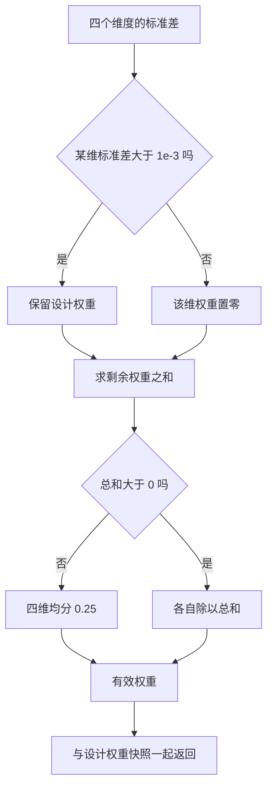
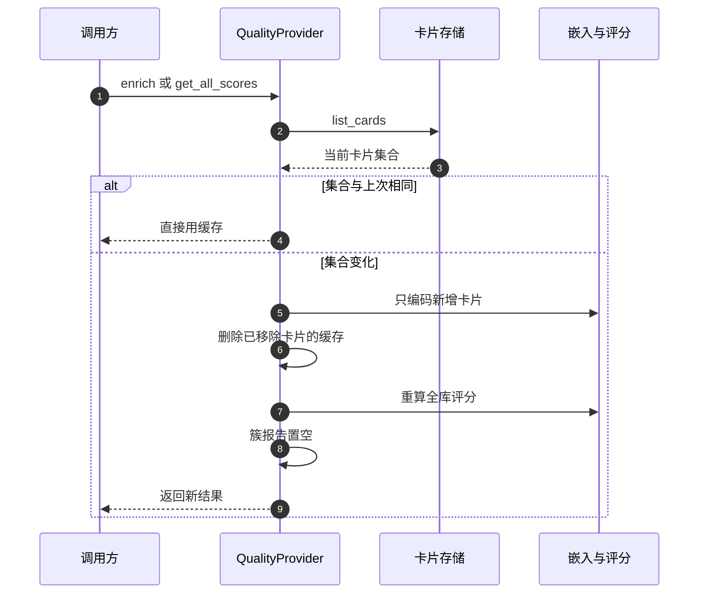

# 退化权重与会话内分位

绝对分数在两种情况下会失去区分力：某一维度在所有卡上取值几乎相同，它就成了拉平分布的常数项；某个绝对门槛在真实数据上长期零命中，它就成了永远不触发的死代码。这个模块对两种情况分别给了处理：运行时按标准差改写权重，决策时优先用会话内相对秩。

先看权重。设计权重是固定的 0.35 / 0.30 / 0.25 / 0.10，但实际参与合成的是“有效权重”。没有嵌入的库，语义维在所有卡上都是 0.5，标准差（衡量一组数值离散程度的指标）为零；如果仍按 0.25 加权，等于给每张卡加了一个常量。有效权重把这一维置零，再把剩余权重按比例放大。

## 有效权重如何计算

`_effective_weights` 接收四个维度的标准差，逐维判断（`backend/quality/scorer.py`）：

```python
eff = {k: (v if sds[k] > _DEGEN_EPS else 0.0)
       for k, v in _DESIGN_WEIGHTS.items()}
total = sum(eff.values())
if total <= 0.0:
    eff = {k: 0.25 for k in _DESIGN_WEIGHTS}
    total = 1.0
eff = {k: v / total for k, v in eff.items()}
```

判据是标准差大于 `DEGEN_EPS`，取值 1e-3（`backend/quality/thresholds.py`）。剩余权重除以总和完成重归一化，所以权重和始终为 1。四个维度全退化时退回均分，这属于理论上才会走到、但必须定义的分支。

返回的是两个字典：有效权重和设计权重快照。后者原样返回，供上层对比“本该用什么权重”与“实际用了什么权重”（`scorer.py`）。评分结果里的 `effective_weights` 与 `design_weights_snapshot` 就来自这里。

| 场景 | 语义维标准差 | 语义有效权重 | 其余权重变化 |
| --- | --- | --- | --- |
| 有嵌入、分布正常 | 大于 1e-3 | 0.25 | 不变 |
| 无嵌入 | 0 | 0 | 其余按比例放大到和为 1 |
| 四维全退化 | 全部接近 0 | 0.25 | 均分 |



## 绝对阈值为什么被写成注释

阈值文件的模块注释专门用一段记录绝对档失效的实测（`backend/quality/thresholds.py`）：

| 绝对阈值 | 取值 | 实测结果 |
| --- | --- | --- |
| refresh 三条件里的绝对 gap | 0.65 | 29 库 736 卡 0 命中 |
| 主题饱和绝对档 | 0.35 | 32 轮 64 个决策状态 0 可达 |
| 簇薄弱档 | 0.5 | 仍在使用，但属于簇分类口径 |

注释给出一条规则：新代码需要区分强弱时，优先用会话内相对秩（分位数），不要新增绝对门槛；必须用绝对门槛时要同时输出可达性统计（`thresholds.py`）。把失效结论写进注释的目的，是阻止后来者再加同类门槛。

文件开头还声明所有数值与重构前逐字节一致，由 `tests/backend/test_thresholds.py` 断言，改动这些值属于实验口径变更，要同步论文与提示词。这解释了为什么注释里保留着已经失效的常量：它们是口径快照，不是当前推荐用法。

## 会话内相对分位怎么算

单卡评分路径与全库评分路径都要给出 `gap_percentile`，二者口径一致。单卡路径先算出全库每张卡的 gap，再数“比本卡严格更差”的卡有多少（`scorer.py`）：

```python
n_greater = sum(1 for g in all_gaps if g > all_gaps[idx])
gap_percentile = round(1.0 - n_greater / (len(all_gaps) - 1), 4)
```

全库路径对每个结果做同样的事。用“严格更差”而不是“大于等于”，让同分卡拿到相同百分位。百分位是一种相对排名：它说明这个值在整组里排在什么位置。只有一张卡时百分位固定为 0.5，避免除零。

绝对 gap 与相对百分位回答两个问题：前者说这张卡本身写得如何，后者说它在当前库里排在哪。注释写明绝对分集中在中间区段时，相对分仍能稳定区分本库最弱与最好。这也是主题守卫用库内相对档的原因。

## 找最弱卡片时的回退

`find_weakest_cards` 先按绝对阈值过滤，没有卡达标时退回取最弱的前几张（`scorer.py`）：

| 情况 | 返回 |
| --- | --- |
| 有卡超过阈值 | 阈值以上的卡，取前 N 张 |
| 无卡超过阈值但库非空 | 全库最弱的前 N 张 |
| 空库 | 空列表 |

注释解释了回退的理由：静默返回空列表会让上层误判知识库已经健康。这与阈值文件的结论一致——绝对门槛在真实分布上可能零命中，工具必须仍能给出可操作的结果。

## 评分服务的缓存与失效

评分不是每次请求都重算。`QualityProvider` 缓存评分、嵌入与簇报告，靠“卡片集合是否变化”决定是否刷新（`backend/quality/provider.py`）：



刷新逻辑有三点需要记录。第一，新增卡片单独编码，已缓存的不重复编码。第二，被删除的卡片从嵌入与评分缓存里清掉。第三，卡片集合变化时簇报告直接置空，下次请求惰性重算。簇报告本身不在刷新时计算，避免每次卡片变动都跑一遍聚类。

`invalidate` 把整个 provider 打回未加载状态；`invalidate_card` 只移除一张卡的嵌入与评分。前者用于换库，后者用于单卡改动后避免全量重算。

## 单卡与全库路径为什么必须一致

`compute_gap_score` 的文档字符串写明它与 `score_all_cards` 共用 `_raw_score_arrays` 与 `_effective_weights`，保证两条路径产出相同的 gap 与有效权重（`scorer.py`）。实现上单卡路径把整组卡片传进批量函数再取自己那一项。

如果两条路径各写一套，界面上的单卡分数与列表里的同一张卡可能出现不一致。共用一个批量函数是最省事的防分裂手段，代价是单卡查询也要遍历全库算原始分——在会话规模下可以接受。

## 易错点

1. 认为设计权重就是实际权重。退化维会被置零。
2. 看到阈值文件里有 0.65 就照用。注释已记录它零命中。
3. 把绝对 gap 与百分位混用。前者说自身，后者说库内排名。
4. 以为同分卡百分位不同。算法按严格更差计数。
5. 每次请求都重算簇报告。缓存会失效但并不立刻重算。
6. 单卡路径另写一套合成。必须与批量路径一致。

## 小结

### 核心概念

| 概念 | 取值或做法 | 来源 |
| --- | --- | --- |
| 退化判据 | 标准差不超过 1e-3 | `backend/quality/thresholds.py` |
| 权重处理 | 置零后重归一化，全退化则均分 | `backend/quality/scorer.py` |
| 权重快照 | 同时返回设计权重 | `backend/quality/scorer.py` |
| 绝对档实测 | 0.65 零命中、0.35 零可达 | `thresholds.py` |
| 相对分位 | 按严格更差卡片数计算 | `scorer.py` |
| 回退策略 | 无卡达标时取最弱前几张 | `scorer.py` |
| 缓存刷新 | 按卡片集合差异增量编码 | `backend/quality/provider.py` |
| 簇报告 | 惰性计算，集合变化后置空 | `backend/quality/provider.py` |

### 设计权衡

| 决策 | 收益 | 代价 |
| --- | --- | --- |
| 运行时改写权重 | 常数维不拉平分布 | 权重随数据变化，解释成本高 |
| 保留失效绝对档 | 保持口径快照与兼容 | 容易被误用 |
| 相对分位兜底 | 分布漂移下仍有区分力 | 跨库不可直接比较 |
| 惰性簇报告 | 避免频繁聚类 | 首次请求延迟高 |
| 单卡走批量路径 | 两条路径不分叉 | 单卡查询也遍历全库 |

## 练习

### 基础题

1. 说明有效权重的计算过程，给出无嵌入库的权重结果。
2. 列出两个失效绝对档的实测数字与结论。
3. 解释相对分位为什么用严格更差计数。

### 挑战题

4. 为有效权重设计一条回归测试，覆盖单维退化与全维退化两种输入。
5. 设计一个报告字段，输出各维标准差与是否退化，说明它如何帮助解释权重变化。
6. 分析惰性簇报告在连续编辑场景下的缓存抖动，给出改进方案与代价。

### 附：本页引用的路径

| 路径 | 用途 |
| --- | --- |
| `backend/quality/scorer.py` | 有效权重、分位、回退与单卡路径 |
| `backend/quality/thresholds.py` | 退化常数与失效绝对档记录 |
| `backend/quality/provider.py` | 评分、嵌入与簇报告缓存 |
| `tests/backend/test_thresholds.py` | 阈值逐字节一致性断言 |
