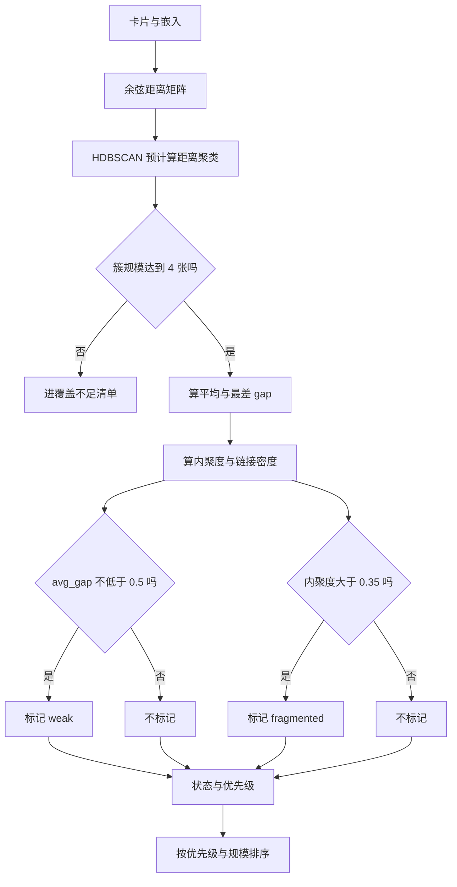
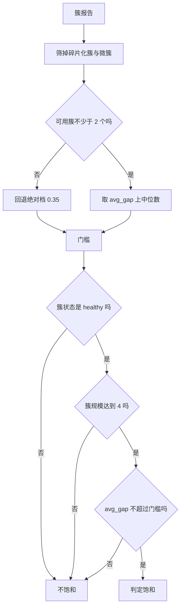

# 簇级诊断与主题饱和守卫

单卡 gap 回答“这张卡写得好不好”，回答不了“这个知识库覆盖得全不全”。两张卡都写得很好，但库里同一个主题有二十张、另一个主题一张都没有，单卡分数完全看不出来。簇级诊断补的就是这个视角：把卡片按嵌入语义聚成主题簇，再看每个簇的规模、平均缺口、内聚程度与簇内链接密度。

聚类之后还有第二个问题：如果某个主题已经饱和，评估工具却仍建议对它扩写，新增内容对整体覆盖几乎没有贡献。主题守卫把这一步变成决策前的确定性检查——饱和主题上不再推荐扩写，而是把注意力转向覆盖不足的主题。两段代码都承认自己的代理性质：运行时没有主题真值，密度簇只是近似。

## 聚类输入与距离矩阵

聚类用的是预计算距离矩阵，距离取余弦（`backend/quality/cluster.py:33-44`）：

```python
mat = np.asarray([embeddings[i] for i in ids], dtype=np.float32)
norms = np.linalg.norm(mat, axis=1, keepdims=True)
norms[norms == 0] = 1.0
mat = mat / norms
sim = np.clip(mat @ mat.T, -1.0, 1.0)
dist = 1.0 - sim
np.fill_diagonal(dist, 0.0)
```

零向量的模被替换成 1，避免除零；相似度截断到负一到一，距离再截到零到二。对角线距离强制为零。HDBSCAN 以 `metric="precomputed"` 消费这个矩阵，参数是 `min_cluster_size=4` 与 `min_samples=2`（`:96-100`）。

`min_cluster_size=4` 的含义在模块注释里写明：簇是至少四张相关卡的主题域，少于四张不成簇，进覆盖不足清单；噪声点的概念天然对应孤立卡（`:10-12`）。

## 簇报告包含什么

每张卡按标签分组后，规模不足的组进覆盖不足清单（`cluster.py:110-119`），其余组成簇报告（`:121-162`）：

| 字段 | 计算 | 含义 |
| --- | --- | --- |
| `size` | 成员数 | 主题规模 |
| `avg_gap` / `worst_gap` | 成员 gap 的均值与最大值 | 簇整体与最弱一张 |
| `compactness` | 子矩阵非对角均值 | 语义内聚程度，越大越散 |
| `link_density` | 簇内去重链接对数除以最大对数 | 主题内部是否互连 |
| `dims` | 内容、来源、链接三个子分均值 | 维度画像 |
| `status` | 由 avg_gap 与 compactness 决定 | 薄弱或碎片化 |
| `priority` | 状态权重之和 | 排序依据 |

内聚度的公式是子矩阵元素和除以“成员数的平方减成员数”（`:130`），即所有有序非对角距离的平均，与卡数无关，便于跨簇比较。链接密度统计簇内互指关系，并把“低于 0.3”标成 `link_density_low`（`:132-139`、`:158`，阈值在 `thresholds.py:73`）。

状态判定只有三条规则（`cluster.py:47-53`）：

```python
if avg_gap is not None and avg_gap >= _WEAK_GAP: flags.append("weak")
if compactness is not None and compactness > _FRAGMENTED_DIST: flags.append("fragmented")
return "+".join(flags) if flags else "healthy"
```

两个标记可以同时出现，状态形如 `weak+fragmented`。优先级把薄弱记为 2、碎片化记为 1（`thresholds.py:74`），排序时先按优先级降序，再按规模降序（`cluster.py:164`），因此报告开头是最需要处理的簇。



## 覆盖不足清单

覆盖不足由两部分组成：未成簇的噪声点，以及规模不足四张的微簇。库内卡片总数少于四张时，整体走空报告分支，所有卡都进清单（`cluster.py:83-94`）。清单按 gap 从高到低排序（`:165`），与“最需要补的排前面”一致。

模块注释把这条输出与完整性质量对应起来，并引用综述说明完整性与正确性是两个正交维度（`:7-8`）。因此覆盖不足清单不评价单卡内容，只回答“这个主题在当前库里有没有足够代表”。

## 主题饱和守卫要解决什么

守卫模块开头记录了实测问题（`backend/quality/topic_guard.py:3-10`）：

| 观测 | 数值 |
| --- | --- |
| 库内 Spearman（gap，边际覆盖增益） | 均值负 0.10 |
| argmax-gap 动作零覆盖增益比例 | 78.1% |
| 主导主题已被完全覆盖的卡比例 | 76.7% |

结论是卡级信号与主题级目标错配，不是阈值调参能解决的问题（`:10`）。守卫把处理变成三步（`:12-16`）：先判定卡所属主题是否饱和；饱和则把扩写推荐指向覆盖不足主题的代表卡；库里没有覆盖不足主题就直接判本地足够，不再联网。

## 饱和门槛用库内相对档

门槛取“非碎片化、成规模簇的 avg_gap 上中位数”（`topic_guard.py:51-72`）：

```python
for cluster in (report or {}).get("clusters", []) or []:
    status = str(cluster.get("status", ""))
    if "fragmented" in status: continue
    if int(cluster.get("size", 0) or 0) < CLUSTER_MIN_SIZE: continue
    ...
if len(pool) < SATURATION_MIN_CLUSTERS:
    return SATURATED_AVG_GAP_MAX
pool.sort()
return round(pool[int(len(pool) * SATURATION_QUANTILE)] ..., 4)
```

碎片化簇被排除在“覆盖良好”的判据之外，规模不足的簇也不参与。可用簇少于两个时，相对判据退化，回退到绝对档（保守做法：不触发守卫，保留原路径）。分位取 0.5，即上中位数——池子中位置靠上的一半。

簇饱和判定要求三个条件同时成立（`:75-93`）：状态为 `healthy`、规模达到主题单元下限、平均 gap 不超过门槛。状态为 healthy 已经蕴含 avg_gap 低于 0.5 且非碎片化，再叠加相对门槛后，比单纯用绝对档更不容易误判。



## 单卡主题判定与边界

`card_topic_verdict` 把卡映射到簇，返回主题状态、簇规模、主题 gap、是否饱和、使用的门槛与判定来源（`topic_guard.py:96-119`）。报告为空或卡不在任何簇时返回 `unknown` 且不饱和（`:99`），这是保守默认：没有足够信息就不改变原有推荐路径。

模块用一段“诚实边界”声明自己的近似性（`:18-24`）：主题单元是库内密度簇，不是评测大纲主题，运行时没有主题真值；饱和是“平均 gap 低加非碎片化”的代理，其效度要用离线探针检验；守卫是纯函数、零 IO，只消费簇报告，运行时禁止读取评测专用资产，由 `tests/backend/test_no_eval_leakage.py` 守卫。

## 易错点

1. 把密度簇当成真实主题标签。它只是库内近似。
2. 用绝对档判饱和。实测 0 可达，默认走相对档。
3. 忽略返回空报告的情况。卡不在簇里时判定为未知且不饱和。
4. 把碎片化簇也算进饱和池。它们被显式排除。
5. 认为主题守卫会读探针或大纲。它零 IO，只有簇报告。
6. 只按 avg_gap 排序簇。报告还按状态优先级排序。

## 小结

### 核心概念

| 概念 | 取值或做法 | 来源 |
| --- | --- | --- |
| 聚类算法 | HDBSCAN，预计算余弦距离 | `backend/quality/cluster.py:10`、`:96-100` |
| 最小组规模 | 4 张 | `backend/quality/thresholds.py:70` |
| 薄弱档 | 簇平均 gap 不低于 0.5 | `:71` |
| 碎片化档 | 内聚度大于 0.35 | `:72` |
| 覆盖不足 | 噪声点与微簇 | `cluster.py:110-119` |
| 饱和门槛 | 非碎片化成规模簇的上中位数 | `backend/quality/topic_guard.py:51-72` |
| 饱和判定 | healthy 加规模达标加不超门槛 | `:75-93` |
| 未知默认 | 不在簇中则不饱和 | `:99` |

### 设计权衡

| 决策 | 收益 | 代价 |
| --- | --- | --- |
| 密度聚类当主题代理 | 运行时无需主题真值 | 代理有偏，需离线检验 |
| 小簇进覆盖不足 | 主题覆盖判断保守 | 小规模新库报很多覆盖不足 |
| 状态可叠加标记 | 能表达“又弱又散” | 状态字符串需要解析 |
| 饱和用相对档 | 分布漂移下不失效 | 跨库不可比 |
| 守卫零 IO | 无评测泄漏风险 | 只能依赖库内结构信号 |

## 练习

### 基础题

1. 说明距离矩阵的构造步骤与 HDBSCAN 的两个参数。
2. 列出簇报告的字段与状态判定的三条规则。
3. 解释饱和门槛在可用簇不足两个时的回退与理由。

### 挑战题

4. 设计一个实验检验“密度簇代理主题”的效度，说明需要的离线资产与判据。
5. 针对小规模知识库调参：给出最小组规模与覆盖不足清单的取舍方案。
6. 为碎片化簇设计改进建议生成规则，说明它与链接密度字段的关系。

### 附：本页引用的路径

| 路径 | 用途 |
| --- | --- |
| `backend/quality/cluster.py` | 距离矩阵、聚类与簇报告 |
| `backend/quality/topic_guard.py` | 饱和门槛与单卡主题判定 |
| `backend/quality/thresholds.py` | 簇级与饱和阈值 |
| `tests/backend/test_no_eval_leakage.py` | 评测资产不进入运行时的守卫 |
