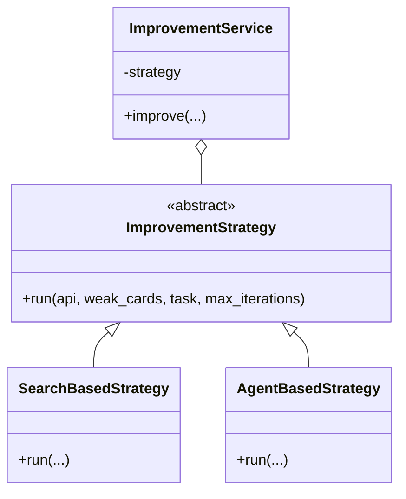
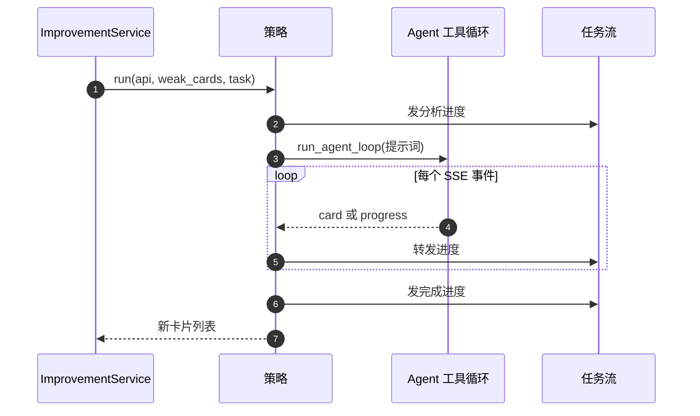
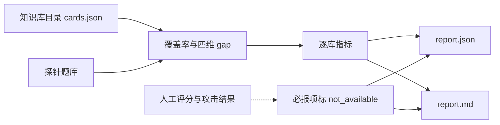

# 缺口闭环与离线评测脚本

评分本身不改变任何东西。要让 gap 真的下降，需要有人拿着评分结果去补内容、补来源或补链接。这个仓库把“用评分”分成两条互不依赖的链路：一条在运行时，按策略自动改进薄弱卡；另一条完全离线，用固定题库评测知识库产物的覆盖质量，用于实验与对比。

两条链路的分工也带来一条约束：运行时不得依赖离线评测资产。因为前者要保证在真实使用中不带任何“答案”，后者才允许持有探针题库与人工评分。这条约束由测试守着，是理解整个目录结构的起点。

## 改进策略的抽象

所有改进策略实现同一个抽象方法（`backend/quality/improver.py:34-49`）：

```python
class ImprovementStrategy(ABC):
    @abstractmethod
    async def run(self, api, weak_cards, task, max_iterations=3) -> List[Card]:
        ...
```

输入是薄弱卡列表，输出是生成的新卡片列表；进度通过 `task.emit` 发事件，供 SSE 流订阅（`:36-39`）。模块注释列出了两个实现与未来的扩展位（`:2-7`）。

| 策略 | 决策方式 | 特点 |
| --- | --- | --- |
| `SearchBasedStrategy` | structure_score 硬编码分支 | 快速、确定、无递归 |
| `AgentBasedStrategy` | 交给 LLM Agent 自行选工具 | 灵活，依赖模型判断 |



## 搜索策略的硬编码分支

`SearchBasedStrategy` 的规则写在类注释里（`improver.py:52-60`）：结构分低于 0.5 就用卡片标题重新搜索并更新原卡；不低于 0.5 就搜索生成补充卡片。每次迭代后重新评估，只把仍然薄弱的卡带进下一轮。它的优点是不依赖模型、结果可复现，适合批处理或回归验证；局限是决策只有一条阈值分支，遇到语义层面的缺口无能为力。

## Agent 策略如何组装提示词

`AgentBasedStrategy` 构造一段结构化提示词，把薄弱卡的三个分列进去（`improver.py:171-187`）：

```python
lines.append(
    f"- 「{c['title']}」"
    f"(gap={c.get('gap_score', 0):.2f}, "
    f"structure={c.get('structure_score', 0):.2f}, "
    f"semantic={c.get('semantic_score', 0):.2f})"
)
prompt = "\n".join([
    "请依次分析以下薄弱卡片的改进方案，使用合适的工具逐步改进：",
    *lines,
    "- structure_score 低 → 用 search_by_keyword 搜索补充内容",
    "- semantic_score 低 → 用 expand_from_card 生成子卡片扩展知识面",
    "每次改进后重新调用 assess_card_quality 确认效果。",
])
```

提示词把分数与推荐工具直接对应，等价于把硬编码分支交给模型执行。随后调用 `run_agent_loop`，逐行解析 SSE 事件（`:189-210`）：`card` 事件里的数据被收集成结果卡片，`progress` 事件转成任务进度，进度上限截到 0.95，剩余留给收尾事件。JSON 解析失败被静默忽略（`:209-210`），保证一条坏事件不会中断整轮。



## 统一入口与默认策略

`ImprovementService` 封装“分析到改进”的流程，策略由构造函数注入，默认用 Agent 策略（`improver.py:220-236`）。文档字符串给出的用法是构造服务后调用 `improve`，传入阈值与最大迭代次数（`:9-18`、`:226-228`）。默认选 Agent 的原因可以理解：它覆盖搜索策略做不到的语义缺口，代价是结果不确定、依赖模型可用性。需要确定性时显式传入搜索策略。

## 离线评测工具解决什么

`scripts/kb_quality_eval` 是一个命令行工具，把评测协议落地成仓库能力，声明“零 LLM、零网络、确定性”，同一输入永远得到同一输出（`scripts/kb_quality_eval/README.md:1-5`）。输入是知识库产物目录与探针题库，输出 `report.json` 与 `report.md` 两个文件（`README.md:7-13`）。

| 输入 | 内容 |
| --- | --- |
| 知识库目录 | `cards.json` 列表，每项至少含标题与正文 |
| 探针库 | 题目、主题、难度层与黄金关键词 |
| 参数 | top-k（默认 5）、是否跳过四维 gap、族名 |

输出按区块组织（`README.md:30-43`）：工具身份与离线性声明、输入指纹、资产汇总、探针库统计、逐库指标、必报项覆盖、不可主张清单与限制。必报项里有五项标为 `not_available`，逐条给出原因或指针（`:45-57`），例如人工评分相关性需要评分员逐卡评分文件，攻击测试需要攻击工具。

报告里专门用一节规定相关性口径（`:58-83`）：X 取 gap（越高越差）、Y 取人工总分（越高越好），因此原始相关系数天然为负；长度变量取字符数的对数；四种偏相关实现会给出不同小数，推荐用秩残差 Spearman 并同时给出另一种口径。这一节的价值在于把“同一个数据不同口径”讲清楚，避免把方法差异当成结论冲突。



## 四条红线

工具的 README 末尾列出四条由测试锁定的红线（`README.md:93-99`）：

1. 运行时后端不得导入这个工具，且后端完全不依赖脚本目录；
2. 探针不进入被评价机制，四维 gap 只吃卡片数据；
3. 包内不得出现网络或大模型客户端导入；
4. 覆盖率指标与既有评测脚本逐字段一致。

第一条与第二条把“评测资产”和“运行时代码”隔开，防止评分时偷看答案。第三条保证可复现。第四条保证新工具不会和旧口径悄悄分叉。第 2 条的实现依赖 `tests/backend/test_kb_quality_eval.py` 的源码扫描与行为断言。

## 只读盘点脚本与一处口径差异

另一个脚本 `scripts/quality_audit.py` 做只读盘点：打开会话数据库，把 `card_vec_map` 里的卡片 ID 映射到向量行号，再去 `cards_vec` 取向量（`scripts/quality_audit.py:38-65`）。它用的是映射表的 `rowid`。

相邻单元记录过一处差异：业务查询路径用的是显式的 `vec_rowid` 列，而部分审计脚本按 `rowid` 取行，两者在部分数据上不一致（约 3.5% 的行）。同类写法也出现在 `scripts/monthly_eval/metrics.py`。核对类脚本的统计数字时，需要先确认它走的是哪一列；本仓库未在本次核对中重跑这些脚本确认影响范围，只记录口径差异。

## 易错点

1. 认为评分结果会自动改进卡片。改进要显式调用服务或策略。
2. 把 Agent 策略当确定性流程。它依赖模型输出。
3. 让运行时导入离线评测工具。红线明确禁止。
4. 把 `not_available` 当成指标为零。它是没有输入数据。
5. 混用相关性口径。符号方向与偏相关实现都要声明。
6. 不核对审计脚本取向量用的是哪一列。

## 小结

### 核心概念

| 概念 | 取值或做法 | 来源 |
| --- | --- | --- |
| 策略抽象 | 异步 `run` 返回新卡片列表 | `backend/quality/improver.py:34-49` |
| 搜索策略 | 结构分 0.5 分支 | `:52-60` |
| Agent 策略 | 提示词加工具循环与 SSE 解析 | `:148-217` |
| 默认策略 | Agent 策略 | `:231-232` |
| 离线工具 | 零 LLM、零网络、确定性 | `scripts/kb_quality_eval/README.md:1-5` |
| 输出 | `report.json` 与 `report.md` | `:7-13` |
| 红线 | 运行时不导入、探针不进机制、无网络、口径一致 | `:93-99` |
| 审计脚本 | 只读盘点，按 `rowid` 取向量 | `scripts/quality_audit.py:38-65` |

### 设计权衡

| 决策 | 收益 | 代价 |
| --- | --- | --- |
| 策略可插拔 | 确定性与灵活性都能选 | 需要上层选择并承担差异 |
| 默认 Agent 策略 | 能处理语义缺口 | 结果不确定 |
| 离线工具零网络 | 可复现、无外部依赖 | 覆盖指标受限于探针质量 |
| 必报项显式标缺失 | 不假装有数据 | 报告更冗长 |
| 审计脚本独立实现 | 不侵入运行时 | 口径可能与业务查询分叉 |

## 练习

### 基础题

1. 说出两种改进策略的决策依据与适用场景。
2. 列出离线工具的输入、输出与四条红线。
3. 解释必报项里 `not_available` 的含义。

### 挑战题

4. 为 Agent 策略设计一条回归测试，在模型不可用时验证降级行为。
5. 设计一个把离线探针覆盖率与在线 gap 对齐的核对流程，说明如何避免评测资产泄漏。
6. 统一审计脚本与业务查询的向量取值口径，给出迁移步骤与差异回归方法。

### 附：本页引用的路径

| 路径 | 用途 |
| --- | --- |
| `backend/quality/improver.py` | 策略抽象、两种实现与服务入口 |
| `backend/quality/provider.py` | 评分与簇报告的对外入口 |
| `scripts/kb_quality_eval/README.md` | 离线评测工具的输入输出与红线 |
| `scripts/quality_audit.py` | 只读质量盘点与向量取值 |
| `scripts/monthly_eval/metrics.py` | 同类统计脚本 |
