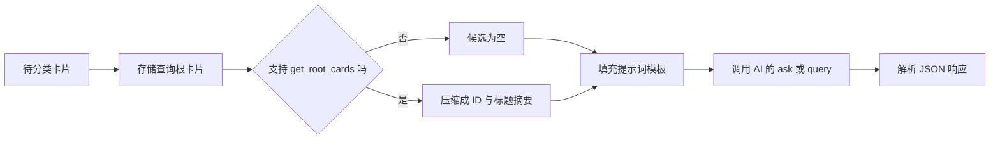
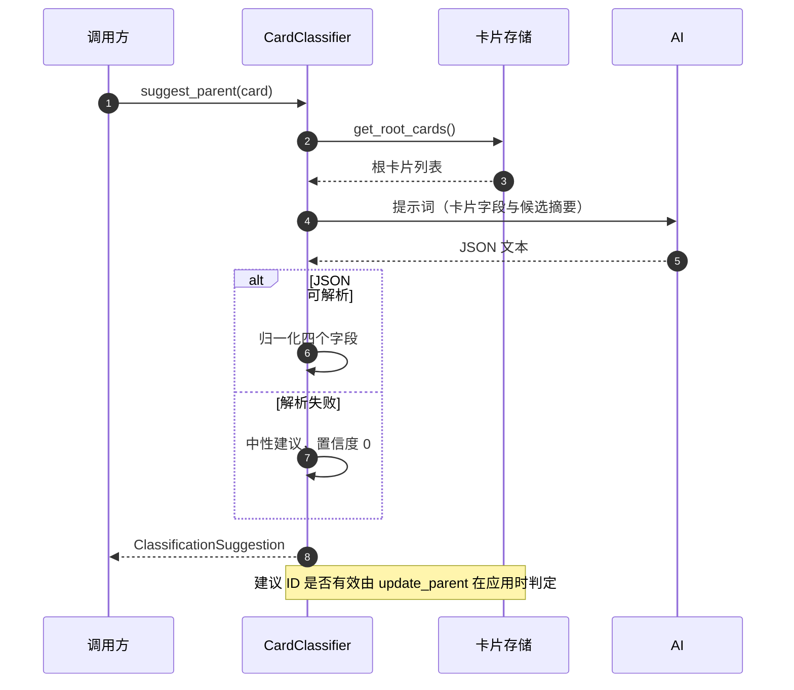

# 候选父节点与 AI 分类契约

一张新卡片要放进树里，需要有人回答“它的父卡是谁”。人工做法是拖拽或选择，自动做法是让模型在现有卡片里挑一个。分类器负责后一条路：取一批候选父卡，连同新卡的标题与正文一起交给模型，让模型返回一个父卡 ID 与理由。

这条路有两个容易忽略的前提。第一，候选集只取根卡片，不是全部卡片——模型只能在树的顶层里挑，深层节点不会作为候选出现。第二，模型返回的是自由文本里的 JSON，代码要能容忍格式错误，也要承担模型给出不存在 ID 的风险。理解这两点，才能判断自动分类的能力边界。

## 分类器的依赖与兼容层

分类器构造时注入两个东西：卡片存储与 AI 提供方（`backend/classification/classifier.py:35-37`）。它不直接创建任何存储或模型客户端，便于替换实现与测试。

两个兼容函数把差异挡在内部：

| 辅助方法 | 作用 | 位置 |
| --- | --- | --- |
| `_maybe_await` | 值可等待就 await，否则原样返回 | `:39-43` |
| `_ask_ai` | 优先用 `ask`，否则用 `query`，都没有则报错 | `:45-51` |

存储层既有同步也有异步实现，这个兼容层让同一份分类器代码都能用。AI 提供方的方法名不统一，`_ask_ai` 用属性探测决定调用哪一个，找不到就抛 `AttributeError`，属于显式失败。

## 候选集只取根卡片

`suggest_parent` 先向存储要根卡片，再把它们压缩成“ID 加标题”的摘要列表（`classifier.py:53-63`）：

```python
candidates: List[Card] = []
if hasattr(self.store, "get_root_cards"):
    candidates = await self._maybe_await(self.store.get_root_cards())
candidate_summaries = [
    {"id": c.id, "title": getattr(c, "title", getattr(c, "name", str(c)))}
    for c in candidates
]
```

存储没有 `get_root_cards` 方法时，候选集为空列表，提示词里对应位置为空。摘要只保留 ID 与标题，正文不进提示词——这是一个有意的裁剪，控制提示词长度，也让候选比较集中在主题层面。

只取根卡片意味着分类结果是“挂到某一棵树的顶上”，不会挂到深层节点下面。新卡想成为某个子树的子节点，需要先由别的机制建立更深的结构，或者人工重分类。存储侧的根判据是父指针为空（见相邻单元），因此候选集随父指针结构变化。



## 提示词里放了什么

提示词是一个带占位符的常量字符串（`backend/classification/prompts.py:3-17`）。填进去的字段有五个：卡片 ID、标题、正文、元数据、候选父卡列表（`classifier.py:65-71`）。模板明确要求只输出一个 JSON 对象，并列出四个键：

| 键 | 类型 | 含义 |
| --- | --- | --- |
| `suggested_parent_id` | 字符串或 null | 建议的父卡 ID |
| `confidence` | 0 到 1 的浮点 | 置信度 |
| `reasoning` | 字符串 | 理由 |
| `alternative_parents` | 字符串列表 | 备选父卡 |

模板是英文的，字段名与代码里的键一致，减少模型改写键名的机会。元数据被整段塞进提示词（`prompts.py:13`），因此卡片元数据里如果有长文本或敏感内容，也会进入模型上下文——这一点在提示词层面没有任何过滤。

## 解析失败与字段归一化

模型返回后先尝试 `json.loads`（`classifier.py:74-82`）。解析失败不抛异常，而是构造一份中性建议：

```python
except Exception:
    data = {
        "suggested_parent_id": None,
        "confidence": 0.0,
        "reasoning": "AI did not return valid JSON.",
        "alternative_parents": [],
    }
```

父卡为 null、置信度为零，调用方据此可以判断“没有可用建议”。这比抛异常更适合交互式场景：模型偶发输出解释性文字时，接口仍能返回结构化结果。

四个字段随后逐项取值并归一化（`:84-95`）。备选列表用“或空列表”兜底，处理模型返回 null 的情况。置信度直接做浮点转换——如果模型把置信度写成 `"high"` 这类字符串，转换会抛 `ValueError`，这一条没有被捕获。这是从代码读出的边界，未实际构造响应验证。

## 建议 ID 没有成员校验

返回的 `ClassificationSuggestion` 只做类型声明（`classifier.py:21-27`），没有校验建议 ID 是否在候选列表里，也没有校验这张卡是否真的存在。也就是说，模型完全可以返回一个不存在的 ID，或者一个不在候选集里的深层节点 ID，分类器都会原样返回。

拦住无效父卡的是存储层：`update_parent` 会检查父卡是否存在、是否指向自己、是否形成祖先环，任一条不满足就抛异常（`backend/storage/sqlite_card_store.py:309-341`）。因此无效建议不会静默写坏数据，错误会在应用阶段暴露。调用方需要接住这个异常，否则接口返回 500。



## 置信度怎么用

代码只把置信度放进结果，没有设置阈值，也没有“低于阈值就不建议”的分支。是否采纳完全交给调用方。与检索模块里的相似度阈值不同，这里没有单一来源的阈值常量，因此不同调用方可能各自解释。

对交互式界面，这个设计把判断权留给人：低置信度建议仍然展示，由用户决定。对自动流水线，则需要在调用方加策略，否则会按模型给出的第一个 ID 直接挂载。

## 易错点

1. 认为候选集是全部卡片。只取根卡片。
2. 依赖模型返回合法 JSON。解析失败会退化为中性建议。
3. 认为置信度有默认门槛。代码不做阈值判断。
4. 认为建议 ID 已被校验。校验在存储层。
5. 忽略元数据会进提示词。长元数据会拉长上下文。
6. 认为置信度转换一定成功。字符串型置信度会抛异常。

## 小结

### 核心概念

| 概念 | 取值或做法 | 来源 |
| --- | --- | --- |
| 依赖注入 | 存储与 AI 提供方 | `backend/classification/classifier.py:35-37` |
| 候选集 | 仅根卡片，压缩成 ID 与标题 | `:53-63` |
| 提示词字段 | ID、标题、正文、元数据、候选 | `backend/classification/prompts.py:3-17` |
| JSON 契约 | 四个键 | `:7-8` |
| 解析失败 | 中性建议，置信度 0 | `classifier.py:74-82` |
| 建议模型 | 父卡 ID、置信度、理由、备选 | `:21-27` |
| 有效性校验 | 应用时由存储层完成 | `backend/storage/sqlite_card_store.py:309-341` |

### 设计权衡

| 决策 | 收益 | 代价 |
| --- | --- | --- |
| 只让模型在根卡里选 | 候选少、提示词短 | 无法自动挂到深层 |
| 候选只用标题 | 控制长度 | 模型缺少内容线索 |
| 解析失败取中性值 | 接口不中断 | 失败原因不在返回值里区分 |
| 不做成员校验 | 分类器保持纯粹 | 错误推迟到写入阶段 |
| 置信度不设门槛 | 判断权留给调用方 | 自动流水线需自行处理 |

## 练习

### 基础题

1. 说明分类器的两个依赖，以及兼容层解决什么问题。
2. 列出提示词里放入的字段与模型必须返回的四个键。
3. 解释 JSON 解析失败后的返回值与置信度。

### 挑战题

4. 设计候选集扩展到“根加一层子节点”的方案，说明提示词长度与准确率的取舍。
5. 为建议增加成员校验与存在校验，说明错误应返回给调用方还是静默降级。
6. 设计一版中文提示词并保持字段契约不变，说明如何验证模型输出不漂移。

### 附：本页引用的路径

| 路径 | 用途 |
| --- | --- |
| `backend/classification/classifier.py` | 候选集、提示词填充与 JSON 解析 |
| `backend/classification/prompts.py` | 分类提示词模板与字段契约 |
| `backend/classification/__init__.py` | 模块导出 |
| `backend/storage/sqlite_card_store.py` | 父卡有效性校验 |
