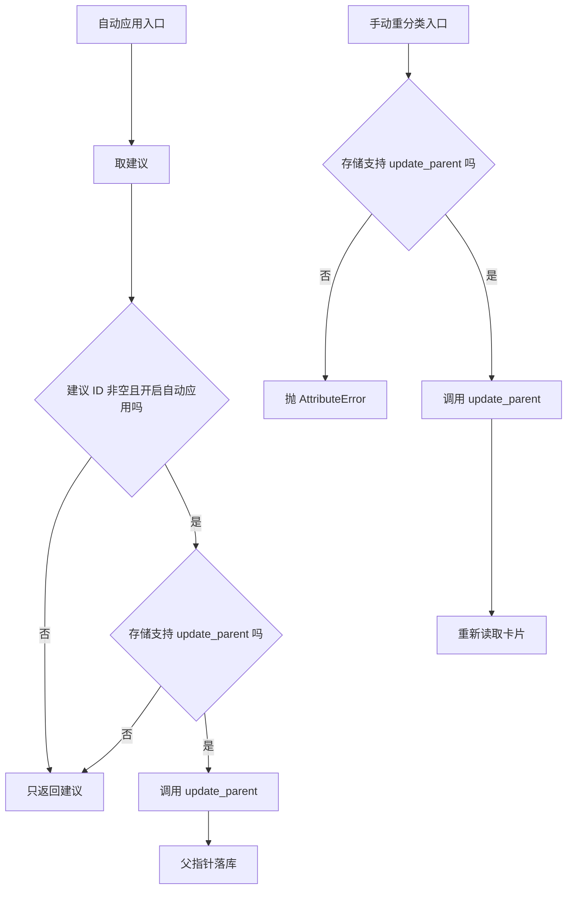
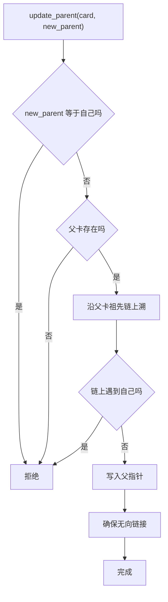

# 自动应用、手动重分类与写入校验

建议只是候选，落地要写父指针。写父指针有两个入口：一条是自动应用模型建议，另一条是用户手动指定新父卡。两条入口最终都调用存储层的 `update_parent`，而这个方法自带四步校验。也就是说，分类器本身不保证父卡有效，守门人在存储层。

理解这层分工后，很多现象就能解释：模型返回不存在的 ID 时接口为什么报 500，而不是返回一条“建议无效”的错误；把卡片拖到自己的子节点下时为什么被拒绝；`new_parent_id` 传 null 为什么是合法的“移到根”。这一页按两条入口、四步校验、失败表现展开。

## 自动应用的封装

`classify_card` 把“取建议”和“写建议”合成一步（`backend/classification/classifier.py`）：

```python
async def classify_card(self, card, auto_apply: bool = False):
    suggestion = await self.suggest_parent(card)
    if auto_apply and suggestion.suggested_parent_id:
        if hasattr(self.store, "update_parent"):
            await self._maybe_await(self.store.update_parent(card.id, suggestion.suggested_parent_id))
    return suggestion
```

两个条件同时成立才写：`auto_apply` 为真，且建议 ID 非空。存储不支持 `update_parent` 时静默跳过写入，仍然返回建议——调用方从返回值看不出“没写成功”，这一点需要留意。

置信度不参与判断。即使模型返回 0.01 的置信度，只要 ID 非空且开了自动应用，就会写入。

## 手动重分类

`reclassify` 接收卡片 ID 与目标父卡 ID，目标是 null 时表示摘除父指针（`classifier.py`）：

```python
if hasattr(self.store, "update_parent"):
    await self._maybe_await(self.store.update_parent(card_id, new_parent_id))
    return await self._maybe_await(self.store.get_card(card_id))
raise AttributeError("CardStore does not support update_parent")
```

与自动应用不同，这里缺少 `update_parent` 会直接抛异常，而不是静默跳过。写入成功后重新读取卡片并返回，保证返回值带上最新的父指针。路由再把返回值压成 ID 与父指针两个字段（`backend/routes/classification.py`）。



## 路由里的第二条自动应用路径

分类路由的 `/apply` 端点没有调用 `classify_card(auto_apply=True)`，而是自己取建议、自己写（`routes/classification.py`）：

```python
suggestion = await classifier.suggest_parent(card)
if suggestion.suggested_parent_id:
    await store.update_parent(card.id, suggestion.suggested_parent_id)
return suggestion.dict()
```

行为与 `classify_card` 的自动分支等价：同样只判断 ID 非空，同样不判断置信度；区别只在于存储不支持 `update_parent` 时，路由会直接 AttributeError，而分类器会静默跳过。两条路径并存意味着以后修改应用规则要记得改两处。

| 路径 | 触发 | 失败处理 |
| --- | --- | --- |
| `classify_card(auto_apply=True)` | 代码调用 | 存储不支持则跳过 |
| `POST /api/classification/apply` | 接口 | 存储不支持则报错 |

## 四步写入校验

`update_parent` 在写库前依次检查四件事（`backend/storage/sqlite_card_store.py`）：

| 顺序 | 检查 | 不通过时 |
| --- | --- | --- |
| 1 | 新父卡是否就是自己 | 抛异常 |
| 2 | 新父卡是否存在 | 抛异常 |
| 3 | 沿新父卡的祖先链是否会回到自己 | 抛异常 |
| 4 | 通过后写父指针并确保无向链接 | 完成 |

第三步是防环的核心：先看新父卡，再一路向上看它的父卡，只要遇到自己就说明挂上去会成环。这个检查让父指针结构始终保持有向无环（有向无环图：边有方向，且沿边前进不会回到起点），相邻单元记录过它的必要性——两张卡互指为父时，根卡片查询会返回空，整棵树消失。

第四步除了写父指针，还调用 `_ensure_undirected_link` 补一条无向链接，保证树关系与链接关系不脱节。因此自动分类不仅改变父子结构，也会让两张卡的链接列表出现对应条目，进而影响图谱视图。



## 校验失败会看到什么

存储层抛出的异常沿路由向上传播。应用层有一个全局异常处理器（框架提供的统一兜底，任何未捕获异常都在一处转成 HTTP 响应），把未预期异常转成 500 并隐藏堆栈（`backend/main.py`）。因此模型返回一个不存在的父卡 ID 时，客户端看到的是 500，而不是“建议无效”的 4xx。

这是接口设计上的一处粗糙：校验已经知道自己拒绝的原因，却没有把它翻译成分类语义的错误。改进方向是在路由里捕获存储异常并映射为 400，或者让分类器在返回建议前先做存在性校验。两种做法各有代价，前者保留“模型自由返回”的现状，后者多一次查询。

## 与置信度阈值的关系

应用阶段没有置信度门槛，也没有“建议与现有父指针冲突时如何处理”的分支。已经挂在 A 下的卡被建议改挂到 B 时，代码会直接覆盖。这意味着自动应用是有破坏性的：它不比较新旧父卡的优劣，也不保留历史。

对交互场景这不是问题，用户在界面上看到建议再决定。对批处理场景则需要在上层加策略，例如只在置信度高于某个自定义阈值时才调用 `classify_card(auto_apply=True)`。

## 易错点

1. 认为自动应用会检查置信度。只检查 ID 是否非空。
2. 认为分类器保证父卡有效。校验在存储层。
3. 把 `new_parent_id=None` 当成错误。它是合法的摘除父指针。
4. 认为两条自动应用路径行为完全一致。存储缺失时一处跳过一处报错。
5. 期待无效建议返回 4xx。当前会变成 500。
6. 忽略补链副作用。写父指针会同时补无向链接。

## 小结

### 核心概念

| 概念 | 取值或做法 | 来源 |
| --- | --- | --- |
| 自动应用条件 | 开关为真且建议 ID 非空 | `backend/classification/classifier.py` |
| 手动重分类 | 写入后重新读取卡片 | `backend/classification/classifier.py` |
| 路由第二路径 | 取建议后直接写 | `backend/routes/classification.py` |
| 校验四步 | 自己、存在、祖先环、写入 | `backend/storage/sqlite_card_store.py` |
| 补链 | 写父指针后确保无向链接 | `backend/storage/sqlite_card_store.py` |
| 失败表现 | 未捕获异常变 500 | `backend/main.py` |

### 设计权衡

| 决策 | 收益 | 代价 |
| --- | --- | --- |
| 校验放在存储层 | 所有写入路径共享 | 分类路由拿不到语义化错误 |
| 自动应用不设门槛 | 调用方自由决定 | 需要上层自行加策略 |
| 两条应用路径并存 | 路由与代码调用都方便 | 规则改动要同步两处 |
| 重分类允许 null | 一张接口支持挂载与摘除 | 需要文档说明 |
| 写父指针同时补链 | 树与图保持一致 | 增加一次链接写入 |

## 练习

### 基础题

1. 写出自动应用的两个条件与失败时的行为。
2. 列出 `update_parent` 的四步校验与每步的拒绝条件。
3. 说明 `new_parent_id` 为 null 的语义。

### 挑战题

4. 把存储异常映射成分类语义错误，给出状态码与响应结构设计。
5. 为批处理自动分类设计置信度门槛策略，说明阈值来源与回退行为。
6. 合并两条自动应用路径，说明如何保持路由与代码调用的行为一致。

### 附：本页引用的路径

| 路径 | 用途 |
| --- | --- |
| `backend/classification/classifier.py` | 自动应用与手动重分类 |
| `backend/routes/classification.py` | 路由侧应用路径与重分类接口 |
| `backend/storage/sqlite_card_store.py` | 父指针写入校验与补链 |
| `backend/main.py` | 路由注册与全局异常处理 |
