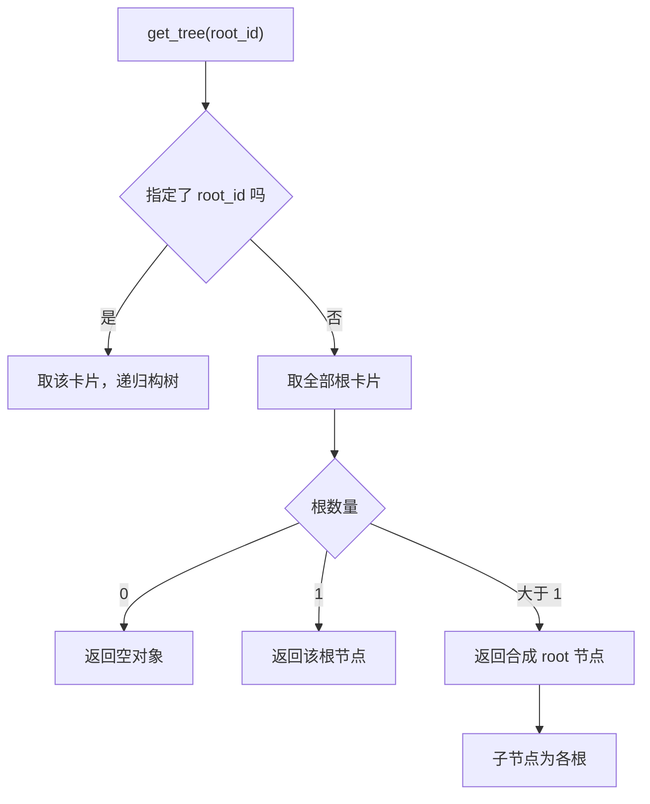
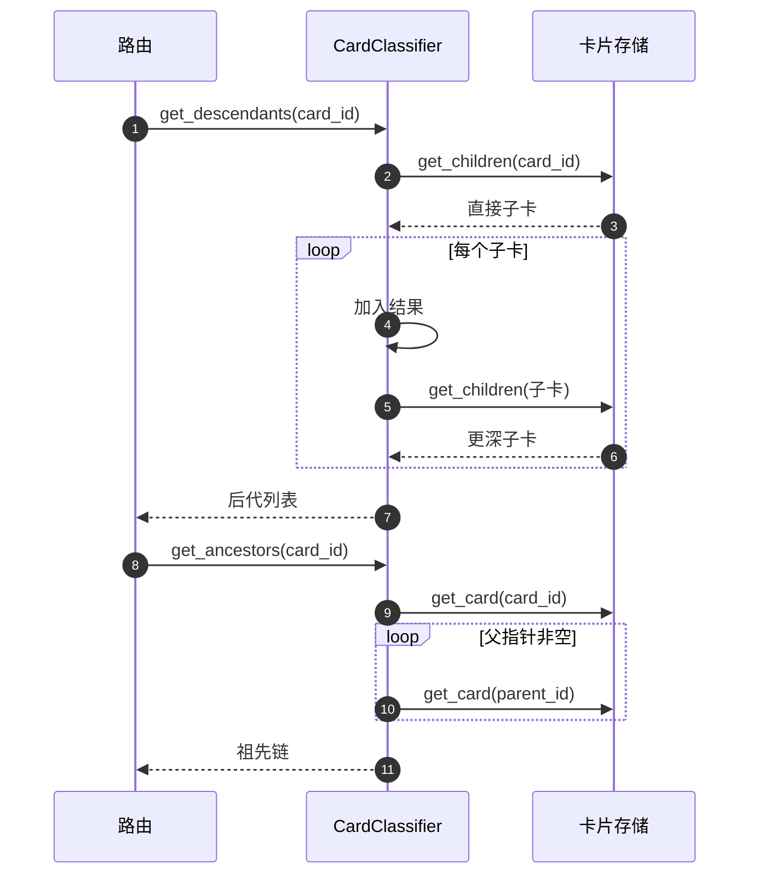

# 分类树的查询形状与接口现状

树查询看起来是最简单的一部分，但它有一个容易让前端困惑的地方：根的数量不同，返回的顶层结构也不同。没有根时返回空对象，只有一个根时直接返回那个根节点，有多个根时临时造一个名为 Root 的合成节点把根们挂在下面。前端如果按固定形状解析，就会在某个分支上取不到 `children`。

这一页还讨论一个更容易迁移的问题：怎么判断一套接口是真的可用，还是只留了壳。分类路由注册在应用里，但依赖注入没有提供实现，前端也没有调用方；这种「注册了但没接线」的状态在项目里很常见，下面给出识别方法。

## 树查询的三种形状

`get_tree` 先确定起点，再递归构节点（`backend/classification/classifier.py`）：

| 输入 | 起点 | 返回 |
| --- | --- | --- |
| 指定 `root_id` | 该卡片 | 单节点树 |
| 未指定，根数为 0 | — | 空对象 |
| 未指定，根数为 1 | 唯一根 | 该根节点 |
| 未指定，根数大于 1 | 合成节点 | `id="root"`、`title="Root"` 的节点，子节点是各根 |

三种形状的判定简化后如下（示意）：

```python
if root_id:
    return build_node(root_id)                 # 指定根：单节点树
roots = get_root_cards()
if not roots:
    return {}                                  # 没有根：空对象
if len(roots) == 1:
    return build_node(roots[0])                # 只有一个根：直接返回
return {"id": "root", "title": "Root",         # 多个根：合成 Root 节点
        "children": [build_node(r) for r in roots]}
```

递归函数 `_build_node` 每层取直接子卡，再把子卡递归构造成节点。返回的节点只有三个字段：ID、标题、子节点列表。父指针、链接、评分等信息都不出现在树里。

多根时使用合成节点，好处是前端只需要处理一种“有子节点列表”的形状；代价是它引入了一个不存在的卡片 ID。按该 ID 去查卡片会失败，前端需要知道这个约定。



## 子卡、后代与祖先

三个查询分别回答不同深度的问题（`classifier.py`）：

| 方法 | 遍历方式 | 返回 |
| --- | --- | --- |
| `get_children` | 直接查存储 | 直接子卡列表 |
| `get_descendants` | 深度优先递归 | 全部后代 |
| `get_ancestors` | 沿父指针向上 | 祖先链，自底向上 |
| `get_root_cards` | 直接查存储 | 全部根卡 |

后代遍历是“先取子卡，逐个加入结果，再递归该子卡”，属于深度优先递归（沿一条分支走到底再回溯）。它与树构建共用同一份父子数据，因此结果的成员与 `get_tree` 中的节点一致，只是一维列表形式。

祖先遍历用一个循环：读当前卡，只要父指针非空就取父卡、加入结果、继续向上。这段循环没有访问集合。父指针如果成环，循环不会终止；当前能安全运行，是因为存储层的写入校验拒绝成环（相邻单元给过四步校验的位置）。这属于“依赖上游约束”的写法，读代码时需要知道这层依赖。



## 七个端点的返回形状

分类路由挂在 `/api/classification` 前缀下（`backend/routes/classification.py`），共七个端点：

| 方法与路径 | 行为 | 返回 |
| --- | --- | --- |
| `POST /suggest` | 取建议不写入 | 建议字典 |
| `POST /apply` | 取建议并写入 | 建议字典 |
| `POST /reclassify` | 手动移动 | ID 与父指针 |
| `GET /tree` | 全树或指定根 | 节点对象 |
| `GET /tree/{card_id}` | 指定子树 | 节点对象 |
| `GET /children/{card_id}` | 直接子卡 | 卡片列表 |
| `GET /ancestors/{card_id}` | 祖先链 | 卡片列表 |

建议字典由 Pydantic 模型序列化得到，字段与分类建议模型一致。子卡与祖先端点直接返回卡片对象列表，由框架序列化。

## 依赖没接上时，端点为什么不可用

FastAPI 的 `Depends` 在请求进入时把依赖对象解析好再传进处理函数；如果它指向的函数永远返回 `None`，端点拿到空值，第一次调用其方法就会抛 `AttributeError`。分类路由的存储与模型参数正写成 `Depends(lambda: None)`，因此请求一进来就会失败。

依赖可以在应用装配处覆盖（FastAPI 提供 `app.dependency_overrides`，测试里常用来换成替身，部署时也能换成真实实现）。分类路由只被注册进应用、检索不到覆盖（`backend/main.py`），因此当前不可用；这是按源码读出的结论，本次没有实际发起请求复现。

所以「路由已注册」与「端点可用」是两件事：注册只把路径挂进应用，能不能跑要看依赖是否被真正提供。核对时把这两件事分开记录——接口是否存在看路由注册，接口是否接线看依赖提供方与调用方。

## 怎么确认一套接口有没有被使用

判断某个接口是否在用，静态检索两条线：前端有没有请求它的路径，测试里有没有针对它的用例。两者都没有命中，只能得出「当前代码里未使用」的结论。分类相关调用在前端源码里没有命中，测试目录里也没有分类器用例，说明这套能力目前没有界面入口，也没有自动化回归覆盖。

| 检查项 | 结果 |
| --- | --- |
| 前端调用 `/api/classification` | 未发现 |
| 分类器单元测试 | 未发现 |
| 路由依赖覆盖 | 未发现 |
| 路由注册 | 已在装配处注册 |

结论只到「未发现」这一层：检索范围是仓库内的前端源码与测试目录，外部工具、脚本与运行时动态注册都不在覆盖范围内。

## 易错点

1. 按固定形状解析树。根数量不同返回三种形状。
2. 把合成根的 ID 当真实卡片。它不存在。
3. 认为祖先遍历有防环集合。它依赖写入校验。
4. 认为端点注册即可用。依赖当前为 None。
5. 认为前端在用这套接口。检索无调用。
6. 把“接口存在”和“已接线”混为一谈。

## 小结

### 核心概念

| 概念 | 取值或做法 | 来源 |
| --- | --- | --- |
| 树形状 | 零个空对象、单根直返、多根合成 Root | `backend/classification/classifier.py` |
| 节点字段 | ID、标题、子节点 | `backend/classification/classifier.py` |
| 后代遍历 | 深度优先递归 | `backend/classification/classifier.py` |
| 祖先遍历 | 沿父指针向上，自底向上 | `backend/classification/classifier.py` |
| 端点数量 | 七个 | `backend/routes/classification.py` |
| 依赖情况 | 全部为返回 None 的依赖函数 | `backend/routes/classification.py` |
| 前端调用 | 未发现 | 前端源码检索 |
| 测试 | 未发现分类器用例 | `tests/` 检索 |

### 设计权衡

| 决策 | 收益 | 代价 |
| --- | --- | --- |
| 多根用合成节点 | 前端只处理一种形状 | 引入不存在的 ID |
| 树节点只带三字段 | 载荷小 | 前端要另行取详情 |
| 祖先遍历依赖上游防环 | 实现简单 | 数据异常时可能死循环 |
| 端点先留接口 | 后续接入成本低 | 当前不可用且易误判为已实现 |
| 无界面无测试 | — | 回归风险高 |

## 练习

### 基础题

1. 列出树查询的三种返回形状与触发条件。
2. 对比后代遍历与祖先遍历的方式与返回顺序。
3. 写出七个端点的路径与返回内容。

### 挑战题

4. 统一树返回形状（例如始终返回合成根），说明对前端与兼容性的影响。
5. 给祖先遍历加防环保护并补测试，说明在父指针异常时的期望行为。
6. 为分类路由补齐依赖注入并接入界面，列出一份从接口到界面的核对清单。

### 附：本页引用的路径

| 路径 | 用途 |
| --- | --- |
| `backend/classification/classifier.py` | 树查询与遍历方法 |
| `backend/routes/classification.py` | 七个端点与依赖写法 |
| `backend/main.py` | 路由注册与异常处理 |
| `backend/storage/sqlite_card_store.py` | 父指针写入校验 |
