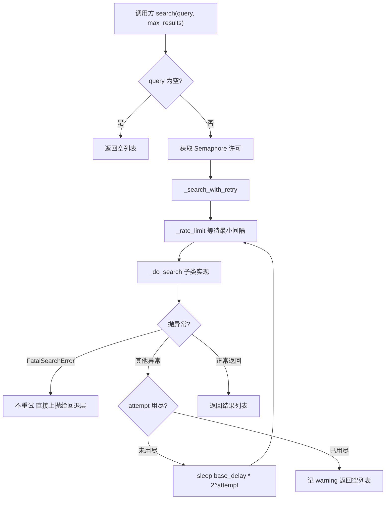
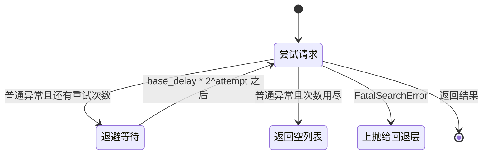

# 统一搜索接口与重试语义

适配层位于 `backend/search/base.py`，它把博查、百度、Exa 三个来源共有的模式收进一个抽象基类：并发闸门、请求最小间隔、指数退避重试。三个子类只实现 `_do_search()`，把「怎么调 API、怎么解析响应」和「失败之后怎么办」分开写。搜索源的差异因此集中在各子类内部，失败处理只有一份。读懂基类之后，再去看任何一条具体实现，关注点都只剩两件事：请求体怎么拼、响应字段怎么取。重试、限流、异常分类由基类兜住，子类不需要重复实现，也不应该绕过。

## 1. 一次搜索可能落入的四种结局

基类把调用结果分成四类，每类的后续动作不同：

| 结局 | 触发方式 | 基类的动作 | 是否触发回退 |
| --- | --- | --- | --- |
| 正常返回 | `_do_search()` 返回非空列表 | 直接返回 | 否 |
| 空结果 | `_do_search()` 返回 `[]` | 直接返回空列表 | 否（Hybrid 层会自行判断） |
| 瞬态失败 | `_do_search()` 抛普通异常 | 退避重试，用尽后返回 `[]` | 否 |
| 致命失败 | `_do_search()` 抛 `FatalSearchError` | 不重试，原样上抛 | 是 |

两类自定义异常在 `backend/search/base.py` 里定义，都只继承 `Exception`、不带额外字段，全靠类型区分：`RateLimitError` 表示子类遇到了 429，基类会按同一个退避逻辑重试；`FatalSearchError` 表示认证失效、额度不足或服务不可用，基类不重试也不吞掉，交给外层的回退包装器切换来源。这个划分是整条链路的枢纽：异常类型决定了这次失败能否被重试掩盖，以及会不会触发换源。

```python
# backend/search/base.py
class RateLimitError(Exception):
    """子类遇到 429 限速时抛出，基类会以指数退避重试。"""

class FatalSearchError(Exception):
    """致命搜索错误（认证失败/额度不足/服务不可用）。"""
```

429 是 HTTP 的「请求过多」状态码，表示被服务端限速、等一下通常就好，所以归入可重试；`FatalSearchError` 则意味着继续重试同一个源没有意义。这个划分是整条链路的枢纽：异常类型决定了这次失败能否被重试掩盖，以及会不会触发换源。

## 2. 构造函数里的四个旋钮

`BaseSearchClient.__init__()`（`backend/search/base.py`）接收四个参数并据此建立三件状态。签名里的 `*` 表示这些参数只能按关键字传入，避免调用时把几个数字传错位置：

```python
self._semaphore = asyncio.Semaphore(max_concurrent)
self._lock = asyncio.Lock()
self._last_ts: float = 0.0
self._min_interval = 1.0 / rate_per_sec if rate_per_sec > 0 else 0.0
```

四个参数的默认值是 `max_concurrent=5`、`rate_per_sec=2.0`、`max_retries=2`、`base_delay=1.0`。`rate_per_sec` 并不表示「每秒固定发几次」，它被换算成两次请求之间的最小间隔 `1.0 / rate_per_sec`；传 0 表示不做间隔约束。博查这一路把 `rate_per_sec` 设成 0（`backend/search/bocha.py` 的 `BochaSearchClient`），因为它的限速由服务端返回 429 表达，客户端再加一层间隔只会拖慢批量搜索。

```python
# backend/search/bocha.py（节选）
super().__init__(
    max_concurrent=max_concurrent,
    rate_per_sec=0.0,      # 限速交给服务端的 429 表达
    max_retries=2,
    base_delay=2.0,
)
```

它的重试底数 `base_delay` 取 2.0 秒而不是默认的 1.0，因为博查是远端商业 API，抖动通常不会在 1 秒内恢复。

并发与间隔解决的是两个不同的问题。信号量限制同时在飞的请求数，避免瞬时打满连接池；最小间隔限制请求的发起节奏，避免被服务端判定为爬取。两者都在基类里实现，子类拿到的 `search()` 已经是一个被约束过的入口。

## 3. 一次 search() 的完整路径



`search()` 本身就是这三行：空查询直接返回空列表、用信号量包住一次重试流程、把结果原样返回。信号量在 `async with` 里获取，意味着同一时刻在飞的请求数受 `max_concurrent` 限制，而许可的释放在异常路径上也成立——这正是把整段重试放在 `async with` 内部的原因。

```python
# backend/search/base.py（节选）
async def search(self, query: str, max_results: int = 10) -> List[SearchResult]:
    """带限流、重试的搜索入口。"""
    if not query:
        return []

    async with self._semaphore:
        return await self._search_with_retry(query, max_results)
```

`async with` 是 Python 的异步上下文管理器语法：进入时获取信号量许可、退出时自动释放，包括中途抛异常的情况——这正是把整段重试包在里面的原因。

## 4. 指数退避只重试一类错误

`_search_with_retry()` 的循环次数是 `max_retries + 1`，也就是默认最多尝试 3 次，主体只有十来行：的循环次数是 `max_retries + 1`，也就是默认最多尝试 3 次。循环体里的顺序决定了两件事：

```python
# backend/search/base.py（节选）
for attempt in range(self.max_retries + 1):
    try:
        await self._rate_limit()
        return await self._do_search(query, max_results)
    except FatalSearchError:
        raise                          # 不重试，交给回退层
    except Exception as e:
        if attempt >= self.max_retries:
            logger.warning(...)
            return []                  # 重试用尽，返回空列表
        delay = self.base_delay * (2 ** attempt)
        logger.warning(...)
        await asyncio.sleep(delay)
return []
```

循环体里的顺序决定了两件事：

1. 每次尝试之前先调 `_rate_limit()`，把间隔约束套在每次真实请求上，而不是只在第一次。
2. `FatalSearchError` 在第一个 `except` 分支就被重新抛出，既不记重试日志也不等待。其余异常进入退避分支：第 `attempt` 次失败后的等待时间是 `base_delay * 2^attempt`，默认 1 秒、2 秒；超过重试上限时记一条 warning 并返回空列表。返回空列表而不是继续上抛，是为了让「搜索源暂时抖动」不打断整条流水线——上层的空结果处理会把它当作没有找到来源。



## 5. 限流器保证的是最小间隔

`_rate_limit()` 的完整实现如下：用 `time.monotonic()` 而不是墙上时钟，避免系统时间被调整后间隔计算出现负值。实现是三行：算出距上次请求的间隔、不足则睡掉差额、把本次时刻写回。整段代码在 `asyncio.Lock` 保护下，因此多个协程并发调用时，间隔约束仍然成立，不会出现「同时判断都没超时、然后同时发出去」。

```python
# backend/search/base.py（节选）
async def _rate_limit(self) -> None:
    """令请求间至少间隔 _min_interval 秒，避免触发限速。"""
    if self._min_interval <= 0:
        return
    async with self._lock:
        elapsed = time.monotonic() - self._last_ts
        if elapsed < self._min_interval:
            await asyncio.sleep(self._min_interval - elapsed)
        self._last_ts = time.monotonic()
```

`time.monotonic()` 是只会向前走的单调时钟，不受系统时间被手动调整或用 NTP 对时的影响，用它算间隔不会出现负值。整段在 `asyncio.Lock` 保护下，因此多个协程并发调用时判断与写入是原子的，不会出现「都没超时、然后同时发出去」。

一个容易忽略的后果是：等待期间协程持有锁，但 `_semaphore` 许可已经拿到。也就是说，间隔约束发生在并发闸门之内，被等待的请求仍然占用一个并发额度。把 `rate_per_sec` 设得过小会同时压低吞吐与并发利用率：百度反代与 Exa 两条实现都受这一份限流器约束，限速值调小后并发额度被等待中的请求占住，两者的并发利用率会一起下降。

## 6. 空查询不进网络

`search()` 开头判断 `if not query: return []`。这条短路看起来只是防御性代码，实际上改变了下游语义：空查询不消耗信号量、不触发限流、不产生日志，也不会被算作一次失败。调用方在拼接关键词时如果产生了空串，拿到的是空列表而不是异常，需要在上层自行区分「没搜到」和「没搜」。

## 7. 两套 SearchResult 模型与它们的转换

适配层内部存在两个同名模型，字段一样、类型不同：

```python
# backend/search/exa.py（节选）· 搜索侧：Pydantic 模型
class SearchResult(BaseModel):
    """搜索结果条目。"""
    url: str
    title: str
    snippet: str = ""

# backend/pipeline/stages.py（节选）· 流水线侧：dataclass
@dataclass
class SearchResult:
    url: str
    title: str = ""
    snippet: str = ""
```

Pydantic 的 `BaseModel` 会在构造时做类型校验、并把 JSON 字段解析成 Python 值，适合直接承接 API 返回；`dataclass` 是标准库的轻量数据容器，没有校验开销。`__init__.py` 把 Pydantic 版本导出为对外的公共名，百度与博查两条实现则直接构造 `dataclass` 版本。

归一发生在 `SourceProvider` 里：三家的 Provider 各自把客户端返回的对象逐条转成流水线版本，`ExaSourceProvider` 是这样：

```python
# backend/pipeline/defaults.py（节选）
async def search(self, query: str, max_results: int = 5) -> List[SearchResult]:
    raw = await self.search_client.search(query, max_results)
    results = []
    for r in raw:
        if isinstance(r, SearchResult):
            if r.url and not _dq().is_blocked(r.url):
                results.append(r)
        elif hasattr(r, "url"):          # 别的对象：按字段名取值再转
            results.append(SearchResult(
                url=url, title=getattr(r, "title", ""),
                snippet=getattr(r, "snippet", getattr(r, "description", "")),
            ))
    return results
```

`isinstance` 分支同时兼容「已经是流水线模型」与「还是客户端对象」两种输入；`_dq().is_blocked(url)` 是域名质量分模块给出的拉黑判断，转进来的每个 URL 都要先过这一关。

分开的理由是依赖方向：搜索模块不想依赖流水线，流水线也不想被搜索库的 Pydantic 版本绑住。代价是每新增一个搜索源，都要在 `defaults.py` 里多写一个 `SourceProvider` 适配器，字段映射要重抄一遍。三份实现的字段处理几乎相同，只有缺字段时的默认值略有差别。

## 8. 易错点

- 把 `rate_per_sec` 当成「每秒请求数上限」。它换算的是最小间隔，实际速率还受并发数与单次请求耗时影响；要限制 QPS 需要同时看这两个量。
- 子类里自己吞异常。基类的重试与回退判定完全依赖异常类型：`_do_search()` 里如果先 `try/except` 再返回 `[]`，瞬态失败会被伪装成「无结果」，回退层永远看不到。
- 在 `_do_search()` 里做客户端截断。百度与博查两条实现都刻意保留全量候选（`backend/search/baidu.py` 与 `backend/search/bocha.py`），把挑来源的职责留给下游的加权选择。
- 忘记 `FatalSearchError` 与 `RateLimitError` 的区别。429 应该抛前者之外的那一个，交给基类退避；抛成 `FatalSearchError` 会直接熔断主源，把可恢复的限速放大成一次换源。
- 认为空查询也会走限流。`search()` 的短路在信号量之前，空查询既不占额度也不留日志，排查时不要在限流日志里找它。

## 小结

核心概念：

| 概念 | 内容 |
| --- | --- |
| `_do_search()` | 子类唯一需要实现的方法，负责 API 调用与响应解析 |
| 四类结局 | 正常、空结果、瞬态失败（重试后为空）、致命失败（上抛） |
| `RateLimitError` | 429 等可恢复限速，走与其他异常相同的退避 |
| `FatalSearchError` | 认证、额度、服务不可用，不重试，交给回退层 |
| `_min_interval` | 由 `rate_per_sec` 换算的最小请求间隔，0 表示不约束 |
| 两套 `SearchResult` | 搜索侧 Pydantic，流水线侧 dataclass，在 `SourceProvider` 转换 |

设计权衡：

| 决策 | 选择 | 收益 | 代价 |
| --- | --- | --- | --- |
| 失败处理位置 | 基类统一 | 三个子类只写请求与解析 | 子类必须遵守异常约定，否则语义丢失 |
| 重试用尽后返回空 | 返回 `[]` | 单源抖动不打断流水线 | 「没搜到」与「搜失败」在上层难区分 |
| 限流实现 | 最小间隔加锁 | 并发下间隔仍成立 | 等待期间占用并发额度 |
| 结果模型 | 两侧各有一套 | 搜索模块不依赖流水线 | 每新增来源要重写一次字段映射 |

## 练习

### 基础题

1. `max_retries=2`、`base_delay=1.0` 时，一次搜索最坏情况下要等多久才返回空列表？写出退避序列。
2. 把 `rate_per_sec` 从 2.0 改成 0.5，`_min_interval` 变成多少？对 `max_concurrent=5` 的实际吞吐有什么影响？
3. 子类在 `_do_search()` 里捕获了 `httpx.TimeoutException` 并返回 `[]`。描述这条改动的三类后果。

### 挑战题

4. 设计一个能在日志里区分「空结果」与「重试后失败」的方案，要求不改变 `_do_search()` 的签名。
5. 三个子类的字段映射目前分散在三处 `SourceProvider` 中。给出一个把映射收敛到一处的重构方案，并说明如何保持对下游数据类的兼容。

### 本页引用的路径

| 路径 | 作用 |
| --- | --- |
| `backend/search/base.py` | 基类、两类异常、重试与限流 |
| `backend/search/exa.py` | Exa 客户端与搜索侧 `SearchResult` |
| `backend/pipeline/stages.py` | 流水线侧 `SearchResult` 与各抽象阶段 |
| `backend/pipeline/defaults.py` | 三个 `SourceProvider` 与字段转换 |
| `backend/search/__init__.py` | 对外导出的公共名字 |
| `backend/config.py` | 默认来源与回退开关 |
