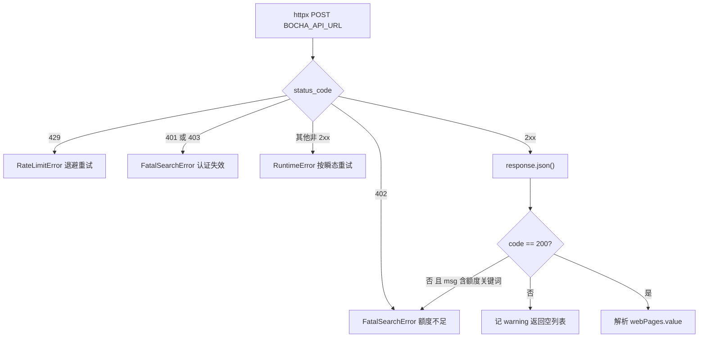
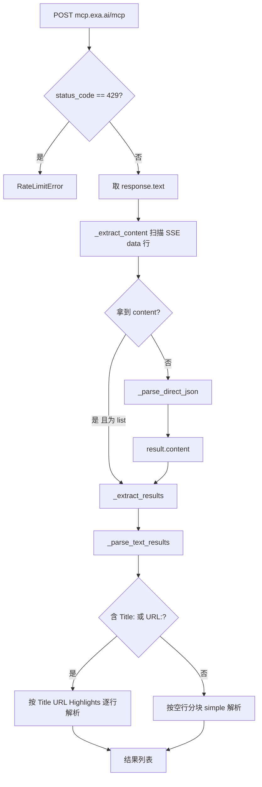

# 博查与 Exa 的 API 适配

同样是「按关键词拿一批 URL」，博查与 Exa 用了两种完全不同的接口形态。博查是普通的 HTTP POST：一个 JSON 请求体、一个 JSON 响应体，额度与鉴权都用状态码表达。Exa 走的是 MCP 端点，请求与响应都包在 JSON-RPC 里，服务端还可能以 SSE 流的形式回数据。两条实现都继承 `BaseSearchClient`，因此重试、限流、异常分类的写法一致，差异全部集中在 `_do_search()` 与各自的解析函数里。

两条实现放在一起读，关注点落在同一个抽象面对不同协议时要处理的额外情况：状态码怎么翻译成异常、候选池取多大、响应结构不固定时怎么兜底。

## 1. 博查的请求体与固定候选池

博查的请求体在 `backend/search/bocha.py:78` 附近拼装，字段有四个：`query`、`freshness`、`summary` 与 `count`。前两个是查询语义，`count` 被硬编码为 60，注释给出了理由：候选池必须远大于目标来源数（本仓库默认 `max_sources=2`，`backend/config.py:98`），下游的加权筛选才有选择余地。

```python
payload = {
    "query": query,
    "freshness": self._freshness,
    "summary": self._summary,
    "count": 60,
}
```

与之配套的注释记录了一处历史问题：早期按 `max_results` 截断返回条数，当目标来源数是 5 时 API 只回 3 到 5 条，筛选环节无米下锅，低质 URL 直接进入抓取（`backend/search/bocha.py:82`）。因此博查这条实现刻意不做客户端截断，`max_results` 参数在解析函数里也没有被使用（`backend/search/bocha.py:124`）。

同样地，百度实现保留了全量候选（`backend/search/baidu.py:68`）。两条实现的选择一致：适配层只负责拿到尽可能全的候选，挑哪几条交给下游。

`count` 与 `max_results` 的关系容易读错。`max_results` 是调用方希望拿到几条，`count` 是向服务端要几条。博查按次计费，返回条数不额外计费，所以放大候选池不会增加成本；服务端在超过上限时会自行钳制。

## 2. 博查的状态码到异常类型的映射

`_do_search()` 把 HTTP 状态码翻译成三类语义（`backend/search/bocha.py:96`）：

| 状态码 | 含义 | 抛出的异常 | 基类的动作 |
| --- | --- | --- | --- |
| 429 | 触发限速 | `RateLimitError` | 指数退避重试 |
| 401 / 403 | 鉴权失效 | `FatalSearchError` | 不重试，上抛给回退层 |
| 402 | 余额或额度不足 | `FatalSearchError` | 不重试，上抛给回退层 |
| 其他非 2xx | 未预期错误 | `RuntimeError` | 按瞬态处理，退避重试 |



业务层的错误还要再判一次：响应体里的 `code` 不等于 200 时，`msg` 中若含有「额度」「余额」「欠费」或对应英文关键词，同样按致命错误上抛（`backend/search/bocha.py:130`）；其余业务错误记一条 warning 后返回空列表。HTTP 层与业务层都参与分类，是因为额度不足既可能以 402 出现，也可能以 200 加错误码的形式返回。

## 3. 黑名单域名的 60 秒缓存

博查支持 `exclude` 参数排除指定域名。本仓库的黑名单来自域名质量模块，读取路径是 `backend/scraper/domain_quality.py` 的 `list_blocked()`，上限 100 个（`backend/search/bocha.py:27`）。每次搜索都查一次 SQLite 会带来额外延迟，因此模块级用两个全局变量做 60 秒内存缓存（`backend/search/bocha.py:22`）：

```python
_blocked_cache: list[str] = []
_blocked_cache_ts: float = 0.0
_BLOCKED_CACHE_TTL = 60.0
```

缓存读取失败时把结果置空并刷新时间戳（`backend/search/bocha.py:37`），也就是故障期间不会反复重试读取，而是按空黑名单继续搜索。这个取舍偏向可用性：宁可暂时放行被拉黑的域名，也不让搜索因黑名单读取失败而中断。缓存是模块级的，多个客户端实例共享，因此 `list_blocked()` 的调用频率与实例数无关。

## 4. 从响应字段到结果列表

解析函数 `_parse_response()`（`backend/search/bocha.py:124`）沿着 `data → webPages → value` 逐层取字段，每一层都先判类型再取下一层，遇到不符合预期的结构就返回空列表。条目级只取三个字段：`url`、`name`、`snippet`（`backend/search/bocha.py:158`），其中 `title` 来自 `name` 而不是 `title`，这是与 Exa 最直接的字段口径差异。

`totalEstimatedMatches` 只用于日志（`backend/search/bocha.py:164`），不参与结果构造。

## 5. Exa 走 MCP 端点

Exa 客户端的 `EXA_MCP_URL` 固定为 `https://mcp.exa.ai/mcp`（`backend/search/exa.py:36`），请求体是标准 JSON-RPC 调用 `tools/call`，工具名 `web_search_exa`，参数包含 `query`、`numResults`、`type=auto` 与 `livecrawl=fallback`（`backend/search/exa.py:48`）。

与博查相比，这里多了一层协议：HTTP 状态码只用来判 429，其余语义都在 JSON-RPC 的 `result` 里。请求头声明同时接受 `application/json` 与 `text/event-stream`（`backend/search/exa.py:68`），因为 MCP 服务端可能以 SSE 流式返回。`numResults` 直接使用调用方传入的 `max_results`，这一点与博查的固定候选池不同：Exa 这条实现不放大候选池。

## 6. SSE 与直连 JSON 两条解析路径

`_parse_exa_response()`（`backend/search/exa.py:87`）先尝试从 SSE 行里提取 `content`，失败再按普通 JSON 解析。SSE 分支逐行扫描以 `data:` 开头的行，把冒号后的内容按 JSON 解析，取出 `result.content`（`backend/search/exa.py:97`）。

直连分支直接解析整个响应体，取 `result.content` 列表（`backend/search/exa.py:113`）。两条路径最后都汇入 `_extract_results()`，把 `content` 每一项的 `text` 字段交给文本解析。



## 7. 文本响应的两种格式

Exa 返回的是人可读文本，格式并不固定。`_parse_text_results()`（`backend/search/exa.py:133`）用「是否含 `Title:` 或 `URL:`」作为分派条件：

- 结构化格式逐行推进，`Title:` 开启一条新结果，`URL:` 记录地址，`Highlights:` 之后的非空行累加进 `snippet`，`Published:` / `Author:` / `ID:` / `Score:` 一律跳过（`backend/search/exa.py:177`）。最后一行结果在循环外补收（`backend/search/exa.py:185`）。
- 简单格式按空行切块，要求每块至少两行且第二行以 `http` 开头，第一行作为标题、第二行作为地址、其余合并成摘要（`backend/search/exa.py:194`）。两种格式都可能解析出零条结果。这种情况不抛异常，基类因此不会重试，也不会触发回退——「格式没匹配上」与「确实没有结果」在当前实现里无法区分，这是一处已知的口径模糊。

## 8. 两个来源的字段口径对照

| 维度 | 博查 | Exa |
| --- | --- | --- |
| 协议 | HTTP POST，JSON 请求与响应 | MCP JSON-RPC，响应可能是 SSE |
| 认证 | `Authorization: Bearer` 头（`backend/search/bocha.py:117`） | 无显式鉴权头 |
| 候选池 | 固定 `count=60` | 透传 `numResults` |
| 标题字段 | `name` | 文本里的 `Title:` 行 |
| 摘要字段 | `snippet` | `Highlights:` 段拼接 |
| 致命错误来源 | 状态码 401/403/402 与业务错误码 | 仅 429 有专门分支 |
| 超时 | `BOCHA_TIMEOUT=30`（`backend/config.py:78`） | `EXA_TIMEOUT=30`（`backend/config.py:87`） |

两条实现都自带 `httpx.AsyncClient` 的懒加载与所有权标记：外部传入客户端时不关闭，自己创建的在 `close()` 里关闭（`backend/search/bocha.py:110`、`backend/search/exa.py:80`）。这让测试可以注入假客户端而不泄漏连接。

## 9. 易错点

- 以为 `max_results` 会限制博查返回条数。解析函数不读这个参数，返回的是 `count` 条候选。
- 把 Exa 的 429 当成致命错误。它抛的是 `RateLimitError`，会走退避而不是换源。
- 业务错误码只看 `code`。额度不足既可能走 HTTP 402，也可能走 200 加错误码加关键词，两处都要判。
- 忘记 `exclude` 的 100 上限。`list_blocked(limit=100)` 取的是前 100 条，超出的域名不会进入排除列表。
- 用 `Title:` 的存在与否猜响应格式。简单格式的标题行也可能含该字样，分派条件同时检查 `URL:` 可以降低误判，但无法完全消除。

## 小结

核心概念：

| 概念 | 内容 |
| --- | --- |
| 候选池 | 博查固定 60 条，Exa 透传调用方条数，两者都不在客户端截断 |
| 状态码映射 | 博查把 401/403/402 翻译成 `FatalSearchError`，其余非 2xx 按瞬态处理 |
| 业务错误二次判定 | `code != 200` 时按 `msg` 关键词识别额度类致命错误 |
| 黑名单缓存 | 模块级 60 秒 TTL，读取失败按空列表继续 |
| SSE 优先 | Exa 先扫 `data:` 行，再退回直连 JSON，最后按文本格式解析 |
| 字段口径 | 博查 `name`/`snippet`，Exa 从文本行提取，统一转换在 `SourceProvider` |

设计权衡：

| 决策 | 选择 | 收益 | 代价 |
| --- | --- | --- | --- |
| 候选池大小 | 固定 60（博查） | 下游筛选有选择余地 | 单次响应体更大 |
| 黑名单失败 | 按空列表继续 | 黑名单故障不阻断搜索 | 拉黑域名可能被放行 |
| 解析失败 | 返回空列表 | 不误触发重试与回退 | 与「无结果」无法区分 |
| 协议适配 | 两条实现各自解析 | 协议差异不外泄 | 字段口径差异需在适配层消化 |

## 练习

### 基础题

1. 博查返回 `code=200` 但 `webPages` 是字符串，写出解析函数的执行路径与返回值。
2. 为什么 `_get_excluded_domains()` 的失败分支要刷新 `_blocked_cache_ts`？不刷新会怎样？
3. 指出 Exa 简单格式解析中，哪种合法响应会被漏掉。

### 挑战题

4. 设计一个能在不抛异常的前提下表达「解析格式不匹配」的方案，要求回退层能据此换源。
5. 把两条实现的状态码映射抽成一张声明式表格，说明这样做对新增第三个 HTTP 搜索源的影响。

### 本页引用的路径

| 路径 | 作用 |
| --- | --- |
| `backend/search/bocha.py` | 博查客户端、黑名单缓存、状态码映射 |
| `backend/search/exa.py` | Exa MCP 客户端与三种文本解析 |
| `backend/search/base.py` | 基类与异常类型 |
| `backend/scraper/domain_quality.py` | `list_blocked()` 黑名单来源 |
| `backend/config.py` | 超时、并发与默认来源 |
