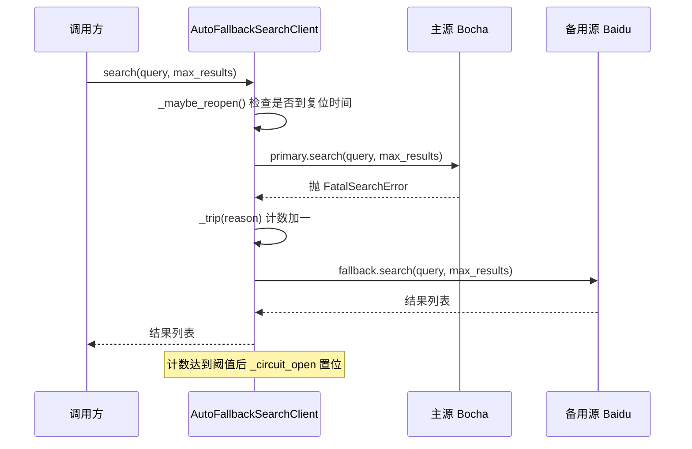
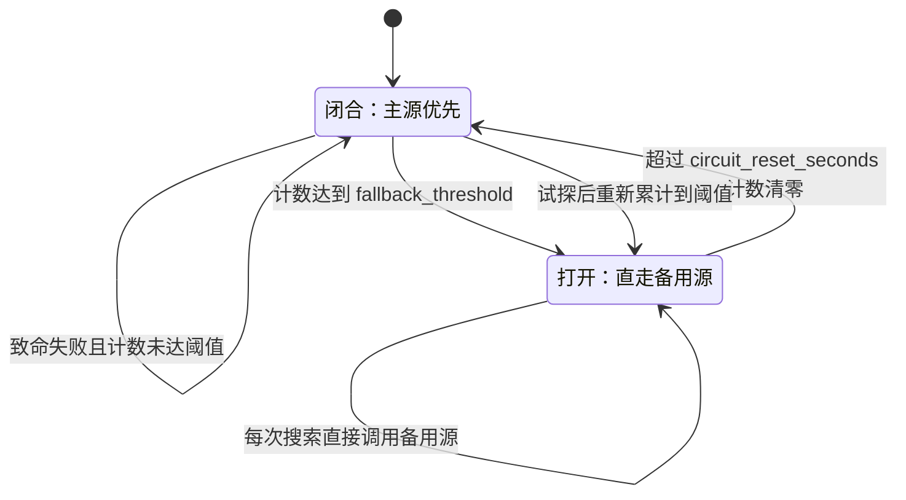

# 百度反代与回退熔断

百度这一路的实现形态和前两条不同：底层库是同步的，客户端要用 `asyncio.to_thread()` 把它搬进事件循环；它又是博查的兜底来源，只有在上游认证失效或额度耗尽时才会被用到。围绕它的代码因此分成两块——一块是 `backend/search/baidu.py` 里的同步到异步适配与业务码处理，另一块是 `backend/search/fallback.py` 里的熔断式回退包装器。

熔断这一层解决的问题很具体：主源连续致命失败之后，每一次搜索仍然先打一次主源，失败再换源，白白增加一次网络往返。计数达到阈值后把开关置开、后续请求直走备用源，这就是包装器引入状态的全部理由。

## 1. 百度实现把同步库接进异步链路

`BaiduSearchClient`（`backend/search/baidu.py:18`）的构造函数只暴露三个参数：`max_concurrent`、`rate_limit`、`retry_limit`，默认 3、1.0、2（`backend/search/baidu.py:24`）。它们被翻译成基类的 `max_concurrent=3`、`rate_per_sec=1.0`、`max_retries=2`，而 `base_delay` 固定为 2.0 秒（`backend/search/baidu.py:34`）。

比基类默认值更保守的并发与间隔，是因为反代接口对访问频率更敏感。适配只发生在一行：`_do_search()` 用 `asyncio.to_thread(client.search, query)` 调用同步库（`backend/search/baidu.py:48`），把阻塞调用挪到线程池。`BaiduPc` 实例懒加载并缓存在 `self._client` 上（`backend/search/baidu.py:38`），进程内复用。这条路径没有连接池概念，客户端的并发上限由 `_semaphore` 控制，线程池的大小交给运行时的默认值。

## 2. 百度业务码的处理会吞掉两类失败

返回体不是字典时记一条 warning 并返回空列表（`backend/search/baidu.py:50`）。业务码不等于 200 时同样返回空列表，只在日志里区分 501 与 429（`backend/search/baidu.py:56`）：

```python
if code != 200:
    logger.warning(f"[Baidu] {query!r} 错误: code={code}, msg={msg}")
    if code == 501:
        logger.warning("[Baidu] 安全验证触发")
    elif code == 429:
        logger.warning("[Baidu] 限速 429")
    return []
```

对照博查的实现可以看出差别：博查把 429 抛成 `RateLimitError`，基类随后按 `base_delay * 2^attempt` 退避重试（`backend/search/bocha.py:96`）；百度把 429 和 501 都写成日志加空列表，两者都不会被基类重试，也不会被回退包装器看见。后果是百度作为备用源时，一旦触发安全验证或限速，这一次搜索直接以零来源结束，没有任何补偿动作。这是一处可以从代码直接读出的行为差异，修改前需要先决定这两类失败应该算可重试还是该换源。

## 3. 回退包装器的构造参数与状态字段

`AutoFallbackSearchClient`（`backend/search/fallback.py:24`）接收主源、备用源、阈值、复位时间与名字，并初始化五个状态字段（`backend/search/fallback.py:42`）：

| 字段 | 含义 | 初值 |
| --- | --- | --- |
| `_fatal_count` | 连续致命失败计数 | 0 |
| `_circuit_open` | 熔断开关 | `False` |
| `_circuit_opened_at` | 打开时刻（`time.monotonic()`） | `None` |
| `_fallback_hits` | 实际走到备用源的次数 | 0 |
| `_last_trigger` | 最近一次触发原因 | `None` |

构造时它调用基类的方式需要留意：`max_concurrent` 取自 `max(primary._semaphore._value, 1)`，`rate_per_sec=0.0`、`max_retries=0`（`backend/search/fallback.py:35`）。包装器自身不做限流也不做重试，因为它把活干在内部的 `primary.search()` 上，限流与重试由主源自己完成。并发上限沿用主源的信号量当前值，读的是私有属性，主源信号量被并发占用时这个值会偏小，属于实现上的已知粗糙处。

## 4. 一次致命失败的完整回退时序



主源路径的异常处理分两支（`backend/search/fallback.py:101`）：捕获到 `FatalSearchError` 时先 `_trip()` 再调用备用源，备用源自身抛异常则记一条 error 并返回空列表；捕获到其他异常时只记 warning 并返回空列表，不做回退。熔断打开之后 `_do_search()` 的第一分支直接调用备用源（`backend/search/fallback.py:91`），不再尝试主源。

## 5. 熔断的打开与半开试探

`_trip()`（`backend/search/fallback.py:77`）只做三件事：计数加一、记录原因、在计数达到阈值且开关尚未打开时把开关置位并记录打开时刻。阈值默认 3，即连续三次致命失败之后才切换。`_maybe_reopen()`（`backend/search/fallback.py:69`）在每次搜索开头被调用，若开关已打开且距打开时刻超过 `circuit_reset_seconds`（默认 1800 秒），就把开关与计数一起清零，下一次搜索重新尝试主源。



复位把计数清零这一点决定了试探的语义：1800 秒之后第一次尝试主源，即使再次致命失败，计数也只是从 1 重新开始，开关不会立刻回到打开状态。也就是说熔断打开一次之后，每次复位都需要重新累计三次失败才会再次打开。`reset()` 提供了手动复位入口（`backend/search/fallback.py:53`），用于确认主源已经恢复之后立即切回。

## 6. 非致命异常为什么不触发回退

主源的非致命异常已经在它自己的基类里重试过并返回空列表，走到包装器时通常只剩「服务端返回了空结果」或「重试仍然超时但按主源语义返回空」两种情况。此时切换备用源会把一次普通的空结果放大成两次网络请求，而空结果本身在中文查询里很常见，所以包装器选择记一条 warning 后返回空列表（`backend/search/fallback.py:113`）。这条规则和基类的异常分类是配套的：可恢复的失败应该在主源内部消化，只有认证、额度、服务不可用这类「换源才有意义」的失败才向上冒泡成 `FatalSearchError`。

两条实现里会抛 `FatalSearchError` 的只有博查（`backend/search/bocha.py:100`），百度实现目前一条都不抛，作为备用源时它没有更下一层的来源可以接替。

## 7. HybridSearchClient 是更早的一条回退链

`HybridSearchClient`（`backend/search/hybrid.py:20`）与包装器解决同一个问题，实现方式不同：它把百度放在前面、Exa 放在后面，百度返回空列表或抛异常时切换 Exa（`backend/search/hybrid.py:31`）。区别有两点。第一，它没有继承 `BaseSearchClient`，因此本身不带限流与重试，两个成员各自带；第二，它没有熔断状态，每次搜索都先试百度，不会因为连续失败而跳过。

它仍然被使用：工厂在 `search_provider` 取 `"baidu"` 时构造 `BaiduSourceProvider(HybridSearchClient())`（`backend/pipeline/factory.py:47`）。也就是说这条链是「百度主用」时代留下的路径，而 `AutoFallbackSearchClient` 是「博查主用」时代的路径，两者在仓库里并存。

| 维度 | `HybridSearchClient` | `AutoFallbackSearchClient` |
| --- | --- | --- |
| 继承基类 | 否 | 是 |
| 主源 | 百度 | 博查 |
| 备用源 | Exa | 百度 |
| 触发条件 | 空结果或任意异常 | 仅 `FatalSearchError` |
| 熔断 | 无 | 有，默认阈值 3、复位 1800 秒 |
| 使用位置 | `backend/pipeline/factory.py:47` | `backend/pipeline/factory.py:53` |

## 8. 观测点

包装器提供两个只读入口：`active_provider` 返回当前生效来源的字符串（`backend/search/fallback.py:48`），`stats()` 返回熔断开关、致命计数、备用命中次数、当前来源与最近触发原因（`backend/search/fallback.py:60`）。排查搜索质量下降时，先看 `fallback_hits` 是否在增长：它增长说明主源在持续失败，返回的结果其实来自百度反代，字段口径与博查不同。

日志侧的关键行有三处：主源回退时的 warning（`backend/search/fallback.py:105`）、熔断打开时的 error（`backend/search/fallback.py:83`）、以及备用源也失败时的 error（`backend/search/fallback.py:111`）。三者都带包装器名字，默认名字是调用时传入的 `"Bocha->Baidu"`（`backend/pipeline/factory.py:56`）。

## 9. 易错点

- 以为百度的 429 会重试。它只写日志并返回空列表，不会触发基类退避。
- 以为熔断会在任何异常后打开。只有 `FatalSearchError` 会累加计数，普通异常直接返回空列表。
- 误读复位语义。复位把计数清零，重新打开需要重新累计到阈值，一次试探失败不会立刻回到打开状态。
- 以为包装器会复用主源的并发上限。它读的是主源信号量在构造时刻的当前值，不是类定义的默认值。
- 把 `HybridSearchClient` 当成基类子类。它没有限流与重试，两个成员各自带；把它当普通客户端注入时需要留意这一点。

## 小结

核心概念：

| 概念 | 内容 |
| --- | --- |
| 同步转异步 | `asyncio.to_thread()` 把 `BaiduPc.search` 搬出事件循环 |
| 业务码处理 | 百度把 501、429 都记日志后返回空列表，不抛异常 |
| 熔断计数 | `_fatal_count` 累计致命失败，达到阈值后打开开关 |
| 打开状态 | 开关打开后所有搜索直走备用源，不再尝试主源 |
| 半开试探 | 超过 `circuit_reset_seconds` 后清零开关与计数，重新试探 |
| 两条回退链 | `HybridSearchClient` 无熔断，`AutoFallbackSearchClient` 有熔断 |

设计权衡：

| 决策 | 选择 | 收益 | 代价 |
| --- | --- | --- | --- |
| 包装器自带宽限流 | 关闭，交给主源 | 不叠加两层节流 | 主源信号量私有值被读取 |
| 回退触发条件 | 只认 `FatalSearchError` | 空结果不放大成两次请求 | 百度实现不抛该异常，链路断在最后一环 |
| 熔断复位 | 到期清零计数 | 试探失败不会立刻再熔断 | 主源持续不可用时会有周期性无效尝试 |
| 两条回退链并存 | 保留历史路径 | 不破坏旧配置 | 行为差异需要按 provider 取值分别理解 |

## 练习

### 基础题

1. `fallback_threshold=3`、主源每次搜索都抛 `FatalSearchError` 时，前三次搜索各走过哪些步骤？第四次与第五次呢？
2. 备用源返回空列表时 `_fallback_hits` 会不会加一？说明判断依据在代码里的哪一行。
3. 把 `circuit_reset_seconds` 设为 0 会发生什么？结合 `_maybe_reopen()` 的判定条件说明。

### 挑战题

4. 百度实现在 429 与 501 时返回空列表。给出一个让这两类失败分别进入重试与换源两条路径的改造方案，并说明对现有调用方的影响。
5. 设计一组日志断言，用来区分「主源空结果」「主源致命失败后备用源成功」「两条来源都失败」三种情形。

### 本页引用的路径

| 路径 | 作用 |
| --- | --- |
| `backend/search/baidu.py` | 百度客户端、同步库适配、业务码处理 |
| `backend/search/fallback.py` | 熔断式回退包装器与统计 |
| `backend/search/hybrid.py` | 百度优先、Exa 兜底的历史回退链 |
| `backend/search/bocha.py` | 会抛 `FatalSearchError` 的主源实现 |
| `backend/pipeline/factory.py` | 两条回退链的装配位置 |
