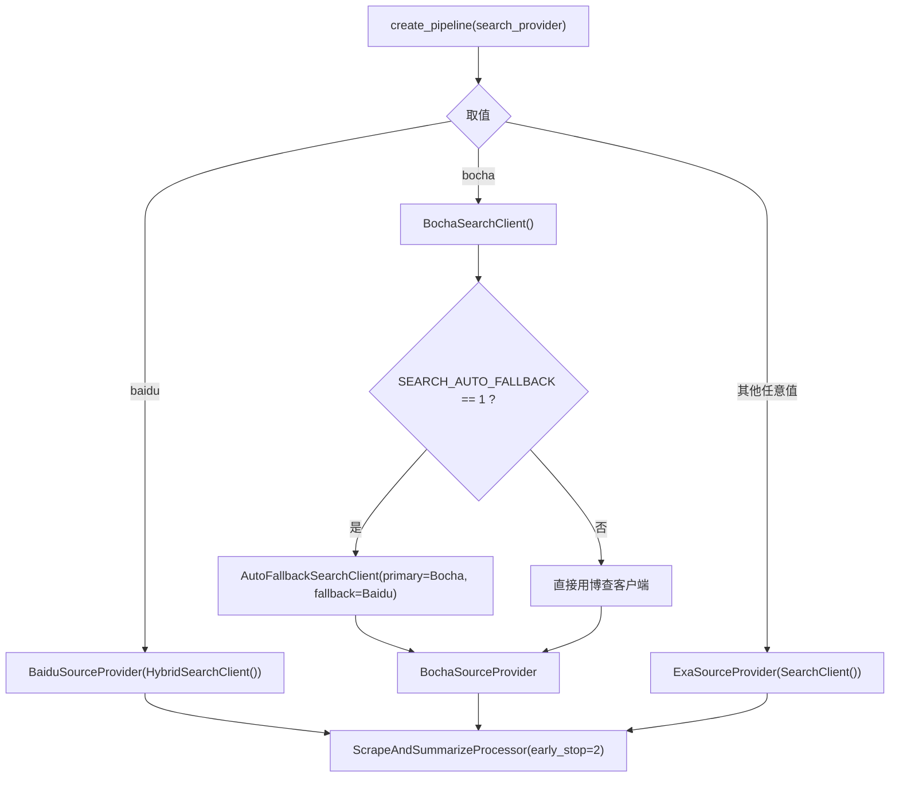
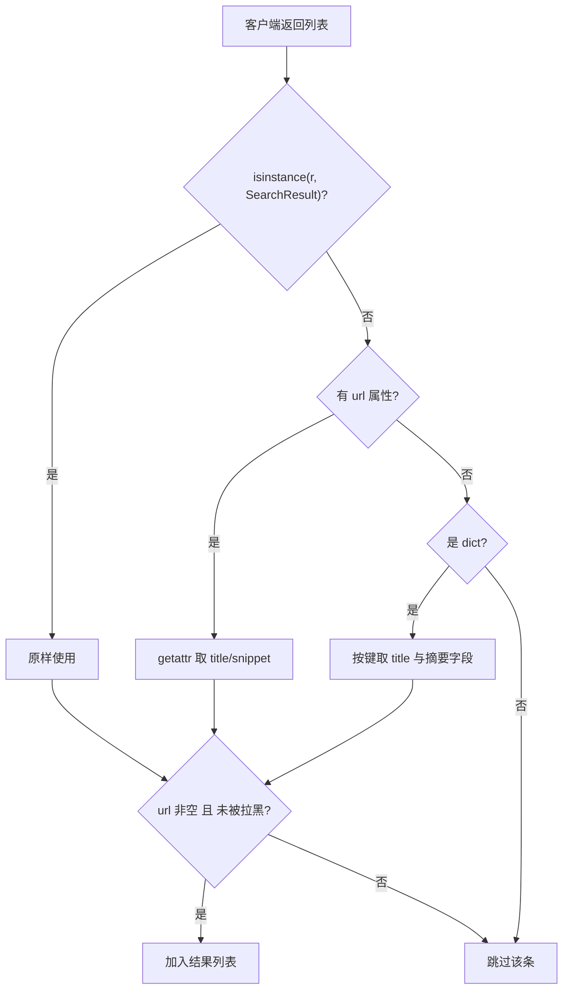

# 工厂装配与选择策略

搜索源的装配集中在 `backend/pipeline/factory.py`。调用方给出用户名、会话、探索深度与一个 `search_provider` 字符串，工厂返回一条已经接好搜索、抓取、卡片生成与持久化的流水线。搜索这一环的差异被压进三个分支：`"baidu"` 走百度加 Exa 的回退链，`"bocha"` 走博查（可选带熔断回退），其余取值走 Exa。装配侧的代码与配置常量放在一起读，要回答两个问题：一次请求最终用了哪个来源，以及返回结果在进入流水线之前被改写了什么。

## 1. provider 的三个取值与默认值

`backend/config.py:67` 的注释列出可选值 `"bocha" | "baidu" | "exa"`，默认值由环境变量 `DEFAULT_SEARCH_PROVIDER` 覆盖，取不到时使用 `"bocha"`（`backend/config.py:69`）。注释同时说明本环境需要经 `WSLENV` 透传环境变量，这与项目在 WSL 下运行有关。默认值是博查而不是 Exa，与后续的回退开关配套：博查是主源，百度是兜底，Exa 只在显式选择或历史配置里出现。

## 2. create_pipeline 的三条分支

`create_pipeline()` 的签名里 `search_provider: str = DEFAULT_SEARCH_PROVIDER`（`backend/pipeline/factory.py:36`），分支判断从 `backend/pipeline/factory.py:46` 开始：

三条分支的处理器相同，都是 `ScrapeAndSummarizeProcessor(fetcher, early_stop=2)`（`backend/pipeline/factory.py:48`、`:59`、`:62`）。差别只在来源与客户端包装方式。分支写法上有一个需要留意的点：第三条分支是 `else`，任何拼错或未支持的取值都会静默落到 Exa，而不会报错。

配置里写 `"bochaa"` 时不会得到博查，也不会得到提示。每次调用 `create_pipeline()` 都会新建客户端实例（`backend/pipeline/factory.py:50`、`:61`）。流水线对象通常与一次生成任务同生命周期，因此这里没有做跨请求的客户端复用，连接池在每个任务开始时重建。

## 3. 文档流水线固定用博查

`create_document_pipeline()`（`backend/pipeline/factory.py:78`）不接收 `search_provider`，来源固定为博查，回退开关同样生效（`backend/pipeline/factory.py:88`）。它使用 `DocumentChunkFetcher` 而不是网页抓取器，探索深度固定为 1。文档解析路径面向本地文件或文档内容，来源选择没有暴露给调用方。

## 4. 三份 SourceProvider 的字段归一

适配层在 `backend/pipeline/defaults.py`，三个 provider 都把客户端返回值转成流水线的 `SearchResult`（`backend/pipeline/stages.py:34`），并顺手过滤空 URL 与黑名单域名。

| provider | 定义位置 | 接受的原始类型 | 标题字段 | 摘要字段 |
| --- | --- | --- | --- | --- |
| `ExaSourceProvider` | `backend/pipeline/defaults.py:42` | 流水线数据类，或任意带 `url` 属性的对象 | `title` | `snippet`，缺省回退到 `description` |
| `BaiduSourceProvider` | `backend/pipeline/defaults.py:70` | 流水线数据类，或 `dict` | `title` | `description` |
| `BochaSourceProvider` | `backend/pipeline/defaults.py:97` | 流水线数据类，或 `dict` | `title` | `snippet` |

`ExaSourceProvider` 的转换分支用 `hasattr(r, "url")` 识别对象形态（`backend/pipeline/defaults.py:53`），字段读取写成 `getattr(r, "snippet", getattr(r, "description", ""))`（`backend/pipeline/defaults.py:60`）。

百度与博查两个 provider 走字典分支，字段名直接对应各自客户端的解析结果（`backend/pipeline/defaults.py:81`、`:108`）。三份代码结构相同，差异只在字典键名。

## 5. 黑名单过滤出现在两处

适配层通过 `_dq()` 拿到域名质量单例（`backend/pipeline/defaults.py:36`），对每条结果调用 `is_blocked()`（`backend/pipeline/defaults.py:51`、`:79`、`:106`）。与之并行的还有博查客户端里的 `exclude` 参数：它把黑名单前 100 个域名拼进请求体，交给服务端过滤（`backend/search/bocha.py:89`）。

两处过滤的作用范围不同。服务端 `exclude` 只能作用于博查这一条来源，而且受 100 个上限约束；适配层的 `is_blocked()` 对三条来源都生效，并且用的是同一个单例。百度与 Exa 两条路径只依赖适配层过滤，因此黑名单读取失败时它们不会得到任何服务端侧的排除。

## 6. 回退开关的取值与生效位置

`SEARCH_AUTO_FALLBACK` 默认 `"1"`（`backend/config.py:72`），只被两处读取：`create_pipeline()` 的博查分支（`backend/pipeline/factory.py:51`）与 `create_document_pipeline()` 的构造（`backend/pipeline/factory.py:93`）。

它比较的是字符串 `"1"`，因此写入 `"true"`、`"yes"` 都等同于关闭。关闭之后博查客户端被直接注入 provider，主源失败时不再有兜底。

## 7. 配置项清单与几个无读者的常量

| 常量 | 定义行 | 默认值 | 读取位置 |
| --- | --- | --- | --- |
| `DEFAULT_SEARCH_PROVIDER` | `backend/config.py:69` | `"bocha"` | `backend/pipeline/factory.py:36` |
| `SEARCH_AUTO_FALLBACK` | `backend/config.py:72` | `"1"` | `backend/pipeline/factory.py:51`、`:93` |
| `BOCHA_API_URL` | `backend/config.py:75` | 官方 web-search 地址 | `backend/search/bocha.py:63` |
| `BOCHA_API_KEY` | `backend/config.py:76` | 空字符串 | `backend/search/bocha.py:62` |
| `BOCHA_MAX_CONCURRENT` | `backend/config.py:77` | 5 | `backend/search/bocha.py:52` |
| `BOCHA_TIMEOUT` | `backend/config.py:78` | 30 | `backend/search/bocha.py:114` |
| `BAIDU_MAX_CONCURRENT` | `backend/config.py:81` | 3 | 无 |
| `BAIDU_RATE_LIMIT` | `backend/config.py:82` | 1.0 | 无 |
| `BAIDU_RETRY_LIMIT` | `backend/config.py:83` | 2 | 无 |
| `EXA_BASE_DELAY` | `backend/config.py:86` | 1.0 | 无 |
| `EXA_TIMEOUT` | `backend/config.py:87` | 30 | `backend/search/exa.py:83` |
| `EXA_MAX_RETRIES` | `backend/config.py:88` | 3 | `backend/search/exa.py:42` |

百度相关的三个常量与 `EXA_BASE_DELAY` 在仓库里没有任何导入点。百度客户端的同名参数写成了字面量默认值（`backend/search/baidu.py:26`、`:27`、`:28`），数值恰好与常量一致，但改常量不会改变运行时行为。这是一处可以从导入关系直接确认的不一致。

## 8. 路由层没有走 provider

`backend/routes/search.py:3` 的模块说明写着通过 Exa 搜索客户端，端点里直接构造 `SearchClient()`（`backend/routes/search.py:30`），没有读取 `DEFAULT_SEARCH_PROVIDER`，也没有经过任何 `SourceProvider`。影响有三层：该接口始终使用 Exa；返回值是搜索侧模型，不过黑名单过滤；每次请求新建客户端，文件里也没有对应的 `close()` 调用。

## 9. 未接入适配层的来源

`backend/search/` 下只有三个引擎适配器（`backend/search/baidu.py`、`backend/search/bocha.py`、`backend/search/exa.py`）与两个包装器（`backend/search/hybrid.py`、`backend/search/fallback.py`）。仓库里另有一个维基百科客户端 `WikipediaClient`（`backend/scraper/wikipedia_client.py:19`），支持多语言与 Parse API 到 Extracts API 的回退，但全仓库没有调用点，本仓库未见它接入搜索聚合链路。任务清单里提到的 `free` 引擎在 `backend/search/` 下没有对应实现，本仓库未见该引擎实现。

## 10. 易错点

- 认为非法 provider 会报错。第三条分支是 `else`，未知取值静默使用 Exa。
- 修改 `BAIDU_*` 常量期待生效。客户端不导入它们，参数是字面量。
- 在 `/api/search` 上验证 provider 切换。该路由固定使用 Exa。
- 以为黑名单只过滤一次。博查路径上服务端 `exclude` 与适配层 `is_blocked()` 都会过滤。
- 把 `SEARCH_AUTO_FALLBACK` 设成 `"true"`。判定条件是等于字符串 `"1"`。

## 小结

核心概念：

| 概念 | 内容 |
| --- | --- |
| provider 取值 | `"bocha"`、`"baidu"`、`"exa"`，默认 `"bocha"` |
| 三分支装配 | 百度走混合链，博查可带回退，其余走 Exa |
| SourceProvider | 把不同形态的返回值归一成流水线 `SearchResult` |
| 双层黑名单 | 博查服务端 `exclude` 与适配层 `is_blocked()` |
| 回退开关 | `SEARCH_AUTO_FALLBACK` 等于 `"1"` 时为真 |
| 无读者常量 | `BAIDU_*` 三个与 `EXA_BASE_DELAY` 没有导入点 |

设计权衡：

| 决策 | 选择 | 收益 | 代价 |
| --- | --- | --- | --- |
| 分支兜底 | `else` 落到 Exa | 老配置不会失效 | 拼写错误不会报错 |
| 客户端生命周期 | 每个流水线新建 | 任务间隔离 | 无跨请求连接复用 |
| 字段归一位置 | 每个 provider 各自转换 | 适配层不依赖搜索库 | 字段映射重复三份 |
| 配置常量 | 部分留作声明 | 便于将来接入 | 改常量不影响行为，易误判 |

## 练习

### 基础题

1. `search_provider="x"` 时最终使用哪个来源？指出对应的代码行。
2. 关闭回退开关后，博查出现 402 时会怎样？结合包装器是否参与说明。
3. 列出适配层在把结果交出去之前会做的两类过滤，并各指出一处行号。

### 挑战题

4. 设计一种既能保留 `else` 兜底、又能提示非法取值的装配方式，说明对现有调用与配置的兼容处理。
5. 把三份 provider 的字段映射收敛为一张声明式映射表，写出表结构并说明如何处理 `snippet` 与 `description` 两种键名。

### 本页引用的路径

| 路径 | 作用 |
| --- | --- |
| `backend/pipeline/factory.py` | 三分支装配与文档流水线 |
| `backend/pipeline/defaults.py` | 三个 `SourceProvider` 与结果归一 |
| `backend/pipeline/stages.py` | `SourceProvider` 抽象与流水线 `SearchResult` |
| `backend/config.py` | 默认来源、回退开关与各来源常量 |
| `backend/search/bocha.py` | 黑名单 `exclude` 与服务端过滤 |
| `backend/search/baidu.py` | 百度客户端的字面量参数 |
| `backend/search/exa.py` | Exa 客户端与超时、重试读取 |
| `backend/routes/search.py` | 固定使用 Exa 的搜索路由 |
| `backend/scraper/wikipedia_client.py` | 未接入聚合链路的维基客户端 |
