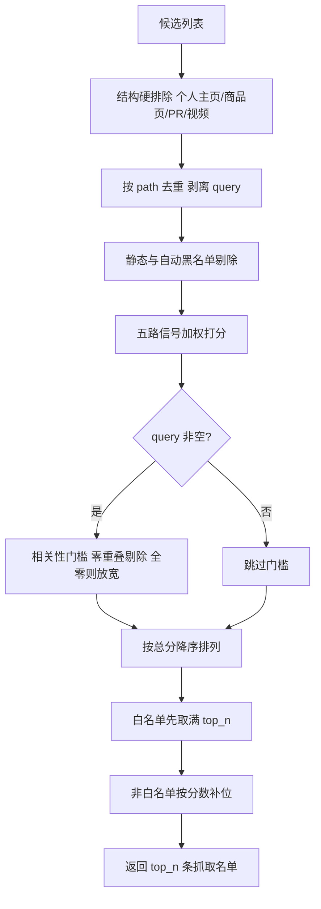
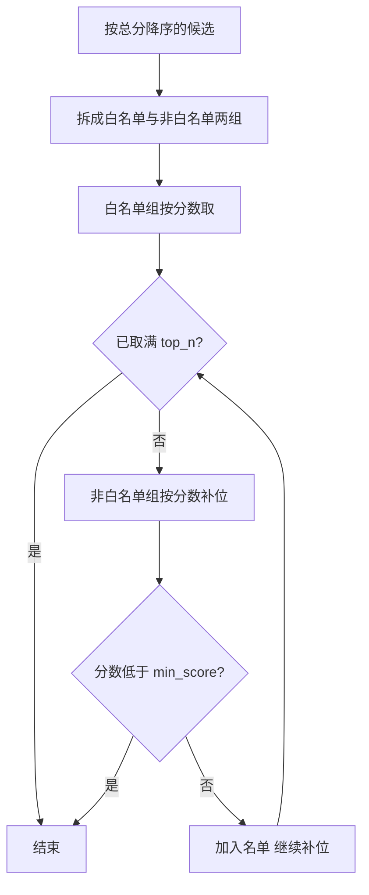

# 候选池到抓取名单的筛选

搜索适配层把候选池做得很大（博查固定 60 条），抓取层却只愿意付 5 条的代价。中间这一步由 `select_top()` 完成，定义在 `backend/scraper/url_prioritizer.py`，流水线在搜索返回后立刻调用它（`backend/pipeline/pipeline.py`）。所有判据都是零模型依赖的启发式，不需要额外调用任何 API，因此可以在每次搜索里都跑一遍。

这里的主题是「怎么挑」；来源侧的协议适配与熔断回退在 25-搜索聚合/01-多引擎适配 里已经写过，两篇的分工是：01 决定候选从哪里来，这里决定哪些候选进入抓取名单。

## 1. 筛选发生在搜索之后的第一步

`select_top()` 的调用点在领域锚定之后、抓取之前（`backend/pipeline/pipeline.py`）。它接收三个参数：候选列表、查询词与两个可调阈值——`top_n` 默认取 `DOMAIN_QUALITY_TOP_URLS`（`backend/config.py`，值为 5），`min_score` 默认 0.15（`backend/scraper/url_prioritizer.py`）。

```python
# backend/scraper/url_prioritizer.py（节选）
def select_top(
    results: List[SearchResult],
    query: str = "",
    top_n: int = DOMAIN_QUALITY_TOP_URLS,
    min_score: float = 0.15,
) -> List[SearchResult]:
    dqc = get_domain_quality()
    excluded = 0
    dup_skipped = 0
    blocked = 0
    scored = []
    seen_paths: set[str] = set()
```

默认参数在函数定义时求值，因此 `top_n` 始终跟着配置里的 `DOMAIN_QUALITY_TOP_URLS` 走；三个计数器分别记录被结构排除、被路径去重、被黑名单拦下的条数。



函数的三个阶段在日志里各有痕迹：减法阶段输出排除与去重计数（`backend/scraper/url_prioritizer.py`），相关性门槛输出丢弃条数（`backend/scraper/url_prioritizer.py`），取选阶段逐条打印评分明细（`backend/scraper/url_prioritizer.py`）。

## 2. 结构硬排除先砍掉没有正文价值的 URL

第一道过滤是 URL 结构匹配，命中即丢弃。模式清单是一组正则片段，按用途分成六组：

```python
# backend/scraper/url_prioritizer.py（节选）
_EXCLUDE_PATH_PATTERNS = [
    # 个人主页 / 用户页
    r'/user/', r'/users/', r'/profile/', r'/people/', r'/member/', r'/author/',
    # 电商商品页
    r'/product/', r'/itemvideo/', r'/goods/', r'/sku/', r'/shop/',
    # 电商子域（product.dangdang.com / item.jd.com / detail.tmall.com 等）
    r'//product\.', r'//item\.jd\.com/', r'//detail\.tmall\.com/',
    # GitHub 非内容页（PR/Issue 讨论、文件 diff）
    r'/pull/', r'/issues/', r'/commit/',
    ...
]
```

匹配方式是 `re.search(pattern, url, re.IGNORECASE)`：只要片段出现在 URL 的任意位置就算命中，子域规则因此写成 `//item.jd.com/` 这种带双斜杠的形式。

| 组别 | 典型模式 | 排除理由 |
| --- | --- | --- |
| 个人主页 | `/user/`、`/profile/`、`/people/` | 无正文，只有文章列表 |
| 电商商品页 | `/product/`、`/goods/`、`/sku/` | 参数与营销文案 |
| 电商子域 | `//item.jd.com/`、`//detail.tmall.com/` | 同上，按子域匹配 |
| GitHub 非内容页 | `/pull/`、`/issues/`、`/commit/` | 讨论与 diff 不适合做知识卡 |
| 下载与标签聚合 | `/download/`、`/tagalbum/` | 实测在候选池高频出现 |
| 视频页与登录跳转 | `/video/`、`/watch\?`、`/login` | JS 渲染抓不到正文 |

这些页面大多能抓到内容，但内容没有卡片价值，占掉一个抓取配额就是净损失。除硬排除之外还有一组扣分模式 `_LOW_QUALITY_PATH_PATTERNS`（`backend/scraper/url_prioritizer.py`），命中只把结构分压到 0.2，不直接出局。

## 3. 按路径去重与静态黑名单

去重键是 `urlparse(url).path`，剥离查询串（`backend/scraper/url_prioritizer.py`）。这样 `?locationNum=11` 与 `?locationNum=10` 被认作同一页面，避免同一篇文章因为分页参数重复抓取。注释记录了动机：候选池放大到 60 条之后，这类重复显著增多。紧接着是黑名单剔除，判据是 `dqc.is_network_blocked(domain)`（`backend/scraper/url_prioritizer.py`）。

这个函数同时匹配精确域名与子域后缀，实现见 `backend/scraper/domain_quality.py`。域名分 `d_s` 也在这里取到（`backend/scraper/url_prioritizer.py`），黑名单域的分会是 0.0（`backend/scraper/domain_quality.py`），即使不剔除也进不了最终名单。

## 4. 五路信号与加权

打分只有一行（`backend/scraper/url_prioritizer.py`）：

```python
total = d_s * 0.30 + u_s * 0.10 + t_s * 0.10 + s_s * 0.30 + site_s * 0.20
```

五路信号的取值范围与含义：

| 信号 | 来源函数 | 取值范围 | 权重 |
| --- | --- | --- | --- |
| 域名质量 `d_s` | `dqc.score()` | 0.0 至 1.0 | 0.30 |
| URL 结构 `u_s` | `_url_structure_score()` | 0.2 或 1.0 | 0.10 |
| 标题 `t_s` | `_title_score()` | 0.1 至 1.0 | 0.10 |
| 相关性 `s_s` | `_snippet_relevance()` | 0.0 至 1.0 | 0.30 |
| 白名单 `site_s` | `_site_quality()` | 0.5 或 1.0 | 0.20 |

三路辅助信号各自有明确判据：结构分命中低质路径模式给 0.2（`backend/scraper/url_prioritizer.py`）；标题分的判据是一串从上到下的 return：

```python
# backend/scraper/url_prioritizer.py（节选）
def _title_score(title: str) -> float:
    if not title or not title.strip():
        return 0.3
    t = title.strip()
    for kw in _LOW_QUALITY_TITLE_KEYWORDS:
        if kw.lower() in t.lower():
            return 0.1
    if re.match(r'^[A-Z\s]{10,}$', t):
        return 0.2
    if len(t) <= 5:
        return 0.4
    return 1.0
```

分支顺序即优先级：先排空标题与低质关键词，再看全大写长标题（多半是站点名），最后处理过短标题；都不命中才给满分 1.0。相关性分的来源函数 `_snippet_relevance()` 见本节末尾。

域名分与相关性分合计占 0.60 权重，说明排序主要由「这个站靠不靠得住」和「摘要里有没有搜索词」决定。白名单信号只值 0.20（取值 0.5 与 1.0 之间差 0.1），单靠它压不住高域名分的低质站，所以后面还需要一道分层取选。

## 5. 相关性门槛把同名异义挡在评选之外

当 `query` 非空时，摘要与查询词零重叠的候选不参与排序（`backend/scraper/url_prioritizer.py`）。判定用的是 `s_s > 0.0`，也就是至少命中一个查询词。门槛只在存在相关候选时生效，全部候选都零重叠时放宽，保证不空手而归（`backend/scraper/url_prioritizer.py`）。

```python
# backend/scraper/url_prioritizer.py（节选）
# 相关性门槛：摘要与查询的 n-gram 词面重合率低于 1/3 的候选不参与评选。
_MIN_RELEVANCE = 1.0 / 3.0
...
if query:
    total_candidates = len(scored)
    relevant = [x for x in scored if x[6] >= _MIN_RELEVANCE]
    if relevant:                      # 全部低于门槛时放宽，不空手而归
        dropped = total_candidates - len(relevant)
        scored = relevant
```

注意这里的门槛比上文描述的「零重叠」更严：当前源码要求重合率至少 1/3，而重合率由 `_snippet_relevance()` 用 1–2 字 n-gram 切分中文后统计，避免把整条中文查询当成一个词来比对。

注释给出了这条规则的实证来源：多义词的搜索结果里，摘要不含搜索词的页面多是同名异概念，白名单硬优先会让它们照样入选。门槛挡的是这类错配，而不是低质站——低质站的问题由域名分与黑名单处理。

## 6. 白名单分层取选

排序之后选出名单的方式是分两层（`backend/scraper/url_prioritizer.py`）：



白名单组低于 `min_score` 的条目直接跳过（`backend/scraper/url_prioritizer.py`），非白名单组一旦遇到低于阈值的条就停止补位（`backend/scraper/url_prioritizer.py`）——因为列表已按分数降序，后面的只会更低。两组都受 `top_n` 上限约束，最终返回的条数不会超过 5。

```python
# backend/scraper/url_prioritizer.py（节选）
whitelisted = [x for x in scored if x[2]]     # x[2] 存的是「是否白名单」
others = [x for x in scored if not x[2]]
selected = []
for item in whitelisted:
    if item[1] < min_score:               # 白名单：跳过低分条继续找
        continue
    selected.append(item)
    if len(selected) >= top_n:
        break
for item in others:
    if len(selected) >= top_n:
        break
    if item[1] < min_score:               # 非白名单：遇到低分条即停止
        break
    selected.append(item)
```

每个候选被打包成一个元组，`item[1]` 是总分、`item[2]` 是白名单标记；两组循环的终止条件写法不同，正是「跳过」与「停止」两种语义的差别。

## 7. 评分明细日志的读法

取选阶段会为每条入选链接打印一行明细（`backend/scraper/url_prioritizer.py`）：

```text
1. https://example.com/a  score=0.742 [白名单] (d=1.00 site=1.0 title=1.00 snippet=0.50 struct=1.00)
```

排查低质 URL 入选时按这个顺序看：先看 `site` 是否为 1.0（白名单是否误入），再看 `snippet` 是否接近 0（相关性门槛有没有生效），最后看 `d`（域名质量分是否来自自动拉黑前的历史数据）。减法阶段的汇总日志（`backend/scraper/url_prioritizer.py`）能回答「多少条被结构排除、多少条被去重、多少条被黑名单拦下」，这四项计数与候选总数对不上时，问题通常出在候选池本身。

## 8. 易错点

- 把 `min_score` 当成硬门槛。白名单组是「跳过低分条」，非白名单组是「遇到低分条即停止」，两者语义不同。
- 以为相关性门槛总会生效。全部候选都零重叠时它被放宽，这时返回的仍是白名单优先的结果。
- 用 `max_results` 控制抓取条数。抓取名单长度由 `top_n` 决定，而 `top_n` 读的是 `DOMAIN_QUALITY_TOP_URLS`。
- 忘记 path 去重会剥离查询串。带不同查询参数的同一页面只保留第一条。
- 在 `select_top()` 里期望得到黑名单域的分数。黑名单域的域名分是 0.0，且在打分前就被剔除。

## 小结

核心概念：

| 概念 | 内容 |
| --- | --- |
| 三段式筛选 | 减法（排除、去重、拉黑）、打分、白名单分层取选 |
| 五路信号 | 域名质量 0.30、相关性 0.30、白名单 0.20、结构 0.10、标题 0.10 |
| 相关性门槛 | 摘要与查询词零重叠的候选不参与排序，全零时放宽 |
| 分层取选 | 白名单先取满 `top_n`，非白名单按分数补位 |
| `top_n` 来源 | `DOMAIN_QUALITY_TOP_URLS`，默认 5 |
| 可核对性 | 减法计数、门槛丢弃数、逐条评分明细三处日志 |

设计权衡：

| 决策 | 选择 | 收益 | 代价 |
| --- | --- | --- | --- |
| 评分方式 | 纯启发式加权 | 零模型成本，可解释 | 权重需要按实证调整 |
| 高质站优先 | 分层取选 | 白名单不会被高域名分的低质站挤掉 | 非白名单只能补位 |
| 相关性门槛 | 全零时放宽 | 不空手而归 | 多义词场景仍可能选错 |
| 路径去重 | 剥离查询串 | 省抓取配额 | 少数按参数区分的页面被合并 |

## 练习

### 基础题

1. `d_s=0.5`、`u_s=1.0`、`t_s=1.0`、`s_s=0.5`、`site_s=0.5` 时总分是多少？
2. 一个候选同时命中 `/product/` 与 `/page/` 两个模式，它会出局还是只被扣分？说明依据。
3. `query` 为空时 `select_top()` 的行为与传查询词时差在哪一步？

### 挑战题

4. 当前白名单信号的权重是 0.20。设计一组实验，判断把它提高到 0.30 是否会让低质站入选率下降，并写出需要记录的指标。
5. `snippet` 相关性只做词面重叠，同义词与英文缩写都算零重叠。给出一个不引入模型的改进方案，并说明它对相关性门槛的影响。

### 本页引用的路径

| 路径 | 作用 |
| --- | --- |
| `backend/scraper/url_prioritizer.py` | `select_top` 与五路信号实现 |
| `backend/scraper/domain_quality.py` | 域名质量分与黑名单判据 |
| `backend/pipeline/pipeline.py` | `select_top` 的调用点 |
| `backend/config.py` | `DOMAIN_QUALITY_TOP_URLS` 等阈值 |
