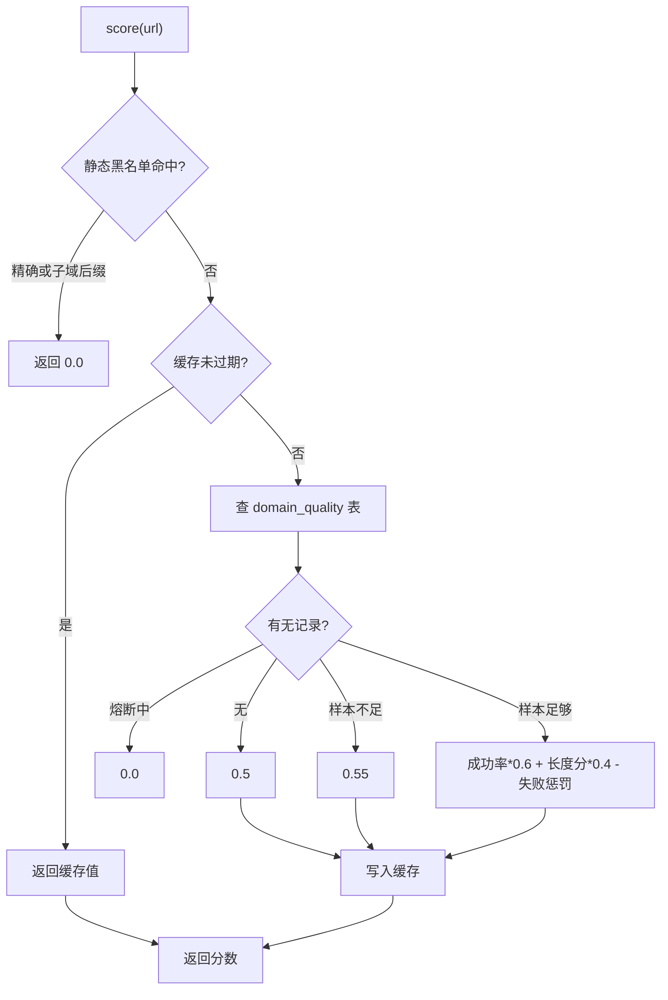
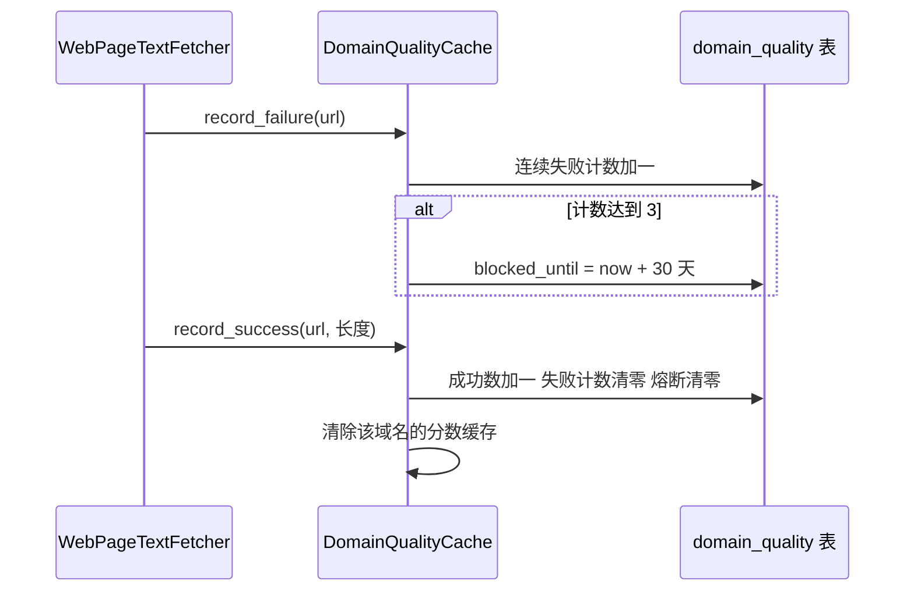

# 域名质量分与自动拉黑

前一篇的排序依赖一个叫 `d_s` 的输入，它来自 `backend/scraper/domain_quality.py` 的单例缓存 `DomainQualityCache`。这个模块记录每一次抓取的成功与失败，算出每个域名的质量分，并在连续失败达到阈值时把域名拉黑一段时间。

它同时维护一张静态低质域表，因为有些站点从不「失败」——请求成功、返回 200，但正文只有几百字节的导航与广告。质量分在两条路径上被消费：`select_top()` 用它排序（`backend/scraper/url_prioritizer.py`），博查客户端用自动拉黑列表拼 `exclude` 参数（`backend/search/bocha.py`）。两条路径读的是同一份状态，因此一次抓取失败会同时影响排序与下一轮搜索的候选池。

## 1. 域名分的输入与公式

`score()`（`backend/scraper/domain_quality.py`）先做静态黑名单检查：精确命中或子域后缀命中直接返回 0.0（`backend/scraper/domain_quality.py`）。

随后查内存缓存，命中且未过期就返回缓存值（`backend/scraper/domain_quality.py`），缓存有效期 `_cache_ttl` 是 5 秒（`backend/scraper/domain_quality.py`）。没有缓存时查数据库，按四种情况给出分数：

```python
# backend/scraper/domain_quality.py（节选）
# 静态黑名单：精确 + 子域后缀匹配（doc.wendoc.com 命中 wendoc.com）
if domain in self._network_blocked or any(
    domain.endswith("." + d) for d in self._network_blocked
):
    return 0.0
...
row = db.execute("SELECT * FROM domain_quality WHERE domain = ?", (domain,)).fetchone()

if row is None:
    s = 0.5
elif row["blocked_until"] > now:
    s = 0.0
elif row["fetch_count"] < DOMAIN_QUALITY_MIN_SAMPLES:
    s = 0.55
else:
    ...          # 有足够样本，走下方公式
```

`any(domain.endswith("." + d) for d in ...)` 是一个生成器表达式：只要静态表里任一条目能让域名以「.条目」结尾，就判为命中，因此 `max.book118.com` 会被 `book118.com` 拦住。

| 情况 | 判据 | 分数 |
| --- | --- | --- |
| 无记录 | 查询结果为空 | 0.5 |
| 熔断中 | `blocked_until` 大于当前时间 | 0.0 |
| 样本不足 | `fetch_count` 小于 `DOMAIN_QUALITY_MIN_SAMPLES`（3） | 0.55 |
| 有足够样本 | 其余情况 | 见下方公式 |

有足够样本时的公式（`backend/scraper/domain_quality.py`）：

```python
total = max(row["fetch_count"], 1)
success_rate = row["success_count"] / total
avg_len = row["total_content_len"] / max(row["success_count"], 1)
content_score = min(avg_len / 500, 1.0)
fail_penalty = min(row["consecutive_fails"] * 0.15, 0.5)
s = max(success_rate * 0.6 + content_score * 0.4 - fail_penalty, 0.0)
```

成功率占 0.6，正文长度占 0.4，平均正文长度按 500 字符封顶；连续失败每次扣 0.15，最多扣 0.5。样本不足时给 0.55，比无记录的 0.5 略高，含义是「还没验证过，但愿意先试一次」。

## 2. 静态低质域与子域后缀匹配

静态表 `_LOW_QUALITY_DOMAINS`（`backend/scraper/domain_quality.py`）收录的是「抓取成功但内容无价值」或高频失败的站点，注释写明它们与自动拉黑互补：这些域从不失败，失败计数机制对它们是盲区。

表内容按注释给出的理由逐条标注，例如付费文档预览站、文档分享站、专利采集站。匹配方式在 `is_network_blocked()`（`backend/scraper/domain_quality.py`）与 `score()` 中一致：精确相等或子域后缀。

注释记录了一次历史问题——早期只做精确匹配，导致 `max.book118.com`、`doc.wendoc.com` 这类子域从未被拦住，数据库里有 35 次抓取记录作为佐证。



## 3. 成功与失败如何改写分数

`record_success()`（`backend/scraper/domain_quality.py`）把 `fetch_count` 与 `success_count` 各加一，正文长度累加，把 `consecutive_fails` 与 `blocked_until` 清零，最后清掉该域名的缓存条目（`backend/scraper/domain_quality.py`）。

```python
# backend/scraper/domain_quality.py（节选，SQL 已简化）
INSERT INTO domain_quality (domain, fetch_count, success_count, ...)
VALUES (?, 1, 1, 0, ?, 0, 0, ?, ?, ?)
ON CONFLICT(domain) DO UPDATE SET
    fetch_count = fetch_count + 1,
    success_count = success_count + 1,
    total_content_len = total_content_len + ?,
    consecutive_fails = 0,          # 成功即清零连续失败
    blocked_until = 0               # 成功即解除熔断
...
with self._lock:
    self._cache.pop(domain, None)   # 主动清掉分数缓存
```

`ON CONFLICT(domain) DO UPDATE` 是 SQLite 的 upsert 写法：没有这行记录就插入，已有就按 `SET` 更新，一次语句同时覆盖「首次」与「再次」。

如果这个域名此前处于熔断状态，日志里会多一条解封记录（`backend/scraper/domain_quality.py`）——一次成功抓取就能解除熔断，这比等满 30 天更符合实际。

`record_failure()`（`backend/scraper/domain_quality.py`）的核心是连续失败计数（`backend/scraper/domain_quality.py`）：读取旧计数加一，达到阈值 `DOMAIN_QUALITY_CONSECUTIVE_FAIL_LIMIT`（3 次，`backend/config.py`）时写入 `blocked_until = now + DOMAIN_QUALITY_BLOCKED_SECONDS`（30 天，`backend/config.py`）。未达阈值时只记录失败，不写熔断时间。

```python
# backend/scraper/domain_quality.py（节选）
row = db.execute("SELECT consecutive_fails, blocked_until FROM domain_quality WHERE domain = ?", (domain,)).fetchone()
old_consecutive = row["consecutive_fails"] if row else 0
new_consecutive = old_consecutive + 1
will_block = new_consecutive >= DOMAIN_QUALITY_CONSECUTIVE_FAIL_LIMIT
blocked = now + DOMAIN_QUALITY_BLOCKED_SECONDS if will_block else 0
# ... 写回数据库：fetch_count / fail_count 各加一，consecutive_fails 与 blocked_until 更新为新值
with self._lock:
    self._cache.pop(domain, None)
```

白名单域名在函数开头就分流到另一条写入路径：只累加 `fetch_count`/`fail_count` 供统计，`consecutive_fails` 不动，因此永远不会被自动拉黑。

## 4. 白名单豁免与启动解封

白名单 `_HIGH_QUALITY_DOMAINS`（`backend/scraper/domain_quality.py`）是静态表之外的一份名单，涵盖技术社区与部分人文条目站点，匹配方式同样支持子域后缀（`backend/scraper/domain_quality.py`）。

它的作用有两处：`_site_quality()` 用它给出 0.5 与 1.0 的白名单信号（`backend/scraper/url_prioritizer.py`），单例初始化时用它做一次解封。

`_unblock_whitelisted()`（`backend/scraper/domain_quality.py`）在首次获取单例时执行一次，把处于熔断状态的白名单域名清出熔断。注释解释了这条补丁的必要性：白名单豁免是后加的，之前 `blog.csdn.net` 与 `zhuanlan.zhihu.com` 这类子域已被拉黑 30 天；熔断期间不被抓取，就永远收不到成功记录来自动解封，形成死锁。

```python
# backend/scraper/domain_quality.py（节选）
def _unblock_whitelisted(self) -> None:
    db = DatabaseManager()
    rows = db.execute(
        "SELECT domain FROM domain_quality WHERE blocked_until > ?",
        (time.time(),),
    ).fetchall()
    fixed = [r["domain"] for r in rows if self._is_whitelisted(r["domain"])]
    for domain in fixed:
        db.execute(
            "UPDATE domain_quality SET blocked_until = 0, consecutive_fails = 0 WHERE domain = ?",
            (domain,),
        )
```

它只查「当前仍在熔断」的记录，再筛出白名单域名逐条清零，因此重复执行结果相同（幂等）；`_is_whitelisted()` 用的也是精确加子域后缀匹配，所以 `blog.csdn.net` 能命中 `csdn.net`。

## 5. exclude 配额的分配顺序

博查的 `exclude` 参数最多接受 100 个域名（`backend/scraper/domain_quality.py`）。`list_blocked()`（`backend/scraper/domain_quality.py`）负责把当前应排除的域名凑成这个列表，顺序是静态低质域在前、自动拉黑按封禁时间倒序补位（`backend/scraper/domain_quality.py`）。

```python
# backend/scraper/domain_quality.py（节选）
def list_blocked(self, limit: int = 100) -> list[str]:
    rows = db.execute(
        "SELECT domain FROM domain_quality WHERE blocked_until > ? "
        "ORDER BY blocked_until DESC LIMIT ?",
        (time.time(), limit),
    ).fetchall()
    blocked = [r["domain"] for r in rows]
    # 静态低质域优先（它们才是主要浪费源），自动拉黑补位
    static = [d for d in self._network_blocked if d not in blocked]
    return (static + blocked)[:limit]
```

`?` 是 SQLite 的参数占位符，值通过第二个参数单独传入，既不拼字符串也不担心引号转义。最后一行先拼「静态域 + 自动拉黑」再截断到 `limit`，所以静态域一定排在配额里。

理由是静态表里的站点才是主要浪费源，配额有限时优先保证它们被排除。调用方每 60 秒刷新一次这份列表（`backend/search/bocha.py`），因此新增的自动拉黑域名最多延迟一分钟进入下一次搜索的排除参数。

## 6. 单例与缓存

`get_domain_quality()`（`backend/scraper/domain_quality.py`）用双检锁维护进程内单例，首次创建时执行白名单解封。5 秒的分数缓存只覆盖 `score()`，不覆盖数据库写入；写入路径会主动清缓存（`backend/scraper/domain_quality.py`），所以抓取结束后立刻读到的分数是新值。



## 7. 易错点

- 认为样本不足与无记录同分。前者 0.55，后者 0.5。
- 以为熔断必须等满 30 天。一次成功抓取就会清零 `blocked_until`。
- 忘记静态黑名单做子域后缀匹配。只按精确域名理解会漏掉子域。
- 以为 `list_blocked()` 返回全部拉黑域名。它按 100 个上限截断，且静态域优先。
- 在 `score()` 之外的地方自行判断黑名单。判据只有 `is_network_blocked()` 一处，重复实现会与子域规则漂移。

## 小结

核心概念：

| 概念 | 内容 |
| --- | --- |
| 域名分公式 | 成功率 0.6 + 正文长度分 0.4 − 连续失败惩罚 |
| 四种取值 | 无记录 0.5、熔断 0.0、样本不足 0.55、样本足够走公式 |
| 静态低质表 | 抓取成功但无价值或高频失败的域名，子域后缀匹配 |
| 自动拉黑 | 连续失败 3 次写 30 天熔断 |
| 白名单豁免 | 初始化时解封误熔断的白名单域名 |
| 配额顺序 | 静态域优先，自动拉黑按封禁时间倒序补位，上限 100 |

设计权衡：

| 决策 | 选择 | 收益 | 代价 |
| --- | --- | --- | --- |
| 分数缓存 | 5 秒内存缓存 | 高频排序不重复查库 | 写入后需主动清缓存 |
| 熔断解除 | 成功即清零 | 恢复及时 | 偶发成功会推迟拉黑 |
| 静态表匹配 | 精确加子域后缀 | 覆盖子域浪费源 | 新增站点需要人工维护 |
| 配额分配 | 静态域优先 | 保证主要浪费源被排除 | 新拉黑域名可能排不进去 |

## 练习

### 基础题

1. 某域名 `fetch_count=4`、`success_count=3`、正文总长 900、`consecutive_fails=1`，算出它的分数。
2. 域名被拉黑后，下一次抓取成功会写回什么值？指出对应的代码行。
3. `list_blocked(limit=10)` 时静态低质域与自动拉黑的相对顺序是什么？

### 挑战题

4. 当前公式里正文长度按 500 字符封顶。设计一组数据说明把上限提高到 1500 会改变哪些站点的排序，并指出需要重新观察的指标。
5. 白名单解封只在单例创建时执行一次。若进程长期运行且白名单新增域名，给出一个不重启进程的补救方案。

### 本页引用的路径

| 路径 | 作用 |
| --- | --- |
| `backend/scraper/domain_quality.py` | 分数、静态表、自动拉黑与配额 |
| `backend/scraper/url_prioritizer.py` | 消费域名分与黑名单判据 |
| `backend/search/bocha.py` | 拉黑列表进入 exclude 参数 |
| `backend/config.py` | 阈值与常量定义 |
