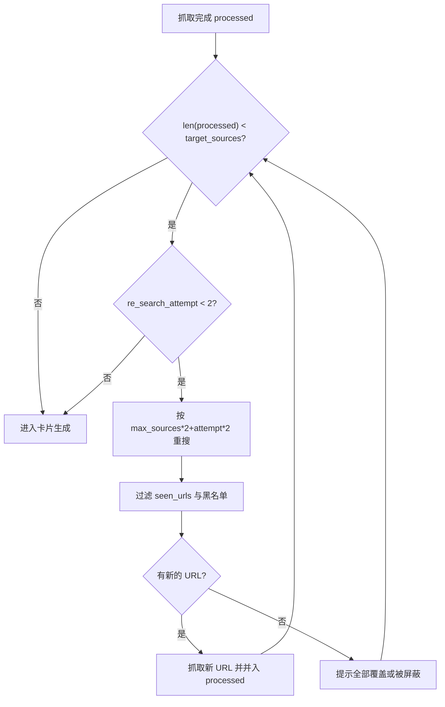
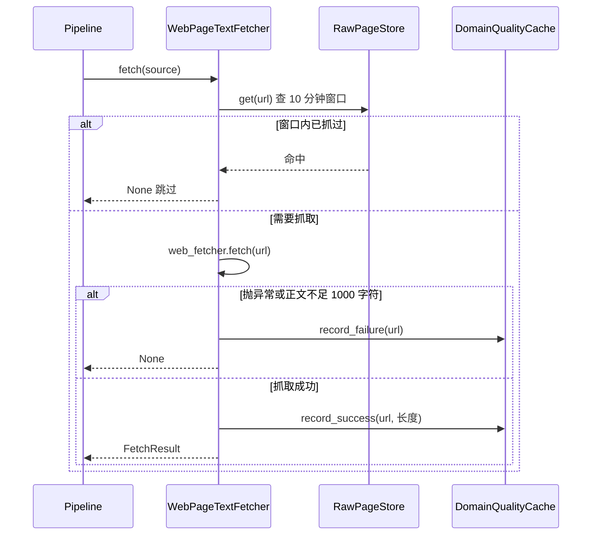

# 重搜阈值与跨尝试去重

搜索返回 5 条候选不等于拿到 5 份正文。抓取会失败、内容可能过短、域名可能在黑名单里，最后进入卡片生成的「有效来源」往往少于预期。`backend/pipeline/pipeline.py` 在抓取之后有一个重搜循环，补足到目标条数为止；与此同时，多层去重保证补进来的链接不会与已经处理过的重复。

去重按数据流顺序分四层：重搜循环内部的 URL 去重、抓取层的短时间窗去重、卡片层的标题与语义查重，以及探索阶段的合并跳过。

## 1. 目标有效来源数是自适应的

重搜的触发条件是 `len(processed) < target_sources`（`backend/pipeline/pipeline.py`）。目标是三个量的最小值（`backend/pipeline/pipeline.py`）：

```python
early_stop = getattr(self.processor, "early_stop", 0) or 3
target_sources = min(early_stop, max(1, len(results) - 1))
```

`early_stop` 取自处理器的同名属性，搜索场景里配置为 2（`backend/pipeline/factory.py`）。`len(results) - 1` 的含义是「允许一个来源失败」：3 条候选要求 2 条有效，5 条要求 4 条，但再与 `early_stop=2` 取最小后实际要求是 2 条。注释记录了旧逻辑的问题——硬编码 3 在只有 3 条候选时零容错，任何网络抖动都会触发重搜。

## 2. 重搜次数与重搜量的公式

重搜最多执行 2 次（`backend/pipeline/pipeline.py`），每次向来源请求的条数随尝试次数增长（`backend/pipeline/pipeline.py`）：

```python
more_results = await self.source.search(query, max_results=max_sources * 2 + re_search_attempt * 2)
```

第一次尝试请求 `2 × max_sources + 2` 条，第二次再加 2 条。注释说明这样写是为了避免固定大数值导致失败后来源滚雪球式增长、把卡片生成的输入撑得过长。

整个重搜循环不长，去重与黑名单过滤就在循环体内：

```python
# backend/pipeline/pipeline.py（节选，日志已省略）
seen_urls = {r.url for r in results}
re_search_attempt = 0
max_re_search = 2
early_stop = getattr(self.processor, "early_stop", 0) or 3
target_sources = min(early_stop, max(1, len(results) - 1))

while len(processed) < target_sources and re_search_attempt < max_re_search:
    re_search_attempt += 1
    more_results = await self.source.search(
        query, max_results=max_sources * 2 + re_search_attempt * 2)
    fresh = [
        r for r in more_results
        if r.url not in seen_urls and not _dq().is_blocked(r.url)
    ]
    seen_urls.update(r.url for r in more_results)
    if fresh:
        processed.extend(await self.processor.process(fresh))
```

`getattr(obj, 名字, 默认值)` 取属性、缺失时回退到默认值，因此处理器没配 `early_stop` 时按 3 算；`seen_urls` 是集合，`in` 判断的代价与集合大小无关。



重搜量与目标条数没有直接关系：目标说的是「还需要几条有效来源」，重搜量说的是「再去问来源要多少条候选」，后者只与 `max_sources` 和尝试次数有关。

## 3. 跨尝试去重与黑名单二次过滤

进入重搜之前先把已处理的 URL 收进集合（`backend/pipeline/pipeline.py`），补进来的候选要同时满足两条：不在 `seen_urls` 里，且未被域名黑名单拦截（`backend/pipeline/pipeline.py`）。

集合在每次重搜后用全部返回结果更新（`backend/pipeline/pipeline.py`），这样同一批结果不会在后续尝试里被重复考虑。黑名单在重搜路径上是第二次过滤：第一次发生在 `select_top()` 内部（`backend/scraper/url_prioritizer.py`），但重搜调用的是来源客户端的 `search()`，没有经过 `select_top()`。两处的判据相同，都是 `is_network_blocked()`。

## 4. 抓取层的 10 分钟窗口

`WebPageTextFetcher.fetch()` 在发起抓取前查一次原始页面存储（`backend/pipeline/defaults.py`）：如果同一 URL 在 600 秒内抓过，直接返回 `None`，日志记一条 `recently fetched`（`backend/pipeline/defaults.py`）。

这个窗口针对的是并发探索分支——多条分支同时展开时很容易搜到同一页面，重复抓取既慢又浪费域名配额。窗口的判据写在代码里而不是配置里，取值是字面量 600。时间戳读自 `fetched_at` 字段，缺失或解析失败时不阻断抓取（`backend/pipeline/defaults.py`）。

## 5. 抓取成功与失败的判定线

抓取抛异常记失败（`backend/pipeline/defaults.py`），正文长度小于 1000 字符同样记失败并返回 `None`（`backend/pipeline/defaults.py`），成功路径才调用 `record_success()`（`backend/pipeline/defaults.py`）。这条长度线解释了为什么「200 响应但只有导航」的站点会被自动拉黑：这类站点的请求是成功的，问题出在内容不足。

```python
# backend/pipeline/defaults.py（节选，日志已省略）
row = self.raw_store.get(source.url)
if row and row.get("fetched_at"):
    ts = datetime.fromisoformat(row["fetched_at"])
    if (datetime.now(timezone.utc) - ts).total_seconds() < 600:
        return None                     # 10 分钟内抓过，跳过
try:
    content = await self.web_fetcher.fetch(source.url)
except Exception as e:
    get_domain_quality().record_failure(source.url)
    return None
if len(content.content) < 1000:         # 正文过短同样算失败
    get_domain_quality().record_failure(source.url)
    return None
get_domain_quality().record_success(source.url, len(content.content))
```

`datetime.fromisoformat()` 把存储里的 ISO 时间戳解析回对象，`timezone.utc` 则保证两边时区一致——存储值缺时区信息时按 UTC 补齐，否则相减会直接抛异常。



## 6. 卡片层的精确与语义去重

保存之前有两道查重。精确匹配按标题查库（`backend/storage/sqlite_card_store.py`），语义查重复用向量检索、阈值更高（`backend/storage/sqlite_card_store.py`），方法是相似度、默认 0.85。

语义查重是向「向量检索」借的一个更严的入口：

```python
# backend/storage/sqlite_card_store.py（节选）
def find_similar(self, embedding: list[float], threshold: float = 0.85, limit: int = 3):
    """语义相似度查重——复用现有 vector_search，阈值更高（去重比搜索严格）。"""
    return self.vector_search(embedding, limit=limit, threshold=threshold)

def vector_search(self, embedding, limit: int = 10, threshold: float = 0.7):
    ...
    rows = self.db.conn.execute(
        "SELECT m.card_id, v.distance "
        "FROM card_vec_map m JOIN cards_vec v ON m.vec_rowid = v.rowid "
        "WHERE v.embedding MATCH ? AND k = ? AND v.distance < ? "
        "ORDER BY v.distance",
        [blob, limit, threshold],
    ).fetchall()
```

`MATCH ... AND k = ?` 是 sqlite-vec 扩展的最近邻查询写法，`v.distance` 是向量距离、越小越像。这里比的是「距离上限」：搜索默认 0.7、查重收紧到 0.85 的说法对应源码里的两个默认值，判断方向都是「小于阈值才算命中」。

探索主题的合并判据走另一套口径：`backend/pipeline/pipeline.py` 取常量 `MERGE_DISTANCE_THRESHOLD`（`backend/pipeline/pipeline.py`，值为 0.40）作为向量检索的阈值（`backend/pipeline/pipeline.py`）。

一个是相似度下限，一个是距离上限，比较时不要混用。持久化阶段跳过多少张由持久化器的 `last_skipped` 决定（`backend/pipeline/pipeline.py`），有跳过时向前端推一条「去重: 跳过 N 张重复卡片」的进度（`backend/pipeline/pipeline.py`）。

## 7. 探索阶段的合并跳过

`try_keyword_merge()`（`backend/pipeline/pipeline.py`）对每个探索主题先做向量检索，命中已有卡片就跳过建卡并累计 `merged_count`（`backend/pipeline/pipeline.py`）；标题完全相同的主题走 `title_skipped` 计数（`backend/pipeline/pipeline.py`）。

```python
# backend/pipeline/pipeline.py（节选）
for topic in topics:
    # 标题预检（第一道闸，先于向量合并）：归一化精确匹配已有卡标题 → 跳过
    if self.card_store and find_card_by_normalized_title(
        self.card_store.list_cards(), topic, exclude_id=source_card_id,
    ):
        title_skipped += 1
        continue
    if await try_keyword_merge(topic):
        merged_count += 1
        continue
    pending_topics.append(topic)
```

`try_keyword_merge()` 内部的判据是「向量距离够近，或标题存在包含关系」，两个条件满足其一就返回 `True`：只看向量距离会把「子概念 vs 上位概念」这类不同主题一并吞掉，只靠词面又会漏掉没有公共子串的变体。

两者汇总成一条进度消息（`backend/pipeline/pipeline.py`）。这一层去重发生在卡片已经存在于知识库之后，目标是防止同一主题在探索中被反复建卡。

## 8. 易错点

- 以为目标来源数固定是 3。它由 `early_stop` 与候选数共同决定，当前实际值是 2。
- 以为重搜也走 `select_top()`。重搜直接调用 `source.search()`，只做 URL 去重与黑名单过滤。
- 忘记重搜量与目标条数无关。前者按 `max_sources` 放大，后者按候选数与 `early_stop` 计算。
- 把正文过短当作成功。小于 1000 字符会记失败，连续三次就进入 30 天熔断。
- 以为 10 分钟窗口是配置项。它是 `defaults.py` 里的字面量 600。

## 小结

核心概念：

| 概念 | 内容 |
| --- | --- |
| 目标来源数 | `min(early_stop, max(1, 候选数 - 1))`，当前为 2 |
| 重搜上限 | 最多 2 次 |
| 重搜量 | `max_sources × 2 + 尝试序号 × 2` |
| 跨尝试去重 | `seen_urls` 集合，重搜后按全部返回结果更新 |
| 抓取窗口 | 同一 URL 600 秒内不重复抓取 |
| 卡片去重 | 标题精确匹配与向量语义查重，阈值 0.85 |

设计权衡：

| 决策 | 选择 | 收益 | 代价 |
| --- | --- | --- | --- |
| 目标条数 | 按候选数自适应 | 小候选池不再频繁重搜 | 实际目标随场景变化 |
| 重搜量 | 随尝试次数小幅放大 | 输入长度可控 | 候选不足时补不满 |
| 短窗去重 | 600 秒内存判据 | 并发分支不重复抓取 | 内容更新快的页面被跳过 |
| 语义查重 | 复用向量检索且阈值更高 | 避免近似主题重复建卡 | 阈值偏高会漏掉真实重复 |

## 练习

### 基础题

1. `max_sources=2` 时，两次重搜各请求多少条候选？
2. 候选数 4、`early_stop=2` 时目标来源数是多少？写出计算过程。
3. 重搜返回的 10 条全部已在 `seen_urls` 中，循环会怎么走？说明依据。

### 挑战题

4. 重搜路径不经过 `select_top()`，补进来的链接只做黑名单过滤。给出一个把排序也应用到重搜结果的方案，并说明对目标条数判定的影响。
5. 10 分钟窗口写死在 `defaults.py`。设计一个把它提为配置项的改造，并说明需要同步修改哪些调用点。

### 本页引用的路径

| 路径 | 作用 |
| --- | --- |
| `backend/pipeline/pipeline.py` | 重搜循环、跨尝试去重与卡片去重统计 |
| `backend/pipeline/defaults.py` | 抓取窗口、长度线与成败记录 |
| `backend/storage/sqlite_card_store.py` | 标题查重与语义查重 |
| `backend/scraper/url_prioritizer.py` | 首次黑名单过滤 |
| `backend/config.py` | `MERGE_DISTANCE_THRESHOLD` 等常量 |
