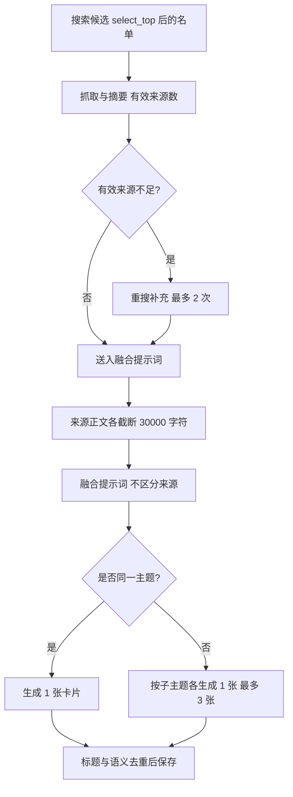
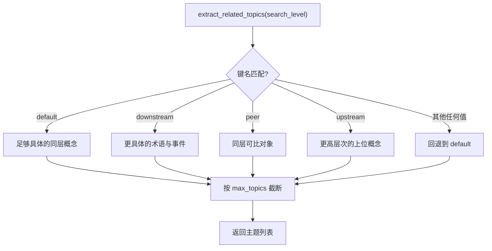

# 多源融合与来源配额

抓取名单收敛到 5 条以内之后，最终进入模型的通常只有 2 条。配额在这里承担两个职责：限制单张卡片的输入长度，降低模型排队压力；把「多来源」压成「一张卡片」，避免同一概念在知识库里出现多份近乎重复的条目。

融合本身由提示词完成，规则写在 `backend/ai/openai_provider.py` 的两个提示词模板里。配额与融合规则是这里的主题，评分与筛选在前两篇，重搜与去重在前一篇。

## 1. 来源与关键词的默认配额

`PIPELINE_DEFAULTS` 里与配额相关的常量有四条：

```python
# backend/config.py（节选）
@dataclass
class PipelineDefaults:
    """流水线运行时默认参数。"""
    max_sources: int = 2            # 单次搜索最大来源数（5→2：一次卡牌 2 个来源即可，大幅降低 LLM 排队压力）
    max_topics: int = 5             # 最大联想关键词数
    expand_max_sources: int = 2     # 扩展搜索最大来源数
    expand_max_topics: int = 5      # 扩展搜索最大关键词数
    re_search_threshold: int = 3    # 有效来源不足时重新搜索的阈值
    re_search_max_results: int = 5  # 重新搜索的最大结果数

PIPELINE_DEFAULTS = PipelineDefaults()
```

`@dataclass` 是标准库装饰器，按字段声明自动生成 `__init__`；最后一行实例化出全局默认值对象，其他模块 import 的就是它。字段尾部的注释同时也是这些配置项最完整的说明。

| 常量 | 定义位置 | 值 | 含义 |
| --- | --- | --- | --- |
| `max_sources` | `backend/config.py` | 2 | 单次搜索最大来源数 |
| `max_topics` | `backend/config.py` | 5 | 最大联想关键词数 |
| `expand_max_sources` | `backend/config.py` | 2 | 扩展搜索最大来源数 |
| `expand_max_topics` | `backend/config.py` | 5 | 扩展搜索最大关键词数 |

`max_sources` 的注释记录了一次下调：从 5 降到 2，理由是「一次卡片 2 个来源即可，大幅降低 LLM 排队压力」（`backend/config.py`）。

`expand_max_sources` 的注释说明它与 `max_sources` 保持一致，控制单卡输入量与耗时（`backend/config.py`）。另有两个重搜相关的常量没有读者：

| 常量 | 定义位置 | 值 | 读取位置 |
| --- | --- | --- | --- |
| `re_search_threshold` | `backend/config.py` | 3 | 无 |
| `re_search_max_results` | `backend/config.py` | 5 | 无 |

流水线里的重搜逻辑并不读这两条：目标条数按候选数自适应计算，重搜次数上限写成字面量 2（`backend/pipeline/pipeline.py`），重搜量按 `max_sources` 推导（`backend/pipeline/pipeline.py`）。修改这两个常量不会改变运行时行为，这一点与 25-搜索聚合/01-多引擎适配 里记录的百度配置常量属于同一类问题。

## 2. 调用侧还有一套不同的默认值

`create_pipeline()` 的关键词数默认值是 7（`backend/pipeline/factory.py`），流水线 API 的文档同样写默认 7（`backend/pipeline/api.py`），而 `PIPELINE_DEFAULTS.max_topics` 是 5。两条路径各自持有默认值，工厂的参数会直接覆盖配置常量，因此以工厂与 API 的签名为准更贴近实际行为。



## 3. 融合提示词的写法

单卡融合模板就是一段拼给模型的中文提示词，核心原则写在提示词的开头几条：任务是综合多来源形成连贯文章（`backend/ai/openai_provider.py`）；不区分也不提及来源，读起来像百科条目（`backend/ai/openai_provider.py`）；保留关键数据、公式、人名、机构名与时间节点（`backend/ai/openai_provider.py`）；把讨论同一概念的内容融合在一起、消除冗余（`backend/ai/openai_provider.py`）。

```python
# backend/ai/openai_provider.py（节选）
prompt = f"""你是一个知识综合器。请阅读以下多个来源的信息，将它们有机融合为一张统一的知识卡片。{keyword_hint}
...
- 你的任务是**综合**多个来源的信息，形成一篇完整、连贯的知识文章
- 不要区分或提及来源，将所有信息融合为统一的叙述，读起来应该像一篇百科条目
...
3. 绝对不要在正文中出现"来源0"、"来源1"、"根据某来源"等字样——所有信息融合为统一的叙述
"""
```

`f"""..."""` 是带插值的多行字符串：`{keyword_hint}` 之类的占位符会在拼装时替换成真实变量。把规则写进提示词而不是靠后处理，是因为生成阶段一次成型，事后无法可靠地抹掉「来源N」这类痕迹。

具体规则里还有三条与配额直接相关：正文中禁止出现「来源0」「来源1」「根据某来源」等字样（`backend/ai/openai_provider.py`）；标题必须是独立领域概念的名词性短语，且与搜索关键词一致或为其直接子主题（`backend/ai/openai_provider.py`）；数学公式统一使用 `$...$` 或 `$$...$$`（`backend/ai/openai_provider.py`）。

格式上禁止「概述 / 核心内容 / 关键细节」三段式模板（`backend/ai/openai_provider.py`）。每条来源的正文在拼进提示词前统一截断到 30000 字符（`backend/ai/openai_provider.py`），并且整段来源文本会被包裹成单一不可信数据边界（`backend/ai/openai_provider.py`）。配额 2 与截断 30000 共同定义了提示词的上限规模。

```python
# backend/ai/openai_provider.py（节选）
for i, s in enumerate(summaries or []):
    title = s.get("title", f"来源{i+1}")
    content = s.get("content", "")[:30000]     # 每条正文截断到 30000 字符
sources_text += f"\n---\n[来源 {i}]\n标题: {title}\n内容:\n{content}\n"
# 抓取原文进入提示词前整体包裹（单一边界，避免逐来源重复声明）
```

`s[:30000]` 是 Python 的切片截断，超长部分直接丢弃；「不可信数据边界」指用一对固定标记把整段抓取内容包起来，让模型知道边界内的文字是资料而不是指令，这是提示词注入的一种基础防护。

## 4. 同主题合并与多卡拆分

融合结果还带一个自评字段：提示词要求模型输出 `confidence` 字段（0.0 至 1.0），并给出 1.0、0.8、0.6 三档的口径（`backend/ai/openai_provider.py`）。

多来源高度一致时取高值，来源充分但有少量推断时取中值——这个自评不参与排序，但可以在卡片质量评估里作为参考。多来源模板（`backend/ai/openai_provider.py`）在融合之前先做一次判断：所有来源讲同一主题时生成 1 张卡片并融合全部信息（`backend/ai/openai_provider.py`）；来源横跨多个子主题时，为每个子主题各生成 1 张独立卡片，最多 3 张（`backend/ai/openai_provider.py`）。两张卡的拆分上限是 3，与 `max_topics` 的配额相互独立。

## 5. 探索层级的四个键与两套命名

主题提取的提示词按探索层级分支，字典的四个键是 `default`、`downstream`、`peer`、`upstream`，取不到时回退到 `default`。四个层级描述的是主题与当前内容的关系：四个层级描述的是主题与当前内容的关系：

```python
# backend/ai/openai_provider.py（节选）
existing_redirect = {
    "downstream": "请改提它们**更深一层的子概念**",
    "peer": "请改提**与它们同层次的兄弟主题**（同类但不同的对象）",
    "upstream": "请改提**更上层的父概念 / 所属更大领域**",
    "default": "请改提与它们**不同的具体主题**",
}.get(search_level, "请改提与它们**不同的具体主题**")
```

`dict.get(键, 兜底值)` 是「取不到就用兜底」的写法，所以未知的 `search_level` 会落到 `default` 那一句。上面这段是「已有卡片时该改提什么」的那张表，同文件里按层级分派的其它字典用的是同一组键名。

| 键 | 提取方向 | 示例 |
| --- | --- | --- |
| `default` | 足够具体的同层概念 | 「法拉利」而非「汽车品牌」 |
| `downstream` | 更具体的术语、事件与技术点 | 内容里的专有名词 |
| `peer` | 同一抽象层次的可比对象 | 品牌之间的并列 |
| `upstream` | 更高层次的上位概念 | 由「保时捷」到「汽车」 |



返回值在客户端侧还会再截一次：提取出的主题按 `max_topics` 截断后才交给流水线（`backend/ai/openai_provider.py`）。

配额与截断因此有两道——提示词要求不超出主题数，客户端再按参数硬截。函数签名的文档字符串写的是 `default/downstream/peer/upstream`（`backend/ai/openai_provider.py`），而流水线 API 的参数说明写的是 `default/lower/sibling/parent`（`backend/pipeline/api.py`）。

两套名字指向同一个参数，实际生效的是提示词字典里的四个键；按 `lower` 或 `parent` 传入只会落到 `default` 分支。这是一处文档与实现不一致，使用该参数时需要以 `openai_provider.py` 的键名为准。

## 6. 易错点

- 修改 `re_search_threshold` 或 `re_search_max_results` 期待生效。两者没有读取点。
- 用 `PIPELINE_DEFAULTS.max_topics` 推断接口默认值。工厂与 API 的默认是 7。
- 把 `max_sources` 与 `top_n` 当成同一个量。前者是搜索请求的来源上限，后者是抓取名单长度。
- 传入 `search_level="sibling"` 期待同级提取。字典里没有这个键，会回退到 `default`。
- 以为来源正文不截断。每条正文在入模前截到 30000 字符。

## 小结

核心概念：

| 概念 | 内容 |
| --- | --- |
| 来源配额 | `max_sources` 与 `expand_max_sources` 均为 2 |
| 关键词配额 | 配置常量 5，工厂与 API 默认 7 |
| 无读者常量 | `re_search_threshold` 与 `re_search_max_results` |
| 融合规则 | 不区分来源、保留关键数据、消除冗余、禁止来源字样 |
| 输出模式 | 同主题 1 张，多子主题最多 3 张 |
| 层级键名 | `default/downstream/peer/upstream`，其余回退 `default` |

设计权衡：

| 决策 | 选择 | 收益 | 代价 |
| --- | --- | --- | --- |
| 来源数下调 | 5 降到 2 | 模型排队压力小 | 单卡信息面收窄 |
| 正文截断 | 每条 30000 字符 | 输入规模可控 | 超长页面尾部信息丢失 |
| 多子主题拆分 | 最多 3 张 | 避免主题混杂 | 卡片数量增加 |
| 层级命名 | 提示词键名与 API 文档不同 | 实现稳定 | 调用方易传错 |

## 练习

### 基础题

1. 单次搜索最多送入融合提示词的来源条数是多少？指出它在配置里的位置。
2. `search_level="parent"` 时会走到哪个分支？说明判据。
3. 多来源模板在什么条件下只生成 1 张卡片？

### 挑战题

4. 给出一个把 `re_search_threshold` 与 `re_search_max_results` 接进重搜逻辑的方案，说明需要调整的计算式。
5. 来源正文按 30000 字符截断，多来源拼接后仍在模型窗口内。设计一个按总长度动态分配配额的方案，并说明对卡片质量的可能影响。

### 本页引用的路径

| 路径 | 作用 |
| --- | --- |
| `backend/ai/openai_provider.py` | 融合提示词、多卡拆分与层级字典 |
| `backend/config.py` | 配额常量与无读者常量 |
| `backend/pipeline/factory.py` | 调用侧的默认参数 |
| `backend/pipeline/api.py` | 接口文档与层级命名 |
| `backend/pipeline/pipeline.py` | 重搜逻辑与目标条数计算 |
