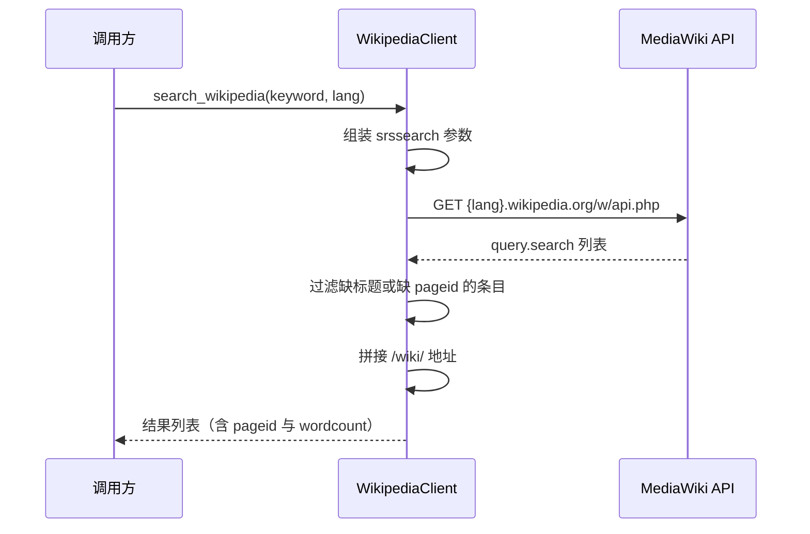
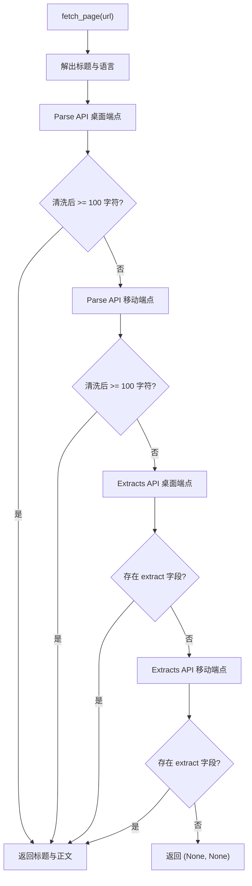

# Wikipedia 专用源的结构与未接入现状

百科站点与通用搜索引擎的差别在于它既是检索入口，也是结构化正文的来源：一次搜索能拿到带 pageid 的条目列表，条目地址可以直接拼出来，正文还能通过官方 API 取到清洗过的纯文本。`backend/scraper/wikipedia_client.py` 实现了这套能力，包括多语言、桌面与移动两套端点、两条正文接口的回退顺序，以及代理支持。

它同时也是一个「写了但没用上」的模块：全仓库检索不到调用点，工厂的三条分支里没有它，`BaseSearchClient` 的抽象也不覆盖它。把它当作一个完整的专用源实现来读，再看它与现有链路的距离。

## 1. 客户端的构造与两套能力

`WikipediaClient`（`backend/scraper/wikipedia_client.py:19`）的构造只接收一个超时参数，默认 5 秒（`backend/scraper/wikipedia_client.py:27`）。它自带一个浏览器风格的 User-Agent（`backend/scraper/wikipedia_client.py:30`），并对外提供三个方法：判断是否维基地址（`backend/scraper/wikipedia_client.py:33`）、关键词搜索（`backend/scraper/wikipedia_client.py:37`）、按 URL 取正文（`backend/scraper/wikipedia_client.py:94`）。

模块注释写明支持 zh 与 en 等多语言，这一点体现在请求参数的 `lang` 上，两套 API 都会用它拼出域名（`backend/scraper/wikipedia_client.py:52`、`:143`）。

## 2. 搜索接口的请求与结果构造

搜索走 MediaWiki 的 query 接口，参数是 `list=search`、`srsearch`、`srlimit` 与 `srprop=size|wordcount`（`backend/scraper/wikipedia_client.py:42`）。

请求头、代理与超时三件套在 `backend/scraper/wikipedia_client.py:53` 一并传入，代理来自 `get_proxy_dict()`。返回码不是 200 时记一条 warning 并返回空列表（`backend/scraper/wikipedia_client.py:61`）。

结果逐条构造：只保留同时有标题与 pageid 的条目（`backend/scraper/wikipedia_client.py:72`），地址按 `https://{lang}.wikipedia.org/wiki/{title}` 拼接并把空格换成下划线（`backend/scraper/wikipedia_client.py:74`），返回字段还带 `wordcount` 与 `size`（`backend/scraper/wikipedia_client.py:79`）。

整个同步过程包在函数内部，异常一律转成空列表（`backend/scraper/wikipedia_client.py:86`）。`srprop` 请求了 `size` 与 `wordcount` 两个字段（`backend/scraper/wikipedia_client.py:48`），结果里也保留了它们（`backend/scraper/wikipedia_client.py:79`），但两者都不参与后续判断——调用方如果要用字数做筛选，需要自己判断阈值。

## 3. 正文的两条获取路径

`fetch_page()`（`backend/scraper/wikipedia_client.py:94`）先从 URL 里解出标题与语言（`backend/scraper/wikipedia_client.py:116`），再按顺序尝试两条接口：

| 顺序 | 接口 | 参数要点 | 结果处理 |
| --- | --- | --- | --- |
| 第一条 | Parse API | `prop=text`、`disabletoc`、`disableeditsection`、`redirects` | BeautifulSoup 去除脚本、样式、表格、图片与脚注后取文本 |
| 第二条 | Extracts API | `prop=extracts`、`exintro=False`、`explaintext=True` | 直接使用 `extract` 字段 |

Parse 路径在取到 HTML 后用 `soup.get_text()` 逐行清理空行（`backend/scraper/wikipedia_client.py:164`），并且只在清洗结果不少于 100 字符时才接受（`backend/scraper/wikipedia_client.py:169`）。

这条长度线让它自动跳到下一条接口，而不会把一段残缺的解析结果当成正文。Extracts 路径跳过 `pageid = "-1` 的缺失条目（`backend/scraper/wikipedia_client.py:203`），有正文就返回。两条接口都各自轮询桌面端点与移动端点：Parse 在 `backend/scraper/wikipedia_client.py:143`，Extracts 在 `backend/scraper/wikipedia_client.py:186`。轮询在单个端点超时或返回异常时继续下一个，因此一次取正文最多发生四次请求。

四个端点按顺序尝试，任何一步拿到合格正文就返回，因此失败路径的代价是四次串行请求加上各自的 5 秒超时。Extracts 接口用 `explaintext=True` 直接取纯文本、用 `exintro=False` 取全文而不是导语（`backend/scraper/wikipedia_client.py:181`），这两项参数是为了让回退结果也能达到卡片生成所需的长度。

## 4. 同步库如何接进异步链路

两个公开方法都是 `async`，内部却用 `requests` 发同步请求，桥接方式是线程池加 `run_in_executor`：搜索在 `backend/scraper/wikipedia_client.py:90`，取正文在 `backend/scraper/wikipedia_client.py:218`。

`asyncio.get_event_loop()` 取当前循环，`ThreadPoolExecutor()` 每次调用新建——也就是说这条实现没有复用线程池，也没有像搜索客户端那样给并发数加信号量。每次调用新建线程池意味着线程创建成本计入延迟；批量搜索时应由调用方在更外层限制并发，模块本身不提供这个闸门。

四个端点的串行尝试加上 5 秒超时，决定了一次取正文的最坏耗时量级。客户端没有缓存层：同一关键词再次搜索会重新请求 API，同一页面再次获取也会重新走一遍端点轮询。需要缓存时应由调用方在这一层之外加，否则批量任务里的重复请求会明显拉长总耗时。两套接口的返回结构并不相同：搜索接口给出条目数组，Parse 接口给出 HTML 字符串，Extracts 接口给出以 pageid 为键的字典。客户端把三种结构统一成两类返回值——搜索返回字典列表，取正文返回标题与正文的二元组。

## 5. 与搜索聚合链路的距离

把它和 `BaseSearchClient` 的子类放在一起看，差距在四处：

| 维度 | 搜索适配层 | `WikipediaClient` |
| --- | --- | --- |
| 基类 | 继承 `BaseSearchClient` | 独立类 |
| 重试 | 基类指数退避 | 无，异常直接返回空 |
| 限流 | 最小请求间隔加锁 | 无 |
| 装配 | 工厂按 provider 分支 | 无分支，全仓库无调用点 |

第三列的四项都可以在一次改造里补齐：把 `search_wikipedia()` 包装成返回 `SearchResult` 的子类，正文获取保留为一条独立的取正文实现。两步分开做的好处是搜索链路先通、正文质量再逐步补齐，因为正文获取的入参是 URL 而不是关键词，它与搜索入口的耦合很浅。

改造顺序上先补基类的限流与重试，再把类注册进工厂的分支，最后才谈正文质量。当前状态是「能力齐备、未接线」，引用它作为来源的结论在本仓库无法成立——本仓库未见该客户端接入搜索聚合或抓取链路。

## 6. 易错点

- 以为它已经被工厂使用。工厂只有 `baidu`、`bocha` 与默认的 Exa 三条分支。
- 期待它像搜索客户端一样重试。异常路径一律返回空列表或 `(None, None)`。
- 忘记 Parse 接口的 100 字符门槛。低于该长度的清洗结果会被丢弃并继续下一条接口。
- 用 `https://zh.wikipedia.org/wiki/标题` 之外的形态直接调用。URL 正则只识别 `/wiki/` 与 `/zh-xx/` 两种路径。
- 忽略它没有并发闸门。批量调用时并发数由调用方自己控制。
- 以为失败日志会出现在 warning 级别。单端点失败只在 debug 记录，warning 留给外层异常与搜索接口错误。
- 把 `wordcount` 当成正文长度。它是服务端统计的条目字数，与清洗后的正文长度不一致。
- 认为 `fetch_page()` 会对标题做规范化。它只做 URL 解码，重定向交给接口的 `redirects` 参数。
- 把移动端点当成备用语言。它只是域名前缀不同，语言仍取自原 URL。
- 以为它会自动区分语言。语言取自 URL 或显式参数，中英条目混用需要调用方分别传入。

## 小结

核心概念：

| 概念 | 内容 |
| --- | --- |
| 两套接口 | 搜索走 query，正文走 Parse 再回退 Extracts |
| 端点轮询 | 桌面端点与 `m` 移动端点各试一次 |
| 100 字符门槛 | Parse 清洗结果过短时继续下一条路径 |
| 异步桥接 | `requests` 加 `ThreadPoolExecutor` 与 `run_in_executor` |
| 多语言 | 由 `lang` 参数拼域名，默认 `zh` |
| 接入现状 | 独立类，全仓库无调用点 |

设计权衡：

| 决策 | 选择 | 收益 | 代价 |
| --- | --- | --- | --- |
| 正文回退顺序 | Parse 优先、Extracts 兜底 | 尽量拿完整正文 | 单次取正文最多四次请求 |
| 清洗方式 | BeautifulSoup 去表格与脚注 | 文本干净 | 表格信息丢失 |
| 异步桥接 | 每次新建线程池 | 隔离清晰 | 无复用与并发上限 |
| 异常处理 | 统一返回空 | 调用方不需要处理异常 | 失败原因只在日志里 |

## 练习

### 基础题

1. 一次 `fetch_page()` 在 Parse 与 Extracts 都失败时最多发出几次 HTTP 请求？写出计数依据。
2. Parse 清洗结果只有 80 字符时会走哪条路径？说明判据所在行。
3. `search_wikipedia()` 返回的每条结果包含哪些字段？它们的来源字段名分别是什么？

### 挑战题

4. 给出把 `WikipediaClient` 接入搜索适配层的改造方案：需要实现哪些方法、如何把 `(title, content)` 映射为统一结果模型。
5. 当前两条接口的轮询是串行的。设计一个带并发与总超时的改造，并说明它如何处理 Parse 成功但正文过短的情形。

### 本页引用的路径

| 路径 | 作用 |
| --- | --- |
| `backend/scraper/wikipedia_client.py` | 搜索、正文获取与回退顺序 |
| `backend/scraper/proxy_config.py` | `get_proxy_dict()` 代理来源 |
| `backend/search/base.py` | 对照用的搜索客户端抽象 |
| `backend/pipeline/factory.py` | 来源装配的三条分支 |
