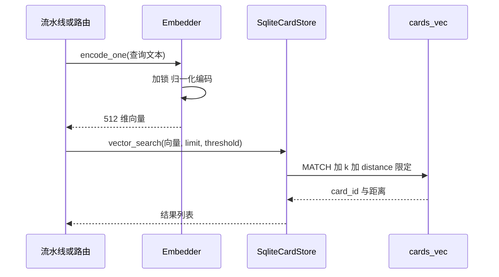
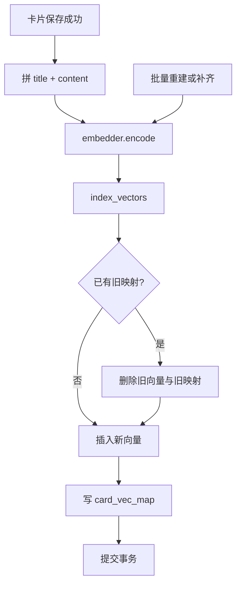

---
title: 本地知识库的语义检索
summary: 本地知识库把卡片向量化后存入 sqlite-vec，检索按距离阈值过滤；嵌入模型用 bge-small-zh-v1.5 的单例封装，编码走线程池，索引在卡片保存与重建时写入，树摘要缓存按会话失效。
tags: [搜索聚合, 向量检索, sqlite-vec, 嵌入模型]
updated: 2026-10-07
--- 缓存的键与失效条件跟着卡片内容走，改动一张卡片只影响它自己那条记录。嵌入模型与索引都跑在本地，没有外部服务依赖，代价是首次建索引需要等待。

# 本地知识库的语义检索

除了外部搜索源，系统还有一个完全本地的数据源：已经保存的卡片。它支撑三类动作——保存新卡片时判断是否与旧卡片语义重复、探索主题时判断是否已被覆盖、以及用户按语义检索已有知识。与外部来源相比，它不需要网络、不受限速影响，但受模型加载与索引完整性约束。

这条链路按「编码 → 索引 → 检索 → 缓存」的顺序走：嵌入模型的封装在 `backend/ai/embedder.py`，索引与检索在 `backend/storage/sqlite_card_store.py`，树摘要缓存在 `backend/agent/tree_cache.py`。本地索引的更新是增量的：新增或修改卡片时只重算受影响的记录，不做全量重建。

## 1. 嵌入模型的位置、维度与归一化

模型目录优先取仓库内的本地路径 `models/bge-small-zh-v1.5`，不存在时才回落到模型名 `BAAI/bge-small-zh-v1.5`（`backend/ai/embedder.py:20`、`:21`）。

编码参数固定为归一化向量与批大小 32（`backend/ai/embedder.py:65`），归一化让检索里的距离与余弦相似度等价，阈值口径因此可以统一写成「距离小于某个值」。批大小固定意味着超长文本不会被自动切分：调用方需要先自行分段再传入，模型自身输入长度上限之外的部分会被截断。

模块注释给出成本量级：首次加载约 500 毫秒，之后约 10 毫秒一条（`backend/ai/embedder.py:5`）。模型输出 512 维向量，表结构与维度由部署时的 sqlite-vec 初始化决定，仓库内的模型目录 `models/bge-small-zh-v1.5` 与线上使用的版本需要保持一致，换模型等于换维度，旧向量必须全量重建。

## 2. 单例与两把锁

`Embedder.get()`（`backend/ai/embedder.py:42`）返回进程内单例。模型加载与推理共用同一把线程锁 `_model_lock`（`backend/ai/embedder.py:25`），加载函数里做了双重检查（`backend/ai/embedder.py:53`）。

注释解释了这把锁的两个理由：多个线程并发首次加载会各载一遍模型，浪费内存并可能触发 transformers 的 meta tensor 错误；编码与推理并发调用同一模型实例会因 torch 内部线程池竞争偶发死锁。也就是说这里牺牲了部分并行度换取稳定性：同一进程内任何时刻只有一个线程在做模型推理。

## 3. 事件循环与线程池两条编码路径

`encode()`（`backend/ai/embedder.py:72`）把阻塞编码交给 `loop.run_in_executor()`，调用方拿到的是 `await` 的结果，耗时与每条平均耗时都写进日志（`backend/ai/embedder.py:80`）。`encode_one()`（`backend/ai/embedder.py:83`）是单条包装。

`encode_sync()`（`backend/ai/embedder.py:87`）供线程池直接调用，注释说明它的存在是为了避免 `asyncio.run()` 与 PyTorch 在非主线程清理线程池时卡死；推荐用法是 `ThreadPoolExecutor(max_workers=1)` 加 `future.result(timeout=30)`（`backend/ai/embedder.py:96`）。

同一条建议在 `backend/pipeline/api.py:67` 与 `backend/utils/async_bridge.py:33` 的注释里重复出现，属于项目内的统一约定。

## 4. 索引结构与检索语句

向量存在 sqlite-vec 虚拟表 `cards_vec` 里，卡片与向量的对应关系另存 `card_vec_map`。写入前先查旧映射，存在则删掉旧向量与旧映射再插入（`backend/storage/sqlite_card_store.py:417`），保证同一卡片只有一个向量。

整段写入在 `_vec_lock` 下完成并提交（`backend/storage/sqlite_card_store.py:433`）。检索语句用 `MATCH ? AND k = ? AND v.distance < ?` 三段限定（`backend/storage/sqlite_card_store.py:446`），参数依次是查询向量、条数上限与距离阈值，结果按距离升序（`backend/storage/sqlite_card_store.py:447`）。

表不存在时 `_vec_ready()` 返回假，检索直接返回空列表（`backend/storage/sqlite_card_store.py:437`）；执行异常同样吞掉并返回空列表（`backend/storage/sqlite_card_store.py:450`）。

## 5. 同一套距离在三种用途上的不同阈值

| 用途 | 方法 | 默认阈值 | 语义 |
| --- | --- | --- | --- |
| 语义检索 | `vector_search()` | 0.7 | 距离上限，越大越宽松 |
| 保存前查重 | `find_similar()` | 0.85 | 更严格，避免误判重复 |
| 探索主题合并 | `try_keyword_merge()` | `MERGE_DISTANCE_THRESHOLD`，值为 0.40 | 最严格，只在高度相似时跳过建卡 |

`find_similar()` 的实现是复用 `vector_search()` 并传入更高的阈值（`backend/storage/sqlite_card_store.py:399`），默认 0.85。探索合并用的是 `backend/pipeline/pipeline.py:35` 的常量 0.40，在 `backend/pipeline/pipeline.py:422` 作为阈值传入。三个数字都是距离口径，比较时不要与相似度混用。

## 6. 索引的写入时机

写入点有三处。保存新卡片后立刻编码并索引（`backend/pipeline/pipeline.py:697`、`:700`、`:701`）；批量重建卡片时同样编码入库（`backend/pipeline/pipeline.py:824`、`:828`）；卡片存储自身还有一个补索引入口，读取缺失向量的卡片后编码补齐（`backend/storage/sqlite_card_store.py:111`、`:124`）。

全量重建走 `reindex_all()`（`backend/storage/sqlite_card_store.py:456`），它遍历该会话的全部卡片再调用同一写入函数（`backend/storage/sqlite_card_store.py:474`）。

嵌入器由工厂注入流水线（`backend/pipeline/factory.py:74`），流水线在构造时保存引用（`backend/pipeline/pipeline.py:90`）；没有嵌入器或没有卡片存储时，索引与检索都被跳过（`backend/pipeline/pipeline.py:697`）。

重建入口有两个：会话级 `reindex_all()` 遍历全部卡片（`backend/storage/sqlite_card_store.py:460`），以及读取时发现缺失向量的补齐路径（`backend/storage/sqlite_card_store.py:117`）。两条路径最终都调用同一个 `index_vectors()`，所以新增卡片不需要额外的索引维护代码。

## 7. 树摘要缓存的失效规则

`TreeSummaryCache`（`backend/agent/tree_cache.py:21`）按 `(username, session_id)` 缓存整棵树的可读摘要，键的拼法在 `backend/agent/tree_cache.py:35`。

`get()`（`backend/agent/tree_cache.py:43`）只在未命中时执行 `builder`，命中直接返回字符串。失效由写操作触发（`backend/agent/tree_cache.py:38`）：模块注释列出四个写层工具，搜索、扩展、刷新与建链成功后都会丢弃该会话缓存（`backend/agent/tree_cache.py:7`）。

缓存上限 128 条，超出后按插入序淘汰最旧条目（`backend/agent/tree_cache.py:56`）。缓存的定位是「卡片集合的投影」，只有写操作会改变集合，读轮次可以零数据库查询。这个前提一旦被打破（例如其他进程写入卡片），缓存不会自动失效，需要进程内调用 `clear()` 或 `invalidate()`。

缓存的可见范围是单进程：它不落库，也不跨进程共享。多进程部署时每个进程各有一份，写操作只失效当前进程的条目，其余进程需要等条目被淘汰或重启。

## 8. 易错点

- 把 0.7 与 0.85 当成同一口径。前者用于检索，后者用于查重，方向相同但松紧不同。
- 忽略距离与相似度的方向差异。三个数字都是距离上限，越小越严格。
- 以为索引与卡片写入是同一个事务。索引写在卡片提交之后，中途失败会留下未索引的卡片。
- 在向量表未就绪时期待结果。`_vec_ready()` 为假时检索返回空列表且只记 debug 日志。
- 认为缓存会自动感知外部写入。失效只由进程内写操作触发。
- 忘记索引写入在卡片提交之后。中途失败会留下没有向量的卡片，需要靠补齐路径修复。
- 把 sqlite-vec 表当成普通表。表不存在时检索静默返回空列表，只留下 debug 日志。
- 认为换嵌入模型只改一行配置。维度变化后旧向量全部失效，必须重建索引。
- 把批量重建当成热更新。它在同一把锁下写向量，大库重建期间检索会被阻塞。
- 以为树摘要缓存跨进程共享。它是进程内字典，多 worker 部署时各持一份。

## 小结

核心概念：

| 概念 | 内容 |
| --- | --- |
| 嵌入模型 | 本地 `bge-small-zh-v1.5`，归一化，批大小 32 |
| 编码入口 | `encode()` 走线程池，`encode_sync()` 供线程池直接调用 |
| 索引表 | `cards_vec` 存向量，`card_vec_map` 存映射 |
| 三个阈值 | 检索 0.7、查重 0.85、合并 0.40，均为距离上限 |
| 索引时机 | 保存后、批量重建、缺失补齐 |
| 树摘要缓存 | 按会话缓存，写工具成功后失效，上限 128 条 |

设计权衡：

| 决策 | 选择 | 收益 | 代价 |
| --- | --- | --- | --- |
| 模型锁 | 加载与推理共用一把锁 | 避免加载竞态与推理死锁 | 推理串行化 |
| 编码入口 | 异步与同步两条 | 适配事件循环与线程池两种场景 | 两处都要维护 |
| 检索失败 | 返回空列表 | 调用方不处理异常 | 失败只在日志可见 |
| 缓存失效 | 写操作显式触发 | 读轮次零查询 | 外部写入不被感知 |

## 练习

### 基础题

1. `_MODEL_NAME` 在什么条件下会取本地路径？指出对应代码行。
2. 语义检索默认阈值 0.7、查重默认 0.85，哪一个更容易判定为重复？说明理由。
3. 树摘要缓存达到 128 条后新增一条会发生什么？

### 挑战题

4. 索引写入发生在卡片保存之后。给出一个保证两者一致性的改造方案，并说明对现有保存路径的影响。
5. `vector_search()` 的异常被吞掉并返回空列表。设计一种让上层能区分「没有结果」与「检索失败」的返回约定。

### 本页引用的路径

| 路径 | 作用 |
| --- | --- |
| `backend/ai/embedder.py` | 嵌入模型单例与两条编码路径 |
| `backend/storage/sqlite_card_store.py` | 向量索引、检索与查重 |
| `backend/agent/tree_cache.py` | 树摘要缓存与失效 |
| `backend/pipeline/pipeline.py` | 索引写入点与合并阈值 |
| `backend/pipeline/factory.py` | 嵌入器注入 |
