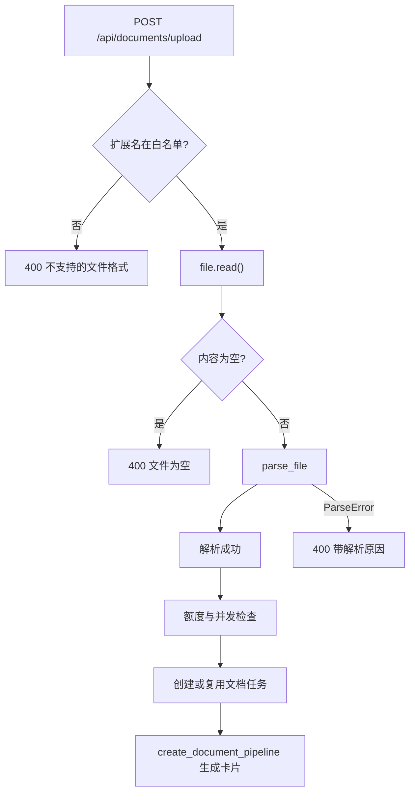
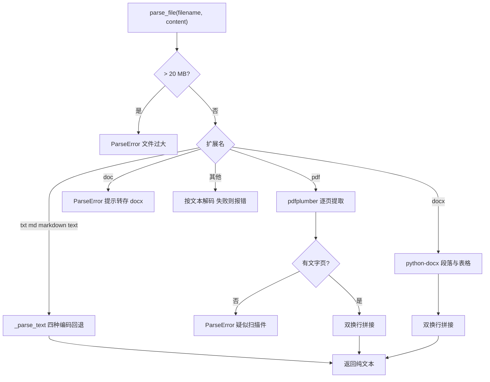

# 文档数据源的上传与切分

用户上传的文件走的是另一条来源通道：没有搜索、没有候选池、没有抓取，文件在请求线程里就被解析成纯文本，随后作为一条「来源」送入固定使用博查的文档流水线。这条通道的边界由三个组件划定——路由做准入与配额，解析器做格式分派，取文本器把解析结果包装成流水线认识的来源对象。三个组件的职责分工很清晰：`backend/routes/documents.py` 不关心文件内容，只判断扩展名、大小、用户额度与任务复用；`backend/documents/parser.py` 不关心调用方，只把字节解析成字符串；`backend/pipeline/defaults.py` 里的取文本器不关心解析过程，只把字符串变成 `FetchResult`。

## 1. 上传接口的准入检查

入口是 `POST /api/documents/upload`（`backend/routes/documents.py:32`），接收文件、会话标识与当前用户。第一道检查是扩展名白名单：只有 `txt`、`md`、`markdown`、`pdf`、`docx` 五种被接受，其余直接返回 400 并说明支持范围（`backend/routes/documents.py:47`）。

第二道是读取与空文件检查，读取失败与空内容都返回 400（`backend/routes/documents.py:57`）。解析异常被单独捕获并转成 400，响应体里带着 `ParseError` 的原始信息（`backend/routes/documents.py:62`），因此「PDF 是扫描件」「文件过大」这类原因会直接回给前端，不需要翻日志。

## 2. 解析器按格式分派

`parse_file()`（`backend/documents/parser.py:27`）的入口先做大小检查：超过 20 MB 直接抛错并给出实际大小（`backend/documents/parser.py:43`）。扩展名从文件名最后一段取出（`backend/documents/parser.py:46`），随后进入分派：

| 扩展名 | 处理函数 | 依赖 |
| --- | --- | --- |
| `txt`、`md`、`markdown`、`text` | `_parse_text()` | 无 |
| `pdf` | `_parse_pdf()` | pdfplumber |
| `docx` | `_parse_docx()` | python-docx |
| `doc` | 直接抛错 | 无 |
| 其他 | 尝试按文本解码 | 无 |

`.doc` 被显式拒绝，错误信息提示用户用 Word 或 WPS 另存为 `.docx`（`backend/documents/parser.py:54`）。未知扩展名走文本解码，解码失败才报「不支持的文件格式」（`backend/documents/parser.py:61`）。

## 3. 文本编码的逐级回退

`_parse_text()`（`backend/documents/parser.py:64`）依次尝试 UTF-8、GBK、GB2312 与 latin-1 四种编码（`backend/documents/parser.py:66`）。latin-1 放在最后，因为它对任意字节序列都能解码，放在前面会让 GBK 文件被解成乱码而不再回退。

四种都失败才抛错并提示确认编码（`backend/documents/parser.py:71`）。这条顺序对中文文档很重要：历史资料常见 GBK 编码，而 latin-1 的容错性意味着它是兜底而不是首选。

## 4. PDF 与 DOCX 的提取差异

`_parse_pdf()`（`backend/documents/parser.py:74`）用 pdfplumber 逐页提取，只保留有内容的页，最后用两个换行拼接（`backend/documents/parser.py:96`）。文件无法打开时抛「PDF 文件损坏或无法读取」（`backend/documents/parser.py:82`）；所有页都没有文字时抛「可能是扫描图片版，不支持 OCR」（`backend/documents/parser.py:94`）。这条分支说明图片型 PDF 在这条链路上没有补救手段。

`_parse_docx()`（`backend/documents/parser.py:99`）先收段落文本，再单独收表格：每行单元格用竖线连接成一行文本（`backend/documents/parser.py:120`）。这个处理让表格内容变成可检索的文本行，代价是丢失了行列结构，后续无法还原表头与数据列的对应关系。

## 5. 解析结果如何变成一条来源

文档流水线用的取文本器是 `DocumentChunkFetcher`（`backend/pipeline/defaults.py:185`）。它的 `fetch()` 只做两件事：正文短于 30 字符时返回 `None`（`backend/pipeline/defaults.py:190`），否则把 `source.snippet` 原样包成 `FetchResult`，地址缺失时用字符串 `"document"` 兜底（`backend/pipeline/defaults.py:194`）。

也就是说解析出来的全文在这里被当作一个来源的摘要字段使用，而不是拆成多个片段。30 字符是这条通道唯一的长度门槛，它挡住空段落，但不做分段。长文档因此以单条来源的形式进入卡片生成，输入长度由模型侧的截断规则控制。

## 6. 文档流水线的装配

`create_document_pipeline()`（`backend/pipeline/factory.py:78`）的来源固定为博查，按回退开关决定是否包一层熔断回退（`backend/pipeline/factory.py:88`），取文本器换成 `DocumentChunkFetcher()`（`backend/pipeline/factory.py:95`），探索深度固定为 1（`backend/pipeline/factory.py:99`）。

这条流水线不接受来源参数：上传的是文件而不是关键词，来源的作用是为文档内容补充关联主题。与网页流水线相比，它少了抓取环节的并发控制与提前终止逻辑：取文本器不访问网络，处理速度取决于解析耗时。

## 7. 任务复用与配额

解析完成后先做额度检查：统计该用户正在运行的任务数，调用 `can_analyze_document()` 判断是否放行（`backend/routes/documents.py:74`），不通过时返回 429 与原因。通过后按文档成本扣费并保存用户数据（`backend/routes/documents.py:78`）。

接着查是否已有同用户、同会话、同文件名的文档任务在运行（`backend/routes/documents.py:81`），命中就直接返回旧任务 ID（`backend/routes/documents.py:87`）。这条复用规则以文件名为键，上传同名但内容不同的文件会命中旧任务，这是使用上需要留意的地方。

## 8. 未接入这条链路的来源

仓库里还有若干专用来源没有接进生产链路。`项目未来/爬虫测试/` 目录下并排放着五组抓取方案，分别是 httpx 加 BeautifulSoup、trafilatura、readability 加 lxml、crawl4ai，以及 trafilatura 与 crawl4ai 的混合方案，另有一份 `benchmark.md` 与实验脚本（`项目未来/爬虫测试/experiment.py:460`）。

同目录还留有一份把 URL 优先级筛选接入抓取层的迁移方案文档（`项目未来/爬虫测试/迁移方案.md:374`），其中记录的做法已经落到生产代码（`backend/pipeline/pipeline.py:597`）。

`项目未来/` 下另有 `llm-wiki-compiler` 与 `swarmvault` 两个目录，本仓库未见它们被后端导入。任务清单里提到的 `free` 引擎在 `backend/search/` 下没有对应实现，本仓库未见该引擎实现。

## 9. 易错点

- 用 `.doc` 上传旧版 Word 文件。接口白名单里没有它，会在解析层被拒绝。
- 期待扫描件被 OCR。PDF 分支在没有文字时直接报错。
- 认为表格结构会被保留。DOCX 的表格被压成竖线连接的行文本。
- 用同名文件覆盖旧内容后立即重新分析。任务复用按文件名匹配，会返回旧任务。
- 把 30 字符门槛当成分段规则。它只过滤空内容，不做切分。

## 小结

核心概念：

| 概念 | 内容 |
| --- | --- |
| 准入白名单 | txt、md、markdown、pdf、docx 五种 |
| 大小上限 | 20 MB，超限直接抛错 |
| 编码回退 | UTF-8 到 GBK 到 GB2312 到 latin-1 |
| PDF 边界 | 无文字页时报错，不支持 OCR |
| 取文本器 | `DocumentChunkFetcher`，30 字符门槛，整体作为一个来源 |
| 任务复用 | 按用户名、会话与文件名匹配运行中的任务 |

设计权衡：

| 决策 | 选择 | 收益 | 代价 |
| --- | --- | --- | --- |
| 解析时机 | 请求内同步解析 | 错误立即回给前端 | 大文件占用请求时间 |
| 编码顺序 | latin-1 兜底放最后 | 中文编码优先正确解码 | 兜底结果可能是乱码 |
| 表格处理 | 压成单行文本 | 内容可检索 | 结构信息丢失 |
| 来源粒度 | 整篇作为一个来源 | 实现简单 | 长文档不分段 |

## 练习

### 基础题

1. 上传一个 25 MB 的 `.md` 文件，会在哪一层被拒绝？说明判据所在文件与行。
2. 一个 GBK 编码的 `.txt` 文件，`_parse_text()` 第几次尝试成功？
3. `DocumentChunkFetcher` 在什么条件下返回 `None`？

### 挑战题

4. 当前整篇文档作为单个来源。设计一个按标题或段落切分成多个来源的方案，并说明对卡片生成的影响。
5. 任务复用只按文件名匹配。给出一个能区分同名不同内容的方案，并说明需要保存哪些额外字段。

### 本页引用的路径

| 路径 | 作用 |
| --- | --- |
| `backend/routes/documents.py` | 上传准入、配额与任务复用 |
| `backend/documents/parser.py` | 格式分派与四种提取路径 |
| `backend/pipeline/defaults.py` | `DocumentChunkFetcher` |
| `backend/pipeline/factory.py` | 文档流水线装配 |
| `项目未来/爬虫测试/` | 五组抓取方案与基准记录 |
| `项目未来/爬虫测试/迁移方案.md` | URL 筛选接入抓取层的方案 |
