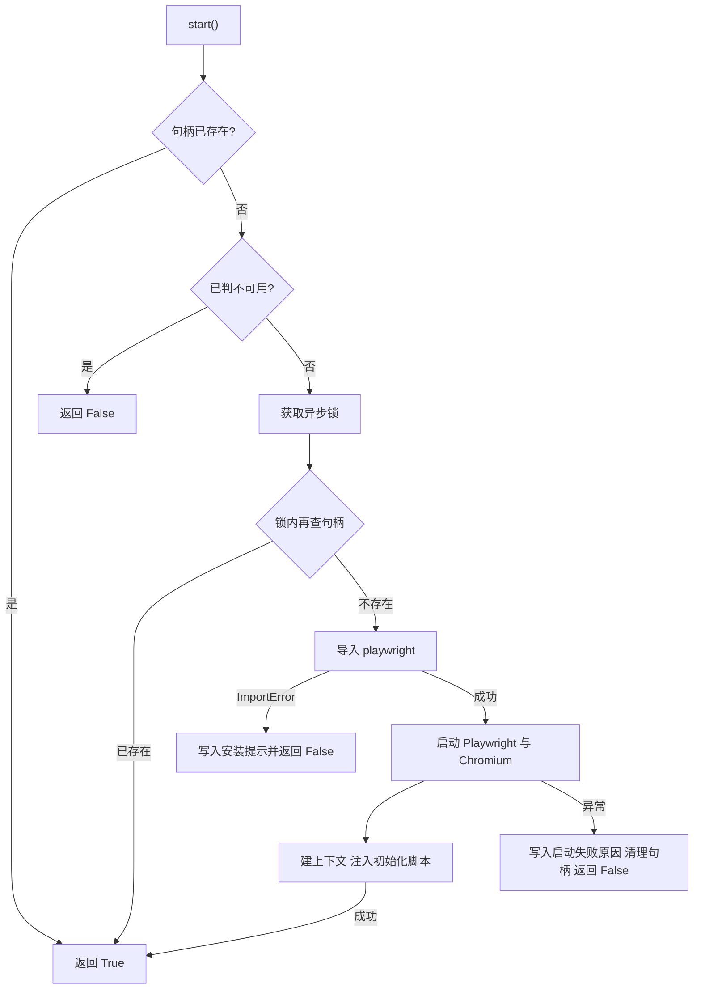
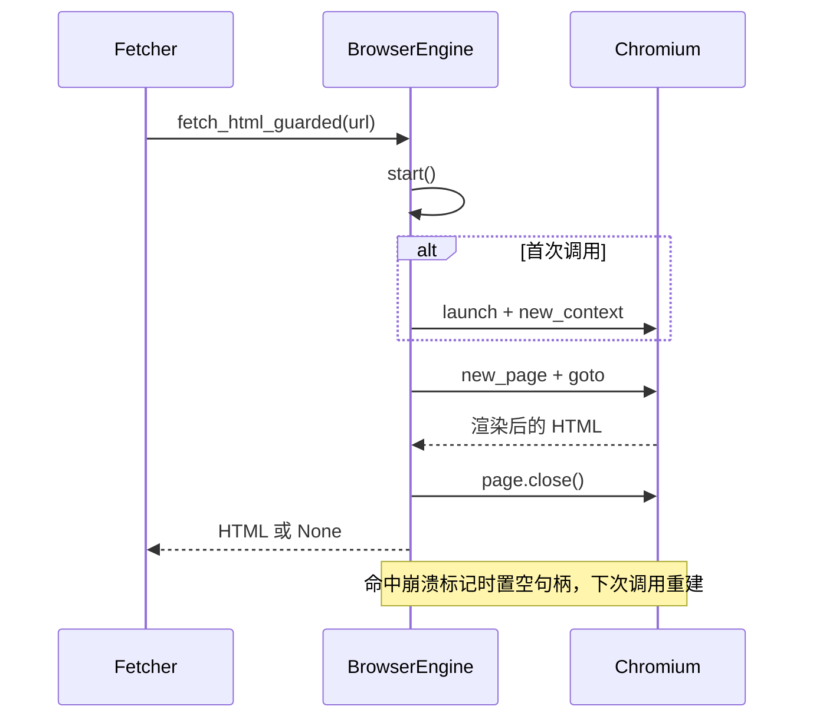

# 单例 Chromium 的启动与回收

用真实浏览器抓 HTML 与用 HTTP 客户端抓 HTML，成本差在进程上：每抓一个 URL 就起一个 Chromium，几个请求之后内存就会被吃满。`src/better_crawler/browser.py` 因此把浏览器做成进程内单例，用一个信号量限制同时在跑的页面数，用一个异步锁保证启动与清理不会并发执行。

它不涉及具体站点的反爬对抗，那些上下文参数与初始化脚本在 26-网页抓取与反爬/03-反爬与浏览器指纹 里单独展开；分层回退的顺序在 02-分层回退 里。单例的生命周期只有启动与回收两端，中间被并发请求复用。

## 1. 单例、信号量与两个上限

`BrowserEngine`（`src/better_crawler/browser.py:75`）的构造函数接收两个参数：是否无头、并发上限，默认值为模块常量 `_MAX_CONCURRENCY = 5`（`src/better_crawler/browser.py:35`）。并发用 `asyncio.Semaphore` 实现（`src/better_crawler/browser.py:80`），生命周期操作则用 `asyncio.Lock` 串行化（`src/better_crawler/browser.py:84`）。

两把同步原语的获取顺序固定：先在抓取入口拿信号量，再在启动时拿锁，不存在反向持有，因此不会互相等待。信号量在构造函数里创建而不是在启动时创建，这样并发上限在实例生命周期内固定，不需要随浏览器重建而重置。两个上限解决不同问题：并发上限限制同时打开的页面数，避免 Chromium 因内存压力崩溃；锁限制启动与清理这类会改写句柄的操作，避免两次启动各建一个浏览器实例。

模块注释把这一条写在最前面（`src/better_crawler/browser.py:6`）。单例的边界是进程：部署多个 worker 时每个进程各持一个 Chromium，总内存随进程数增长。需要更严格的资源隔离时，把浏览器放到独立服务里比在同进程里加锁更有效。

## 2. 启动路径与不可用原因

`start()`（`src/better_crawler/browser.py:94`）返回布尔值，任何失败都不抛异常，而是把原因写进 `_unavailable_reason`。它有三道早退：句柄已存在就直接返回真（`src/better_crawler/browser.py:96`）；此前已判定不可用直接返回假（`src/better_crawler/browser.py:98`）；进入锁之后再做一次句柄检查（`src/better_crawler/browser.py:101`），这道双重检查用来覆盖等待锁期间别的协程已完成启动的情况。

锁内分两个阶段。先导入 `playwright.async_api`，这一步可能耗时几十毫秒，期间其他协程在锁外排队，不会重复发起启动，导入失败时写入安装提示「pip install playwright && playwright install chromium」（`src/better_crawler/browser.py:106`）。

导入失败与启动异常被分开处理，原因是两者对应完全不同的处置：前者要改环境，提示里直接给出两条安装命令；后者要看异常文本，可能是缺系统依赖或权限问题。两者都会让引擎从此不可用，但提示信息不同。导入成功才实际启动：先起 Playwright，再以 `_LAUNCH_ARGS` 启动 Chromium，最后建上下文并注入初始化脚本（`src/better_crawler/browser.py:112` 至 `:128`）。

启动过程任何异常都落到同一条降级分支，写入原因后清空句柄并返回假（`src/better_crawler/browser.py:131`）。

## 3. 上下文的四项参数与初始化脚本

上下文在启动时一次性建好，参数有四组（`src/better_crawler/browser.py:117` 至 `:126`）：用户代理取模块常量 `_UA`（`src/better_crawler/browser.py:38`），视口固定 1080×600，语言固定 `zh-CN`，请求头补齐 `sec-ch-ua` 系列与 `Accept-Language`。

视口取一个小尺寸而不是常见的高分屏尺寸，是为了减少首屏渲染面积、缩短单页耗时；语言与请求头里的语言偏好保持一致，避免服务端按 IP 与头部推断出不同的地区版本。模块注释解释了为什么这几项必须一起给：UA 与 `sec-ch-ua` 的版本号不一致会被反爬识别（`src/better_crawler/browser.py:37`）。

初始化脚本 `_NAVIGATOR_OVERRIDE`（`src/better_crawler/browser.py:45`）在上下文层通过 `add_init_script()` 注入（`src/better_crawler/browser.py:128`），对每个新建页面生效。注入发生在任何页面创建之前，因此不需要在每个页面里重复执行；脚本内容本身只改导航器属性，不阻塞页面加载。

它改写的是导航器上的几个属性，具体项与生效范围在 26-网页抓取与反爬/03-反爬与浏览器指纹 里展开。初始化脚本注入在上下文上，每次导航都会执行一次，它不做网络拦截也不改写页面内容，因此页面拿到的文本与真实浏览器一致。

## 4. 清理与启动失败的收尾

`close()`（`src/better_crawler/browser.py:137`）在锁内调用 `_cleanup_locked()`（`src/better_crawler/browser.py:141`）。清理按上下文、浏览器、Playwright 三层依次关闭，每层的异常都被吞掉，因为关闭失败不影响主流程（`src/better_crawler/browser.py:150`）。

最后三个句柄统一置空（`src/better_crawler/browser.py:157`）。这使 `close()` 具备幂等性：重复调用只是对空句柄再做一次跳过，调用方不需要记录状态；进程退出时句柄也会随进程结束释放，显式关闭主要服务于测试与长驻进程的重配场景。这使 `close()` 具备幂等性：重复调用只是对空句柄再做一次跳过，不需要调用方记录状态。

进程退出时即使没有显式关闭，句柄也会随进程结束释放，显式关闭主要服务于测试与长驻进程里的重配场景。启动失败走的是同一个清理函数（`src/better_crawler/browser.py:134`），因此失败后不存在半开的句柄——状态只有「可用」与「明确不可用」两种。这一点对上层很重要：下次调用 `start()` 时会重新尝试导入与启动，而不是因为上一次失败就永久放弃，因为只有导入失败与启动异常这两种情况才会写入 `unavailable_reason`。

这里要补一句：写入 `unavailable_reason` 之后，`start()` 的第二道早退会直接返回假（`src/better_crawler/browser.py:98`），也就是说启动失败之后不会再自动重试。要恢复需要重建实例或清掉该字段。

## 5. 崩溃标记与单例重置

运行期崩溃与启动失败是两条不同的路径。抓取过程中捕获到异常时，引擎会拿异常文本与 `_CRASH_MARKERS`（`src/better_crawler/browser.py:66`）逐个比对，命中则调用 `_mark_crashed()`（`src/better_crawler/browser.py:161`）。

标记动作只有一步：把三个句柄置空。标记本身不做关闭调用，理由是崩溃后关闭操作大概率也会失败，交给下一次启动的清理逻辑兜底更省事。标记清单里既有 Playwright 的关闭异常文本，也有 CDP 协议错误文本（`src/better_crawler/browser.py:66`），覆盖了句柄失效的常见表述。

置空之后，下一次 `start()` 会因为句柄为空重新走启动流程，单例因此自动重建。标记发生时正在排队的请求不受影响：它们进入抓取逻辑后才发现上下文为空，于是走一次新的启动；并发上限仍由信号量把住，重建期间不会有大量页面同时打开。崩溃标记不写 `unavailable_reason`，这一点决定了它与启动失败的行为差异：崩溃可以自愈，启动失败不会自动重试。

## 6. 不可用原因写给谁看

`unavailable_reason` 是一个只读属性（`src/better_crawler/browser.py:89`）。内部有两个读者：`fetch_html()` 在浏览器不可用时把它写进结果的错误字段（`src/better_crawler/browser.py:190`），抓取层则把这条原因带回响应，让调用方看到「未安装 Playwright」而不是笼统的失败（`src/better_crawler/fetcher.py:162`）。

启动成功的路径不会清掉这个字段吗？会——它只在从未成功启动过时才有值，因为写入点只有两处 ImportError 与启动异常（`src/better_crawler/browser.py:106`、`:132`），成功分支里没有对它赋值。这条原因会一路传到抓取层的结果说明里（`src/better_crawler/fetcher.py:162`），调用方据此可以区分「环境没装浏览器」与「这个页面抓不到」两类失败。不可用原因不参与重试判断：它只用于说明失败原因，抓取层是否重试由自己的策略决定。

## 7. 易错点

- 以为启动失败会自动重试。写入 `unavailable_reason` 后 `start()` 直接返回假。
- 把崩溃与启动失败当成同一类。崩溃只置空句柄，下次调用会重建。
- 在锁外检查句柄就动手启动。双重检查在锁内还有一次，绕过它会出现两个 Chromium。
- 逐个页面新建上下文。上下文在启动时建好并复用，初始化脚本按上下文生效。
- 只改 UA 不改 `sec-ch-ua`。两者版本不一致会暴露自动化特征。
- 以为 `close()` 与启动可以并发。两者都要拿同一把锁，先到先执行。
- 在抓取循环里频繁调用 `close()`。关闭后下一次抓取会重新启动浏览器，启动成本远高于复用。
- 把导入失败当成环境无关的小事。它决定后续所有请求走哪条降级路径。
- 认为并发上限可以随请求数动态调整。信号量在构造时创建，运行期不变。
- 以为浏览器实例会随进程共享。单例是进程内的，多进程各起一个。
- 在浏览器不可用时仍期待拿到部分结果。`fetch_html()` 直接返回 `None`。
- 在浏览器不可用时仍期待拿到部分结果。`fetch_html()` 直接返回 `None`。

## 小结

核心概念：

| 概念 | 内容 |
| --- | --- |
| 单例 | 进程内一个 Chromium，句柄三项：Playwright、浏览器、上下文 |
| 并发闸门 | `asyncio.Semaphore`，默认上限 5 |
| 启动返回 | 布尔值，失败原因写 `unavailable_reason` |
| 上下文参数 | UA、视口、语言与客户端提示头一次性配好 |
| 初始化脚本 | 上下文级注入，对所有页面生效 |
| 启动耗时 | 首次调用承担，之后复用 |
| 崩溃处理 | 命中标记后只置空句柄，下次调用重建 |

设计权衡：

| 决策 | 选择 | 收益 | 代价 |
| --- | --- | --- | --- |
| 启动失败 | 不抛异常只记原因 | 上层按降级处理 | 失败后不再自动重试 |
| 并发粒度 | 信号量限制页面数 | 避免 OOM | 高峰期排队等待 |
| 句柄清理 | 三层逐级关闭且吞异常 | 关闭失败不影响主流程 | 资源泄漏只在日志可见 |
| 上下文复用 | 启动时建一次 | 页面创建快 | 页面级差异无法单独配置 |

## 练习

### 基础题

1. 并发上限为 5 时，第 6 个页面请求会走哪一步？说明判据所在行。
2. `start()` 在句柄为空的第二次调用（第一次启动失败）会做什么？
3. 清理函数为什么要吞掉三层的关闭异常？

### 挑战题

4. 当前启动失败后不会自动重试。设计一个带冷却时间的重试方案，说明状态字段如何扩展。
5. 上下文在启动时建一次。给出一个让部分页面使用不同视口的改造方案，并说明对初始化脚本的影响。

### 本页引用的路径

| 路径 | 作用 |
| --- | --- |
| `src/better_crawler/browser.py` | 单例、启动、上下文与崩溃标记 |
| `src/better_crawler/fetcher.py` | 引擎的构造与调用方 |
| `src/better_crawler/errors.py` | 启动与抓取失败的说明文本 |
