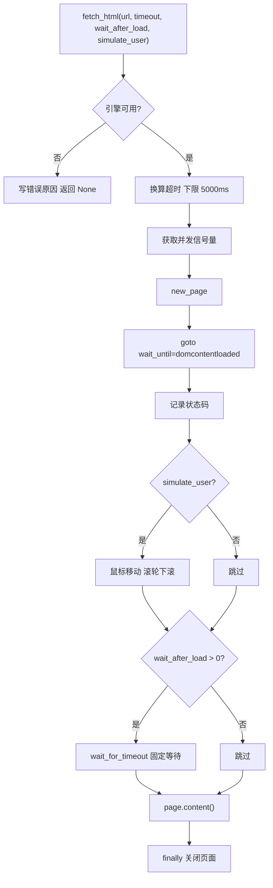
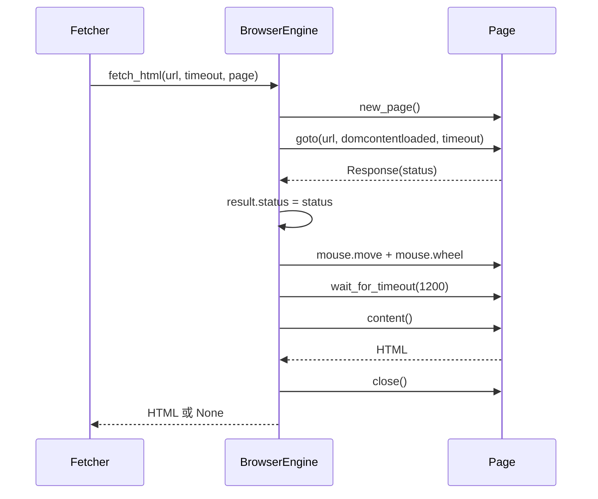

# 渲染抓取的等待策略与结果契约

渲染抓取的难点不在"把页面打开"，而在"什么时候取内容"。导航完成不等于正文渲染完成：单页应用在 domcontentloaded 之后还要发几个请求才把正文填进 DOM，取早了拿到的还是空壳。

`fetch_html()`（`src/better_crawler/browser.py:170`）用三个可调项处理这件事——整页超时、加载后额外等待、是否模拟用户动作。另一个设计点是返回契约：函数只返回 HTML 字符串或 None，状态码与失败原因走一个可选的输出参数。等待的三个旋钮、状态码什么时候拿得到、以及超时与异常分别落到哪个返回分支，是这段代码的三处关键。

## 1. 返回契约与附带信息

`PageFetch`（`src/better_crawler/browser.py:24`）是一个三字段的数据类：状态码、错误文本与默认值（`src/better_crawler/browser.py:31`）。

模块注释解释了为什么不直接返回元组：保持"返回 HTML 字符串或 None"这个简单契约不变，调用方在只关心正文时完全不感知附带信息（`src/better_crawler/browser.py:28`）。

这个取舍的代价是调用方要自己传一个可变对象进来接收信息。抓取层确实这么用：构造一个 `PageFetch` 实例，传给 `fetch_html_guarded()`，失败时读它的 `error` 字段决定说明文本（`src/better_crawler/fetcher.py:154`）。

默认值让 `PageFetch` 在成功路径上保持干净：状态码写真实值，错误字段留空。调用方判断成功与否只看返回的 HTML 是否为 `None`，不需要读附带字段。

## 2. 页面超时与导航等待

超时参数的单位是秒，进入函数后先换算成毫秒，并且设了一个 5 秒的下限：`page_timeout_ms = max(int(timeout * 1000), 5000)`（`src/better_crawler/browser.py:193`）。

下限的意义是保护调用方：即使传入极小的值，页面也至少有一次 5 秒的机会，避免因为参数误写导致全部请求立刻超时。导航等待用的是 `domcontentloaded` 而不是 `load`（`src/better_crawler/browser.py:200`）。

`load` 会等到所有子资源加载完，图片与广告多的页面会把时间耗在无关资源上；`domcontentloaded` 只等 DOM 就绪，剩下的渲染时间交给后面的固定等待。这个组合把"等待"拆成可控的两段，而不是一个不可预测的总时长。

超时参数由抓取层传入，默认 25 秒（`src/better_crawler/fetcher.py:103`）。秒与毫秒的换算只在这一处发生，其余地方都按毫秒传递。

## 3. 状态码在这一步取回

`page.goto()` 返回响应对象，状态码从这里写进结果（`src/better_crawler/browser.py:202`）。注意两处条件：一是必须先传入结果对象，二是响应不为空——跳转过程中某些导航可能没有关联响应。

状态码的用途是区分"页面不存在"与"抓取被拦"。抓取层把它带进响应字段（`src/better_crawler/fetcher.py:167`），错误翻译模块据此给出说明。2xx/3xx 的状态码不会生成错误说明，因为请求本身是成功的，此时抓不到正文属于内容问题。

## 4. 模拟鼠标与滚轮信号

`simulate_user` 默认为真（`src/better_crawler/browser.py:175`）。开启时执行两个动作：鼠标移动到随机坐标（`src/better_crawler/browser.py:206`），滚轮向下滚动一个随机距离（`src/better_crawler/browser.py:209`）。

坐标从 100 到 300、滚动量从 200 到 400 之间取随机值。代码注释解释了为什么不点击：点击固定坐标可能误触链接导致页面跳走（`src/better_crawler/browser.py:205`）。

移动与滚动只产生输入信号，不产生导航副作用；对依赖"用户已交互"才加载正文的页面，这两个动作足以触发懒加载。滚动量上限 400 像素也意味着这只触发首屏之后的少量内容——需要完整长文的页面靠这一个动作拿不全。随机取值是为了避免固定轨迹：固定坐标与固定滚动量在多站点之间会形成可识别的模式，随机区间让每次抓取的输入信号都不同。

## 5. 加载后的额外等待

两个动作之后还有一段固定等待：`wait_after_load` 默认 1.2 秒（`src/better_crawler/browser.py:174`），大于零时用 `page.wait_for_timeout()` 睡眠对应毫秒数（`src/better_crawler/browser.py:211`）。这是最朴素也最稳的一种等待：不依赖任何选择器，给渲染留固定预算。

固定等待的问题是双向的：页面一秒内就渲染完时白等，超过 1.2 秒才出正文时仍然拿空壳。它换来的是实现简单与不依赖站点结构——换成等待某个选择器，规则会随站点改版失效。把 `wait_after_load` 设为 0 可以关掉这段等待，适合已知服务端渲染的站点；默认值偏向保守，用等待时间换取更低的空壳率。

## 6. 两条失败分支与收尾

失败分两类。`asyncio.TimeoutError`（`src/better_crawler/browser.py:213`）对应整页导航超时，错误文本写成"页面加载超时（>N 秒）"（`src/better_crawler/browser.py:216`）。

其余异常走通用分支（`src/better_crawler/browser.py:218`），先把异常文本与崩溃标记比对，命中就重置单例（`src/better_crawler/browser.py:220`），再调用错误翻译函数生成说明（`src/better_crawler/browser.py:224`）。

无论成功还是失败，页面都在 `finally` 里关闭（`src/better_crawler/browser.py:228`），关闭异常同样被吞掉（`src/better_crawler/browser.py:231`）。页面是按请求新建的，关掉它不影响上下文与浏览器，因此下一次请求可以直接复用引擎。

两类失败都返回 `None`，调用方只能靠附带字段区分原因，这也是 `PageFetch` 存在的意义。

## 7. 易错点

- 以为导航完成就等于正文就绪。`domcontentloaded` 之后还要靠固定等待补渲染时间。
- 传入小于 5 秒的超时并期待它生效。函数会把下限抬到 5000 毫秒。
- 把状态码当成正文质量的判据。2xx 只说明请求成功，不说明内容有效。
- 认为模拟用户会点击链接。实现只做鼠标移动与滚轮滚动。
- 忘记关闭页面。页面在 `finally` 里关闭，即使异常路径也不会泄漏。
- 认为两类失败在返回值上有区别。超时与异常都返回 `None`，差异只在附带字段里。
- 把 `wait_after_load` 的默认值当成对所有站点都够用。它偏向保守，慢站点仍可能取到空壳。

## 小结

核心概念：

| 概念 | 内容 |
| --- | --- |
| 返回契约 | 成功返回 HTML 字符串，失败返回 `None` |
| 附带信息 | `PageFetch` 带状态码与错误原因 |
| 超时下限 | `max(timeout * 1000, 5000)` |
| 导航条件 | `domcontentloaded` |
| 交互模拟 | 鼠标移动到随机坐标，滚轮下滚 200 至 400 像素 |
| 加载后等待 | 默认 1.2 秒固定睡眠 |
| 收尾 | `finally` 关闭页面，异常被吞 |

设计权衡：

| 决策 | 选择 | 收益 | 代价 |
| --- | --- | --- | --- |
| 附加信息 | 输出参数而非元组 | 返回契约不变 | 调用方要传入可变对象 |
| 等待方式 | 固定睡眠 | 不依赖站点结构 | 快页面白等、慢页面仍旧取空 |
| 导航条件 | `domcontentloaded` | 不等无关子资源 | 需额外等待补渲染 |
| 交互模拟 | 只移动与滚动 | 无导航副作用 | 拿不到需要点击展开的内容 |

## 练习

### 基础题

1. 传入 `timeout=1` 时页面导航的实际超时是多少毫秒？写出计算式。
2. `result.status` 在什么条件下不会被写入？
3. 页面在成功路径与异常路径下分别由哪一行代码关闭？

### 挑战题

4. 固定等待无法兼顾快慢页面。设计一个用正文长度或网络空闲作为判据的替代方案，说明它如何处理"正文为空但页面正常"的情况。
5. 模拟用户只滚动 400 像素，长文页面可能只加载首屏。给出一个分段滚动到底部的方案，并说明它与超时的关系。

### 本页引用的路径

| 路径 | 作用 |
| --- | --- |
| `src/better_crawler/browser.py` | 等待参数、状态码与失败分支 |
| `src/better_crawler/fetcher.py` | 调用方与 `PageFetch` 的使用 |
| `src/better_crawler/errors.py` | 异常文本的翻译 |
