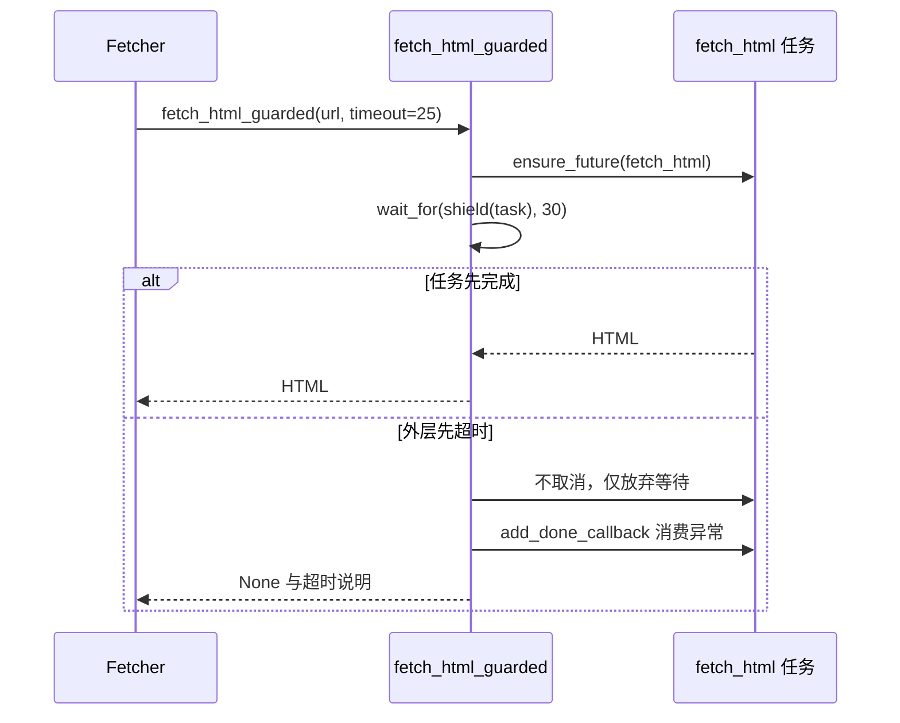
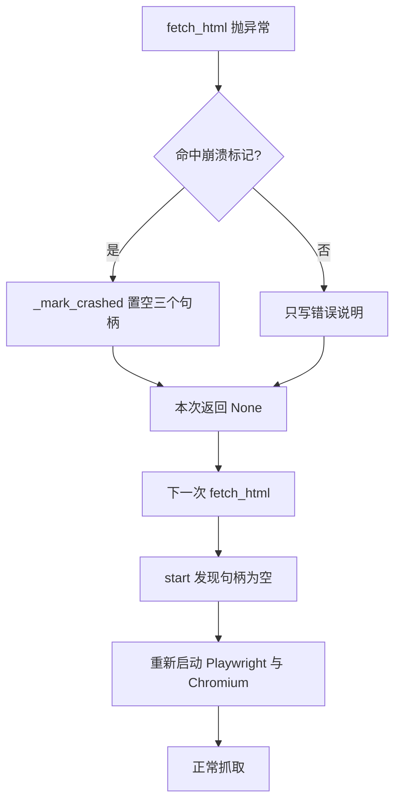

# 整体超时保护与浏览器崩溃恢复

单页导航超时只能覆盖 `goto` 这一步。页面创建、上下文获取、信号量排队以及最后的 `content()` 调用都可能在导航超时之外卡住，而抓取层需要的是一个确定的等待上限。

`fetch_html_guarded()`（`src/better_crawler/browser.py:235`）就是这层保险：它在 `fetch_html()` 外面再套一个整体超时。

难点在于放弃等待之后怎么处理那个还在跑的任务。直接取消会触发 Playwright 内部的 future 异常泄漏，所以这里的做法是"不取消、只放弃等待"，用一个回调把结果或异常消费掉。这种模式、内外两层超时的关系，以及崩溃之后引擎如何自愈，是这里的三个要点。

## 1. 为什么单页超时不够

单页导航超时由 `page_timeout_ms` 控制，只作用于 `page.goto()`（`src/better_crawler/browser.py:199`）。

从进入 `fetch_html()` 到调用 `goto` 之间还有几步等待：拿并发信号量（`src/better_crawler/browser.py:195`）、新建页面（`src/better_crawler/browser.py:198`）。

如果浏览器已经崩溃或上下文处于异常状态，这两步可能长时间不返回，此时 `goto` 的超时根本没机会生效。模块注释把这一点写成设计前提：超时取消会让 Playwright 内部 future 异常泄漏（`src/better_crawler/browser.py:7`）。因此外层需要的是一个"等待上限"，而不是"取消信号"。

## 2. shield 与 wait_for 的组合

实现只有三行：先把 `fetch_html()` 包成任务（`src/better_crawler/browser.py:248`），再用 `asyncio.wait_for()` 等待 `asyncio.shield()` 包过的任务，超时时间取传入值加 5 秒（`src/better_crawler/browser.py:252`）。

两个函数的职责要分清楚。`shield()` 的作用是让外层取消不传递给内层任务：`wait_for()` 超时会取消它等待的对象，包一层 shield 之后，取消落在 shield 上，底层抓取任务继续跑完。外层因此拿到超时控制权，底层任务不受影响。

这 5 秒不是一个精调值，它覆盖的是页面创建与信号量排队的量级；如果上层传了很短的超时，差值保证内层仍有机会先报出更具体的导航错误。

## 3. 放弃等待时消费异常

超时分支做的第一件事是给任务挂回调（`src/better_crawler/browser.py:254`）：回调里调用 `t.exception()`，任务未被取消时才取。

这一句是关键——它把任务最终抛出的异常标记为"已处理"，从而避免解释器打印"future exception was never retrieved"，也避免 Playwright 内部因为异常未消费而进入不一致状态（`src/better_crawler/browser.py:255`）。

随后写一条 debug 日志并设置结果的错误文本为"抓取超时（>N 秒）"（`src/better_crawler/browser.py:259`）。函数返回 `None`，与普通失败路径一致。

需要注意的是：底层任务仍然会跑完，它占用的信号量槽位也会一直占到那次抓取结束。也就是说外层超时并不能立刻释放并发额度，只是让调用方不用继续等。回调是个 lambda，闭包捕获任务对象本身，不引用任何局部可变状态，因此任务结束得再晚也能安全消费异常。

## 4. 内外两层超时的差值

内层超时是 `timeout` 秒，外层是 `timeout + 5` 秒，多出的 5 秒是给页面创建、信号量排队与结果回传留的余量（`src/better_crawler/browser.py:252`）。

如果两层取同一个值，外层会先触发，内层精心区分过的"导航超时"与"抓取超时"两种说明就会被吞掉。这个差值让两条错误文本各有归属：内层超时产生"页面加载超时（>N 秒）"（`src/better_crawler/browser.py:216`），外层超时产生"抓取超时（>N 秒）"（`src/better_crawler/browser.py:259`）。调用方看到后者时，问题更可能出在排队或引擎状态上，而不是目标站点慢。

## 5. 抓取层的重试与这层保护的关系

抓取层为浏览器这一档设置了独立的重试次数，默认 2 次，循环次数是重试数加一（`src/better_crawler/fetcher.py:151`）。每轮调用 `fetch_html_guarded()` 并传入同一个结果对象（`src/better_crawler/fetcher.py:154`），最后一轮失败时把错误原因写成说明（`src/better_crawler/fetcher.py:162`）。

重试与超时的组合意味着最坏耗时是"轮数乘以整体超时"。外层超时不会取消底层任务这一点在重试场景下尤其要考虑：上一轮放弃等待的任务仍在占用信号量，下一轮要排队，重试间隔实际被拉长。重试循环复用同一个结果对象，因此每轮失败都会覆盖上一轮的错误文本，最终留下的说明来自最后一次尝试。

## 6. 崩溃恢复的完整路径

崩溃识别的入口在通用异常分支：把异常文本与 `_CRASH_MARKERS` 比对，命中就调用 `_mark_crashed()`（`src/better_crawler/browser.py:220`）。

标记动作是把 Playwright、浏览器、上下文三个句柄置空（`src/better_crawler/browser.py:161`）。置空之后，下一次 `start()` 会发现句柄为空，重新走启动流程（`src/better_crawler/browser.py:96`）。

这条恢复路径不需要外层介入，也不会写入 `unavailable_reason`，因此不会像启动失败那样被永久判为不可用。

## 7. 并发闸门在超时与崩溃下的状态

信号量的获取在 `fetch_html()` 内、页面创建之前（`src/better_crawler/browser.py:195`），释放由 `async with` 保证。

外层超时放弃等待时，内层任务仍持有槽位，直到它自己结束；崩溃重置句柄则不影响信号量本身，因为信号量属于引擎对象而不属于浏览器。页面关闭在 `finally` 里执行（`src/better_crawler/browser.py:228`），所以正常超时路径不会残留页面对象。

可能残留的是那种"卡在系统调用里"的情况，此时页面对象要等到底层任务被进程回收。超时与放弃等待都只记 debug 日志：这类事件在批量抓取里很常见，写成 warning 会淹没更需要关注的环境错误。

## 8. 易错点

- 以为外层超时会取消底层抓取。实现只放弃等待，任务继续跑到结束。
- 把两层超时设成同一个值。这样内层的导航超时说明永远不会出现。
- 忽略重试与超时的乘数效应。最坏耗时是轮数乘以整体超时。
- 认为崩溃会写进 `unavailable_reason`。只有导入失败与启动异常会写。
- 手动取消返回的任务。取消会让 Playwright 的 future 异常泄漏。
- 从错误文本反推是哪一层超时。内层写「页面加载超时」，外层写「抓取超时」。
- 以为放弃等待会释放并发额度。槽位由底层任务继续持有。这两条超时路径都不需要测试桩：把 `timeout` 调小、指向一个迟迟不响应的地址，就能分别触发内层与外层。

## 小结

核心概念：

| 概念 | 内容 |
| --- | --- |
| 外层超时 | `wait_for` 加 `shield`，时长取 `timeout + 5` |
| 放弃等待 | 不取消任务，挂 `done_callback` 消费异常 |
| 两种超时 | 内层对应导航，外层对应排队与引擎状态 |
| 重试 | 抓取层循环 `browser_retries + 1` 轮 |
| 崩溃恢复 | 置空三个句柄，下次启动自动重建 |
| 信号量 | 属于引擎对象，超时期间仍被占用 |

设计权衡：

| 决策 | 选择 | 收益 | 代价 |
| --- | --- | --- | --- |
| 超时处理 | 不取消只放弃 | 避免 future 异常泄漏 | 槽位滞后释放 |
| 内外差值 | 外层多 5 秒 | 保留两条错误说明 | 最坏耗时增加 5 秒 |
| 崩溃恢复 | 只置空句柄 | 可自愈且不需要外部介入 | 无主动关闭，资源晚释放 |
| 错误消费 | 回调里取 `exception()` | 消除未处理异常告警 | 异常细节只进日志 |

## 练习

### 基础题

1. 传入 `timeout=25` 时内外两层超时分别是多少秒？
2. 外层超时后底层任务会被取消吗？说明依据所在的代码行。
3. `_mark_crashed()` 之后引擎处于什么状态？

### 挑战题

4. 外层超时不取消任务，导致信号量槽位滞后释放。设计一个既保留异常消费又能尽快释放槽位的方案。
5. 崩溃恢复只置空句柄，没有主动关闭旧进程。分析这种做法的风险与适用场景。

### 本页引用的路径

| 路径 | 作用 |
| --- | --- |
| `src/better_crawler/browser.py` | 外层超时、异常消费与崩溃恢复 |
| `src/better_crawler/fetcher.py` | 重试循环与错误说明 |
| `src/better_crawler/errors.py` | 异常文本翻译 |
