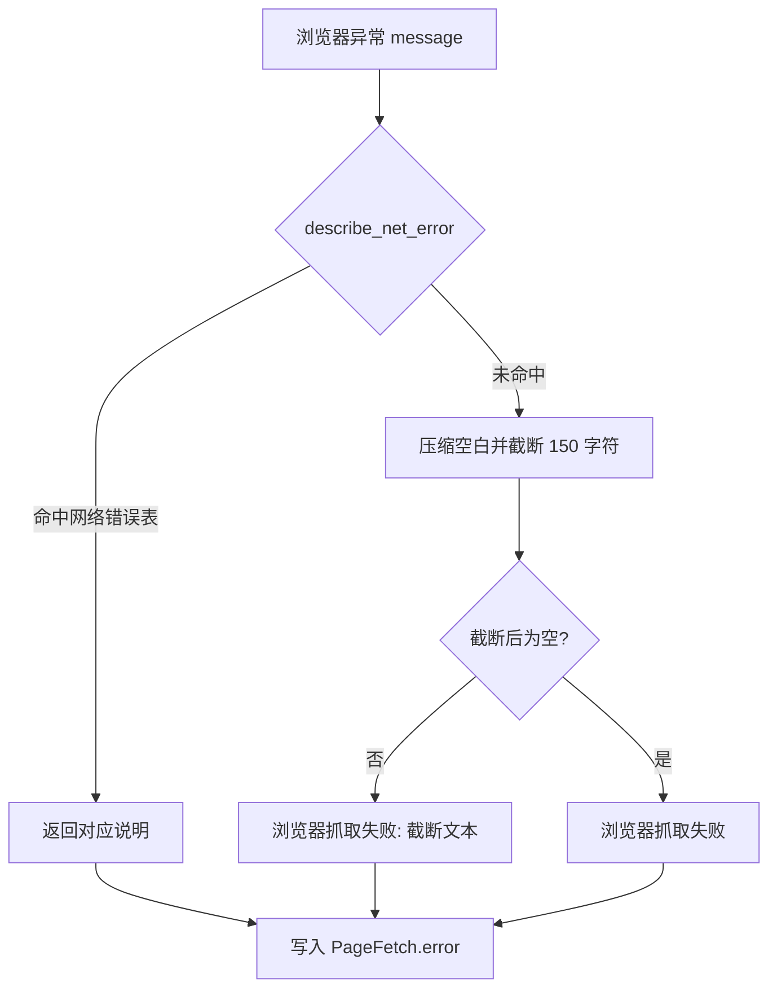
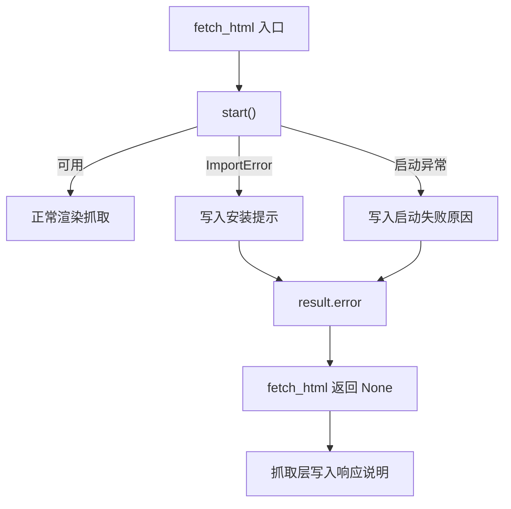

# 失败原因翻译与浏览器不可用降级

渲染抓取失败的原因很多：页面本来就不存在、触发了反爬、域名解析失败、代理没通、浏览器根本没装起来。如果统一报成"提取不到有效正文"，调用方就无法判断该换 URL、该重试、还是该修环境。`src/better_crawler/errors.py` 的存在就是为了把底层错误翻译成能直接指导下一步动作的说明。

翻译规则本身很短，重要的是它划出的边界——哪些情况该给状态码解释，哪些不该。要看的是三件事：状态码与网络错误码怎么翻译、识别不出时怎么兜底、以及浏览器不可用时这条说明怎样一路传到响应里。

## 1. 三个翻译入口

模块对外暴露三个函数：状态码翻译（`src/better_crawler/errors.py`）、网络错误识别、浏览器异常总入口。第三个是前两个的组合：先尝试识别网络错误，识别不出再回退到截断后的原始信息。

模块开头的注释把用途写得很直接：区分"页面有问题"和"抓取被拦"很重要，前者该换 URL，后者可以重试（`src/better_crawler/errors.py`）。表驱动的好处在这一层很明显：新增一个状态码只改字典，不动函数；需要留意的是字典本身的取值口径，比如 `521` 与 `522` 明确写成 Cloudflare 报错而不是笼统的 5xx。

## 2. 状态码表的边界

状态码表覆盖 24 个常见取值（`src/better_crawler/errors.py`），从 400 的「请求无效」到 522 的「连接源站超时」。几个与抓取场景直接相关的条目：403 标注「可能触发反爬」，404 是「页面不存在」，429 是「被限流」，521 与 522 明确写出是 Cloudflare 报错。

翻译函数有一条硬边界：状态码为空或小于 400 时直接返回空字符串（`src/better_crawler/errors.py`）。注释解释了原因——2xx 与 3xx 表示请求本身成功，此时提取不到正文属于内容问题，用状态码解释反而误导。

表里查不到时按区间兜底：500 以上写「服务端错误」（`src/better_crawler/errors.py`），其余写「客户端错误」。几个与抓取决策直接相关的条目如下。

| 状态码 | 说明 | 可采取的动作 |
| --- | --- | --- |
| 403 | 服务器拒绝访问（可能触发反爬） | 换抓取路径或换 URL |
| 404 | 页面不存在 | 换 URL |
| 410 | 页面已永久移除 | 放弃该地址 |
| 429 | 请求过于频繁（被限流） | 降低频率后重试 |
| 451 | 因法律原因不可访问 | 放弃该地址 |
| 503 | 服务暂不可用 | 稍后重试 |
| 521 | 源站不可达（Cloudflare 报错） | 稍后重试 |
| 522 | 连接源站超时（Cloudflare 报错） | 稍后重试 |

## 3. 网络错误码的匹配顺序

网络错误是一张有序元组（`src/better_crawler/errors.py`），匹配方式是子串包含，返回第一个命中的说明。顺序有意义，注释专门写了这一点，因为前缀相近的错误码会互相包含。

表里有两组容易看错的条目：`ERR_NAME_NOT_RESOLVED` 与 `ERR_NAME_RESOLUTION_FAILED` 都映射到 DNS 问题，先出现的先匹配；`ERR_CONNECTION_TIMED_OUT` 在 `ERR_TIMED_OUT` 之前，前者更具体。`ERR_CERT` 与 `ERR_SSL` 用前缀匹配，因此证书与握手类错误都能被这两条覆盖。常用条目与它们的指向如下。

| 错误码 | 说明 | 指向 |
| --- | --- | --- |
| `ERR_NAME_NOT_RESOLVED` | 域名无法解析 | DNS 或域名拼写 |
| `ERR_INTERNET_DISCONNECTED` | 本机网络已断开 | 运行环境 |
| `ERR_CONNECTION_REFUSED` | 连接被拒绝 | 端口或服务未启动 |
| `ERR_CONNECTION_TIMED_OUT` | 连接超时 | 网络或链路 |
| `ERR_EMPTY_RESPONSE` | 服务器返回空响应 | 服务端 |
| `ERR_TOO_MANY_REDIRECTS` | 重定向次数过多 | 目标站点 |

## 4. 识别不出时的截断策略

兜底分支先把连续空白压成单个空格，再截到 150 个字符（`src/better_crawler/errors.py`），最后拼上"浏览器抓取失败:"前缀。压缩是为了让多行堆栈变成单行，截断是为了不把整段堆栈塞进响应字段。注释里的取舍写得很清楚：保留原文总比丢掉好，但需要控制长度。

因此这条兜底路径的信息量介于"什么都没说"和"把堆栈原样返回"之间。截断策略对所有未识别异常一视同仁，包括引擎内部错误与页面脚本错误；翻译层不做归因，只保证文本可读且长度可控。

## 5. 浏览器不可用的降级链路

不可用有两种来源：导入失败与启动异常，两者都会写入引擎的 `unavailable_reason`（`src/better_crawler/browser.py`）。抓取入口在取页面之前先调用 `start()`，不可用时把这段原因直接写进结果对象的错误字段。

抓取层随后把它当成失败说明的一部分：最后一轮仍失败时，把该原因作为响应里的说明文本（`src/better_crawler/fetcher.py`）。这条链路让"没装 Playwright"这类环境问题不会被误报成目标站点的问题。

## 6. 抓取层如何使用这些文本

抓取结果带三个可观测字段：命中哪条抓取路径（`src/better_crawler/fetcher.py`）、是否成功、以及失败说明。浏览器档成功时也会记录状态码，失败时则写入说明。调用方拿到的是结构化字段而不是一段自由文本，翻译函数只负责生成其中的人类可读部分。

这套分工让错误文本有确定的生成点：状态码与网络错误在 `errors.py` 翻译，超时在浏览器引擎内生成，不可用原因在启动路径生成。三处的文本风格一致，都以可操作的动作结尾或给出明确的服务端状态。

## 7. 与分层回退的衔接

这些说明文本有一个直接的消费者：分层回退。当浏览器档失败时，说明文本进入下一档的决策——状态码指向反爬或限流时可以换用带指纹的 HTTP 档，DNS 与证书类错误则换档也不会成功。分层顺序本身在 26-网页抓取与反爬/02-分层回退 里展开。反过来说，翻译层不需要知道有几档：它只产出人类可读的说明与调用方自行判断的原始状态码，档位选择留给抓取层。这条边界让新增档位不必改翻译规则。

## 8. 易错点

- 用状态码解释 2xx 页面的空正文。这类情况不返回状态码说明。
- 依赖未命中网络错误表时的原文。它会被压缩并截断到 150 字符。
- 把「未安装 Playwright」当成页面问题。它由启动路径生成，与目标站点无关。
- 认为错误说明里有完整堆栈。兜底分支只保留单行截断文本。
- 忽略状态码表的区间兜底。表外状态码按 4xx 与 5xx 分两类返回。
- 把说明文本当成可以解析的结构。结构化字段是状态码与错误码，文本只供人读。
- 在翻译层里写档位选择逻辑。档位决策属于抓取层。
- 认为未识别异常会丢信息。兜底分支保留压缩后的前 150 字符。状态码与网络错误码两张表都是纯数据，新增映射不需要改函数；需要改动的是匹配顺序，因为子串匹配依赖先后关系。

## 小结

核心概念：

| 概念 | 内容 |
| --- | --- |
| 状态码表 | 24 个条目，覆盖 400 到 522 |
| 翻译边界 | 只对 400 以上返回说明 |
| 网络错误表 | 有序元组，子串匹配取第一条 |
| 兜底文本 | 压缩空白后截断 150 字符 |
| 不可用原因 | 导入失败或启动异常写入 |
| 传递路径 | 引擎到结果对象再到响应说明 |

设计权衡：

| 决策 | 选择 | 收益 | 代价 |
| --- | --- | --- | --- |
| 状态码范围 | 只翻译 400 以上 | 避免把内容问题说成请求问题 | 2xx 空正文没有专门提示 |
| 表驱动 | 状态码与错误码各一张表 | 新增映射成本低 | 表外取值只能走区间兜底 |
| 兜底 | 截断而不是丢弃 | 保留可诊断信息 | 堆栈细节丢失 |
| 匹配顺序 | 具体项排在前面 | 相近错误码不会误判 | 新条目必须注意插入位置 |

说明文本里不含 URL 或堆栈的完整内容，因此它适合直接放进面向用户的响应，不需要再做一层脱敏。

## 练习

### 基础题

1. 状态码 200 且正文为空时，`describe_status()` 返回什么？
2. 异常文本同时包含 `ERR_CONNECTION_TIMED_OUT` 与 `ERR_TIMED_OUT` 时命中哪一条？
3. 浏览器未安装时，这段原因在代码里经过哪几个字段传递到响应？

### 挑战题

4. 兜底路径固定截断 150 字符。设计一个保留关键错误码、只截断堆栈行的方案。
5. 当前翻译函数是纯函数且无外部依赖。给出一个为它们补单元测试的用例清单，覆盖表内、表外与空输入三类。

### 本页引用的路径

| 路径 | 作用 |
| --- | --- |
| `src/better_crawler/errors.py` | 状态码与网络错误的翻译规则 |
| `src/better_crawler/browser.py` | 不可用原因与错误字段写入 |
| `src/better_crawler/fetcher.py` | 结果字段与说明文本的组装 |
