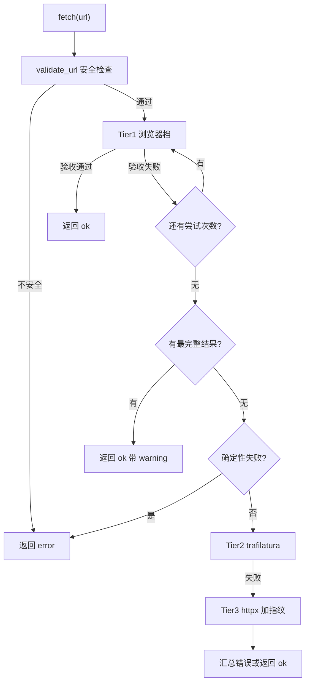
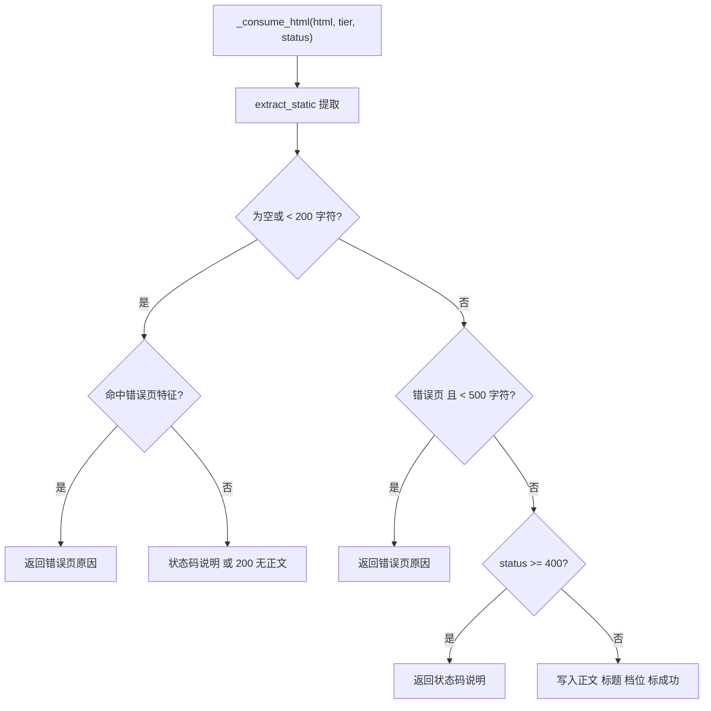

# 三档抓取路径与结果验收

抓一个网页有几条路可走：真浏览器渲染、静态抓取库直取、带完整浏览器指纹的 HTTP 客户端。三条路的能力与成本呈阶梯分布，单靠一条都不够——浏览器最稳但最慢，静态库最快但拿不到 JS 渲染的页面，指纹 HTTP 介于两者之间。

`src/better_crawler/fetcher.py` 把它们串成一个固定顺序，任何一档拿到合格正文就收工。难点不在"按顺序试"，而在"怎么算拿到了"。一条 200 响应可能是一页错误提示，一段够长的文本可能只是导航加站点说明。

验收规则因此独立成函数：三档共用一套验收，判定标准决定要不要重试。

## 1. 三档的顺序与理由

模块注释把分层策略按实测收益排好：浏览器渲染是主路径，因为知乎、CSDN、掘金这类站点只有真浏览器能拿到正文；trafilatura 直取是静态站快路径，约 1 秒，也是浏览器不可用时唯一的依赖；HTTP 加浏览器指纹是二级兜底，补齐 `Sec-Ch-Ua` 与 `Sec-Fetch-*` 全套请求头（`src/better_crawler/fetcher.py`）。

每一档都记录耗时与命中层级，返回给调用方判断，而不是只给一个成功或失败（`src/better_crawler/fetcher.py`）。这条设计决定了结果结构里必须有 `tier` 与 `attempts` 两个字段。

## 2. 结果结构的字段取舍

`FetchResult`（`src/better_crawler/fetcher.py`）有十一个字段：地址、成功标志、正文、标题、命中档位、状态码、正文字符数、耗时、错误、警告与尝试记录。

其中 `warning` 专门留给"拿到了内容但可能不完整"的情形，`attempts` 是逐档、逐次尝试的流水。对外输出由 `to_dict()`（`src/better_crawler/fetcher.py`）负责：传入 `max_chars` 时截断正文，并把截断标记合并进 `truncated` 字段——原本因重试兜底标记的截断与本次按上限截断都算。耗时统一保留两位小数，避免把浮点噪声写进响应。

`validate_url()` 同时承担规范化职责：它返回的是校验后的地址，后续所有请求都使用这个返回值，而不是调用方传入的原始字符串。

## 3. 入口先做三件事

`fetch()`（`src/better_crawler/fetcher.py`）的契约是"始终返回 FetchResult，不抛异常"。开头三步：记录起始时间、调用 `validate_url()` 做安全检查、取域名用于后续的档位冷却判断。

安全检查失败时填好错误与耗时直接返回，不进入任何抓取档（`src/better_crawler/fetcher.py`）。安全检查的实现与规则在 26-网页抓取与反爬/04-安全 里展开。域名在这里只做一件事：作为 trafilatura 档冷却表的键。同一域名下的第一个失败会记住时间，之后的请求在冷却期内跳过这一档。

## 4. 统一的验收规则

三档都通过 `_consume_html()`（`src/better_crawler/fetcher.py`）写结果。它先用 `asyncio.to_thread()` 调 `extract_static()` 做提取，然后按四条规则验收：

| 顺序 | 判据 | 处理 |
| --- | --- | --- |
| 1 | 提取为空或短于 `MIN_CONTENT_LENGTH` | 先识别错误页，再报长度不足 |
| 2 | 长度够但命中错误页特征且短于 500 字符 | 报错误页原因 |
| 3 | 状态码不小于 400 | 报状态码说明，附注疑似错误页内容 |
| 4 | 以上都不命中 | 写入正文、标题、档位并标成功 |

长度门槛来自 `MIN_CONTENT_LENGTH = 200`（`src/better_crawler/extract.py`）。错误页识别走 `detect_error_page()`：短文本分支先查它，因为反爬站常返回 200 却在页面里写"页面不存在"，只报"无有效正文"会掩盖真实原因（`src/better_crawler/fetcher.py`）。

长度够时再查一次，只在文本短于 500 字符时才判定为错误页（`src/better_crawler/fetcher.py`），避免把正文里出现的"404"误判。状态码的归属有一条容易忽略的规则：成功时把状态码写成"拿到正文那一层的值"。

原因是浏览器层可能先碰到 502，而正文最终来自 trafilatura 层，沿用旧的 502 会误导调用方；该层没提供状态码时就置空表示未知（`src/better_crawler/fetcher.py`）。

## 5. 重试的判据与反例

`_worth_retrying()`（`src/better_crawler/fetcher.py`）把失败分成两类。应当重试的是临时性问题：状态码 5xx 或 429，以及说明文本里带"无有效正文""过短""未渲染"的骨架页。

不必重试的是确定性失败：4xx 中的 400、403、404 等（`src/better_crawler/fetcher.py`），重试只会浪费一次加载。判据只看状态码与说明文本两类输入，不做网络探测，因此它是纯函数、可单独测试。

这条判据同时被两处使用：浏览器档循环里决定是否继续（`src/better_crawler/fetcher.py`），以及确定失败时是否直接返回、不再降级。后者尤其重要——一个 404 页面交给后续档位同样拿不到内容。

## 6. 并发抓取与最终汇总

`fetch_many()`（`src/better_crawler/fetcher.py`）用一个信号量限制并发，内部逐条调用 `fetch()` 后用 `gather` 汇总。`gather` 保持输入顺序，因此返回值与传入的 URL 列表一一对应，调用方不需要额外记录映射关系。

单条失败不会影响其他条目，每条结果都带自己的错误原因。所有档位都失败时，错误字段按情况生成：完全没有任何原因时写"所有抓取方式均未取到有效正文"并补一条 `none` 记录（`src/better_crawler/fetcher.py`）；已有明确原因但正文为空时只补一条汇总记录，保留原始原因。

验收函数的返回约定是：成功返回 `None`，失败返回原因字符串。调用方用 `if note is None` 判断，失败原因不需要额外变量承载。

## 7. 易错点

- 只看 `ok` 不看 `warning`。兜底返回的成功结果可能不完整。
- 用状态码判断正文归属。状态码以拿到正文的那一层为准。
- 认为 4xx 重试有意义。除 429 外的 4xx 属于确定性失败。
- 忽略错误页识别。200 响应同样可能是一页错误提示。
- 把 `attempts` 当成日志。它是返回给调用方的结构化诊断记录。
- 认为 `fetch_many()` 会按完成顺序返回。结果顺序与输入顺序一致。
- 忽略域名冷却表的作用范围。它只影响 trafilatura 档，不影响浏览器档。
- 以为重试判据会自己发探测请求。它只读状态码与失败说明。

## 小结

核心概念：

| 概念 | 内容 |
| --- | --- |
| 档位顺序 | 浏览器、trafilatura、指纹 HTTP |
| 命中标记 | `tier` 字段，取值为三档之一或 `none` |
| 验收门槛 | `MIN_CONTENT_LENGTH = 200` |
| 错误页识别 | 短文本先查，长文本仅在短于 500 字符时判定 |
| 状态码归属 | 以拿到正文的那一层为准 |
| 重试判据 | 5xx 与 429 应重试，其余 4xx 不该重试 |

设计权衡：

| 决策 | 选择 | 收益 | 代价 |
| --- | --- | --- | --- |
| 失败表达 | 始终返回结果对象 | 调用方不处理异常 | 失败原因要自己读字段 |
| 验收共用 | 三档走同一个函数 | 规则一致 | 档位特有信息要单独传 |
| 错误页识别 | 分长度两段判定 | 降低误判 | 阈值附近的页面可能漏判 |
| 状态码 | 跟随命中档位 | 不误导调用方 | 档位没状态码时丢失信息 |
| 并发抓取 | 单条独立返回 | 一条失败不影响其他 | 没有整体预算控制 |

## 练习

### 基础题

1. 提取结果 150 字符且状态码为 200 时，`_consume_html()` 会走哪条分支？
2. 状态码 403 的页面会触发浏览器档重试吗？说明判据。
3. 三档都失败且没有任何错误原因时，错误字段写什么？

### 挑战题

4. 验收规则里的 500 字符错误页阈值是硬编码的。设计一个可配置方案，并说明它对不同站点的影响。
5. `fetch_many()` 只限制并发数，没有整体超时。给出一个带总预算的改造方案。

### 本页引用的路径

| 路径 | 作用 |
| --- | --- |
| `src/better_crawler/fetcher.py` | 分档编排、结果结构与验收规则 |
| `src/better_crawler/extract.py` | 长度门槛、错误页识别与正文提取 |
| `src/better_crawler/safety.py` | 入口的 URL 安全检查 |
| `src/better_crawler/browser.py` | 浏览器档的调用对象 |
