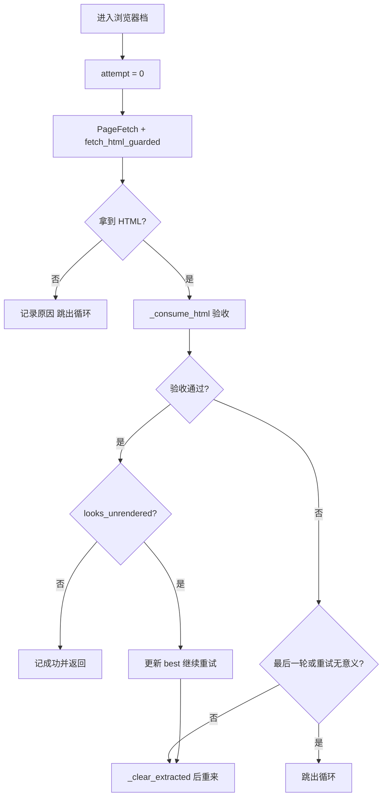
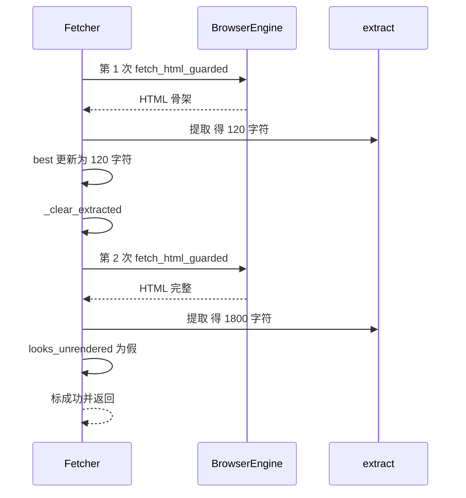

# 浏览器档的重试与最完整结果兜底

浏览器渲染"成功"不等于内容正确。有些站点的正文靠接口异步填充，而接口会概率性失败，页面停在只有导航与页脚的骨架状态：HTTP 状态正常、HTML 也拿回来了，提取出来的正文却短得不像文章。

`src/better_crawler/fetcher.py` 的浏览器档专门处理这种情形——重试，但重试的方式有讲究。降级到后两档的条件在 03-静态档与指纹档的降级条件，验收规则本身在 01-三档抓取路径与结果验收。重试循环有三个设计点：什么时候判定"没渲染出来"、每次重试前清空什么、以及为什么最终要返回"最完整的一次"。

## 1. 默认重试两次的依据

`browser_retries` 默认值为 2（`src/better_crawler/fetcher.py`），构造时再夹一次非负，循环因此最多跑三次。

注释给出了这个数值的来源：实测万方这类站点单次成功率约一半，两次重试后成功率明显提升，而耗时可控（`src/better_crawler/fetcher.py`）。

重试只针对一类失败，而不是所有失败。注释把目标写清楚：内容疑似没渲染出来时重试，因为接口概率性失败，重试通常能拿到（`src/better_crawler/fetcher.py`）。

这一条把重试与"页面本身不存在"区分开——后者在第一次就会短路。循环是串行的：上一轮结束后才发起下一轮，因此同一 URL 的重试不会并发占用两个页面槽位。

## 2. 循环里的三件状态

循环体只维护三样东西：最完整结果 `best`（`src/better_crawler/fetcher.py`）、上一轮失败说明 `last_note`、以及每轮新建的 `PageFetch` 结果容器。

状态码在每轮取回后写入总结果，只保留最后一次的值（`src/better_crawler/fetcher.py`）。每轮先判断有没有 HTML：拿不到时写说明、补一条失败记录并直接跳出循环。浏览器不可用、整体超时、页面加载失败都属于这一类，重试没有意义，因为原因不在页面内容上。

判据的输入同时包含 HTML 与正文，是因为有些骨架页的 HTML 里能看出端倪，而有些只能靠正文字符数判断。

## 3. 未渲染的判据

验收通过之后还有一道检查：`looks_unrendered()`（`src/better_crawler/extract.py`）同时看 HTML 与提取出的正文（`src/better_crawler/fetcher.py`）。

它返回假时才算这次尝试成功，补一条成功记录并立刻返回（`src/better_crawler/fetcher.py`）。判定为未渲染时，说明文本写成"正文仅 N 字符，疑似未渲染出内容"。

这条文本不只是给人看的：后面的重试判据会读它，因为文本里带"未渲染"（`src/better_crawler/fetcher.py`）。判据与说明文本耦合在一起，改动措辞会影响重试行为，这是当前实现里需要留意的一处隐性依赖。清理与验收函数之间存在分工：验收负责写结果，清理负责把结果恢复到未成功的初始态，两者都不负责保存历史。

## 4. 每轮失败前清空什么

重试前调用 `_clear_extracted()`（`src/better_crawler/fetcher.py`），它把成功标志、正文、标题、字符数、档位与错误全部复位，但保留 `attempts` 记录。

清空的目的是让下一轮从干净状态验收，避免把上一轮的残留正文字符数带进这一轮的判据。这条清理与 `best` 的保留是两套逻辑：`best` 在外层单独保存最完整的一次（`src/better_crawler/fetcher.py`），清理不碰它。也就是说"清空"针对当前轮次的验收状态，"保留"针对跨轮次的最优结果。

`best` 只保存正文与标题两个字段，状态码与错误原因不进它，因此兜底结果的状态码来自最后一次尝试。

## 5. 最完整的一次如何兜底

循环结束时若 `best` 里有内容，就把结果标成功、写回正文与标题、档位记为 `browser`，并清掉错误字段（`src/better_crawler/fetcher.py`）。

同时写入一条警告，内容是最后一轮的说明加上"已返回最完整的一次结果"与该次字符数与总尝试次数（`src/better_crawler/fetcher.py`）。

`best` 只在比当前内容更长时才更新（`src/better_crawler/fetcher.py`）。兜底之后直接返回，不再尝试后面的档位。注释给出的理由是：后续档拿到的是同一份 HTML 的更差提取结果，降级只会把内容换得更少。这条判断把"内容不完整"与"内容不存在"分开处理，前者宁可少也不要空。

两处短路都在循环内部判断，外层只负责在循环结束后决定是否降级。

## 6. 两处提前收工

第一处是验收通过且未判定未渲染（`src/better_crawler/fetcher.py`），立即返回，不做多余尝试。第二处是验收失败但失败确定性明显：`_worth_retrying()` 返回假或已是最后一轮时跳出循环，随后由外层判断是否直接返回而不降级。

两处短路共同控制最坏耗时：正常页面一次命中，骨架页最多三次尝试，404 这类页面只试一次。剩下的情况才继续向下走。重试的代价是时间：三轮浏览器抓取的最坏耗时接近三轮整体超时。抓取层因此把它当成同一档内的行为，而不是跨档重试的替代。

## 7. 易错点

- 以为每轮失败都会丢弃内容。最完整的一次保存在 `best` 里。
- 改动未渲染说明的措辞。它同时被重试判据用作关键词。
- 认为拿到 HTML 就算成功。还要过验收与未渲染两道检查。
- 忽略兜底结果的 `warning`。它提示内容可能不完整。
- 以为兜底之后还会继续降级。拿到内容即返回，不再向下走。
- 认为重试是并发发起的。循环串行执行，一轮结束才发下一轮。
- 忽略 `best` 的更新条件。只有更长时才覆盖。
- 把 `_clear_extracted()` 当成清空 `attempts`。尝试记录会被保留。
- 认为兜底结果的状态码来自最完整的那次。它来自最后一次尝试。

## 小结

核心概念：

| 概念 | 内容 |
| --- | --- |
| 重试次数 | 默认 2 次，最多三轮 |
| 触发条件 | 正文疑似未渲染 |
| 跨轮保留 | `best` 保存最完整的一次 |
| 轮内清理 | `_clear_extracted()` 复位成功状态，保留 `attempts` |
| 兜底结果 | 标成功并写 `warning`，不再降级 |
| 短路条件 | 验收通过，或失败确定性明显 |

设计权衡：

| 决策 | 选择 | 收益 | 代价 |
| --- | --- | --- | --- |
| 重试目标 | 只针对未渲染 | 不浪费确定失败的加载 | 其他临时故障不重试 |
| 结果保留 | 取最长的一次 | 内容不丢 | 可能保留不完整内容 |
| 兜底后停止 | 不再降级 | 避免拿到更差的提取 | 放弃其他档位可能更完整的正文 |
| 说明文本 | 兼作判据关键词 | 少一个字段 | 措辞与逻辑耦合 |
| 循环方式 | 串行重试 | 不占用额外页面槽位 | 最坏耗时线性增长 |

## 练习

### 基础题

1. `browser_retries = 2` 时循环最多执行几次？写出取值范围。
2. 第 2 轮提取 120 字符、第 3 轮提取 900 字符但都被判未渲染时，`best` 里是哪一次？
3. 兜底返回的结果里 `error` 与 `warning` 分别是什么？

### 挑战题

4. 说明文本兼作重试判据是一处隐性耦合。给出一个用结构化字段替代关键词匹配的改造方案。
5. 当前取"最长的一次"作为兜底。设计一个按内容质量而非长度挑选的方案，并说明判据来源。

### 本页引用的路径

| 路径 | 作用 |
| --- | --- |
| `src/better_crawler/fetcher.py` | 重试循环、清理与兜底 |
| `src/better_crawler/extract.py` | 未渲染判据与正文提取 |
| `src/better_crawler/browser.py` | 每次尝试的抓取实现 |
