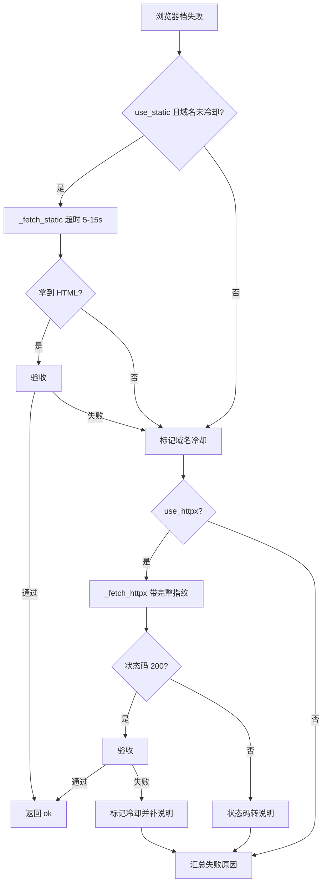
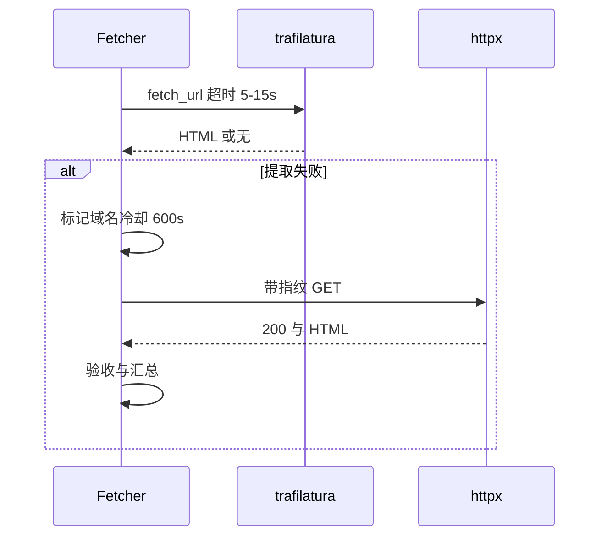

# 静态档与指纹档的降级条件

浏览器档之后的两个档位承担"轻量"职责：trafilatura 直接取 HTML 并就地提取，通常一秒内返回；httpx 档补齐一整套浏览器请求头发请求，用来对付那些只靠请求头就能通过的站点。两档都不启动 Chromium，因此它们也是浏览器不可用时的全部退路。

这两档的进入条件不同：trafilatura 档会被域名冷却表拦下，httpx 档只要开关打开就会尝试。它们的失败处理也不同：trafilatura 失败即标记域名冷却，httpx 失败则把状态码翻译成说明写进结果。两档的开关、超时、请求头与状态码处理各不相同。

## 1. trafilatura 档与域名冷却

进入这一档需要两个条件同时成立：`use_static` 为真，且该域名不在冷却期内（`src/better_crawler/fetcher.py:226`）。冷却表是一个域名到时间戳的字典（`src/better_crawler/fetcher.py:117`），判定函数比较当前时间与记录时间的差值是否小于 600 秒（`src/better_crawler/fetcher.py:413`），这个常量定义在模块顶部（`src/better_crawler/fetcher.py:32`）。

注释解释了冷却的用途：反爬站的 trafilatura 必失败，TTL 内跳过可以省掉每次几秒的试错（`src/better_crawler/fetcher.py:31`）。标记动作在两个失败点各调用一次——trafilatura 档验收失败后（`src/better_crawler/fetcher.py:233`），以及 httpx 档验收失败后（`src/better_crawler/fetcher.py:243`）。第二处用同一个冷却表，说明"该域名静态抓取不管用"这个结论对两档共享。

## 2. 静态档的超时上限

`_fetch_static()`（`src/better_crawler/fetcher.py:353`）把超时夹到 5 到 15 秒之间：`fast = min(max(self.timeout, 5), 15)`（`src/better_crawler/fetcher.py:357`）。

抓取层默认超时 25 秒（`src/better_crawler/fetcher.py:103`），如果不夹，静态档会占掉比浏览器档还长的时间，失去"快路径"的意义。调用方式是把同步函数丢进线程池再套超时：`asyncio.wait_for(asyncio.to_thread(trafilatura.fetch_url, url), timeout=fast)`（`src/better_crawler/fetcher.py:358`）。

超时与一般异常分开处理，两者都只记 debug 日志并返回 `None`（`src/better_crawler/fetcher.py:362`、`:365`），因此这一档失败从不抛出。

## 3. 指纹 HTTP 档的请求头

`_fetch_httpx()`（`src/better_crawler/fetcher.py:369`）的文档字符串写着这套头的来历：缺 `Sec-Ch-Ua`、`Sec-Fetch-*` 或 HTTP/2 时，CSDN 这类站会概率性返回 521，这套头是实测补出来的（`src/better_crawler/fetcher.py:372`）。

| 头字段 | 取值要点 | 作用 |
| --- | --- | --- |
| `User-Agent` | Chrome 126 桌面版 | 与客户端提示头版本一致 |
| `Accept` | 含 html、xml 与通配 | 模拟文档导航 |
| `Accept-Language` | 中文优先 | 与语言偏好一致 |
| `Referer` | 目标站根地址 | 模拟站内跳转 |
| `Sec-Ch-Ua` | Chromium 126 | 客户端提示，反爬识别重点 |
| `Sec-Ch-Ua-Mobile` | `?0` | 声明非移动设备 |
| `Sec-Ch-Ua-Platform` | `"Windows"` | 与 UA 平台一致 |
| `Sec-Fetch-Dest` | `document` | 声明导航请求 |
| `Sec-Fetch-Mode` | `navigate` | 声明顶层导航 |
| `Sec-Fetch-Site` | `same-site` | 声明站内来源 |
| `Upgrade-Insecure-Requests` | `1` | 允许升级到 HTTPS |

客户端参数三项：超时同样夹到 15 秒以内、跟随重定向、启用 HTTP/2（`src/better_crawler/fetcher.py:401`）。HTTP/2 是这套头能否生效的前提之一，文档字符串把它与请求头并列提出。

## 4. 非 200 与异常的处理

httpx 档只在状态码为 200 时返回正文，其余状态码连同状态码本身一起返回给上层（`src/better_crawler/fetcher.py:405`）。抓取入口对这一分支单独处理：状态码不小于 400 时调用 `describe_status()` 生成说明、补一条失败记录、在没有错误时写入该说明，并在状态码为空时写入状态码（`src/better_crawler/fetcher.py:248` 至 `:253`）。

网络异常在 httpx 档内部被吞掉并返回 `(None, None)`（`src/better_crawler/fetcher.py:407`）。也就是说连接失败、DNS 失败这类问题不会带状态码上来，结果的错误原因只能来自其他档位或最终汇总。

这是当前实现的一个信息缺口：httpx 档的网络错误没有经过 `describe_browser_error()` 那条翻译路径。

## 5. 档间状态码与错误的保留规则

结果对象的状态码在每个档位取回后都会更新：浏览器档每轮写入（`src/better_crawler/fetcher.py:157`），httpx 档在拿到响应时写入（`src/better_crawler/fetcher.py:253`）。

正文验收成功时，`_consume_html()` 会把状态码改写成命中档位的值（`src/better_crawler/fetcher.py:346`），因此最终状态码总是指向"正文来自哪一档"。错误字段的规则是"先到先留"：httpx 档只在结果还没有错误时才写入自己的说明（`src/better_crawler/fetcher.py:244`）。这让浏览器档的具体失败原因不会被后一档的笼统说明覆盖。

## 6. 三档都失败之后

函数末尾统一收尾：记录总耗时（`src/better_crawler/fetcher.py:256`）。没有任何错误原因时写"所有抓取方式均未取到有效正文"，并补一条 `none` 档记录（`src/better_crawler/fetcher.py:257`）；已有原因但正文为空时只补一条汇总记录，不改写原因（`src/better_crawler/fetcher.py:260`）。两种情形的差别在于前者是"无信息失败"，后者是"有明确原因但内容为空"。

两档都没有重试：静态档失败即写冷却，指纹档失败即汇总，重试只存在于浏览器档。

## 7. 易错点

- 以为冷却表只影响一次请求。它按域名记录，600 秒内同域名都跳过静态档。
- 把静态档的超时当成抓取层超时。它会夹到 5 至 15 秒。
- 删掉请求头里的 `Sec-Fetch-*`。注释明确写了这套头是实测补出来的。
- 期待 httpx 档带回网络错误原因。异常路径返回空元组，没有说明。
- 认为后一档会覆盖前一档的错误。错误字段遵循先到先留。

## 小结

核心概念：

| 概念 | 内容 |
| --- | --- |
| 静态档开关 | `use_static` 且域名未冷却 |
| 冷却窗口 | 600 秒，键为域名 |
| 静态档超时 | 夹在 5 到 15 秒之间 |
| 指纹档开关 | `use_httpx` |
| 指纹要点 | 客户端提示头、`Sec-Fetch-*` 与 HTTP/2 三者配套 |
| 非 200 处理 | 返回状态码，由入口翻译成说明 |
| 收尾 | 无原因时写统一失败文本并补 `none` 记录 |

设计权衡：

| 决策 | 选择 | 收益 | 代价 |
| --- | --- | --- | --- |
| 域名冷却 | 失败后记 600 秒 | 省掉反复试错 | 站点恢复后仍被跳过 |
| 静态档超时 | 独立夹取到 15 秒 | 保住快路径定位 | 慢站点直接放弃 |
| 请求头 | 完整指纹加 HTTP/2 | 通过部分反爬站 | 头字段需要与 UA 版本同步维护 |
| 错误保留 | 先到先留 | 保留最有信息量的原因 | 后续档位的原因可能被吞 |

## 练习

### 基础题

1. 静态档在抓取层超时为 25 秒时实际使用多少秒？写出计算式。
2. 同一域名第一次静态抓取失败后，下一次请求会跳过这一档多久？
3. httpx 档返回状态码 404 时，结果里的错误文本来自哪里？

### 挑战题

4. httpx 档的网络异常没有翻译路径。给出一个把异常文本接入 `describe_browser_error()` 的改造方案。
5. 冷却表是进程内字典，重启即失效。分析多进程部署下的影响并给出一个共享冷却状态的方案。

### 本页引用的路径

| 路径 | 作用 |
| --- | --- |
| `src/better_crawler/fetcher.py` | 两档的开关、超时、请求头与汇总 |
| `src/better_crawler/errors.py` | 状态码说明的翻译 |
| `src/better_crawler/browser.py` | 前序档位的实现 |
