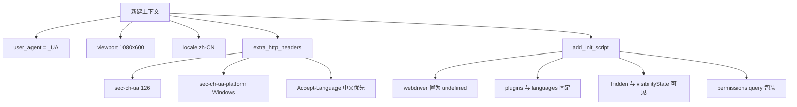
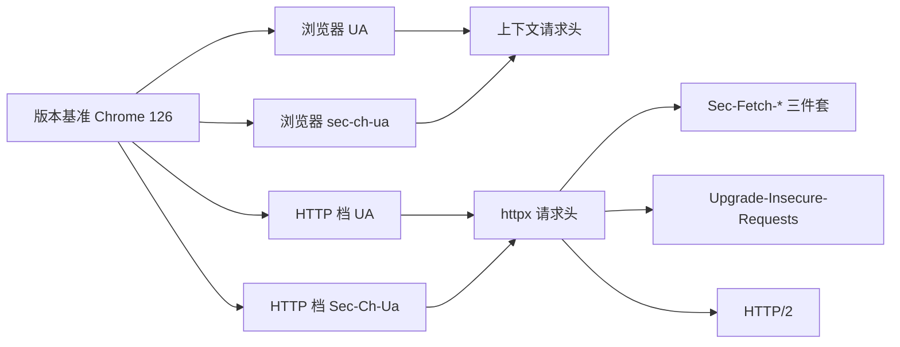

# 浏览器指纹的构成与一致性

反爬识别的是"不像人"的特征，而不是某个单一字段。缺一个头、UA 与客户端提示头版本对不上、导航器上留着 `webdriver`，任何一处都可能让页面返回 403 或一个只有导航的空壳。

`src/better_crawler/browser.py` 把这类修补集中在启动阶段，让后续每次抓取都带着同一套身份。反爬识别的另一半——蜜罐节点与假成功页面——在 02-蜜罐节点与假成功识别；这些修补的实测依据在 03-实测数据与反爬边界。这套身份拆开有五个组成部分，它们在两处实现（浏览器上下文与指纹 HTTP 客户端）之间必须保持一致。

## 1. UA 与客户端提示头必须同版本

用户代理写在模块常量里：Chrome 126 的桌面版字符串（`src/better_crawler/browser.py`）。与之配套的客户端提示头是一个单独的常量，里面同样把 Chromium 与 Google Chrome 标为 126。

模块注释直接写出理由：UA 与 `sec-ch-ua` 版本不一致会被反爬识别（`src/better_crawler/browser.py`）。这两个常量是整套指纹的基准——上下文请求头、初始化脚本与后一档的 HTTP 客户端都围绕同一个版本号展开。

升级时需要同时改多处，这也是把版本写在常量而不是散在函数里的原因。上下文级写法的好处是只配置一次：同一上下文里的所有页面共享这套身份，包括后续重试新建的页面。

## 2. 上下文级请求头

新建上下文时传入四组参数（`src/better_crawler/browser.py`）：用户代理取 `_UA`，视口 1080×600，语言 `zh-CN`，以及一组额外请求头。

额外请求头包含 `sec-ch-ua`、`sec-ch-ua-mobile`、`sec-ch-ua-platform` 与 `Accept-Language` 四项（`src/better_crawler/browser.py`）。

其中平台声明为 `"Windows"`，与 UA 里的 `Windows NT 10.0` 对应；语言偏好与上下文语言对应。这两处对应关系是"一致性"的第二个含义：不只看版本号，还要看平台与语言。脚本里没有涉及网络层或存储层，只改页面对自身环境的可见性，因此不会改变页面加载出来的内容。

## 3. 初始化脚本覆盖导航器属性

`_NAVIGATOR_OVERRIDE`（`src/better_crawler/browser.py`）是一段注入到每个页面的 JavaScript，改写七处属性：`navigator.webdriver` 返回 `undefined`，构造出 `chrome.runtime` 对象，把插件列表写成固定数组，语言写成中文优先，并把文档的 `hidden` 与 `visibilityState` 固定在可见状态。

最后一处是权限查询的包装：通知类查询直接返回当前通知权限，其余交给原函数（`src/better_crawler/browser.py`）。

注释说明这套脚本与 crawl4ai 注入的是同一份，属于通行做法（`src/better_crawler/browser.py`）。脚本通过 `add_init_script()` 挂在上下文上，对所有页面生效。

启动参数只在进程启动时生效，改动需要重启浏览器；初始化脚本与请求头则随上下文走。

## 4. 启动参数关闭自动化特征

`_LAUNCH_ARGS`（`src/better_crawler/browser.py`）有四项：关闭 `AutomationControlled` 特性，禁用 `/dev/shm` 以降低容器内的内存压力，跳过首次运行向导与默认浏览器检查。

第一项直接对应最常被检测的特征位；后三项是稳定性设置，与反爬无关但影响批量抓取的成功率。模块注释还提到 `--headless=new` 与完整 `sec-ch-ua` 是缺一不可的两样（`src/better_crawler/browser.py`），README 里也把 `--headless=new` 列为踩过的点（`README.md`）。

当前实现里启动参数列表没有这一项，无头模式通过 `launch(headless=...)` 传入（`src/better_crawler/browser.py`），依赖 Playwright 对该参数的映射；仓库把 Playwright 版本锁在 1.61.0（`README.md`），版本绑定同时也决定了这一步的实际行为。两套头的作用面不同：浏览器上下文里的头由 Chromium 补齐一部分，HTTP 档必须自己写全，因此后者的列表更长。

## 5. 两套实现的标识必须对齐

后一档的指纹 HTTP 客户端把同一组标识又写了一遍（`src/better_crawler/fetcher.py`）：UA 字符串与浏览器常量一致，`Sec-Ch-Ua` 同样标注 126，平台声明 `"Windows"`。

它额外补了浏览器上下文里由 Chromium 自动产生的三个头：`Sec-Fetch-Dest`、`Sec-Fetch-Mode` 与 `Sec-Fetch-Site`（`src/better_crawler/fetcher.py`），以及 `Upgrade-Insecure-Requests`。

客户端另外启用 HTTP/2（`src/better_crawler/fetcher.py`）。它的文档字符串把三者并列：缺 `Sec-Ch-Ua`、`Sec-Fetch-*` 或 HTTP/2 时，CSDN 这类站会概率性返回 521。也就是说 HTTP 档的指纹不只多几个头，三个条件共同成立才算完整。

把指纹做全并不保证拿到正文：如果站点用接口渲染，浏览器档还要靠重试解决骨架页，这部分属于抓取编排。

## 6. 指纹之外还有行为信号

初始化脚本与请求头之外，行为层面的信号由抓取逻辑负责：加载后模拟鼠标移动与滚轮滚动（`src/better_crawler/browser.py`），坐标与幅度取随机值。

这部分在 26-网页抓取与反爬/01-Playwright浏览器渲染 里讲过，这里只强调它与指纹的分工——指纹解决"看起来像什么"，行为信号解决"动起来像不像"。指纹的目标是让请求与页面看起来来自普通浏览器，它不改变站点的判定逻辑：站点仍然可以根据行为、频率与账号状态拦截请求。

## 7. 易错点

- 只改 UA 不改 `sec-ch-ua`。版本不一致是明确写在注释里的暴露点。
- 忘了平台与语言也要对齐。`sec-ch-ua-platform` 与 UA 平台、`Accept-Language` 与上下文语言是两组对应。
- 以为初始化脚本按页面注入即可。它挂在上下文上，注入一次对所有页面生效。
- 删掉 HTTP 档的 `Sec-Fetch-*`。文档字符串把它与 HTTP/2 并列为必要项。
- 升级 Playwright 后不核对无头行为。仓库锁定了 1.61.0，版本与浏览器 revision 强绑定。
- 认为请求头越多越好。缺 `Sec-Fetch-*` 与多一堆无关头是两个问题。
- 只在一处修指纹。浏览器档与 HTTP 档各有一份，两边都要核对。
- 期待初始化脚本能改内容。它只改页面对自身环境的可见性。排查指纹问题时的顺序是：先看 UA 与客户端提示头是否同版本，再看平台与语言是否对应，最后看 HTTP 档是否需要补齐浏览器自动生成的三个头。

## 小结

核心概念：

| 概念 | 内容 |
| --- | --- |
| 版本基准 | Chrome 126，UA 与客户端提示头共用 |
| 上下文参数 | UA、视口、语言、额外请求头 |
| 初始化脚本 | 七处导航器属性覆盖，上下文级注入 |
| 启动参数 | 关闭自动化特征与三项稳定性设置 |
| HTTP 档补齐 | `Sec-Fetch-*` 三件套、升级请求头与 HTTP/2 |
| 行为信号 | 随机鼠标移动与滚轮滚动 |

设计权衡：

| 决策 | 选择 | 收益 | 代价 |
| --- | --- | --- | --- |
| 版本集中 | 常量写死一处 | 便于核对一致性 | 升级要同步多处 |
| 脚本注入 | 上下文级 | 页面无额外成本 | 无法按页面差异化 |
| 无头模式 | 交给 Playwright 参数 | 跟随库的默认行为 | 与注释描述的开关不完全对应 |
| 双实现 | 浏览器与 HTTP 各写一份头 | 各自最优 | 容易漂移，需要人工同步 |
| 行为信号 | 随机坐标与滚动量 | 无固定轨迹 | 不解决需要点击的场景 |

指纹是否生效不容易从响应里直接看出来：反爬站的表现往往只是返回空壳或 403，需要结合内容长度与错误页特征一起判断。

## 练习

### 基础题

1. 上下文请求头里有哪四项？各自对应哪个常量或参数？
2. 初始化脚本改写了哪些导航器属性？至少列出五项。
3. HTTP 档缺少哪三样东西时 CSDN 可能返回 521？

### 挑战题

4. 两套实现各自维护一份请求头，存在漂移风险。设计一个共享常量模块的方案，并说明如何验证一致性。
5. 论证当前无头模式的实际行为与模块注释描述的关系，给出一个可验证的检查办法。

### 本页引用的路径

| 路径 | 作用 |
| --- | --- |
| `src/better_crawler/browser.py` | UA、客户端提示头、初始化脚本与启动参数 |
| `src/better_crawler/fetcher.py` | 指纹 HTTP 档的请求头与 HTTP/2 |
| `README.md` | 实测记录与版本锁定说明 |
