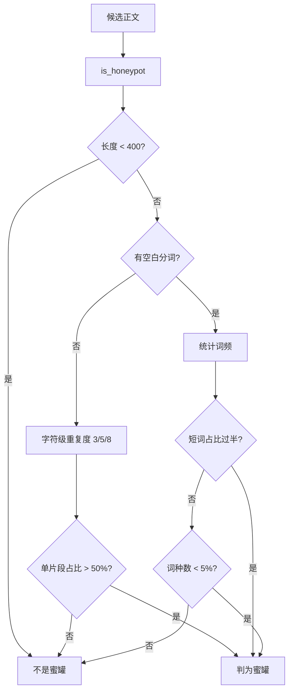
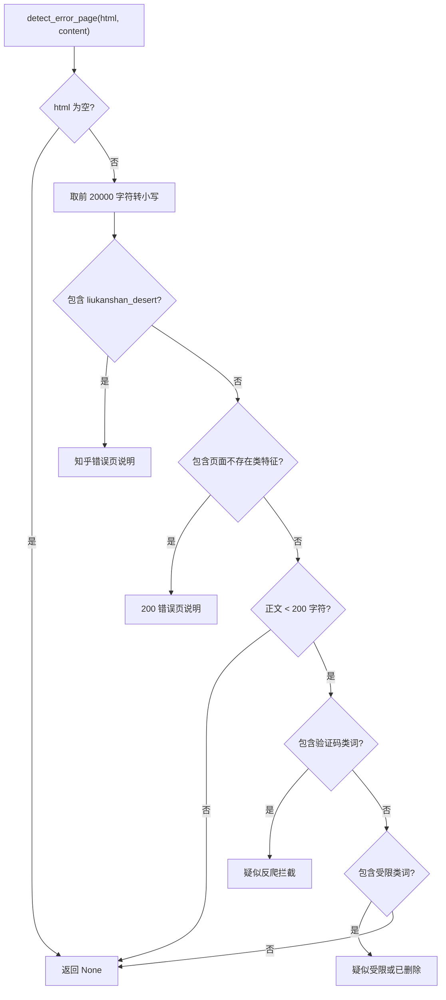

# 蜜罐节点与假成功识别

一次抓取"成功"可能有好几种错法：拿到的是一段上万字符的重复噪声、是一页以 200 状态码渲染的"内容不存在"、是一页要求验证码的拦截页、或者是一页只有导航与弹窗的骨架。

它们的共同点是长度可能达标、状态码正常，单看任何一个指标都会误判。`src/better_crawler/extract.py` 因此准备了多组判据，分别处理这些情形。

候选正文的挑选算法本身在 26-网页抓取与反爬/06-正文提取 里展开，这里只讲与反爬识别相关的判据。页面里藏的反爬特征有四类：字体蜜罐、知乎的删除标记、200 错误页、以及短文本里的验证码与受限提示；骨架页判据为什么用两个阈值，随后再说。

## 1. 字体蜜罐的形态

模块注释记录了这个现象：知乎会插入字体指纹蜜罐节点，内容像 `"mmmmlli"` 这样重复，长度能到上万字符，纯按长度挑就会选中它（`src/better_crawler/extract.py`）。

识别函数 `is_honeypot()`（`src/better_crawler/extract.py`）因此不按关键词匹配，而是按重复度判断。判据分两条路径。

文本短于 400 字符时不判定为蜜罐（`src/better_crawler/extract.py`），这是给正常短文留的余量。取前 4000 字符作为样本后先看有没有空白分词：没有空白时走字符级重复度检查，对 3、5、8 三种片段长度统计出现次数，单一片段占比超过一半即判为蜜罐。

有空白时统计词频，单个短词占比过半（`src/better_crawler/extract.py`），或去重后的词种数少于总量的 5%，同样判为蜜罐。这三处过滤的代价是重复计算：同一段文本可能被多次判断，但每次判断只取前 4000 字符，成本可接受。

## 2. 蜜罐在候选筛选里的三处过滤

蜜罐检查不在最后单独进行，它嵌在候选收集里。trafilatura 的结果先过一遍（`src/better_crawler/extract.py`）；站点选择器的候选在列表推导里统一过滤；最大文本块兜底在遍历节点时逐块检查。

三处都过滤的原因是蜜罐可能出现在任何一条候选路径上：它可能是选择器命中的节点，也可能是页面里最大的文本块。选择器路径另外处理了"只取第一个匹配"的问题——每个选择器取其所有匹配中最长的那个（`src/better_crawler/extract.py`），因为知乎页面上同一容器有多个节点，第一个可能只是摘要预览。

站点专用标记的数量随实测积累增长，它与其他特征串一起放在同一个函数里，没有单独的表结构。

## 3. 知乎的删除标记

知乎的文章不存在或已删除时会渲染一张沙漠插画（`src/better_crawler/extract.py`），页面里因此留下一个可匹配的标识 `liukanshan_desert`。

命中时返回"页面提示文章不存在或已删除（知乎错误页）"（`src/better_crawler/extract.py`）。这条判据针对单个站点，属于实测积累下来的特征；匹配范围限制在 HTML 前 20000 字符内，避免对超长页面做全量小写转换的浪费。这类页面的正文长度可能超过 200 字符，因此它必须在长度门槛之外单独判断，否则会被当成正常内容。

## 4. 200 状态码的错误页

通用规则是第二个分支：页面里出现"页面不存在""页面已删除""page not found""404 not found"等特征串时，返回"页面提示内容不存在或已被删除（服务端返回 200）"（`src/better_crawler/extract.py`）。

注释解释了这类页面的来源：站点用自己的模板渲染"页面不存在"，状态码却是 200（`src/better_crawler/extract.py`）。两类提示的措辞都来自实测页面，覆盖中文站点常见的拦截文案；英文站点主要靠 captcha 与 page not found 两条。

## 5. 短文本里的验证码与受限提示

只有正文短于长度门槛时，才继续查两类提示（`src/better_crawler/extract.py`）：出现"验证码""captcha""人机验证""安全检查"时返回"疑似被反爬拦截（要求验证码）"；出现"已删除""违规""仅作者可见""需要登录"时返回"页面疑似受限或已被删除"。

把这两类判断限制在短文本里是刻意的：一篇文章正文里出现"验证码"三个字很常见，用它来判定拦截会大量误报。函数的文档字符串也强调只在确有错误特征时返回说明，页面只是短（例如图片为主的文章）时返回 `None`，交给调用方按内容过短处理（`src/better_crawler/extract.py`）。

这两个阈值只用于判断是否重试，不参与是否成功的最终判定；重试逻辑在浏览器档内完成。

## 6. 骨架页判据的两个阈值

`looks_unrendered()`（`src/better_crawler/extract.py`）处理另一种假成功：HTML 结构不小，正文却极少。

两条判据同时成立才算骨架页——HTML 不小于 30000 字符（`src/better_crawler/extract.py`），且正文短于 1500 字符。

两个常量都定义在文件顶部（`src/better_crawler/extract.py`）。注释给出实测依据：万方检索页在接口概率性失败时 HTML 193KB 只有 727 字符，成功时 HTML 481KB 有 5720 字符；结构大小与正文量之间的反差是骨架状态的典型特征。

HTML 本身就不大的页面不参与判定，避免把正常短页面误判成骨架（`src/better_crawler/extract.py`）。判据的维护成本集中在特征串上：凡是字符串匹配都随站点改版而失效，蜜罐判据因为基于统计量而相对稳定。

## 7. 易错点

- 只用长度判断提取是否成功。蜜罐可以很长，错误页也可以不短。
- 把验证码词条判据用在长文本上。它只在正文短于 200 字符时生效。
- 改动错误页特征串后不补测试。特征串是字符串匹配，改动影响面比函数签名大。
- 认为骨架页只看正文字数。它要求 HTML 体积同时超过 30000 字符。
- 忽略最大文本块路径上的蜜罐过滤。兜底路径同样会命中蜜罐节点。
- 以为蜜罐只在知乎出现。判据是通用的重复度检查。
- 把骨架页判据当成提取失败判据。它只触发重试，不决定结果成败。
- 认为错误页判据能覆盖所有站点。它依赖固定特征串，站点改版会失效。

## 小结

核心概念：

| 概念 | 内容 |
| --- | --- |
| 蜜罐特征 | 短片段大量重复，长度可上万 |
| 蜜罐判据 | 短于 400 字符不判；字符级与词级两条重复度路径 |
| 过滤位置 | trafilatura、站点选择器、最大文本块三处 |
| 知乎标记 | `liukanshan_desert` |
| 200 错误页 | 页面不存在类特征串，命中即返回说明 |
| 短文本提示 | 验证码与受限两类，仅在正文短于 200 字符时查 |
| 骨架页 | HTML 不小于 30000 字符且正文短于 1500 字符 |

设计权衡：

| 决策 | 选择 | 收益 | 代价 |
| --- | --- | --- | --- |
| 蜜罐判据 | 按重复度而非关键词 | 不依赖具体站点文案 | 极端排版可能出现误判 |
| 错误页判据 | 特征串匹配 | 实现简单、可维护 | 站点改版即失效 |
| 短文本限制 | 仅短文本查验证码 | 大幅降低误报 | 长拦截页要靠状态码兜底 |
| 骨架页阈值 | 两个实测常量 | 判据明确 | 阈值来自单站实测，通用性有限 |
| 站点标记 | 与通用特征串同函数 | 实现集中 | 新增站点要改函数 |

## 练习

### 基础题

1. 一段 8000 字符的重复文本会被判为蜜罐吗？写出判据路径。
2. 200 状态码的错误页与状态码 404 的错误页，在结果里的错误文本有什么不同？
3. 骨架页判据的两个阈值分别是什么？

### 挑战题

4. 蜜罐判据对"重复度高的正常文本"（例如歌词或代码）可能误判。设计一个降低误报的补充判据。
5. 错误页特征串是硬编码列表。给出一个把站点特征外置为配置的方案，并说明对测试的影响。

### 本页引用的路径

| 路径 | 作用 |
| --- | --- |
| `src/better_crawler/extract.py` | 蜜罐判据、错误页识别与骨架页阈值 |
| `src/better_crawler/fetcher.py` | 调用判据的位置与失败处理 |
| `src/better_crawler/errors.py` | 状态码说明的翻译 |
