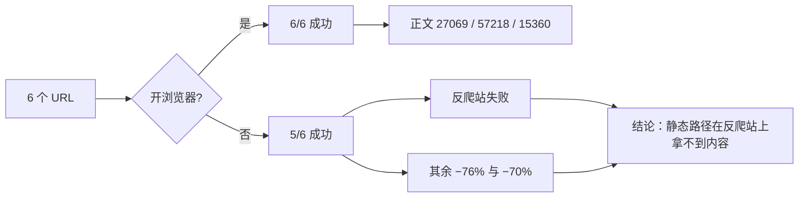
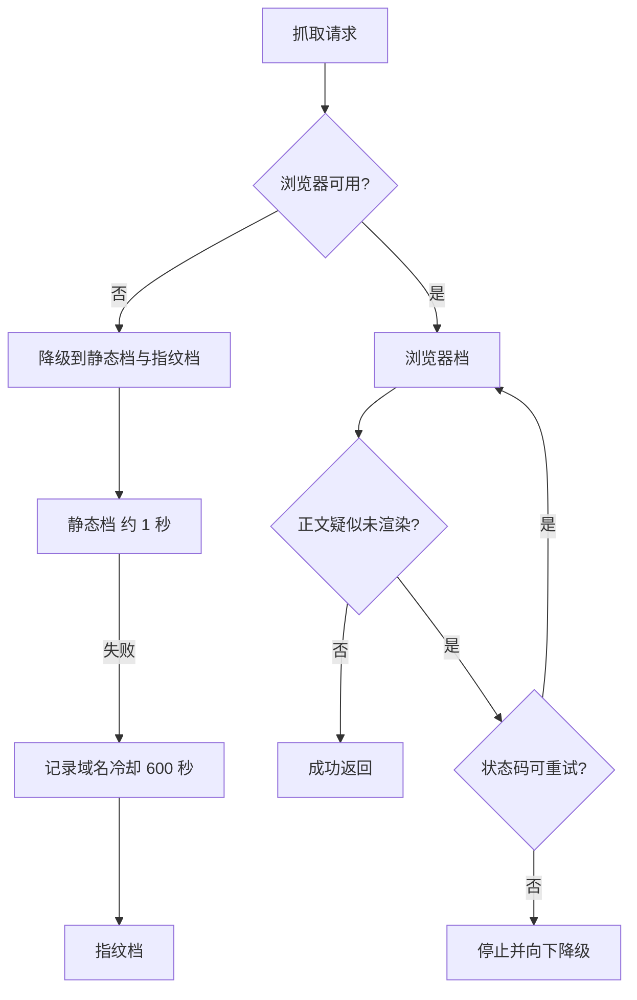

---
title: 实测数据与反爬对抗的边界
summary: 浏览器开关的对照实测给出了正文完整度的差量，反爬站的现象集中在空壳、403 与 521；实测同时说明加长等待对接口失败的骨架页无效，确定性失败不该重试，分层与单例是成本与成功率之间的折中。

tags: [反爬, 实测数据, 分层回退, 成本边界]
updated: 2026-10-07
--- 这些数字来自若干次真实抓取的记录，站点改版后需要重新采样。结论按站点分组记录，便于对照同一策略在不同站点上的效果。

# 实测数据与反爬对抗的边界

指纹修补、蜜罐识别、骨架页判据都是"看起来合理"的工程手段，但它们的效果需要数据支撑，边界也需要写清楚。`README.md` 记录了项目自己的对照实测：同一组 URL 开关浏览器各抓一遍，比较成功率与正文量；也记录了失败案例的形态，以及哪些做法被证明没用。

前两页讲的具体修补在 01-浏览器指纹的构成与一致性 与 02-蜜罐节点与假成功识别。实测结论与代码里的对应策略要放在一起读：对照数据解释为什么浏览器档是主路径，失败形态解释为什么需要重试与降级，成本记录解释为什么浏览器是单例。样本量不大，但足以说明同一套指纹在不同站点上的通过率差异很大。

## 1. 开关浏览器的对照实测

README 明确写出实验设置：同一组 6 个 URL，开浏览器与关浏览器各抓一遍，使用项目自带的 `Fetcher`，实测时间为 2026 年 9 月（`README.md:39`）。结果分成两行：

| 配置 | 成功率 | 最大正文 | 次一档正文 | 再次一档正文 |
| --- | --- | --- | --- | --- |
| 有浏览器 | 6/6 = 100% | 27069 | 57218 | 15360 |
| 无浏览器（仅静态路径） | 5/6 = 83% | 失败 | 13845（−76%） | 4627（−70%） |

表格下方的结论是：反爬站点直接失败，其他站点正文完整度也大幅下降，因为没有 JS 渲染只能拿到首屏片段（`README.md:46`）。这三列数字里有一列是"失败"，说明静态路径在反爬站上拿不到内容，而不只是内容偏少。

同页的动机表把问题分成三类：JS 渲染导致返回只有导航与页脚的空壳；反爬拦截表现为知乎返回 403、CSDN 返回 521；提取退化表现为页面上有内容、提取出来却是零散片段（`README.md:31`、`:32`）。三条分别对应后文的不同策略——渲染、指纹、多候选提取。

## 2. 已实测通过的站点与耗时

README 列出已经实测可抓取的站点类型：知乎专栏、CSDN、博客园、掘金、豆瓣读书、少数派、腾讯云社区，以及 React 与 Python 官方文档；浏览器暖启动后单页耗时 2 到 5 秒（`README.md:50`）。

这条记录同时说明了成本量级：浏览器档是秒级，静态档约 1 秒，两者差着数倍（`README.md:217`）。四类实测现象与代码对策的对应关系如下。

| 现象 | 实测表现 | 对应策略 |
| --- | --- | --- |
| JS 渲染 | 只有导航与页脚的空壳 | 浏览器档渲染 |
| 反爬拦截 | 知乎 403、CSDN 521 | 完整客户端提示头与 HTTP/2 |
| 提取退化 | 有内容但提取成零散片段 | 多候选提取与蜜罐过滤 |
| 骨架页 | HTML 193KB 仅 727 字符 | 重试而不是加长等待 |

站点清单的价值在于给分层顺序提供依据：清单里既有反爬站也有静态文档站，前者必须走浏览器，后者可以走静态档。分层顺序按实测收益排，而不是按实现难度排（`README.md:211`）。

## 3. 加长等待为什么解决不了骨架页

README 记录了一个反例：万方检索页在接口概率性失败时，加长等待时间没有用，实测等 5 秒照样失败，因为问题出在接口这一次没返回数据，而不在渲染速度（`README.md:236`）。

这条实测直接对应提取层的一对阈值——HTML 结构不小、正文极少即判定为骨架页（`src/better_crawler/extract.py:29`）。结论是改用重试而不是加长等待：接口失败是概率性的，重试有机会拿到完整的接口响应，而等待只会让同一次失败拖得更久。

浏览器档的重试循环因此设置默认 2 次（`src/better_crawler/fetcher.py:107`），并且只在疑似未渲染或服务端临时故障时重试。

## 4. 确定性失败不重试

README 把"确定性失败不重试"单列一条：404、403 这类状态码重试只会浪费时间（`README.md:241`）。代码里的对应实现是 `_worth_retrying()`：5xx 与 429 返回真，其余 400 以上返回假（`src/better_crawler/fetcher.py:90`、`:92`）。

这两条实测与判据互为解释：加长等待无效说明"慢"不是原因，确定性失败不重试说明"再试一次"也不是万能的。抓取策略的取舍点因此落在"这次失败是不是概率性的"上。

## 5. 成本边界与降级路径

README 的成本记录列出两条关键实现：单例浏览器加信号量，原因是每 URL 起一个 Chromium 会迅速吃满内存；骨架页重试，原因是内容靠异步接口填充的站点会概率性停在空壳状态（`README.md:260`、`:265`）。

`--headless=new` 也被列为踩过的点，缺了它部分站点只返回空壳（`README.md:267`）。降级路径同样有明确记录：浏览器不可用时自动降级为后两层，状态查询接口会给出原因（`README.md:223`）。

分层顺序与静态档约 1 秒、反爬站记录失败域名并在 10 分钟内跳过该层的说明写在同一节（`README.md:217`）——这正是代码里 600 秒冷却常量的来源。

## 6. 实测数据的适用范围

对照实验只有 6 个 URL，站点清单也是有限集合，因此这些数字说明的是方向而不是普遍比例：浏览器路径在反爬站上不可替代，静态路径在文档站上足够快。把它当成"浏览器一定更好"会误读——静态站的 1 秒与浏览器的 2 到 5 秒之间是数倍差距，分层顺序正是为了保住这部分收益。

同理，万方那条骨架页实测只覆盖一个站点，1500 字符与 30000 字符两个阈值因此需要随新站点复核。记住每条现象后面跟的策略，比记住数字更有用：看到空壳先怀疑渲染，看到 403 或 521 先核对指纹与 HTTP/2，看到正文零散先怀疑提取退化，看到结构大而正文少就交给重试。

排障顺序也可以照着这张表走：先看 `tier` 字段确认命中哪一档，再看 `status` 区分页面问题与拦截问题，最后看 `attempts` 里每轮的失败说明。

三样信息合起来通常能定位到具体哪一环没生效。需要提醒的是，这些策略都有代价：浏览器档最慢，重试会成倍拉长最坏耗时，指纹头要随版本维护。分层顺序的作用正是在成功率与耗时之间取得平衡，而不是为了把成功率推到 100%。

## 7. 易错点

- 把 6/6 与 5/6 当成所有站点的成功率。样本只有 6 个 URL。
- 用加长等待替代重试。实测等 5 秒仍然失败。
- 对所有失败都重试。404 与 403 属于确定性失败。
- 忽略降级路径的存在。浏览器不可用时后两层仍能工作。
- 把实测阈值当成通用常量。两个骨架页阈值来自单站数据。
- 只看成功率不看正文量。对照表里两者的差距同样重要。

## 小结

核心概念：

| 概念 | 内容 |
| --- | --- |
| 对照实测 | 6 个 URL，有浏览器 6/6，无浏览器 5/6 |
| 正文差量 | 无浏览器时其余站点 −76% 与 −70% |
| 典型现象 | 空壳、403、521、提取退化为零散片段 |
| 耗时量级 | 静态档约 1 秒，浏览器档 2 到 5 秒 |
| 反例 | 骨架页加长等待无效，应重试 |
| 成本约束 | 单例浏览器加信号量 |

设计权衡：

| 决策 | 选择 | 收益 | 代价 |
| --- | --- | --- | --- |
| 主路径 | 浏览器优先 | 反爬站可抓 | 秒级耗时 |
| 失败处理 | 骨架页重试 | 覆盖概率性接口失败 | 最坏耗时成倍 |
| 确定性失败 | 不重试不降级 | 省时 | 放弃极小概率的成功 |
| 冷却 | 域名级 600 秒 | 省掉反复试错 | 站点恢复后仍被跳过 |

## 练习

### 基础题

1. 对照实测里"无浏览器"一行的成功率是多少？失败的那一列说明了什么？
2. 万方骨架页为什么加长等待无效？代码里的替代做法是什么？
3. 浏览器不可用时请求会走哪两层？

### 挑战题

4. 样本只有 6 个 URL。设计一个可复现的对照实验方案，说明样本分层与指标选择。
5. 骨架页两个阈值来自单站实测。给出一个用多站点数据校准阈值的方法。

### 本页引用的路径

| 路径 | 作用 |
| --- | --- |
| `README.md` | 对照实测、站点清单与成本记录 |
| `src/better_crawler/fetcher.py` | 重试判据与分层实现 |
| `src/better_crawler/extract.py` | 骨架页阈值与注释里的实测依据 |
