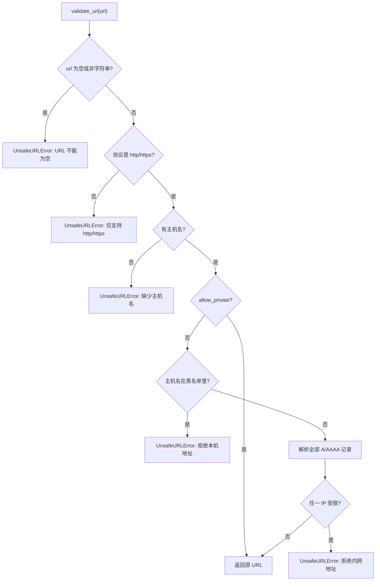
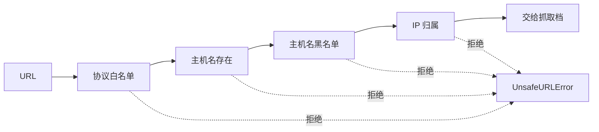

# 只放行公网 HTTP 的四道校验

一个能把任意 URL 变成正文的工具，等于把"发一个 HTTP 请求"的能力交给了调用方。如果调用方是模型或一段外部输入，那么 `http://169.254.169.254/latest/meta-data/` 这种地址就可能被塞进来：它指向云厂商的元数据服务，响应里通常带着实例凭证与配置。抓取层因此不把 URL 当普通字符串参数，而是当不可信输入先过一遍校验。

校验集中在一个函数里，入口是 `validate_url()`（`src/better_crawler/safety.py:71`）。抓取的第一步就调用它（`src/better_crawler/fetcher.py:135`），失败时把异常转成结果里的错误说明（`src/better_crawler/fetcher.py:137`），不会带着可疑地址继续往下走。以下按执行顺序说明四道闸，以及每道闸挡的是什么。

## 1. 第一道：协议白名单

只允许 `http` 与 `https` 两种协议（`src/better_crawler/safety.py:14`）。不在名单里就直接抛错，错误信息带上收到的协议名，空协议显示为 `(空)`（`src/better_crawler/safety.py:82`）。这道闸挡的是 `file://` 与 `raw://` 这类能读本地文件的协议。它们不经过 HTTP 栈，却能拿到磁盘内容，是"抓网页"工具最容易被误用的入口。

自检脚本把 `file:///etc/passwd` 放进应拒绝的用例（`scripts/selfcheck.py:75`），单元测试另外覆盖了 ftp 与 gopher（`tests/test_core.py:33`）。

## 2. 第二道：主机名不能为空

协议过了之后，URL 必须带主机名，否则同样拒绝（`src/better_crawler/safety.py:87`）。空串、只有协议头的 `http://` 都在这一关被挡下，测试用例的最后两项就是它们（`tests/test_core.py:35`）。这一道看起来只是防手误，实际作用是保证后面两步有东西可查：没有主机名就没有 DNS 解析结果，IP 归属判定无从谈起。

## 3. 第三道：主机名黑名单

四个主机名直接拒绝，不看解析结果：`localhost`、`localhost.localdomain`、`metadata.google.internal` 与 `metadata`（`src/better_crawler/safety.py:17` 至 `:24`）。错误信息写成"拒绝访问本机地址"并带上原始主机名（`src/better_crawler/safety.py:93`）。

把它们排在解析之前，可以避开一类绕过：把 `localhost` 指向外部地址（或反过来）都改变不了这一关的结论。自检里的 `http://127.0.0.1:8000/x` 与单元测试里的 `http://localhost:8000/`（`tests/test_core.py:26`）分别覆盖 IP 直写与主机名两种写法。黑名单只有四项，覆盖的是最常见的两种写法：本机调试常用的 `localhost` 系列，以及云环境里指向凭证服务的 metadata 主机名。拦截的主力是第四道，因为它直接看域名最终落在哪个地址段。

## 4. 第四道：解析出的地址归属

主机名不在黑名单里，还要看它解析到哪：先取出全部地址，逐个判断，任何一个命中受限范围就抛错（`src/better_crawler/safety.py:96` 至 `:100`）。解析时带上端口，缺省按协议选 443 或 80（`src/better_crawler/safety.py:95`）；错误信息里保留域名与命中的 IP，便于判断是域名本身有问题还是解析被污染（`src/better_crawler/safety.py:98`）。

判断一个地址是否受限的规则在 02-解析出的 IP 怎么判风险 里展开，那里也解释了为什么 IPv6 映射地址要再按 IPv4 判一次。

四道闸的顺序是固定的，前一道不过就不会进入后一道：

## 5. 默认拒绝与放行开关

模块导入时读一次环境变量 `BETTER_CRAWLER_ALLOW_PRIVATE`，只认 `1`、`true`、`yes`、`on` 四种写法（`src/better_crawler/safety.py:26` 至 `:31`）。开关打开时，函数在协议与主机名检查之后直接返回原 URL（`src/better_crawler/safety.py:90`），后面的黑名单与 IP 判定都不执行。

默认值是不打开，因此"拒绝私网"是默认行为，"允许私网"要显式设置。README 把这条写成配置项，并注明只用于本地调试（`README.md:281`）；状态接口也会把当前取值报出来（`src/better_crawler/mcp_server.py:129`），排查"为什么本地地址连不上"时先看它。开关在模块导入时读取一次，因此进程内改环境变量不会立刻生效，需要重启服务或重新导入模块。

## 6. 错误类型只有一种

所有拒绝都抛 `UnsafeURLError`，它是 `ValueError` 的子类（`src/better_crawler/safety.py:34`）。抓取层只捕获这一个类型，转成结果对象里的错误说明后返回（`src/better_crawler/fetcher.py:137`），调用方拿到的是一条失败结果，而不是一个未处理的异常。用同一个类型的好处是调用方不必区分"协议不对"和"地址不对"：两种情况的下一步动作一样，都是换 URL。

需要区分时看错误文本即可，文本里保留了具体原因。失败结果里除了错误说明，还保留这次尝试的记录。校验失败发生在任何档位尝试之前，所以 `attempts` 是空的，这一点可以用来区分「地址被拒」与「地址能访问但抓不到内容」。

## 7. 校验挡不住的部分

校验发生在请求之前，只看 URL 本身。两类情况它管不到：一是解析结果可能在校验之后、实际发请求之前发生变化（同一域名两次解析可以给出不同地址）；二是重定向之后的新地址不会再过一次校验，而指纹 HTTP 档跟随重定向（`src/better_crawler/fetcher.py:401`），浏览器档的跳转由页面自己发。这两点属于残留风险，03-放行开关与残余风险 里一并说明。把这两点写清楚，是为了避免高估这道闸：看到「已校验」就认为整条请求链路都安全，与它的实际覆盖范围不符。

## 8. 拒绝用例对照

自检与单元测试里的用例可以按触发的闸分组，改校验逻辑时照这张表核对：

| 用例 | 触发的闸 | 期望 |
| --- | --- | --- |
| `file:///etc/passwd` | 协议白名单 | 拒绝 |
| `ftp://example.com/x` | 协议白名单 | 拒绝 |
| `http://` | 主机名存在性 | 拒绝 |
| `http://localhost:8000/` | 主机名黑名单 | 拒绝 |
| `http://127.0.0.1/admin` | IP 归属（回环） | 拒绝 |
| `http://169.254.169.254/latest/meta-data/` | IP 归属（链路本地） | 拒绝 |
| `https://example.com/x` | 全部通过 | 放行且返回原串 |

这张表也说明了放行用例为什么只有三条：能通过四道闸的地址必须同时满足「http/https + 有主机名 + 不在黑名单 + 解析到公网」，可用例只需要覆盖正常公网地址这一种形态。

## 9. 易错点

- 以为黑名单排在解析之后。它在解析之前，因此与 DNS 结果无关。
- 把开关理解成"只放开 IP 判定"。打开后主机名黑名单也一样不执行。
- 用 `!= "0"` 之类的方式判断开关。实现只认四种真值写法。
- 认为校验能覆盖重定向后的地址。只校验了调用方传入的那一个 URL。
- 在异常处理里只接 `ValueError` 之外的类型。所有拒绝都统一成 `UnsafeURLError`。
- 以为放行用例要覆盖各种形态。通过四道闸的形态只有一种。
- 改了校验顺序却不更新用例表。用例是按闸分组的，顺序变了分组也会变。

## 小结

核心概念：

| 概念 | 内容 |
| --- | --- |
| 协议白名单 | 仅 http 与 https |
| 主机名检查 | 必须存在 |
| 主机名黑名单 | localhost 与云元数据主机名，解析前判定 |
| IP 归属判定 | 解析全部地址，任一受限即拒绝 |
| 默认行为 | 拒绝私网与保留地址 |
| 放行开关 | `BETTER_CRAWLER_ALLOW_PRIVATE`，四种真值 |
| 统一异常 | `UnsafeURLError`，`ValueError` 子类 |

设计权衡：

| 决策 | 选择 | 收益 | 代价 |
| --- | --- | --- | --- |
| 默认策略 | 默认拒绝 | 误配置时也不会发出内网请求 | 本地调试必须显式开开关 |
| 判定时机 | 请求前集中校验 | 一处维护，覆盖所有抓取档 | 覆盖不到重定向与二次解析 |
| 异常类型 | 单一类型 | 调用方处理简单 | 细分原因要看文本 |
| 开关粒度 | 全局环境变量 | 实现简单、状态可查 | 无法按域名白名单开口子 |
| 拒绝粒度 | 任一地址命中即拒 | 不给多记录留缝隙 | 双栈域名可能被单条记录拖累 |

## 练习

### 基础题

1. 写出四道校验的顺序，并说明哪一道不依赖 DNS。
2. `http://` 与空串分别在哪一步被拒绝？
3. 开关打开后，主机名黑名单还会执行吗？依据是哪几行代码？

### 挑战题

4. 为本地调试加一份"按域名放行"的白名单，说明它与现有开关的关系，以及如何避免白名单自身被滥用。
5. 设计一个能覆盖"重定向后地址"的校验方案，说明在浏览器档与 HTTP 档分别要接在哪里。

### 附：本页引用的路径

| 路径 | 作用 |
| --- | --- |
| `src/better_crawler/safety.py` | 校验实现与默认拒绝策略 |
| `src/better_crawler/fetcher.py` | 调用点与错误转换 |
| `src/better_crawler/mcp_server.py` | 状态接口暴露开关取值 |
| `scripts/selfcheck.py` | 自检拒绝用例 |
| `tests/test_core.py` | 单元测试拒绝与放行用例 |
