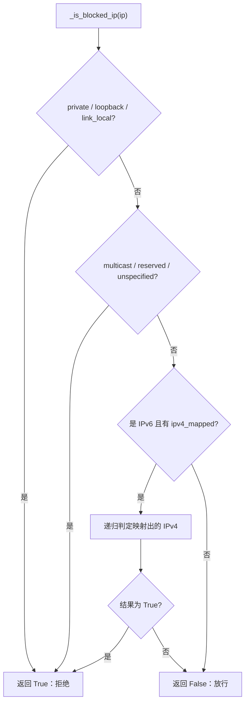
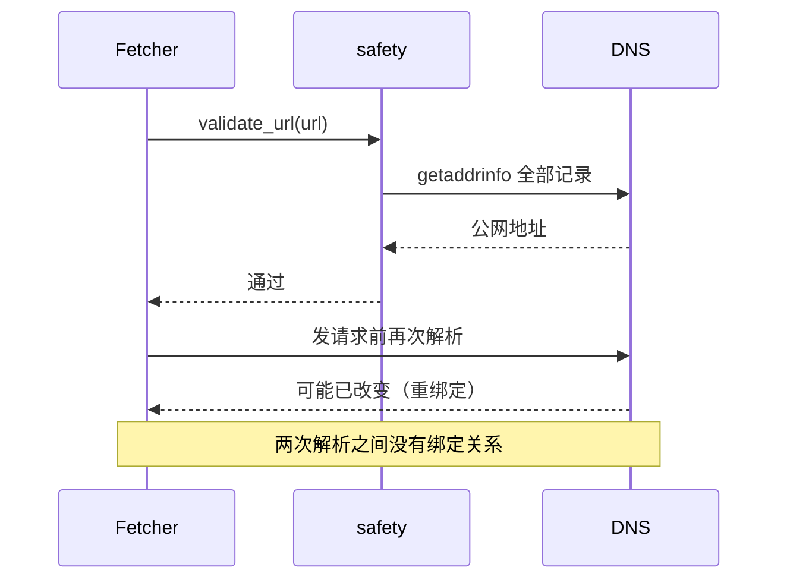

# 解析出的 IP 怎么判风险

`http://192.168.1.1/` 这种地址一眼就能看出不该访问，但真实的输入不会写得这么直白：一个看起来正常的域名，A 记录可以指向 `10.0.0.5`；一个 IPv6 地址可以写成 `::ffff.0.0.1`，把回环地址藏在映射格式里。

只看 URL 文本挡不住这些写法，必须先把域名解析成地址，再按地址的归属判断。判定因此分成两步：解析出一组地址，逐个判断是否落在受限范围。两步分别在 `_resolve_ips()`（`src/better_crawler/safety.py`）与 `_is_blocked_ip()`里实现。四道校验的整体顺序在 01-只放行公网HTTP的四道校验。

## 1. 一次解析取出全部地址

解析用 `socket.getaddrinfo()`，并把协议限定为 TCP（`src/better_crawler/safety.py`）。它返回该域名全部 A 与 AAAA 记录，而不是只看第一条。

只看第一条会留下一个缺口：同一个域名可以同时返回公网地址与内网地址，先返回哪条由解析器决定。全部取出再逐个判断，才不会因为顺序不同给出不同的结论。解析这一步拿到的结果直接决定后面还有没有可判的东西，所以它的失败处理与「地址不合格」同等重要。

## 2. 解析失败与空结果都算拒绝

解析抛 `socket.gaierror` 时转成 `UnsafeURLError`，信息是「域名无法解析」（`src/better_crawler/safety.py`）。

解析成功但没有任何地址能转成 IP 对象时，同样抛这个错（`src/better_crawler/safety.py`）。两种情况都按拒绝处理，理由是它们无法证明目标是公网地址。这与「默认拒绝」的整体策略一致：拿不准就不放。

## 3. 链路本地地址的 scope id 要先削掉

链路本地 IPv6 地址形如 `fe80:%eth0`，`%` 后面是网卡标识。这个写法直接交给 `ipaddress.ip_address()` 会解析失败，因此实现先按 `%` 切一次取前半段（`src/better_crawler/safety.py`）。

去掉之后再尝试构造 IP 对象，仍失败就跳过这条记录（`src/better_crawler/safety.py`）。跳过的记录不参与判定，因此如果一组地址里其余记录都合法，校验结果仍按那些记录给出。这六类之外还有一类容易漏掉：运营商级别的特殊用途段。它们多数落在 reserved 里，因此这条判据顺带覆盖了一部分。

## 4. 六类受限范围

判定按 IP 对象的属性归类，前三类先判：私网（`is_private`）、回环（`is_loopback`）、链路本地（`is_link_local`）（`src/better_crawler/safety.py`）；后三类后判：组播（`is_multicast`）、保留（`is_reserved`）、未指定（`is_unspecified`）。

任何一类命中即返回真。这六类合起来覆盖了内网段、本机、自动配置地址、组播地址与保留段。其中未指定地址指 `0.0.0.0` 与 `::`，它们在部分系统上会被解释为「本机」，因此单独列一类。递归只有一层就够：映射出的对象一定是 IPv4，不会再次进入映射分支。

## 5. IPv4 映射地址要按 IPv4 再判一次

`::ffff.0.0.1` 在 Python 里是一个 IPv6 对象，但它的回环属性为假——回环的语义在被映射的那个 IPv4 地址上。实现因此检查 `ipv4_mapped` 字段，非空时递归调用判定函数（`src/better_crawler/safety.py`），把结论交给 IPv4 规则。

没有这一步，`::ffff.0.0.1` 会以「既不是私网也不是回环」的身份通过校验。注释把这条单独写出来，说明它是实际遇到过的绕过写法（`src/better_crawler/safety.py`）。

如果同一个域名在不同端口上解析到不同地址（少见但协议允许），校验用的端口与请求用的端口必须一致，否则两次解析的目标并不相同。

## 6. 端口会参与解析

解析时把端口一起传进去：`parsed.port` 有值时用它，缺省时按协议选 443 或 80（`src/better_crawler/safety.py`）。

端口影响的是 `getaddrinfo()` 的查询参数，对普通 A/AAAA 记录来说结论一样，但保持完整输入更接近真实请求的解析条件。

## 7. 判定与请求之间的时间差

校验里解析出的地址，与实际发请求时解析出的地址可能不同。两次解析之间可能隔了几百毫秒，域名所有者可以通过极短的 TTL 让第二次解析指向内网——这类做法通常叫 DNS 重绑定。

当前实现没有把校验时解析到的地址固定下来传给请求，因此这个时间差是残留风险。要堵住它，需要在发出请求时复用同一份解析结果，或者在校验之后按地址直连并带上 Host 头；这两条都会改变抓取层的实现，属于 03-放行开关与残余风险 里讨论的边界。

判定结果只有两种：拒绝与放行。表里几类输入的结论可以对照着看。

| 输入 | 走到哪一步 | 结论 |
| --- | --- | --- |
| `https://example.com` 解析到 `93.184.216.34` | 六类都不命中 | 放行 |
| 域名解析到 `192.168.1.1` | 私网命中 | 拒绝 |
| 域名解析到 `127.0.0.1` | 回环命中 | 拒绝 |
| 域名解析到 `169.254.169.254` | 链路本地命中 | 拒绝 |
| 域名解析到 `::ffff.0.0.1` | 映射后递归命中私网 | 拒绝 |
| 域名解析失败 | 抛 `gaierror` 即转错 | 拒绝 |

## 9. 易错点

- 只看第一条解析结果。同一域名可能同时返回公网与内网地址。
- 把链路本地地址的 `%` 当成非法输入，直接放弃整组记录。实现只跳过这一条。
- 认为 IPv6 地址的自身属性足够判定。映射地址要回到 IPv4 规则。
- 把「解析失败」当成「可以再试」。当前实现直接拒绝。
- 忽略校验与请求之间的二次解析。这是已知的残留风险。
- 认为映射地址会被自动识别。属性判定不看映射关系。
- 把解析失败当成可以通过的中间状态。失败即拒绝。

## 小结

核心概念：

| 概念 | 内容 |
| --- | --- |
| 解析范围 | 全部 A 与 AAAA 记录，限定 TCP |
| 解析失败 | 转成 `UnsafeURLError`，按拒绝处理 |
| scope id | 链路本地地址去掉 `%` 后再解析 |
| 六类受限 | 私网、回环、链路本地、组播、保留、未指定 |
| 映射地址 | `ipv4_mapped` 非空时递归按 IPv4 判定 |
| 端口 | 缺省 443 或 80，参与解析参数 |

设计权衡：

| 决策 | 选择 | 收益 | 代价 |
| --- | --- | --- | --- |
| 解析全部记录 | 任一命中即拒 | 不看解析顺序 | 双栈域名可能被单条记录拖累 |
| 解析失败处理 | 直接拒绝 | 不给「先放过去」的空间 | 临时 DNS 故障也会拒绝 |
| 跳过非法记录 | 逐条尝试 | 单条坏记录不影响整组 | 可能少判一条 |
| 映射地址 | 递归回 IPv4 规则 | 堵住绕过写法 | 判定逻辑多一层 |
| 端口 | 与请求保持同源输入 | 解析条件一致 | 端口非法时提前报错 |

## 练习

### 基础题

1. 为什么解析要取全部记录而不是第一条？
2. `fe80:%eth0` 在解析阶段要做什么处理？为什么？
3. `::ffff.168.1.1` 会被拒绝吗？沿哪条规则走？

### 挑战题

4. 设计一个把校验结果与请求解析绑定的方案，说明它在浏览器档与 HTTP 档分别怎么接。
5. 解析失败即拒绝会带来误伤（临时 DNS 故障）。给出一个既保留默认拒绝、又能区分「域名本身不可用」与「解析服务抖动」的方案。

### 附：本页引用的路径

| 路径 | 作用 |
| --- | --- |
| `src/better_crawler/safety.py` | 解析与 IP 判定实现 |
| `src/better_crawler/fetcher.py` | 调用点与错误转换 |
| `tests/test_core.py` | 内网与元数据地址的拒绝用例 |
