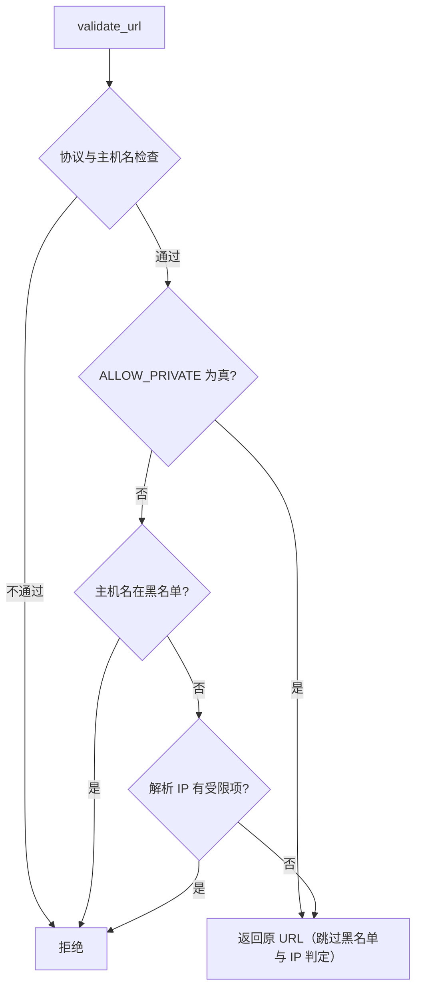
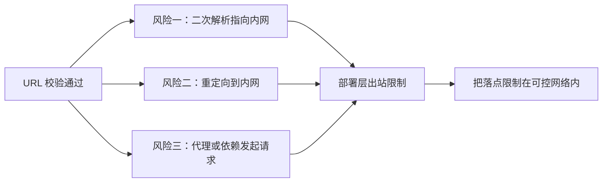

# 放行开关与残余风险

本地开发时最常见的需求是抓自己机器上的页面，比如 `http://127.0.0.1/docs`。默认策略会直接拒绝这个地址，因为它解析到回环段。这类需求靠改代码不合适，于是实现留了一个环境变量开关：打开它，私网限制整体让路。

开关的方便之处也是它的风险所在。打开之后，任何调用方都能让服务去请求内网地址，包括云厂商的元数据服务；README 对这个工具的定性正是「抓任意 URL 等于把本地网络请求能力交出去」，并注明只在可信环境启用（`README.md`）。下面说明开关具体放行到哪一层，以及即使关着开关也存在的三类残留风险。

## 1. 开关的读取方式

环境变量 `BETTER_CRAWLER_ALLOW_PRIVATE` 在模块导入时读一次，只把 `1`、`true`、`yes`、`on` 四种写法当成真（`src/better_crawler/safety.py`），其余取值（包括 `0`、空串与未设置）都按关闭处理。

读取时机决定了一个使用细节：进程启动后再改环境变量不会生效，因为模块已经导入。要切换状态就得重启服务，或者重新加载模块。开关的粒度是进程级的：一旦打开，所有请求都按放行处理，没有「只放开这一台」或「只放开这个域名」的中间档。需要更细的粒度就得改实现。

## 2. 它跳过的到底是哪几步

开关的判断位置在协议与主机名检查之后（`src/better_crawler/safety.py`），命中时直接返回原 URL。此时执行过的只有两项：协议必须在白名单里，URL 必须带主机名。

后面的主机名黑名单与解析 IP 判定都不再执行。这意味着「允许私网」的实际含义比字面更宽：`localhost` 与 `metadata` 这类主机名也一并放行。把开关理解成「只放宽 IP 段限制」会低估它的作用范围。

默认值与「拒绝优先」的判定顺序配合起来，形成的是先拦后放的结构：不配置任何东西时最严格，放开需要一次显式动作。

## 3. 为什么默认关闭

默认关闭对应一条安全设计常识：能被外部输入影响的网络请求，默认只允许访问公网。内网地址本身并不危险，问题在于服务运行的位置往往比调用方更靠内——同一台机器上可能跑着数据库、管理后台与云厂商的元数据端点（`README.md`）。

README 把三类拒绝写在安全一节：非 http/https 协议、回环与内网地址、云元数据地址（`README.md`）。默认关闭让这些规则在所有部署里都生效，只有明确知道自己在干什么时才需要打开。

状态接口只报告取值，不判断它是否合理。看到 `allow_private=1` 出现在生产环境里，应当当成一个需要解释的配置。

## 4. 状态接口会报告当前取值

状态查询接口会把开关的原始取值放进返回字段 `allow_private`（`src/better_crawler/mcp_server.py`）。它读的是同一个环境变量，因此能直接反映进程启动时的配置。

排查「为什么本地地址抓不到」时先看这个字段：为 `0` 说明是策略拦下的，此时错误说明里会带「拒绝访问内网地址」或「拒绝访问本机地址」；为 `1` 却仍失败，问题就在网络或端口上，与安全策略无关。

重绑定之所以有效，是因为校验与请求之间隔了一次独立的解析，而这两次解析之间没有任何绑定关系。域名所有者控制的只是自己的解析记录。

## 5. 残留风险一：解析结果会变

校验阶段解析出的地址，与实际发请求时解析出的地址是两次独立查询。域名所有者可以把 TTL 设得很短，让第一次解析返回公网地址、第二次返回内网地址，从而穿过校验。

这类手法通常叫 DNS 重绑定。当前实现没有把校验用的地址固定下来传给请求，因此这条风险存在。可行的收口方式是把解析结果缓存下来，在请求时复用（按 IP 直连并带上 Host 头），或者在部署层禁止这类解析变化。

这类绕过的前提是攻击者能控制一个已通过校验的公网地址的重定向目标。对普通站点来说这不容易做到，因此它的现实风险低于重绑定。

## 6. 残留风险二：重定向之后不再校验

校验只看调用方传入的 URL。请求发出后如果发生重定向，新地址不会再过一次 `validate_url()`。指纹 HTTP 档跟随重定向（`src/better_crawler/fetcher.py`），浏览器档的跳转则由页面自己发起，两者都不回到校验入口。

一个公网地址重定向到 `http://192.168.1.1/` 的场景因此不会被拦下。堵住它需要在每一跳之后重新校验，或者干脆关闭自动重定向、在应用层逐跳处理。

把三类风险列出来不是为了否定校验的作用：它挡住了最常见的直写地址与简单域名指向，属于性价比很高的一层。需要补的是它刻意不覆盖的部分。

## 7. 残留风险三：策略之外的通路

这套校验只管抓取入口这一条路。同一个进程如果还暴露了别的网络功能，或者依赖本身会向外部发请求，那些通路不在校验范围内。代理设置是一个具体例子：请求走上游代理时，目标地址由代理解析，本地校验只能看到 URL 文本。

这三类风险的共同点是：校验在「URL 文本 + 本地解析」这一层做判断，而真实请求的落点由后续环节决定。它们无法靠改 `safety.py` 完全消除，只能靠部署环境补：容器网络策略限制出站、把服务放在不允许访问内网的位置、或者对代理配置单独审计。

部署层能补的做法通常有三种：

| 做法 | 做什么 | 覆盖哪类风险 |
| --- | --- | --- |
| 出站网络策略 | 只允许容器访问公网网段 | 二次解析与重定向 |
| 网络位置隔离 | 把服务放在访问不到内网的位置 | 三类全部 |
| 代理配置审计 | 明确代理能到达哪些地址 | 代理通路 |

这三种做法的前提都是知道服务会被谁调用。如果调用方本身就不可信，最省事的办法是不打开开关，同时不要把内网服务暴露在同一网络里。

## 9. 易错点

- 把开关理解成只放开 IP 判定。主机名黑名单也一并跳过。
- 运行时改环境变量期待立刻生效。模块只在导入时读一次。
- 认为校验覆盖整个请求链路。它只看传入的 URL 与本地解析结果。
- 忽略重定向。跟随重定向的两个档位都不会重新校验。
- 以为打开开关只影响本地开发。它对所有调用方生效。
- 看到 `allow_private=1` 不追问来源。它应当是本地调试的临时状态。
- 认为部署层与代码校验二选一。两层覆盖的范围不同。

## 小结

核心概念：

| 概念 | 内容 |
| --- | --- |
| 开关名 | `BETTER_CRAWLER_ALLOW_PRIVATE` |
| 真值写法 | `1`、`true`、`yes`、`on` |
| 读取时机 | 模块导入时一次 |
| 跳过范围 | 主机名黑名单与 IP 判定 |
| 保留检查 | 协议白名单与主机名存在性 |
| 状态字段 | `allow_private` |
| 残留风险 | 二次解析、重定向、代理与依赖通路 |

设计权衡：

| 决策 | 选择 | 收益 | 代价 |
| --- | --- | --- | --- |
| 开关形态 | 全局环境变量 | 配置简单、默认安全 | 粒度粗，无法按域名开口子 |
| 读取时机 | 导入时一次 | 行为稳定 | 切换需重启 |
| 校验位置 | 请求前的 URL 层 | 一处实现、覆盖所有档位 | 覆盖不到落点变化 |
| 风险收口 | 交给部署层 | 不改抓取代码 | 依赖部署方是否配置 |
| 开关粒度 | 进程级 | 语义简单、状态可查 | 无法按域名放行 |

## 练习

### 基础题

1. 开关打开后，哪两项检查仍然执行？
2. `BETTER_CRAWLER_ALLOW_PRIVATE=TRUE` 会生效吗？说明判断依据。
3. 状态接口的哪个字段能反映开关取值？

### 挑战题

4. 给出一个按域名白名单放行私网的方案，说明它如何缩小开关的影响面。
5. 针对 DNS 重绑定，设计一个把校验结果与请求绑定起来的最小改动，并说明它对浏览器档是否可行。

### 附：本页引用的路径

| 路径 | 作用 |
| --- | --- |
| `src/better_crawler/safety.py` | 开关读取与跳过位置 |
| `src/better_crawler/fetcher.py` | 调用点与重定向设置 |
| `src/better_crawler/mcp_server.py` | 状态接口报告取值 |
| `README.md` | 安全策略与启用前提说明 |
