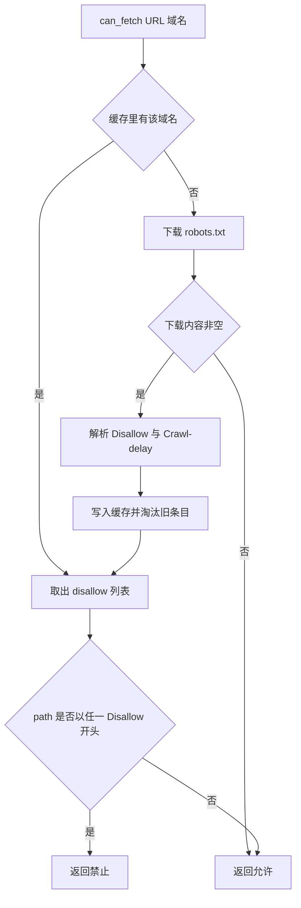
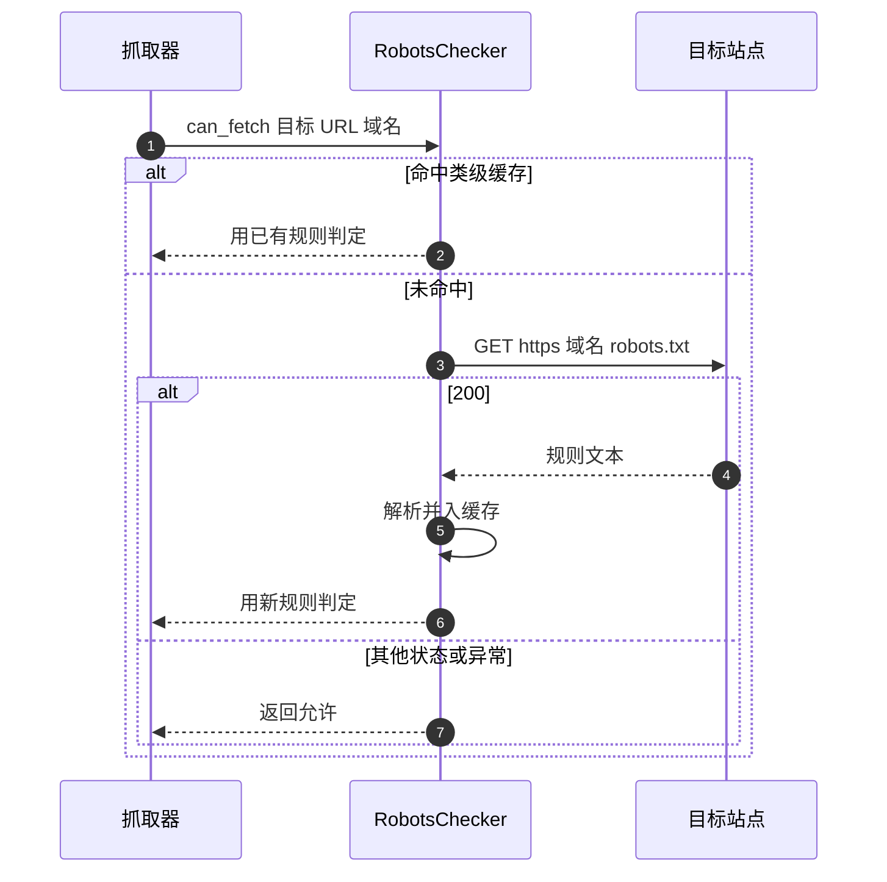

# robots 协议与检查器

抓一个站点之前，先看它有没有在 `robots.txt` 里说不希望被爬，是爬虫代码里最省事的一条合规动作。仓库里有一个 `RobotsChecker` 负责这件事：给定 URL 与域名，下载该域名的 `robots.txt`，解析出禁止路径，再判断当前路径是否落在禁止范围内。

它只有一百多行，但把下载、解析、缓存与判定都放在一个类里。理解它的关键是分清三件事：哪些输入会导致「允许」，缓存了什么、缓存多久，以及规则匹配到底按什么粒度做。

## 1. robots.txt 的规则形态

`robots.txt` 是纯文本，规则按 `User-agent` 分组，组内是若干 `Disallow` 与可选的 `Crawl-delay`：

```text
User-agent: *
Disallow: /search
Disallow: /private/
Crawl-delay: 2
```

语义上有三点容易记错：`Disallow` 是路径前缀匹配而不是精确匹配；空的 `Disallow` 表示允许所有路径；`Crawl-delay` 是建议的抓取间隔，单位是秒。标准里还有 `Allow` 与通配符，检查器没有实现这两样。

| 字段 | 含义 | 检查器是否支持 |
| --- | --- | --- |
| `User-agent` | 规则适用的客户端 | 读取但不区分 |
| `Disallow` | 禁止的路径前缀 | 支持 |
| `Crawl-delay` | 建议间隔 | 解析但不使用 |
| `Allow` | 例外允许的路径 | 不支持 |

## 2. 两个对外入口

`RobotsChecker` 暴露两个方法（`backend/scraper/robots.py`）：

| 方法 | 形态 | 说明 |
| --- | --- | --- |
| `can_fetch(url, domain)` | 异步 | 主入口，返回是否允许 |
| `can_fetch_sync(url)` | 同步 | 从 URL 解析域名后调用异步版本 |

异步版本接收两个参数，域名不一定要与 URL 一致，调用方负责传对。抓取器实际调用时用 `urlparse(url).netloc` 取值（`backend/scraper/fetcher.py`）。



## 3. 下载路径

下载固定用 https，域名拼在后面（`robots.py`）：

```python
url = f"https://{domain}/robots.txt"
client_kwargs = {
    "timeout": self.default_timeout,
    "transport": AsyncCurlTransport(impersonate="chrome120", default_headers=True),
}
if proxy:
    client_kwargs["proxy"] = proxy
```

三个细节：默认超时 10 秒；传输层用 curl 伪装的浏览器指纹，跟主抓取路径保持一致的形态；代理来自 `get_proxy_url()`，配了代理时 `robots.txt` 也走代理。

只有状态码 200 才返回正文，其余情况（404、403、超时、连接失败）统一返回空字符串。异常被整段捕获，不区分类型。

## 4. 解析实现

`_parse_robots` 先把文本按行去空，然后顺序扫描。示意如下（省略大小写与空值细节）：

```python
# 逐行扫描 robots.txt，遇到 User-agent 就切组，组内收集 Disallow
for raw in text.splitlines():
    line = raw.strip()
    if line.lower().startswith('user-agent:'):
        current_group = line.split(':', 1)[1].strip()   # 只记组名，不比对自身 UA
    elif line.lower().startswith('disallow:'):
        path = line.split(':', 1)[1].strip()
        if path:
            disallow.append(path)                       # 所有组的路径合并进同一个列表
    elif line.lower().startswith('crawl-delay:'):
        crawl_delay = float(line.split(':', 1)[1])      # 解析并缓存，但后续未被使用
```

实现要点（`robots.py`）：

| 遇到的行 | 处理 |
| --- | --- |
| `User-agent:` | 记录当前组，进入内层循环 |
| `Disallow:` 且路径非空 | 收集路径 |
| `Crawl-delay:` 且可转浮点 | 记录间隔 |
| 其他 | 跳过 |

内层循环一直到下一个 `User-agent` 或文本结束，因此不同 `User-agent` 组的 `Disallow` 会被合并进同一个列表。检查器没有比对自身 UA，也没有区分 `*` 与具名客户端：所有组的禁止路径对它一律生效。这是偏保守的做法——宁可多禁，不会漏禁，但可能挡掉本可抓的路径。

`Crawl-delay` 解析成浮点数后随缓存保存，返回给调用方的是 `(disallow, crawl_delay)` 元组，然而 `can_fetch` 只用了前者，间隔从未被执行。

## 5. 缓存与淘汰

缓存挂在类上（`robots.py`），所有实例共享同一个字典：

```python
_cache: dict[str, dict] = {}
_MAX_CACHE_SIZE = 1000
```

写入时若已满 1000 条，按 `fetched_at` 排序删掉最旧的一半（`robots.py`）。条目里的 `fetched_at` 只在写入时记录，读取时不比较：`can_fetch` 命中缓存就直接用，没有过期判断。模块开头导入了 `timedelta`，但代码里没有用到。



## 6. 判定与失败语义

判定只做一件事：把 URL 的路径取出，逐个 `Disallow` 前缀比较（`robots.py`）：

```python
parsed = urlparse(url)
path = parsed.path or "/"
for d in data.get("disallow", []):
    if path.startswith(d):
        return False
return True
```

路径为空时按 `/` 处理。前缀匹配意味着 `Disallow: /a` 会同时禁掉 `/a`、`/ab` 与 `/a/b`——这是规范里的行为，但写规则的人常常按精确路径理解。

失败语义是「一律放行」：下载不到、状态码不是 200、解析结果为空列表，都会得到 `True`。合规角度这是宽松策略，实际效果是「检查器只在能读到明确禁止时才拦人」。

| 情形 | 结果 |
| --- | --- |
| robots.txt 不存在 | 允许 |
| 下载超时或异常 | 允许 |
| 解析出空 Disallow | 允许 |
| 路径命中 Disallow | 禁止 |

## 7. 易错点

| 易错点 | 现象 | 位置 |
| --- | --- | --- |
| 以为会区分 User-agent | 所有组的规则合并生效 | `robots.py` |
| 以为 Crawl-delay 会限速 | 只解析保存，未执行 | `robots.py` 与  |
| 以为缓存会过期 | 只按容量淘汰 | `robots.py` |
| 以为下载失败会拦人 | 失败一律放行 | `robots.py` |
| 在事件循环里用同步入口 | `run_until_complete` 会报错 | `robots.py` |
| 把 Disallow 当精确路径 | 前缀匹配会连带禁用兄弟路径 | `robots.py` |

## 小结

核心概念：

| 概念 | 内容 |
| --- | --- |
| 入口 | `can_fetch` 与同步包装 `can_fetch_sync` |
| 下载 | 固定 https，超时 10 秒，可走代理 |
| 解析 | 按 `User-agent` 分块扫 `Disallow` 与 `Crawl-delay`，组间合并 |
| 缓存 | 类级字典，上限 1000，按时间淘汰一半，无过期 |
| 判定 | 路径前缀匹配，命中即禁 |
| 失败 | 一律视为允许 |

设计权衡：

| 决策 | 选择 | 收益 | 代价 |
| --- | --- | --- | --- |
| 规则范围 | 合并全部 UA 组 | 实现简单、偏保守 | 可能挡掉允许的路径 |
| 缓存 | 类级共享、容量淘汰 | 跨实例复用、省请求 | 规则更新不会被重新读取 |
| 失败处理 | 放行 | 不因站点侧问题中断抓取 | 合规强度依赖开关 |
| 下载传输 | 浏览器指纹客户端 | 与主路径一致，少被拦 | 依赖额外库 |

## 练习

基础题：

1. `can_fetch` 的两个参数分别是什么？
2. 哪些情况会导致检查器返回「允许」？
3. `Crawl-delay` 解析后有没有被使用？
4. 缓存的容量与淘汰规则是什么？

挑战题：

5. 让缓存支持按时间过期，说明条目结构需要增加什么、淘汰时机放在哪里。
6. 实现按调用方 UA 选择规则组，比较与当前合并策略的行为差异。
7. 把 `Crawl-delay` 接进抓取限速，说明与现有按间隔限速的关系与冲突。

---

### 附：本页引用的路径

| 路径 | 用途 |
| --- | --- |
| `backend/scraper/robots.py` | 检查器实现：下载、解析、缓存与判定 |
| `backend/scraper/proxy_config.py` | 下载时使用的代理 URL |
| `backend/scraper/fetcher.py` | `_check_robots` 与调用位置 |
| `backend/scraper/__init__.py` | 模块导出的检查器 |
