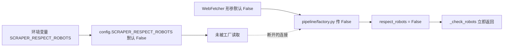
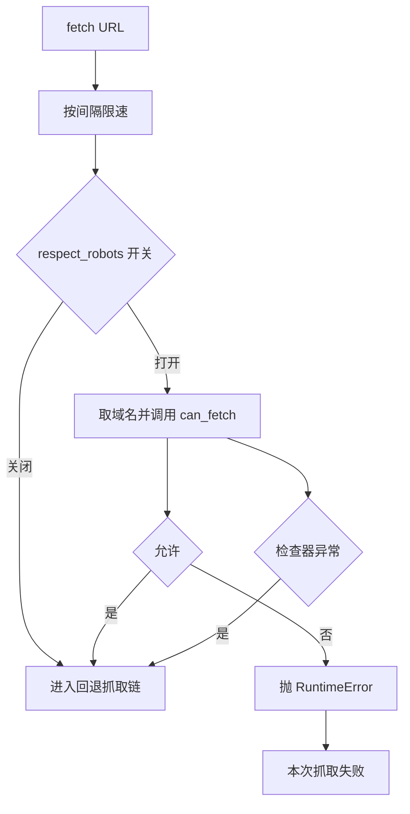

# 合规开关与调用链

检查器写好了，但不代表抓取时会用它。是否检查 `robots.txt` 由一个布尔开关控制，而这个开关的默认值是 `False`，主流水线在构造抓取器时又显式传了 `False`。结果是默认部署下，检查器代码存在但调用链不会走到它。

配置、构造与调用三个位置的默认值决定了这个开关的实际状态，而打开它之后的行为又与检查器的失败语义有关。

## 1. 配置里的默认值

配置模块给出一个布尔量（`backend/config.py`）：

```python
SCRAPER_RESPECT_ROBOTS: bool = False # 是否遵守 robots.txt
```

它读的是环境变量 `SCRAPER_RESPECT_ROBOTS`，缺省关闭。相邻两行是超时 10 秒与请求间隔 1 秒：

| 配置 | 默认值 | 含义 |
| --- | --- | --- |
| `SCRAPER_TIMEOUT` | 10 | HTTP 请求超时秒数 |
| `SCRAPER_RATE_LIMIT` | 1.0 | 请求间隔秒数 |
| `SCRAPER_RESPECT_ROBOTS` | `False` | 是否检查 `robots.txt` |

## 2. 抓取器的构造参数

`WebFetcher` 把开关作为构造参数保存（`backend/scraper/fetcher.py`）：

```python
def __init__(self, ..., respect_robots: bool = False, ...):
    self.respect_robots = respect_robots
```

参数默认值同样是 `False`，与配置保持一致。抓取器内部只在一处读它，就是检查函数的第一行。

## 3. 主流水线的写死

决定线上行为的地方在流水线工厂（`backend/pipeline/factory.py`）：

```python
web_fetcher = WebFetcher(respect_robots=False)
```

这里没有读配置项 `SCRAPER_RESPECT_ROBOTS`，而是写了字面量 `False`。因此即使把环境变量设成真，主流水线构造出的抓取器仍然不检查 `robots.txt`。配置项与工厂参数是两条没有接上的线。

| 位置 | 取值来源 | 结果 |
| --- | --- | --- |
| 配置模块 | 环境变量，默认 `False` | 可被部署覆盖 |
| `WebFetcher` 形参 | 默认 `False` | 调用方决定 |
| `pipeline/factory.py` | 字面量 `False` | 不受配置影响 |



## 4. 检查在抓取流程里的位置

`fetch` 的顺序是先限速、再检查、然后依次尝试各条抓取路径（`fetcher.py`）：

```python
await self._rate_limit()
await self._check_robots(url)
if self.use_fallback:
    result = await self._try_crawl4ai(url)
```

检查排在所有抓取尝试之前，因此一旦它拦下来，后面 Playwright、轻量客户端等路径都不会执行。限速在前，意味着被拦的请求也消耗了一次限速间隔。

## 5. 命中规则后的行为

`_check_robots` 的逻辑很短（`fetcher.py`）：

```python
if not self.respect_robots:
    return
domain = urlparse(url).netloc
try:
    allowed = await RobotsChecker().can_fetch(url, domain)
except Exception:
    allowed = True
if not allowed:
    raise RuntimeError(f"Disallowed by robots.txt: {url}")
```

三种走向：开关关闭直接返回；检查器判定允许继续；判定禁止则抛出 `RuntimeError`。异常被上层当作抓取失败处理，最终表现为该 URL 抓不到内容。检查器自身抛异常时被吞掉并按允许处理，这与它内部的失败语义一致。

| 条件 | 结果 |
| --- | --- |
| 开关 `False` | 不检查 |
| 判定允许 | 继续抓取 |
| 判定禁止 | 抛 `RuntimeError` |
| 检查器抛异常 | 按允许继续 |



## 6. 打开开关的代价

把开关打开后，每个域名的第一次抓取会多一次 `robots.txt` 请求，之后走类级缓存不再重复。代价有三点：多出的请求也占超时预算；下载用的客户端同样带浏览器指纹；被禁 URL 会直接失败，需要上层把它当作一种正常结果记录，而不是反复重试。

| 变化 | 影响 |
| --- | --- |
| 每域名首次多一次请求 | 首轮抓取变慢 |
| 被禁 URL 抛异常 | 需要区分「失败」与「不允许」 |
| 限速仍然生效 | 被禁请求也占一次间隔 |

检查器里解析出的 `Crawl-delay` 没有被使用，所以打开开关只会增加「是否允许」的判断，不会让抓取节奏更温和；节奏仍由 1 秒的固定间隔控制。

## 7. 易错点

| 易错点 | 现象 | 位置 |
| --- | --- | --- |
| 以为设了环境变量就生效 | 工厂写死 `False` | `pipeline/factory.py` |
| 以为检查器没被调用是死代码 | 开关打开即生效 | `fetcher.py` |
| 把被禁当成网络失败重试 | 每次都会抛同样的异常 | `fetcher.py` |
| 期待 `Crawl-delay` 自动生效 | 只解析不使用 | `robots.py` |
| 忽略被禁请求也占限速 | 检查在限速之后 | `fetcher.py` |

## 小结

核心概念：

| 概念 | 内容 |
| --- | --- |
| 配置项 | `SCRAPER_RESPECT_ROBOTS` 默认 `False` |
| 构造参数 | `WebFetcher(respect_robots=False)` |
| 主流水线 | 工厂传字面量 `False`，与配置脱节 |
| 调用位置 | `fetch` 内限速之后、抓取尝试之前 |
| 命中行为 | 抛 `RuntimeError` 中断本次抓取 |
| 例外 | 检查器自身异常按允许处理 |

设计权衡：

| 决策 | 选择 | 收益 | 代价 |
| --- | --- | --- | --- |
| 默认值 | 关闭 | 不因站点 robots 缺失而丢数据 | 默认不满足合规检查 |
| 配置接法 | 工厂未读配置 | 行为确定 | 部署时改环境变量无效 |
| 拦截方式 | 抛异常 | 复用失败路径 | 调用方难以区分原因 |
| 检查时机 | 限速之后 | 与抓取节奏一致 | 被禁请求也占间隔 |

## 练习

基础题：

1. `SCRAPER_RESPECT_ROBOTS` 的默认值是什么？
2. 主流水线在哪里构造抓取器，传了什么？
3. 检查在 `fetch` 的哪一步之后执行？
4. 判定禁止时抛出的异常是什么？

挑战题：

5. 让工厂读取配置项，说明需要改的位置与对现有部署的影响。
6. 为「被 robots 禁止」设计独立的结果类型，说明与抓取失败、域名熔断三者的区别。
7. 把 `Crawl-delay` 接进限速：给出优先级（固定间隔与站点建议取大者）与实现位置。

---

### 附：本页引用的路径

| 路径 | 用途 |
| --- | --- |
| `backend/config.py` | 抓取配置三项，含 `SCRAPER_RESPECT_ROBOTS` |
| `backend/pipeline/factory.py` | 构造抓取器，写死 `respect_robots=False` |
| `backend/scraper/fetcher.py` | 构造参数、限速、`_check_robots` 与 `fetch` 顺序 |
| `backend/scraper/robots.py` | 检查器的判定与 `Crawl-delay` 解析 |
