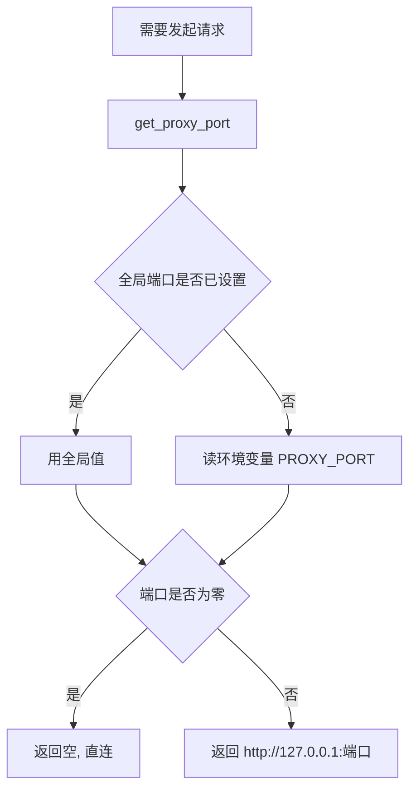
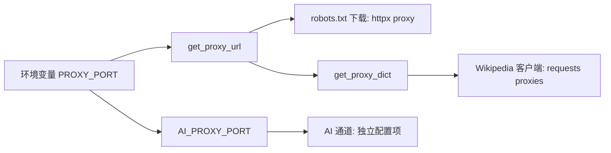
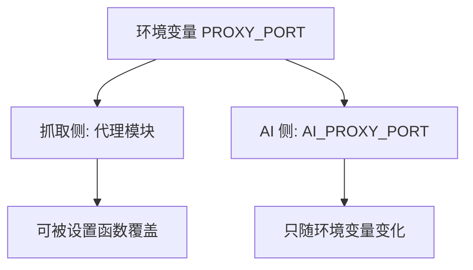
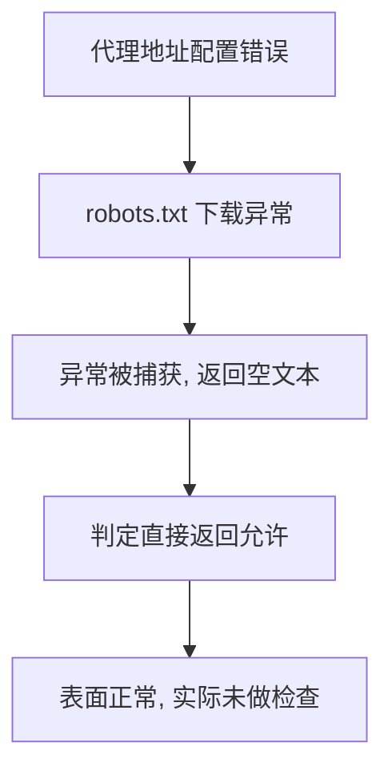

# 代理配置与出口路径

有些站点在本地网络里直连不通，抓取前需要把出口换成本机代理。这个仓库的代理配置只有四十行，却决定了四件事：什么时候直连、什么时候走代理、哪些调用会走代理、以及改完配置在哪里生效。

它把「端口」当作唯一配置项，其余信息（协议、主机、字典形态）都由代码里的模板推出来。这种极简写法的好处是不会配错格式，代价是能力边界很窄：只支持本机 HTTP 代理，没有认证，也不读通用的代理环境变量。

## 端口是唯一的配置项

配置模块只有四个公开名字（`backend/scraper/proxy_config.py`）：

| 名字 | 形态 | 作用 |
| --- | --- | --- |
| 模块级变量 | 整数或空 | 进程内的全局代理端口 |
| `set_proxy_port(port)` | 函数 | 设置全局端口 |
| `get_proxy_port()` | 函数 | 取端口，全局变量优先，回退环境变量 |
| `get_proxy_url()` | 函数 | 拼出代理 URL，端口为零时返回空 |
| `get_proxy_dict()` | 函数 | 给 requests 用的字典形态 |

协议与主机是写死的：拼出来的 URL 固定形如 `http://127.0.0.1:{port}`（`proxy_config.py`）。也就是说，这套配置默认代理进程就跑在同一台机器上，端口是它唯一的变量。

## 全局变量优先于环境变量

取端口时先看模块级变量，没有被设置过才去读环境变量，最后兜底为零（`proxy_config.py`）：

```python
def get_proxy_port() -> int:
    if _proxy_port is not None:
        return _proxy_port
    return int(os.environ.get("PROXY_PORT", "0"))
```

这个顺序带来的实际影响是：进程内调用过设置函数之后，再改环境变量不会生效，因为模块级变量已经不是空值。启动方式不同，读到配置的时机也不同——环境变量在首次取值时读取，设置函数则在被调用的那一刻覆盖它。

| 情形 | 取到的端口 | 原因 |
| --- | --- | --- |
| 只设环境变量 | 环境变量的值 | 全局变量为空 |
| 只调设置函数 | 函数传入的值 | 全局变量优先 |
| 两者都设 | 函数传入的值 | 全局变量优先 |
| 两者都没有 | 0 | 兜底直连 |

## 端口为零表示直连

零是「不用代理」的哨兵值，判断点只有一处（`proxy_config.py`）：

```python
port = get_proxy_port()
if port == 0:
    return None  # 禁用代理，直连
return f"http://127.0.0.1:{port}"
```

返回空值之后，调用方要么不加代理参数，要么拿到空字典，两条路都落到直连。这个设计让「没配代理」与「显式关闭代理」共用同一条分支，不需要额外的开关。


## URL 与 requests 字典两种形态

同一个 URL 有两种对外形态，分别给不同的客户端用（`proxy_config.py`）：

| 形态 | 返回值 | 给谁用 |
| --- | --- | --- |
| 单个 URL 字符串 | `http://127.0.0.1:端口` | httpx 的 `proxy` 参数 |
| 字典 | `{"http": url, "https": url}` | requests 的 `proxies` 参数 |

字典里 http 与 https 指向同一个地址，含义是「无论目标协议是什么，都从这个代理出去」，而不是「代理本身的协议是 https」。这一点容易混：URL 前缀 `http://` 描述的是到代理的连接方式，目标站点仍然可以是 https。

## 哪些调用会走代理

当前检出里代理被三处使用，覆盖两条链路（`backend/scraper/robots.py`、`backend/scraper/wikipedia_client.py`）：

| 使用点 | 形态 | 说明 |
| --- | --- | --- |
| robots.txt 下载 | URL 字符串 | 配了代理时，规则文件也从代理取 |
| Wikipedia 客户端 | 字典 | 三处 requests 调用都带代理 |
| AI 通道 | 端口字段 | 与抓取共用环境变量，另有独立配置项 |

robots.txt 走代理这个细节要留意：如果代理只对部分站点可用，规则文件的下载会与目标页面一起失败，于是「取不到规则」和「页面取不到」同时发生。排查时容易误判成站点封禁，实际是代理没覆盖那个域名。



## AI 侧走的是另一个通道

AI 调用与抓取读的是同一个环境变量，但落在两个不同的配置字段上：抓取侧由代理模块直接读取，AI 侧先经过总配置的 `AI_PROXY_PORT`，再传给 AI 客户端（`backend/config.py`、`backend/ai/config.py`）。

| 通道 | 取端口的位置 | 传给谁 |
| --- | --- | --- |
| 抓取 | 代理模块，可被设置函数覆盖 | httpx 与 requests |
| AI | 总配置的字段 | AI 客户端 |

后果是两条通道会一起被环境变量改动影响，但只有抓取侧能被进程内的设置函数临时覆盖。调试时如果只想给 AI 换出口，改环境变量会连带影响抓取。



## 代理出问题时的症状

代理故障的表现分两类，取决于故障发生在哪一侧：

| 症状 | 常见原因 | 现象 |
| --- | --- | --- |
| 需要代理认证 | 代理要求账号密码而配置不支持 | 状态码 407，提示需要代理认证 |
| 代理连接失败 | 端口没起服务或被防火墙拦 | 客户端报代理连接错误 |
| 代理不覆盖该域名 | 规则文件与页面一起取不到 | 表现为抓取全线失败 |

前两项的文案在另一个工具的错误映射表里有对应条目：407 映射为「需要代理认证」，连接类错误映射为「代理连接失败」（`/mnt/d/better-crawler-4-agent/src/better_crawler/errors.py`）。本仓库的代理模块只负责提供地址，不处理认证，也不重试。

还有一条更隐蔽的路径：robots.txt 下载的异常被整段捕获并返回空字符串（`robots.py`），空字符串会让判定直接返回允许。所以代理配错、又开着 robots 检查时，检查器不会报错，而是静默放行。



## 易错点

| 易错点 | 现象 | 判据 |
| --- | --- | --- |
| 以为改环境变量一定能生效 | 设置函数调用过之后环境变量被忽略 | 检查全局变量是否已赋值 |
| 把字典里的 http 当目标协议 | 误以为只能抓 http 站点 | 字典描述的是代理连接方式 |
| 以为代理配错会报错 | robots 检查静默放行 | 看下载异常是否被吞 |
| 以为只影响抓取 | AI 侧同样读 PROXY_PORT | 查两处配置字段 |
| 以为支持认证与 https 代理 | 只拼本机 http 地址 | 看 URL 模板 |
| 端口写 0 当成无效配置 | 0 是显式直连 | 看哨兵分支 |

## 小结

### 核心概念

- 端口是唯一配置项，协议与主机由代码写死为本机 http。
- 全局变量优先于环境变量，设置函数调用后环境变量不再生效。
- 端口为零表示直连，与「没配代理」共用一条分支。
- 抓取侧与 AI 侧读同一个环境变量，但落在两个配置字段上。

### 设计权衡

| 决策 | 选择 | 收益 | 代价 |
| --- | --- | --- | --- |
| 配置项数量 | 只留端口 | 不会配错格式 | 不支持认证与远程代理 |
| 覆盖方式 | 全局变量加环境变量 | 兼顾进程内与启动时设置 | 优先级容易记错 |
| 关闭方式 | 端口为零 | 无需额外开关 | 零值与未配置无法区分 |
| 失败处理 | 下载异常返回空 | 不因代理问题中断流程 | 检查会静默失效 |

## 练习

### 基础题

1. 取端口时两级来源的优先级是什么？
2. 端口为零表示什么，为什么不需要额外开关？
3. 代理 URL 与 requests 字典两种形态分别给谁用？

### 挑战题

4. 让代理模块支持认证与远程主机，说明需要新增哪些配置项，以及 URL 模板怎么改。

5. 设计一个启动自检，在代理配错时给出明确提示，而不是让 robots 检查静默放行。

6. 说明抓取侧与 AI 侧共用一个环境变量带来的问题，并给出拆分方案。

### 附：本页引用的路径

| 路径 | 用途 |
| --- | --- |
| `backend/scraper/proxy_config.py` | 端口读取、URL 与字典形态 |
| `backend/scraper/robots.py` | robots.txt 下载走代理、异常吞掉与放行 |
| `backend/scraper/wikipedia_client.py` | requests 调用带代理字典的三处 |
| `backend/config.py`、`backend/ai/config.py` | AI 侧代理端口字段（ 与 ） |
| `/mnt/d/better-crawler-4-agent/src/better_crawler/errors.py` | 407 与代理连接失败的文案 |

（引用的 KD 仓库路径以 /mnt/d/KnowledgeDiver 为根。）