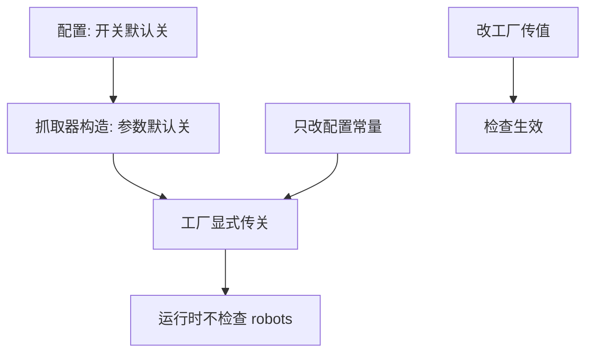
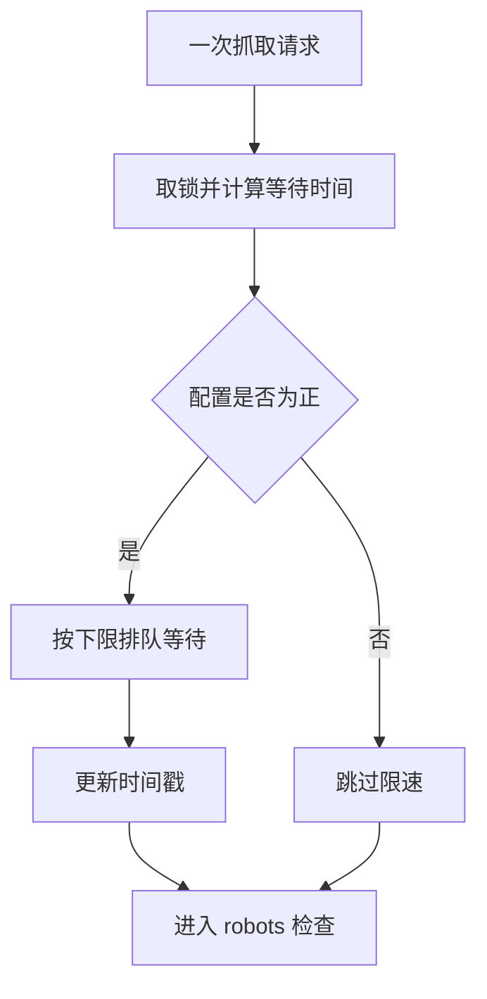
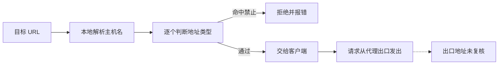
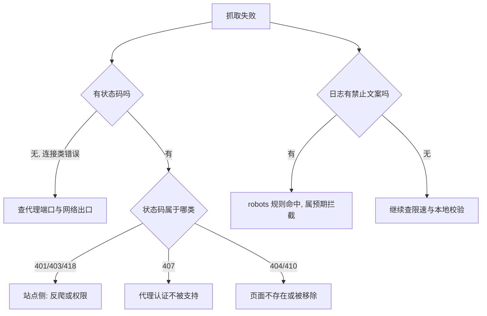

# 合规边界与排查顺序

抓取失败时，第一反应常常是「站点把 IP 封了」。但在这个项目里，一次抓不到至少有四层可能的原因：代理出口、速率限制、robots 开关与安全校验。四层里默认生效的只有一层，另外几层要么默认关闭，要么只覆盖部分路径，所以排查的第一步应当是分类：分清「代码拦了」还是「站点拒了」，换 IP 排在后面。

这些层的默认状态决定了合规在这个项目里主要靠约定而不是靠强制。理解每一层的开关与它失效时的表现，才能既解释失败原因，也说明当前的合规强度到底落在哪里。

## 默认不检查的两层原因

robots 检查在默认部署里不会执行，原因在配置与构造两处叠加：配置里开关的默认值是关闭，主流水线在建立抓取器时又显式传了关闭（`backend/config.py`、`backend/pipeline/factory.py`）。

| 位置 | 写法 | 效果 |
| --- | --- | --- |
| 配置常量 | `SCRAPER_RESPECT_ROBOTS = False` | 默认关闭 |
| 抓取器构造 | 参数默认 `False` | 不传时关闭 |
| 流水线工厂 | 显式传 `False` | 即使改配置也不生效 |

第三行是关键：工厂写死了这个参数，所以只改配置常量不会改变线上行为（`backend/scraper/fetcher.py`、`backend/pipeline/factory.py`）。要实际启用，必须改工厂这一处的传值，或者从别处构造抓取器并显式打开。



## 检查打开后落在哪里

检查点在抓取入口的第一步之后：限速先执行，然后才做 robots 判定（`fetcher.py`）。判定本身分三种结果：

| 情形 | 行为 |
| --- | --- |
| 开关关闭 | 直接返回，不下载规则 |
| 命中禁止 | 抛运行时错误，文案带目标 URL |
| 检查器自身异常 | 当作允许，继续抓取 |

命中禁止抛的是通用运行时错误，不是自定义异常类型，因此调用方只能靠文案区分「被 robots 拦」与「所有抓取方法都失败」（`fetcher.py`）。这一点排查时很实用：日志里出现带目标 URL 的禁止文案，说明规则生效了。

检查器自身异常按允许处理，是第二处宽松策略：下载失败、解析失败都不会拦人。它与第一页讲的「失败一律放行」是同一套语义的上下两半——规则里的禁止会拦，规则拿不到就不拦。

## 默认生效的那道闸是限速

四层里默认起作用的是限速。配置里请求间隔为 1 秒（`config.py`），而限速函数的实现是取间隔的倒数作为允许的频率（`fetcher.py`）：

```python
if self.rate_limit <= 0:
    return
min_interval = 1.0 / self.rate_limit
```

| 配置值 | 最小间隔 | 效果 |
| --- | --- | --- |
| 1.0 | 1 秒 | 每秒最多一次请求 |
| 0.5 | 2 秒 | 放慢一半 |
| 0 或负值 | 无 | 跳过限速 |

限速用一把锁保护，时间戳在等待结束后更新，因此并发调用会排队而不是各自计算间隔（`fetcher.py`）。这是当前唯一默认开启的节流手段，也是「不要高频批量抓取」这条约定在代码里的落点。


## 文档约定覆盖的边界

代码之外还有一层约定，写在抓取工具的说明文档里：抓取要遵守目标站点的规则与服务条款，工具适合按需读取具体页面，不要用于高频批量抓取（`/mnt/d/better-crawler-4-agent/README.md`）。同一份文档还列出了测试覆盖范围，包括地址安全校验、蜜罐识别、正文提取与错误页识别（`README.md`）。

把代码能力与约定放在一起看，合规边界大致如下：

| 边界项 | 当前状态 |
| --- | --- |
| `Disallow` 前缀 | 支持，命中即拦 |
| `Allow` 与通配符 | 未实现，规则被忽略 |
| 抓取间隔建议 | 解析但不执行 |
| 多客户端分组 | 所有组规则合并生效 |
| 规则文件过期 | 缓存无时间淘汰 |
| 高频批量抓取 | 靠限速与文档约定约束 |

前五行来自检查器的实现，最后一行是这套工程手段的上限：限速把频率压到每秒一次，但如果有人把间隔调小或起多个进程，约定就只剩文档效力。

## 安全校验与代理的关系

抓取工具本身还有一层地址安全校验：只允许 http 与 https，并拒绝解析到内网、回环与链路本地的地址，默认拦截，需要时用环境变量放开（`/mnt/d/better-crawler-4-agent/src/better_crawler/safety.py`）。

这套校验的工作方式是先用系统解析把主机名换成地址，再逐个判断地址是否属于禁止范围（`safety.py`）。它有一个与代理有关的盲区：解析发生在本地，而请求实际从代理出口发出，两者可能看到不同的地址。

| 环节 | 看的是哪一侧的地址 |
| --- | --- |
| 地址校验 | 本地解析结果 |
| 实际请求 | 代理出口 |

按通用做法，代理场景下的地址校验需要在代理侧或响应返回后复核，否则「本地解析为公网、代理侧落到内网」这类情况不会被发现。当前检出里没有针对代理的二次校验，属于本仓库未实现的部分。



## 排查顺序

按「先分类、后分层」的顺序走，能避免一开始就怀疑站点封禁（`/mnt/d/better-crawler-4-agent/src/better_crawler/errors.py`）：

| 步骤 | 看什么 | 结论方向 |
| --- | --- | --- |
| 1 | 状态码与错误分类 | 401/403 多为站点侧，407 是代理认证，超时看网络 |
| 2 | 日志里的禁止文案 | 带目标 URL 的禁止文案说明 robots 拦了 |
| 3 | 请求间隔 | 间隔稳定等于配置值说明在排队限速 |
| 4 | 代理端口与出口 | 端口为零是直连，端口错则全线失败 |
| 5 | 安全校验报错 | 地址类报错与协议类报错都是本地拦的 |
| 6 | 站点响应内容 | 到这一步才是反爬与页面结构问题 |



第三行要单独留意：限速等待与网络慢在日志上都表现为「请求很慢」，区分办法是看间隔是否稳定贴着配置值。稳定贴住说明是主动等待，抖动很大才是网络问题。

## 易错点

| 易错点 | 现象 | 判据 |
| --- | --- | --- |
| 改了配置以为就生效 | 工厂写死了参数 | 看工厂传值 |
| 抓不到就换 IP | 可能被 robots 或本地校验拦 | 先看禁止文案与地址报错 |
| 把 robots 检查当成强制 | 默认关闭且失败放行 | 看两层默认值 |
| 以为规则文件会更新 | 缓存无过期 | 看缓存实现 |
| 以为 `Allow` 也生效 | 未实现，只读禁止项 | 看解析函数 |
| 代理场景下信任地址校验 | 校验在本地解析 | 看请求实际出口 |

## 小结

### 核心概念

- robots 检查默认不执行，配置与工厂两处都为关闭。
- 打开后命中禁止会抛错，检查器自身异常按允许处理。
- 默认唯一生效的节流手段是每秒一次的限速。
- 地址安全校验基于本地解析，与代理出口可能不一致。

### 设计权衡

| 决策 | 选择 | 收益 | 代价 |
| --- | --- | --- | --- |
| 默认合规强度 | 只开限速 | 不阻断正常抓取 | 规则约束依赖开关与约定 |
| 拦截方式 | 抛通用运行时错误 | 实现简单 | 只能靠文案区分原因 |
| 规则支持范围 | 只做禁止前缀 | 逻辑清晰 | 忽略例外与通配 |
| 缓存策略 | 容量淘汰 | 省请求 | 规则更新不及时 |

## 练习

### 基础题

1. robots 检查默认不执行的两层原因分别在哪里？
2. 命中禁止时抛的是什么类型的错误，文案里有什么信息？
3. 默认生效的节流手段是什么，单位怎么理解？

### 挑战题

4. 让配置常量单独就能控制检查开关，说明需要改哪几处、有什么风险。

5. 为「抓取很慢」设计一份排查清单，要求能区分主动限速与网络故障。

6. 说明代理场景下地址安全校验的盲区，并给出两种可落地的补强方案。

### 附：本页引用的路径

| 路径 | 用途 |
| --- | --- |
| `backend/config.py`、`backend/pipeline/factory.py` | 开关默认值与工厂写死的传参（ 与 ） |
| `backend/scraper/fetcher.py` | 检查点位置、异常语义与限速实现 |
| `/mnt/d/better-crawler-4-agent/README.md` | 合规约定与测试覆盖范围 |
| `/mnt/d/better-crawler-4-agent/src/better_crawler/safety.py` | 地址安全校验的范围与本地解析方式 |
| `/mnt/d/better-crawler-4-agent/src/better_crawler/errors.py` | 状态码与连接类错误文案 |

（引用的 KD 仓库路径以 /mnt/d/KnowledgeDiver 为根。）