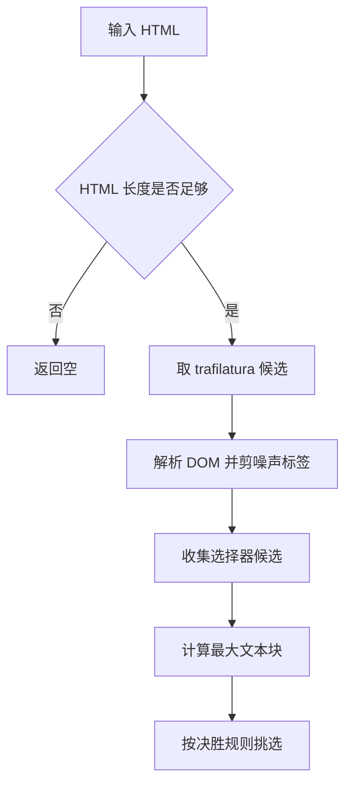
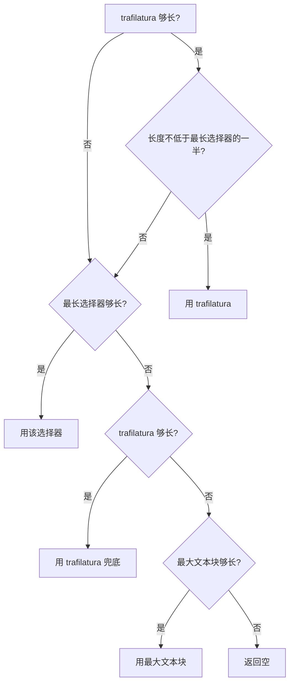
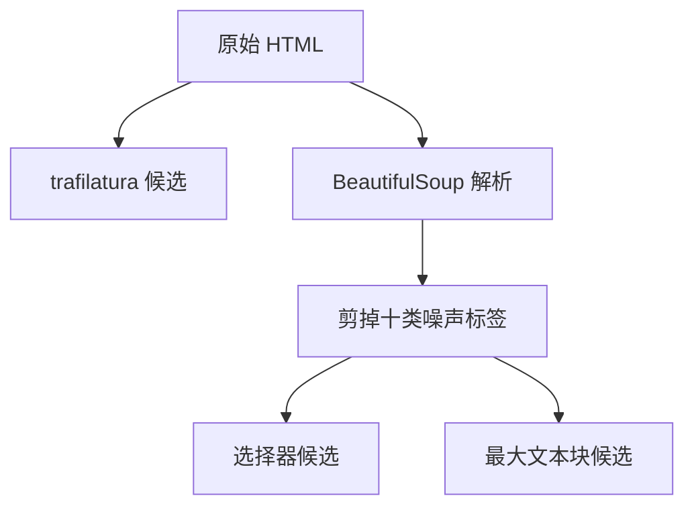
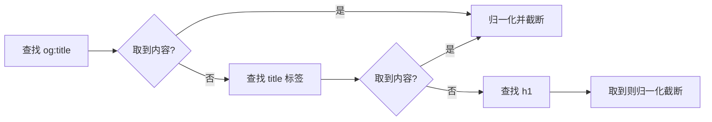

# 三级候选与选择顺序

同一篇文章，交给不同的提取方式，拿到的结果可能相差很大：博客正文识别最好的是通用算法，而中文技术站点的正文往往藏在固定容器里；反过来，通用算法在知乎这类站点上可能只取到摘要。这个仓库的做法是同时收集多个候选，再用一条明确的决胜规则挑一个，而不是「第一个够长的就用」。

候选有三条来源：通用正文算法、站点专用选择器、最大文本块。三条来源各自失败的方式不同，因此决胜规则不采用先到先得，而是带长度比较的优先级。

## 三条候选来源

三条来源的分工与能力边界如下（`src/better_crawler/extract.py:1-15`）：

| 来源 | 擅长 | 失败方式 |
| --- | --- | --- |
| trafilatura | 博客与文档站正文 | 中文站点可能只取到摘要 |
| 站点选择器 | 已知站点的正文容器 | 名单没覆盖的新站点 |
| 最大文本块 | 无特征页面兜底 | 可能选中注释或导航的聚合块 |

通用算法的调用带四个选项：不含评论、包含表格、偏向精度关闭、允许内部回退（`extract.py:148-158`）。「偏向精度关闭」的意思是不为了干净而牺牲召回，宁可多留一点内容，这与后面「候选不够长才换下一级」的整体思路一致。

## 采集顺序与数据结构

提取函数先做长度门槛，再收集候选，最后按规则返回（`extract.py:192-240`）：

```python
if not html or len(html) < 200:
    return None
traf = _trafilatura_candidate(html)          # 候选一
if is_honeypot(traf): traf = ""              # 蜜罐直接作废
soup = BeautifulSoup(html, "html.parser")
for tag in soup(_NOISE_TAGS): tag.decompose()  # 先剪噪声
selectors = [...]                            # 候选二
largest = _largest_block(soup)               # 候选三
```

返回对象带三个字段：正文、标题与来源标记（`extract.py:70-77`）。来源标记的值形如 `trafilatura`、`selector:#content_views` 或 `largest-block`，调用方据此知道这次走的是哪一级。



## 决胜规则：长度比与阈值

决胜规则是整套流程里最需要记住的一段，它由四条判断按顺序组成（`extract.py:226-240`）：

| 顺序 | 条件 | 结果 |
| --- | --- | --- |
| 1 | trafilatura 够长，且长度不低于最长选择器候选的一半 | 采用 trafilatura |
| 2 | 最长选择器候选够长 | 采用该选择器 |
| 3 | trafilatura 够长 | 采用 trafilatura |
| 4 | 最大文本块够长 | 采用最大文本块 |
| 5 | 都不够 | 返回空 |

第一条里的「一半」是关键：它承认选择器候选可能比通用算法更长，但当长出的部分不到一半时换来源就不划算。反过来说，如果选择器候选的长度超过通用结果的两倍，说明通用算法漏了正文，此时改用选择器。


## 噪声标签先剪掉

选择器与最大文本块这两条候选都基于同一份解析后的 DOM，而 DOM 在收集之前先剪掉了十类噪声标签：脚本、样式、导航、页脚、页头、侧栏、无脚本块、内嵌框架、表单与矢量图（`extract.py:34-45`、`:215-216`）。

| 标签 | 为什么剪 |
| --- | --- |
| 脚本与样式 | 正文里不该出现代码与样式文本 |
| 导航、页头、页脚、侧栏 | 站点公共区域，与文章无关 |
| 无脚本与内嵌框架 | 多为占位内容 |
| 表单 | 搜索框与登录提示 |
| 矢量图 | 图标文字可能混进正文 |

剪枝发生在解析之后，而通用算法的候选是在原始 HTML 上算的（`extract.py:199` 在 `:211` 解析之前）。也就是说，trafilatura 自己处理噪声，选择器候选拿到的是一份已经干净的结构。



## 标题的三种来源

标题按固定顺序尝试三个位置，先命中先返回（`extract.py:120-145`）：

| 顺序 | 来源 | 读数方式 |
| --- | --- | --- |
| 1 | `og:title` 元信息 | 取 `content` 属性 |
| 2 | 页面标题标签 | 取节点文本 |
| 3 | 一级标题 | 取节点文本 |

元信息优先是因为它通常最干净：站点标题模板（「文章名 - 站点名」）常常出现在标题标签里。取到的文本会做空白归一化，并截到 200 字符（`extract.py:144`）。



## 长度阈值 200 的含义

阈值 200 是这套流程里出现次数最多的常数，它在三个位置起作用：入口的 HTML 长度门槛、每条候选是否够长、以及调用方拿到结果后的复查（`extract.py:26`、`:194`、`:227-237`、`fetcher.py:298`）。

| 位置 | 作用 |
| --- | --- |
| 入口 | 太短的 HTML 直接放弃 |
| 候选 | 够长的候选才能进入比较 |
| 调用方 | 提取结果短于此长度视为失败 |

这个值的量级是「一段话」，比它短的内容大多是提示语、导航汇总或错误文案。把它设得更低会让噪声更容易被当成正文，设得更高则会误杀短文章与图集页。

## 易错点

| 易错点 | 现象 | 判据 |
| --- | --- | --- |
| 以为候选是串行回退 | 三条候选都会被计算 | 看提取函数的收集顺序 |
| 以为先够长先用 | 通用结果够长但仍会比较比例 | 看决胜规则第一条 |
| 把 0.5 的比例当成阈值 | 它只影响来源切换 | 看条件里的比较对象 |
| 以为通用算法拿的是干净 DOM | 它直接吃原始 HTML | 看解析发生的位置 |
| 忽略来源标记 | 出问题时分不清哪一级 | 看返回对象的来源字段 |

## 小结

### 核心概念

- 三条候选同时收集，按决胜规则挑一条，不是串行回退。
- 决胜规则用「不低于一半」的比例决定是否从通用算法切到选择器。
- 选择器与最大文本块基于剪过噪声的 DOM，通用算法吃原始 HTML。
- 长度阈值 200 贯穿入口、候选与调用方三处。

### 设计权衡

| 决策 | 选择 | 收益 | 代价 |
| --- | --- | --- | --- |
| 候选策略 | 多路收集后挑选 | 单个算法失效不影响结果 | 每次都要算三遍 |
| 来源切换 | 用比例而非绝对值 | 容忍合理长度差异 | 比例值需要实测标定 |
| 噪声处理 | 选择器路径先剪枝 | 结构干净 | 两条路径处理方式不一致 |
| 阈值 | 固定 200 字符 | 简单可预期 | 短文章会被判失败 |

## 练习

### 基础题

1. 三条候选来源分别是什么，各自擅长什么？
2. 决胜规则的第一条里「一半」是比较什么与什么？
3. 标题按什么顺序尝试哪三个位置？

### 挑战题

4. 把固定阈值改成按站点自适应的阈值，说明需要哪些统计量以及风险。

5. 让通用算法与选择器共用同一份剪枝后的 DOM，分析结果可能怎么变。

6. 设计一组测试用例，覆盖三条候选各自生效的情形。

### 附：本页引用的路径

| 路径 | 用途 |
| --- | --- |
| `src/better_crawler/extract.py` | 候选收集、决胜规则、阈值与标题提取（`:1-15`、`:26`、`:34-67`、`:120-240`） |
| `src/better_crawler/fetcher.py` | 对提取结果的复查与后续处置（`:281-351`） |

（引用的路径以 /mnt/d/better-crawler-4-agent 为根。）