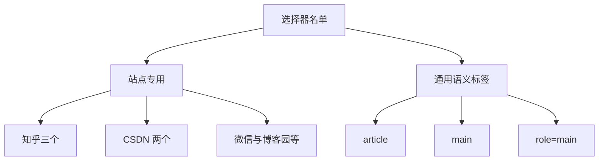
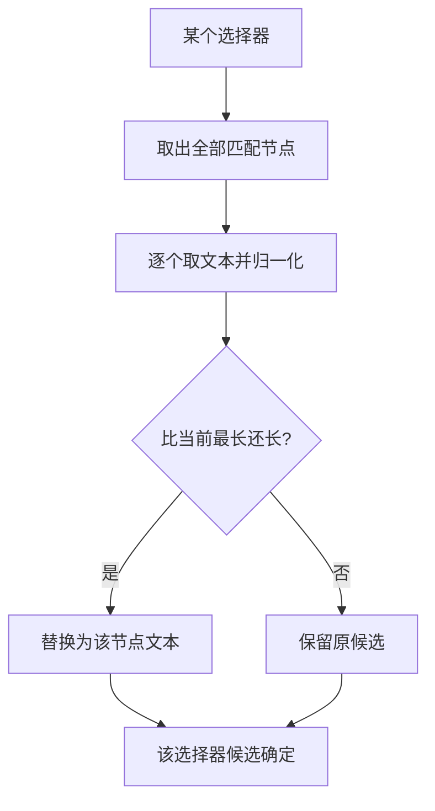
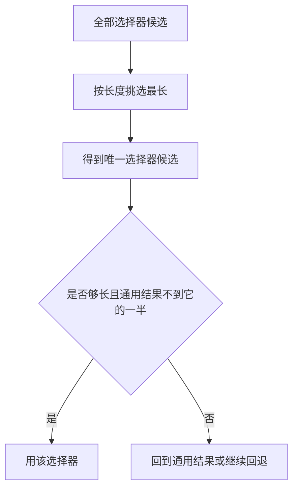
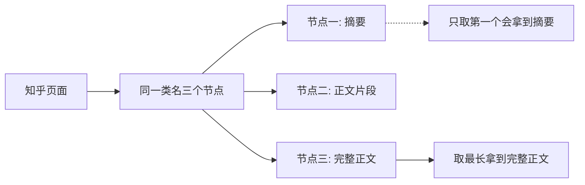

# 选择器名单与最长匹配

知乎页面上，正文容器的类名会同时出现在多个节点上：`RichText ztext` 能匹配到三个，其中第一个往往只是摘要预览。如果按「找到就取」的写法处理，拿到的就是那几百字预览，而正文在第三个节点里。这个仓库对选择器有两条约定来避开这类问题：单个选择器取所有匹配中最长的那个，多个选择器之间再取最长的一个。

名单本身是硬编码的，覆盖十来个常见中文内容站点，另加三个通用语义标签作为兜底。理解它需要同时看「取哪一个」与「怎么取最长」这两件事。

## 名单里有哪些站点

名单按站点分组排列，每组一到三个选择器（`src/better_crawler/extract.py`）：

| 分组 | 选择器 |
| --- | --- |
| 知乎 | `.RichText.ztext`、`.Post-RichText`、`.RichContent-inner` |
| CSDN | `#content_views`、`.htmledit_views` |
| 微信公众号 | `#js_content` |
| 掘金与简书 | `.markdown-body`、`.article-content` |
| 博客园 | `#cnblogs_post_body` |
| 少数派 | `.post-content` |
| 通用语义标签 | `article`、`main`、`[role=main]` |

同一站点给多个选择器，是因为页面模板不止一种：同一个站点可能有旧版与新版两套结构，两个类名不会同时出现，都列上就不用判断版本。



## 每个选择器取最长匹配

第一个约定在收集函数里：对每个选择器取出全部匹配节点，逐个算文本长度，只保留最长的那个作为该选择器的候选（`extract.py`）：

```python
for selector in _SITE_SELECTORS:
    nodes = soup.select(selector)
    best = ""
    for node in nodes:
        text = _clean_text(node.get_text("\n", strip=True))
        if len(text) > len(best):
            best = text
    if best:
        out.append((selector, best))
```

两个细节要指出：取文本时用换行符作为节点之间的分隔，而不是空格，这样多个段落不会粘成一句；候选只在非空时进入结果列表，空匹配不会占位。


## 跨选择器再取最长

第二个约定发生在收集之后：把所有选择器候选按文本长度排序，只留最长的一个，蜜罐候选在这一步就被排除（`extract.py`）：

```python
selectors = [(sel, txt) for sel, txt in _selector_candidates(soup)
             if not is_honeypot(txt)]
best_sel, best_sel_text = ("", "")
for sel, txt in selectors:
    if len(txt) > len(best_sel_text):
        best_sel, best_sel_text = sel, txt
```

两层取最长是同一思路的重复使用：先在同一选择器的多个匹配里去噪，再在不同选择器之间去噪。副作用是候选里同时包含站点专用选择器与通用的 `article`、`main`，如果通用标签匹配到一个包含侧栏与评论区的大块，它可能比专用容器更长而被选中。

| 层次 | 比较对象 | 结果 |
| --- | --- | --- |
| 第一层 | 同一选择器的多个匹配 | 每个选择器一条候选 |
| 第二层 | 所有选择器候选 | 全局最长的一条 |
| 之后 | 与通用算法结果比较 | 决定最终来源 |



## 通用语义标签作为兜底

名单最后三项是 HTML 语义标签，而不是站点专用类名：`article`、`main` 与 `role=main`（`extract.py`）。它们的作用是覆盖不在名单里的站点，只要页面结构规范就能命中。

这三项与后面的最大文本块兜底有重叠但不相同：语义标签依赖页面作者用了正确的标签，最大文本块则不挑标签，直接在所有块级元素里找最长的正文（`extract.py`）。

| 手段 | 依赖 | 失败方式 |
| --- | --- | --- |
| 语义标签 | 页面用了规范标签 | 老站点用多层 `div` |
| 最大文本块 | 没有依赖 | 选中评论区或导航聚合块 |

## 只取第一个匹配会漏什么

文件开头的注释把这条经验写得很直接：知乎页面上 `.RichText.ztext` 有三个节点，第一个可能只是摘要预览（`extract.py`）。按「找到就取」的写法，返回的将是预览而不是正文，而且长度可能刚好越过阈值，从而骗过「够长就用」的判断。

| 写法 | 知乎页面的结果 |
| --- | --- |
| 只取第一个匹配 | 摘要预览 |
| 取最长匹配 | 正文节点 |



## 名单的维护成本

名单是模块级常量，改动意味着改代码并重新发布。它的成本不在写选择器，而在持续验证：站点改版后旧选择器会静默失效——不报错，只是候选变短，于是流程落到下一级，症状是「提取质量下降」而不是「提取失败」。

| 变化 | 表现 | 排查入口 |
| --- | --- | --- |
| 站点改版 | 候选变短，来源标记变化 | 看返回的来源字段 |
| 名单没覆盖 | 走通用算法或最大块 | 看来源是否为选择器 |
| 选择器写法过期 | 匹配到空节点 | 看候选是否为空 |

## 易错点

| 易错点 | 现象 | 判据 |
| --- | --- | --- |
| 只取第一个匹配 | 拿到摘要预览 | 看收集函数是否遍历全部匹配 |
| 以为选择器按优先级排序 | 实际上按长度决胜 | 看第二层取最长的代码 |
| 忽略通用标签的副作用 | 大块容器压过专用容器 | 看候选长度对比 |
| 以为名单失效会报错 | 静默落到下一级 | 看来源标记 |
| 在噪声未剪时收集 | 侧栏文字进入候选 | 看剪枝发生的位置 |

## 小结

### 核心概念

- 名单覆盖十余个常见站点，另加三个通用语义标签。
- 同一选择器的多个匹配取最长，跨选择器再取最长。
- 只取第一个匹配是曾经踩过的失误，会拿到摘要预览。
- 名单失效的表现是来源变化与长度变短，不是报错。

### 设计权衡

| 决策 | 选择 | 收益 | 代价 |
| --- | --- | --- | --- |
| 名单形式 | 硬编码常量 | 无外部依赖、速度快 | 站点改版要改代码 |
| 取用规则 | 两层都取最长 | 抗重复节点 | 大块容器可能胜出 |
| 通用标签 | 与专用选择器混排 | 名单外也能命中 | 可能选中公共区域 |
| 失败处理 | 静默落到下一级 | 流程不中断 | 质量下降不易察觉 |

## 练习

### 基础题

1. 知乎分组为什么给了三个选择器？
2. 同一个选择器匹配到多个节点时取哪一个？
3. 通用语义标签与最大文本块的区别是什么？

### 挑战题

4. 把名单改成外部配置并支持热更新，说明需要哪些保障措施。

5. 设计一条规则，避免通用 `main` 标签因为包含侧栏而压过专用容器。

6. 给出一种能在站点改版后自动发现选择器失效的监测方法。

### 附：本页引用的路径

| 路径 | 用途 |
| --- | --- |
| `src/better_crawler/extract.py` | 选择器名单、两层取最长、最大文本块与噪声剪枝 |

（引用的路径以 /mnt/d/better-crawler-4-agent 为根。）