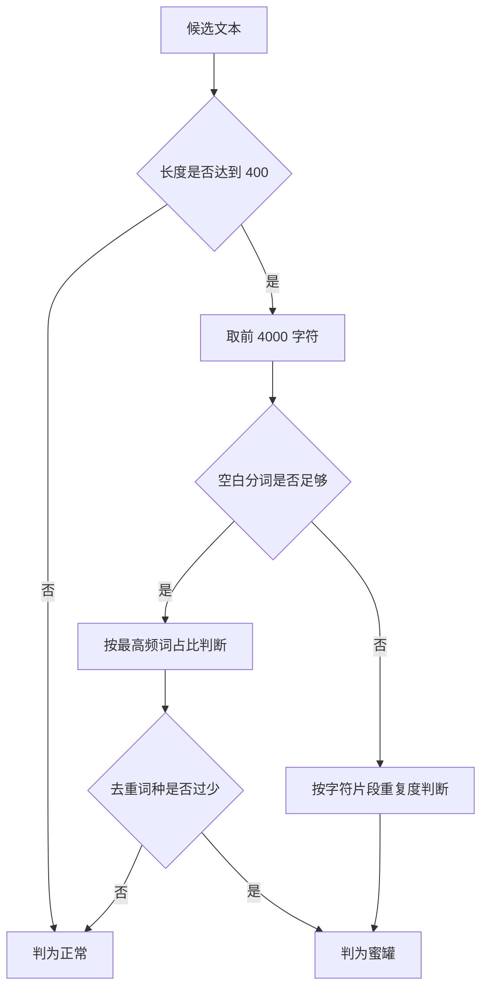
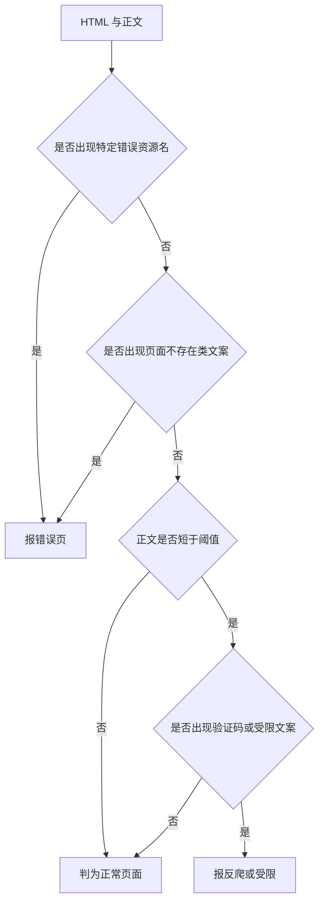
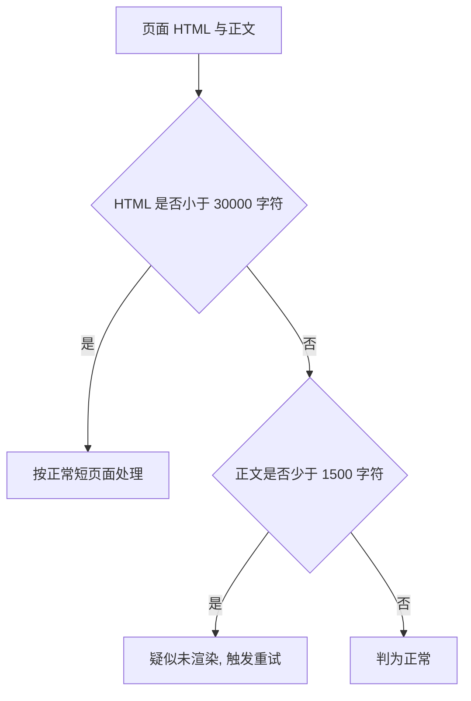
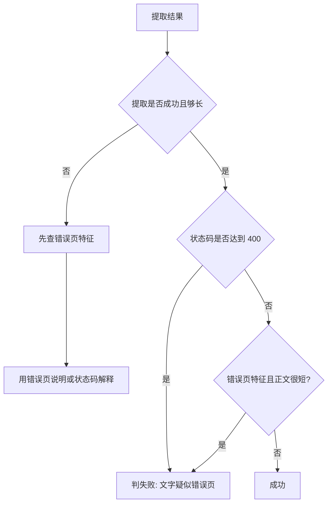

# 非正文页面的识别

最难排查的失败是「看起来成功」而不是报错：状态码 200，正文也过了长度门槛，内容却是一段与主题无关的短文。这类页面有三种常见来源——站点注入的字体指纹蜜罐、用自己的模板渲染的错误页，以及内容没渲染出来的骨架页。仓库对三种各写了一支判据，判断结果都会影响这次抓取是重试、报错还是采用。

三支判据的输入各不相同：蜜罐只看文本，错误页同时看 HTML 与正文，骨架页比较 HTML 大小与正文长度。理解它们的关键是每个判据在什么条件下才敢下结论。

## 蜜罐节点的三种特征

蜜罐是站点为字体指纹检测注入的隐藏节点，内容形如重复上万次的短串，长度足以骗过按长度挑选的规则（`src/better_crawler/extract.py`）。判定分两步，先看有没有空白分词：

| 情形 | 判据 |
| --- | --- |
| 文本短于 400 字符 | 直接不判，返回正常 |
| 几乎没有空白分词 | 取前 3、5、8 字符片段，某片段重复占比超一半即判蜜罐 |
| 有正常分词 | 单个短词（不超过 12 字符）占比超一半即判蜜罐 |
| 有正常分词 | 去重后词种少于 5 或不足总词数的 5% 亦判蜜罐 |

取样的范围只有前 4000 字符（`extract.py`），这是刻意限制：蜜罐特征重复度极高，前几千字符足够判断，也避免对长文本做全量统计。

## 错误页的固定特征

错误页判据检查 HTML 的前两万字符，命中任何一条特征就返回一条说明（`extract.py`）：

| 特征 | 含义 |
| --- | --- |
| 知乎沙漠插画的资源名 | 页面提示文章不存在或已删除 |
| 多种「页面不存在」类文案 | 站点用自己模板渲染的 200 错误页 |
| 正文短且出现验证码类词 | 疑似被反爬拦截要求人机验证 |
| 正文短且出现删除、违规、仅作者可见、需要登录 | 页面受限或已删除 |

判据的设计有一条边界：只在确有错误特征时返回说明，页面只是短（例如以图片为主的文章）时返回空，交给调用方按内容过短处理（`extract.py`）。这样做的原因是错误页的结论会直接写进失败原因，误报的代价比漏报高。

## 骨架页的两个阈值

骨架页指 HTML 骨架已经下载、但正文靠接口异步填充、接口失败后停在导航与弹窗状态的情况。判据是「结构不小、正文极少」，两个阈值都来自实测（`extract.py`）：

| 阈值 | 取值 | 作用 |
| --- | --- | --- |
| HTML 大小下限 | 30000 字符 | 低于此值不算骨架页 |
| 正文长度上限 | 1500 字符 | 高于此值视为正常 |

实测的两组数字说明了这个判据的由来：万方检索页在接口失败时 HTML 有 193KB 而正文只有 727 字符；成功时 HTML 481KB、正文 5720 字符（`extract.py`）。失败态的特点是结构一点没小，内容几乎清空。

## 状态码与正文长度一起看

调用方不会只看长度就宣布成功，它把状态码与提取结果放在一起判断（`fetcher.py`）：

| 状态码 | 正文长度 | 结论 |
| --- | --- | --- |
| 200 | 够长 | 成功 |
| 200 | 过短 | 先查是否错误页，否则报无有效正文 |
| 4xx | 够长 | 仍算失败，文字疑似错误页内容 |
| 4xx | 过短 | 用状态码解释失败原因 |

第二行里有一个顺序：提取失败时先问「是不是带 200 的错误页」，因为这类页面会返回正常状态码，只报「无有效正文」会把真实原因掩盖（`fetcher.py`）。第四行则是反过来，优先用状态码解释，2xx 且无正文才归为内容问题。

## 清理与归一化

判据都在归一化后的文本上做，归一化只做三件事：把连续空格与不换行空格压成一个空格、把三个以上换行压成两个、去掉首尾空白（`extract.py`）。

| 输入 | 输出 |
| --- | --- |
| 制表符与连续空格 | 单个空格 |
| 三个以上连续换行 | 两个换行 |
| 首尾空白 | 去掉 |

它不删标点、不做简繁转换，也不去重句子。蜜罐判据里的字符级统计因此看到的是压缩后的文本，「重复片段占比」不会因为空白字符而被稀释。

## 误报的代价与规避

三支判据的误报代价不同：把正常页面判成骨架页会白跑一次重试，判成错误页会把成功写成失败，判成蜜罐则会让一份候选直接作废、可能连带丢掉完整正文。

| 判据 | 误报后果 | 规避方式 |
| --- | --- | --- |
| 蜜罐 | 候选作废，可能落到更差的来源 | 长度门槛 400，统计只看前 4000 字符 |
| 错误页 | 成功被抓成失败 | 只在特征明确时返回，短页面不判 |
| 骨架页 | 多一次重试 | HTML 小的页面不判，避免轻量页误伤 |

规避的共同做法是给判据加前提条件，宁可不判也不误判。这与抓取整体「拿不到就重试、拿得到就用」的风格一致：判据的作用是把明显不对的结果筛掉，而不是追求精确分类。

## 易错点

| 易错点 | 现象 | 判据 |
| --- | --- | --- |
| 按长度挑到蜜罐 | 正文是重复短串 | 看是否过了蜜罐判据 |
| 只看状态码 | 200 的错误页被当成成功 | 看错误页特征是否命中 |
| 只查一次内容 | 骨架页被判成正常短页面 | 看 HTML 大小与正文比例 |
| 以为短页面都是错误 | 图集文章被判失败 | 看判据是否要求错误特征 |
| 在原始文本上统计重复度 | 空白字符稀释占比 | 先归一化再判 |

## 小结

### 核心概念

- 蜜罐判据分字符级与词级两条路，取样只有前 4000 字符。
- 错误页判据识别 200 状态码下的伪装，只在特征明确时下结论。
- 骨架页判据用「结构大、正文少」两个实测阈值。
- 调用方把状态码、正文长度与错误特征放在一起判断。

### 设计权衡

| 决策 | 选择 | 收益 | 代价 |
| --- | --- | --- | --- |
| 蜜罐判据 | 阈值加取样 | 快且稳 | 极短蜜罐不会被发现 |
| 错误页判据 | 关键词匹配 | 可解释 | 新错误页要补关键词 |
| 骨架页判据 | 两个实测阈值 | 针对性强 | 阈值随站点结构漂移 |
| 归一化 | 只压空白 | 不改动语义 | 不做去重与标点处理 |

## 练习

### 基础题

1. 蜜罐判据在文本多短时不作判断，为什么？
2. 错误页判据在哪两种情况下分别检查哪些关键词？
3. 骨架页判据的两个阈值来自哪组实测数据？

### 挑战题

4. 为错误页判据设计一份可维护的关键词表结构，说明如何避免误报。

5. 说明为什么错误页判据在正文短于阈值时才检查验证码类关键词。

6. 设计一个实验区分「骨架页」与「本来就短的文章」，给出判据与预期数据。

### 附：本页引用的路径

| 路径 | 用途 |
| --- | --- |
| `src/better_crawler/extract.py` | 蜜罐、错误页与骨架页三支判据及归一化 |
| `src/better_crawler/fetcher.py` | 状态码与正文的联合判断、重试与兜底 |

（引用的路径以 /mnt/d/better-crawler-4-agent 为根。）