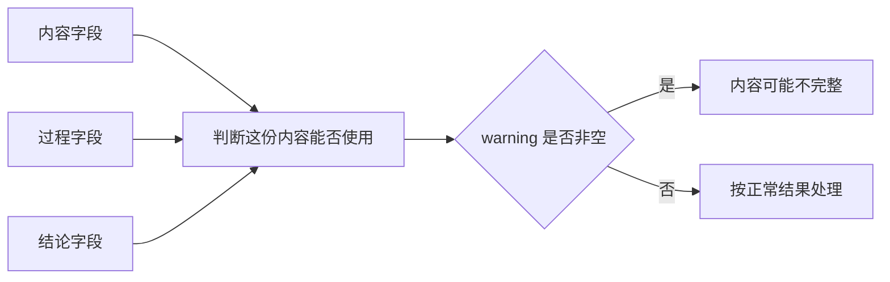
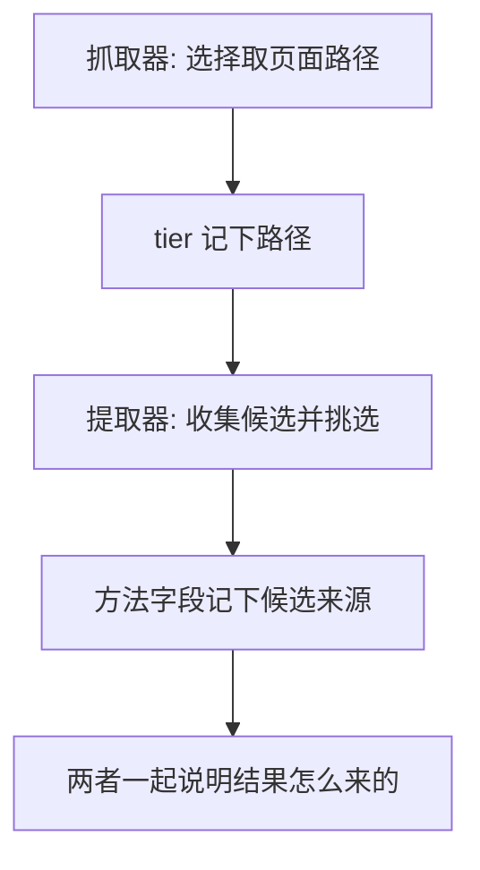
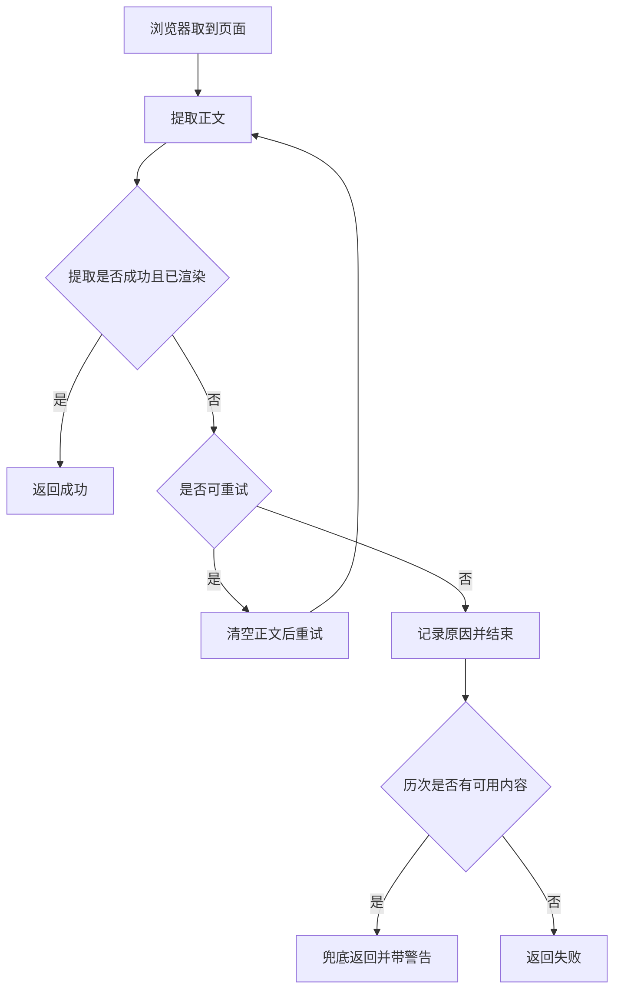

# 提取结果的判定与重试

一次抓取返回 `ok: true` 但 `warning` 非空，说明正文是重试之后用历次最完整的一份兜底的，可能并不完整。要判断这份内容能不能用，需要读懂结果里的几个字段：来源层级、状态码、尝试记录与截断标记。

这些字段由两层代码共同填写：抓取器负责选择路径与重试，提取器负责给出正文与内部来源标记。分清这两层，才能知道一个结果是「哪条路拿到的」以及「失败发生在哪一步」。

## 结果里的判断字段

结果对象的字段可以分成三组（`src/better_crawler/fetcher.py:36-49`）：

| 组 | 字段 | 作用 |
| --- | --- | --- |
| 内容 | 正文、标题、截断前长度 | 判断拿到什么 |
| 过程 | 来源层级、状态码、耗时、尝试记录 | 判断怎么拿到的 |
| 结论 | 是否成功、错误说明、警告 | 判断能不能用 |

其中三个字段需要专门解释：`content_length` 是截断前的真实长度，返回的正文可能因为字符上限被截短，`truncated` 单独标记这一点（`fetcher.py:51-67`）；`warning` 非空表示拿到了内容但可能不完整（`fetcher.py:47`）；`attempts` 是按层记录的尝试流水（`fetcher.py:49`）。

| 字段 | 取值形态 | 常见误读 |
| --- | --- | --- |
| `tier` | 抓取层级名或空 | 当成提取器内部的方法名 |
| `status` | 整数或空 | 以为一定是最后一层的状态码 |
| `warning` | 空或提示文本 | 与 `error` 混为一谈 |

## 两套来源标记的分工

「来源」在两个层次上各有一套标记，含义不同：

| 层次 | 标记 | 取值 |
| --- | --- | --- |
| 抓取器 | `tier` | 浏览器、通用算法、指纹兜底或空 |
| 提取器 | 方法字段 | 通用算法、某个选择器、最大文本块 |

抓取层级说明这次走的是哪条取页面的路（`fetcher.py:42`），提取方法说明正文是哪个候选胜出的（`extract.py:70-77`）。排查质量问题时先看前者确认路径，再看后者确认候选；两者都为空时，说明这份结果不是正常路径产出的。

## 状态码以拿到正文的那一层为准

结果里的状态码取自「实际取到正文的那一层」，而非最后一层（`fetcher.py:343-346`）。原因是浏览器层可能返回 502，而正文其实是从静态路径取到的，沿用 502 会让调用方误判。

| 情形 | 状态码字段 |
| --- | --- |
| 浏览器层拿到正文 | 浏览器层的状态码 |
| 静态路径拿到正文 | 该次请求的状态码 |
| 该层没提供状态码 | 置空，表示未知 |

这条约定与上一页讲的联合判断配合：调用方拿到状态码后还要与正文长度、错误特征一起看，因此状态码的来源必须与正文来源一致，否则两个信号会互相矛盾。
## 重试与兜底

浏览器路径带重试，重试是否有意义由一个函数判断（`fetcher.py:81-94`）：

| 情形 | 是否重试 | 理由 |
| --- | --- | --- |
| 5xx、429 | 是 | 服务端异常或限流，换个时刻可能就好 |
| 4xx（404、403 等） | 否 | 确定性失败，重试只是再加载一次 |
| 正文过短或未渲染 | 是 | 接口概率性失败，重试常能拿到 |

重试时先清空已提取的正文再去取页面，清空动作保留尝试记录（`fetcher.py:71-78`、`:185`、`:192`）。如果重试用尽仍未拿到正常内容，就用历次里最完整的一份兜底，标为成功但带上警告，让调用方自己判断（`fetcher.py:194-199`）。

静态路径另有一套冷却机制：某个域名上的通用算法连续失败后，会在一段时间内跳过这条路径（`fetcher.py:411-417`）。它的作用是避免在已知失效的站点上反复付出代价，代价是冷却期内该站点的静态快路径不再可用。

## 逐层尝试记录

`attempts` 是按顺序记录的尝试流水，每条包含层级、是否成功与原因（`fetcher.py:161-163`、`:174-177`、`:303-326`）。重试场景下记录由调用方统一写入，避免每次尝试都留一条成功记录（`fetcher.py:294-295`）。

| 记录字段 | 含义 |
| --- | --- |
| 层级 | 这次尝试走的是哪条路 |
| 是否成功 | 该层是否产出可用正文 |
| 原因或字数 | 失败原因，或成功时的字符数 |

读这份流水的方式是看最后一条与失败原因的组合：最后一条失败且原因是错误页，说明站点侧问题；多条同一层记录，说明发生了重试；成功记录里字数很小，说明内容可能只是刚过门槛。

## 截断与长度

返回内容可以按字符上限截断，但截断不改变 `content_length` 的含义（`fetcher.py:51-67`）：

| 字段 | 截断前还是截断后 |
| --- | --- |
| 正文 | 可能是截断后的片段 |
| `content_length` | 截断前的真实长度 |
| `truncated` | 标记本次是否截断过 |

这个区分的用途是判断「内容本来就短」还是「被上限截短」：前者要看判据是否放过了它，后者需要放宽上限重新取。只看正文长度会把两种情况混在一起。

## 调试一支提取器的顺序

遇到「拿到了但不对」时，按下面的顺序推进最省时间：

| 步骤 | 看什么 | 结论方向 |
| --- | --- | --- |
| 1 | 来源层级 | 确认走的是哪条路径 |
| 2 | 尝试记录 | 是否重试过、失败原因是什么 |
| 3 | 提取方法字段 | 正文来自哪个候选 |
| 4 | 正文开头与长度 | 是错误页、蜜罐还是骨架 |
| 5 | 判据阈值 | 是否被某个阈值的边界卡住 |
| 6 | 单页复现 | 用同一条 URL 重跑并对比 |

## 易错点

| 易错点 | 现象 | 判据 |
| --- | --- | --- |
| 把警告当失败 | 内容其实可用只是可能不全 | 看成功标记与警告是否同时存在 |
| 把抓取层级当提取方法 | 两套标记语义不同 | 看字段来源是哪个模块 |
| 用截断后长度判断完整性 | 真实长度在另一个字段 | 看长度字段与截断标记 |
| 看到重试就以为会重试一切 | 4xx 不重试 | 看重试判据 |
| 忽略静默冷却 | 同一域名静态路径短期内不生效 | 看冷却记录 |

## 小结

### 核心概念

- 结果分内容、过程与结论三组字段，警告非空说明内容可能不完整。
- 抓取层级与提取方法是两套标记，分别说明路径与候选。
- 状态码以实际拿到正文的那一层为准。
- 重试只对临时问题有意义，兜底结果会带警告返回。

### 设计权衡

| 决策 | 选择 | 收益 | 代价 |
| --- | --- | --- | --- |
| 重试范围 | 只重试临时失败 | 不做无用的重复加载 | 确定性失败只能报错 |
| 兜底结果 | 标成功并带警告 | 尽量不丢内容 | 调用方必须读警告 |
| 记录方式 | 重试时统一写流水 | 语义不重复 | 代码分支多一处 |
| 静态冷却 | 按域名记失败时间 | 避免反复失败 | 冷却期内少一条路径 |

## 练习

### 基础题

1. 哪些失败可以重试，哪些重试没有意义？
2. 兜底结果为什么标为成功而不是失败？
3. `content_length` 与截断标记分别说明什么？

### 挑战题

4. 设计一份结果消费方的判断流程，要求能区分「内容不全」与「内容不对」。

5. 说明静态路径冷却的收益与风险，并给出一个更细的冷却策略。

6. 为一次抓取设计日志字段，使事后仅凭日志就能还原重试过程。

### 附：本页引用的路径

| 路径 | 用途 |
| --- | --- |
| `src/better_crawler/fetcher.py` | 结果字段、重试判据、兜底、尝试流水、静态冷却（`:36-94`、`:150-199`、`:281-351`、`:411-417`） |
| `src/better_crawler/extract.py` | 提取方法的取值与结果结构（`:70-77`） |

（引用的路径以 /mnt/d/better-crawler-4-agent 为根。）