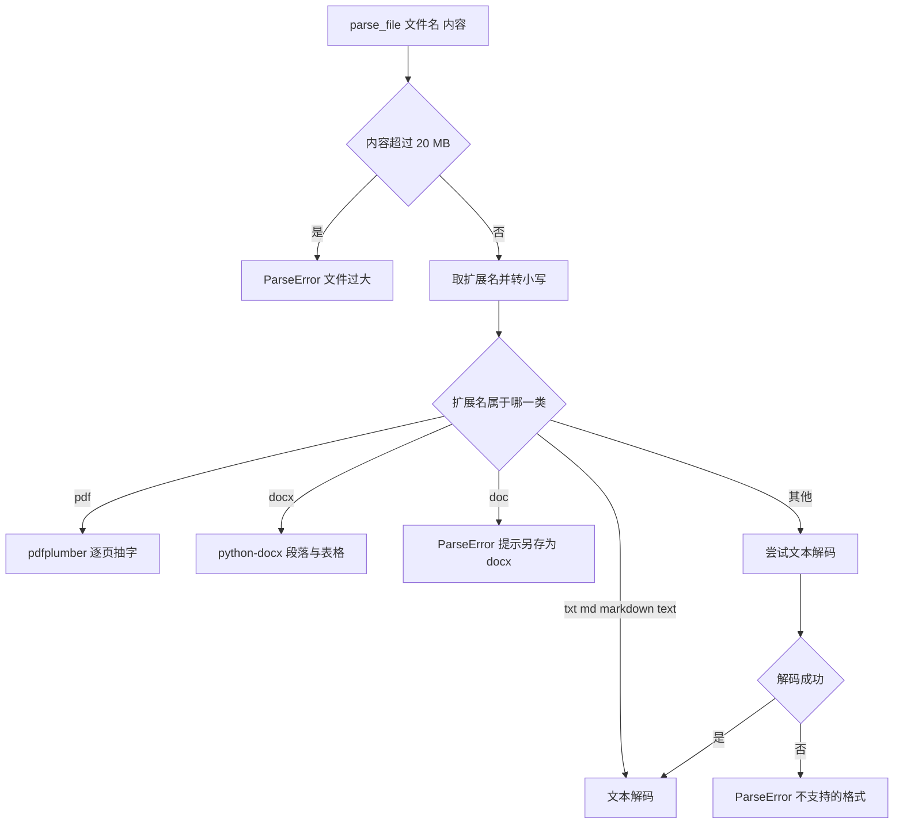
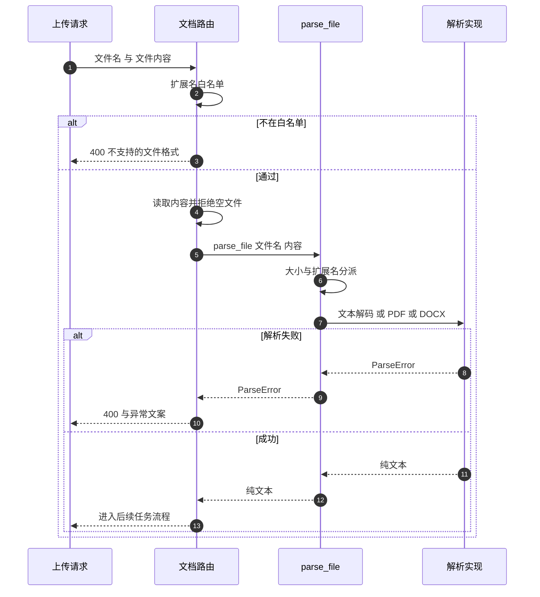

# 格式分派与文本解码

用户上传一份资料，希望它变成卡片。第一步是把文件变成一段纯文本，AI 分析要等这一步完成：PDF 要逐页抽字，DOCX 要读段落和表格，纯文本文件要猜编码。仓库把这一步放在 `backend/documents/parser.py` 里，对外只有一个函数 `parse_file(filename, content)`。

分派逻辑按扩展名进行，先判断大小与格式，再调用对应的解析函数。路由层在调用之前又做了一次格式检查，两道白名单并不完全重合，这决定了哪些扩展名实际能用。

## 1. 入口与大小上限

`parse_file` 的第一件事是查大小（`backend/documents/parser.py`）：

```python
_MAX_FILE_SIZE = 20 * 1024 * 1024  # 20 MB 文件大小上限
if len(content) > _MAX_FILE_SIZE:
    raise ParseError(f"文件过大（{len(content) / 1024 / 1024:.1f} MB），上限 20 MB")
```

上限是 20 MB，超过就抛 `ParseError`，错误信息里带上实际大小。注意判断发生在内容已经读入内存之后：路由先 `await file.read()` 再调用解析，因此超大文件仍然会先占用内存。

## 2. 扩展名分派

扩展名取自文件名最后一个点之后的部分，统一转小写（`parser.py`）。分派表如下：

| 扩展名 | 处理 | 位置 |
| --- | --- | --- |
| `txt`、`md`、`markdown`、`text` | 文本解码 | `parser.py` |
| `pdf` | pdfplumber 抽字 | `parser.py` |
| `docx` | python-docx 读段落与表格 | `parser.py` |
| `doc` | 直接拒绝并给出另存为提示 | `parser.py` |
| 其他 | 尝试文本解码，失败再报错 | `parser.py` |

老版 `.doc` 的处理是直接抛出固定提示，不做解析尝试（`parser.py`）：说明该格式不支持，建议用 Word 或 WPS 另存为 `.docx`。这类错误对用户是可操作的。



## 3. 文本解码的编码回退链

解码失败不能直接放弃，按顺序试几种编码，示意如下：

```python
# 示意：编码探测与回退链
def decode_text(raw: bytes) -> str:
    for enc in ("utf-8", "utf-8-sig", "gb18030", "latin-1"):
        try:
            return raw.decode(enc)
        except UnicodeDecodeError:
            continue
    return raw.decode("utf-8", errors="replace")
```

纯文本文件本身不携带编码信息，只能靠试探。`utf-8-sig`处理带 BOM（字节顺序标记）的文件——Windows 记事本常写这个前缀，不解掉它会在正文开头留下一个不可见字符。`latin-1`放在最后是因为它把任意字节都映射成字符、永不失败，一旦提前使用就等于放弃探测；末尾的`errors="replace"`保证最坏情况也能返回可读文本而不是抛异常，代价是出现替换符时原文已经丢失。

纯文本没有自描述编码，函数按固定顺序尝试（`parser.py`）：

```python
for encoding in ("utf-8", "gbk", "gb2312", "latin-1"):
    try:
        return content.decode(encoding)
    except UnicodeDecodeError:
        continue
raise ParseError("无法解码文件，请确认文件编码为 UTF-8 或 GBK")
```

| 顺序 | 编码 | 覆盖场景 |
| --- | --- | --- |
| 1 | `utf-8` | 现代编辑器与网页复制内容 |
| 2 | `gbk` | 中文 Windows 常见编码 |
| 3 | `gb2312` | `gbk` 的子集，多为历史文件 |
| 4 | `latin-1` | 任意字节都能解码，兜底 |

`latin-1` 会把任何字节序列解成字符串，因此循环不会走到最后那条 `raise`：实际行为是「无法识别的内容变成乱码文本」，而不是报错。乱码会一路传进 AI 分析环节，表现为生成的卡片内容不可读。

## 4. 未知扩展名的处理

不在白名单里的扩展名不会立刻拒绝，而是先当成文本试一次（`parser.py`）。只有解码抛 `UnicodeDecodeError` 时才报「不支持的文件格式」。由于回退链最后有 `latin-1`，这条报错路径同样很难触发：二进制文件通常会被解成乱码并通过。

| 输入 | 期望 | 实际 |
| --- | --- | --- |
| 未知文本类扩展名 | 按文本解析 | 成功 |
| 未知二进制扩展名 | 拒绝 | 解成乱码后成功 |
| 文件名没有点 | 拒绝 | 按文本解析 |

## 5. 路由层的第二道白名单

上传接口在调用解析之前先把扩展名筛一遍（`backend/routes/documents.py`）：

```python
ext = filename.rsplit(".", 1)[-1].lower() if "." in filename else ""
if ext not in ("txt", "md", "markdown", "pdf", "docx"):
    raise HTTPException(status_code=400, detail=f"不支持的文件格式 .{ext}（支持: txt, md, pdf, docx）")
```

两份白名单的差别在于 `text`：解析器认它，路由不认。由于路由先执行，`.text` 文件在接口层就被挡下，解析器里那条分支在正常请求路径中到不了。

| 层 | 白名单 | 作用 |
| --- | --- | --- |
| 路由 | `txt md markdown pdf docx` | 返回 400 与提示 |
| 解析器 | 上面四项加 `text`，其余尝试解码 | 兜底与解析 |

路由随后还会读内容并拒绝空文件（`documents.py`），然后才调用解析。解析层的 `ParseError` 被捕获后转成 400，错误文案直接来自异常消息（`documents.py`）。



## 6. 解析之后

`parse_file` 只负责产出文本，不写文件也不碰数据库。路由拿到文本后记录长度，再做积分与并发校验，最后把任务交给后台流水线（`documents.py`）。因此这一层的输出质量直接决定后续分析的上限：乱码、丢表格、丢页都会被当成正常输入。

| 职责 | 归属 |
| --- | --- |
| 大小与格式校验 | 解析层与路由层各一次 |
| 文本提取 | `parser.py` |
| 积分与并发校验 | `routes/documents.py` |
| 卡片生成 | 后台流水线任务 |

## 7. 易错点

| 易错点 | 现象 | 位置 |
| --- | --- | --- |
| 以为超限文件不会占内存 | 先读入再判断 | `documents.py` |
| 以为能识别乱码 | `latin-1` 兜底使其通过 | `parser.py` |
| 以为未知格式一定会被拒 | 先按文本尝试 | `parser.py` |
| 用 `.text` 上传 | 路由白名单不含它 | `documents.py` |
| 以为 `.doc` 会被尽力解析 | 直接抛提示 | `parser.py` |
| 把 `ParseError` 与依赖缺失混为一谈 | 动态导入异常不被捕获 | `parser.py` |

## 小结

核心概念：

| 概念 | 内容 |
| --- | --- |
| 入口 | `parse_file(filename, content)` 返回纯文本 |
| 大小上限 | 20 MB，超限抛 `ParseError` |
| 分派 | 按扩展名选文本、PDF、DOCX |
| 编码链 | `utf-8` → `gbk` → `gb2312` → `latin-1` |
| 两道白名单 | 路由不含 `text`，解析器含 |
| 错误出口 | `ParseError` 由路由转 400 |

设计权衡：

| 决策 | 选择 | 收益 | 代价 |
| --- | --- | --- | --- |
| 未知扩展名 | 先按文本尝试 | 宽容、少误拒 | 二进制被解成乱码 |
| 编码回退 | 加 `latin-1` 兜底 | 永不报解码失败 | 乱码静默进入分析 |
| 大小校验 | 解析层内 | 逻辑集中 | 内存已在路由占用 |
| 白名单 | 两层各写 | 各层职责清晰 | 两处需同步维护 |

## 练习

基础题：

1. 文件大小上限是多少？在哪一步判断？
2. 扩展名分派支持哪些格式？
3. 文本解码的尝试顺序是什么？
4. 路由与解析器的白名单差在哪里？

挑战题：

5. 去掉 `latin-1` 兜底，说明需要新增什么判断来减少误拒。
6. 把大小校验提前到上传流阶段，给出实现思路与需要改的路由代码。
7. 统一两层白名单，说明以哪一层为准及其对既有客户端的影响。

---

### 附：本页引用的路径

| 路径 | 用途 |
| --- | --- |
| `backend/documents/parser.py` | 大小上限、扩展名分派、文本解码与两个解析实现 |
| `backend/documents/__init__.py` | 包导出 `parse_file` 与 `ParseError` |
| `backend/routes/documents.py` | 上传接口的白名单、空文件检查与错误转换 |
| `requirements.txt` | `pdfplumber` 与 `python-docx` 依赖声明 |
