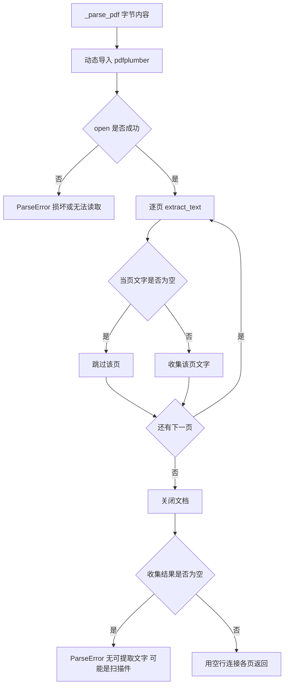
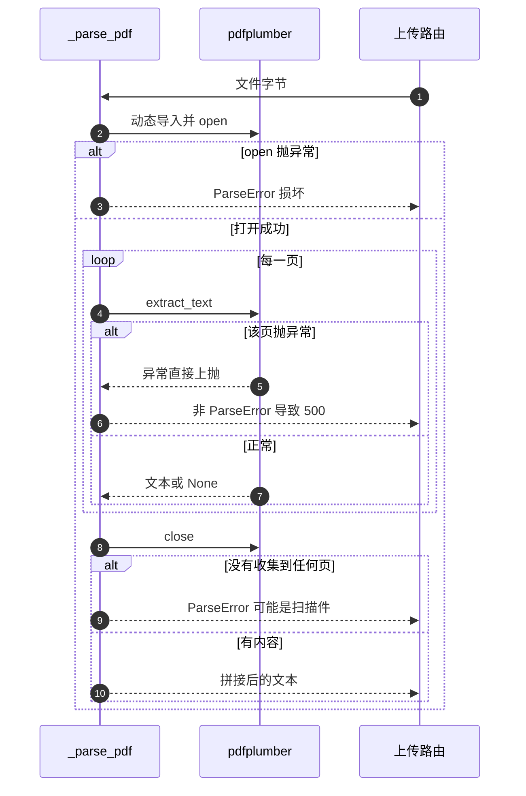

# PDF 文本提取

PDF 是一份排版指令而不是文本容器：文字被放在页面的坐标上，抽取工具要把它们按阅读顺序重新拼回段落。`_parse_pdf` 用 pdfplumber 做这件事，逻辑是打开文档、逐页取文字、跳过空页、用双换行拼接。

代码只有二十多行，边界条件却比纯文本多：文件损坏、扫描件、单页解析失败、依赖缺失，各自的表现与错误类型都不一样。

## 1. 提取流程

```python
def _parse_pdf(content: bytes) -> str:
    from io import BytesIO
    import pdfplumber
    try:
        doc = pdfplumber.open(BytesIO(content))
    except Exception as e:
        raise ParseError(f"PDF 文件损坏或无法读取: {e}")
    pages: list[str] = []
    try:
        for page in doc.pages:
            text = page.extract_text()
            if text and text.strip():
                pages.append(text)
    finally:
        doc.close()
    if not pages:
        raise ParseError("PDF 文件中没有可提取的文字（可能是扫描图片版，不支持 OCR）")
    return "\n\n".join(pages)
```

| 步骤 | 行为 |
| --- | --- |
| 导入依赖 | 函数内动态 `import pdfplumber` |
| 打开 | `pdfplumber.open(BytesIO(content))`，失败转 `ParseError` |
| 逐页 | `extract_text()`，空白页不收集 |
| 关闭 | `finally` 中 `doc.close()` |
| 合并 | 页之间用空行分隔 |



## 2. 空页与扫描件

空页不会报错，只是不进入结果：图片页、封面、纯分隔页都会被跳过。如果整本 PDF 一页都没抽出文字，函数抛出固定提示（`parser.py:93-94`），说明可能是扫描图片版且不支持 OCR。

| 输入 | 结果 |
| --- | --- |
| 文字版 PDF | 逐页文本，空页跳过 |
| 扫描图片版 | `ParseError` 提示不支持 OCR |
| 空白页夹在中间 | 该页被忽略，其余正常 |
| 全书为空 | `ParseError` |

这条提示是解析层少见的可操作错误：用户看到后可以改用带文字层的 PDF，或先做 OCR 再上传。

## 3. 依赖导入的位置

`pdfplumber` 在函数内部导入（`parser.py:77`），不在模块顶部。这样做让未安装依赖的环境也能加载整个解析模块，只有在解析 PDF 时才触发导入。

代价是缺依赖时抛的是 `ImportError`，不是 `ParseError`。路由只捕获 `ParseError`（`backend/routes/documents.py:60-63`），因此未安装 `pdfplumber` 的部署会在上传 PDF 时返回 500，而不是 400 与可读提示。依赖本身已在 `requirements.txt` 声明（`requirements.txt:19`）。

| 情况 | 异常类型 | 路由表现 |
| --- | --- | --- |
| 文件损坏 | `ParseError` | 400 与原因 |
| 依赖缺失 | `ImportError` | 500 |
| 依赖版本不兼容 | `ImportError` 或内部异常 | 500 |

## 4. 单页异常没有被捕获

逐页循环在 `try/finally` 里，只保证关闭文档，不捕获 `extract_text()` 抛出的异常。某一页结构异常时，异常会直接穿出 `_parse_pdf`，既不是 `ParseError` 也没有关闭之外的处理，路由把它当未预期错误处理。

| 位置 | 是否捕获 | 后果 |
| --- | --- | --- |
| `pdfplumber.open` | 是，转 `ParseError` | 400 |
| 逐页 `extract_text` | 否 | 500 |
| `doc.close()` | `finally` 保证执行 | 资源释放 |

要让它变成可读错误，需要在循环内逐页兜底：单页失败记录并跳过，或整体包装成 `ParseError`。



## 5. 抽取结果的固有损失

即使一切正常，`extract_text()` 的输出也不是原文的完整再现：

| 现象 | 原因 |
| --- | --- |
| 多栏内容交叉 | 抽取按坐标顺序而非栏位 |
| 表格变成一行行文字 | 未调用表格抽取接口 |
| 段内换行被保留 | 页面上的硬换行就是换行 |
| 页眉页脚重复 | 每页都被完整抽取 |
| 公式与图片丢失 | 只抽文字对象 |

`pdfplumber` 提供 `extract_tables()` 等接口，这份实现没有使用，因此表格结构在解析阶段就已经消失。对以表格为主的技术文档，后续 AI 分析只能看到被压平的行文本。

## 6. 加密与异常文件

加密 PDF 在 `open` 阶段可能要求密码，未提供密码时通常直接抛异常并被包装成「损坏或无法读取」。这个文案对用户不够准确：文件可能没坏，只是需要密码。区分两者需要在打开前读取文档信息或捕获特定异常类型。

| 文件 | 表现 |
| --- | --- |
| 有密码的 PDF | 报「损坏或无法读取」 |
| 截断的 PDF | 同上 |
| 结构异常的 PDF | 可能在 open 或逐页阶段失败 |

## 7. 易错点

| 易错点 | 现象 | 位置 |
| --- | --- | --- |
| 认为缺依赖会返回 400 | `ImportError` 不被捕获 | `parser.py:77` 与 `documents.py:62` |
| 认为任何解析失败都是 `ParseError` | 单页异常直接上抛 | `parser.py:85-91` |
| 期待表格结构保留 | 只调用 `extract_text` | `parser.py:87` |
| 把加密文件当成损坏 | 文案统一 | `parser.py:81-82` |
| 认为空页会导致失败 | 空页只被跳过 | `parser.py:88-89` |

## 小结

核心概念：

| 概念 | 内容 |
| --- | --- |
| 工具 | `pdfplumber`，函数内动态导入 |
| 流程 | 打开、逐页抽字、跳过空页、关闭、拼接 |
| 空结果 | 抛 `ParseError` 提示不支持 OCR |
| 打开失败 | 包装成「损坏或无法读取」 |
| 未覆盖 | 依赖缺失与单页异常都不是 `ParseError` |

设计权衡：

| 决策 | 选择 | 收益 | 代价 |
| --- | --- | --- | --- |
| 依赖导入 | 函数内 | 模块可加载 | 缺依赖时报错类型不对 |
| 逐页策略 | 只抽文本 | 实现短 | 表格与版式信息丢失 |
| 空页 | 跳过 | 减少噪声 | 空白页信息被无声忽略 |
| 无 OCR | 直接报错 | 提示明确 | 扫描资料无法用 |

## 练习

基础题：

1. `_parse_pdf` 的步骤顺序是什么？
2. 空页与空文档分别怎么处理？
3. `pdfplumber` 在哪里导入？缺依赖时路由返回什么？
4. 打开失败时抛出的异常类型与文案是什么？

挑战题：

5. 让单页异常不再导致 500：给出逐页兜底与整体包装两种做法并比较。
6. 接入表格抽取，说明输出格式如何与现有纯文本拼接共存。
7. 区分加密文件与损坏文件，说明需要在打开前读取哪些信息。

---

### 附：本页引用的路径

| 路径 | 用途 |
| --- | --- |
| `backend/documents/parser.py` | `_parse_pdf` 全文（:74-96） |
| `backend/routes/documents.py` | `ParseError` 转 400（:60-63） |
| `requirements.txt` | `pdfplumber` 版本声明（:19） |
