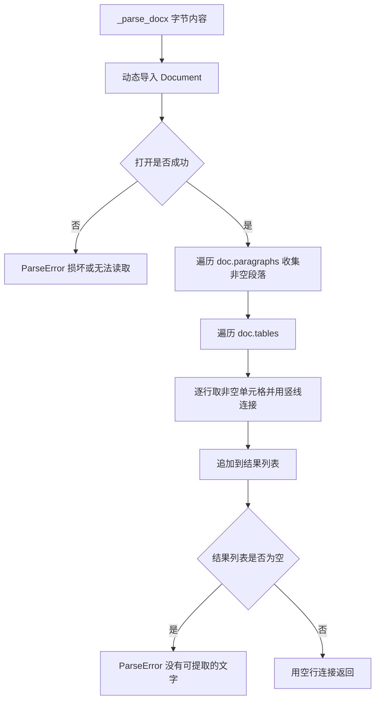
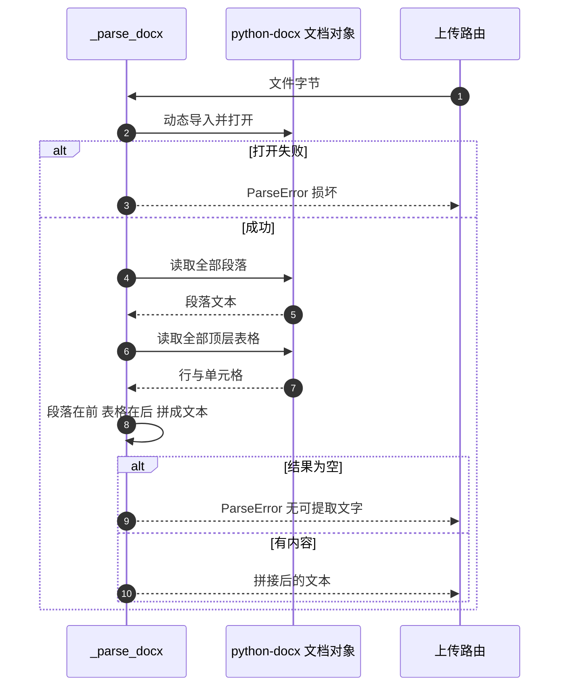

# DOCX 段落与表格提取

DOCX 是 zip 包里的 XML，结构信息完整：段落、表格、图片、页眉各有节点。`_parse_docx` 只取两类内容——段落与表格——并把它们压成一段段纯文本。做法是先用 `doc.paragraphs` 收集所有段落，再遍历 `doc.tables` 把每行拼成一条竖线分隔的记录，最后统一追加。

这段逻辑很短，但它决定了 DOCX 里哪些信息能进入后续分析：段落与表格能，图片、文本框、脚注、页眉页脚不能；表格的二维结构被压成一行行文字；内容在文档中的先后顺序也不再保留。

## 1. 提取流程

```python
def _parse_docx(content: bytes) -> str:
    from io import BytesIO
    from docx import Document
    try:
        doc = Document(BytesIO(content))
    except Exception as e:
        raise ParseError(f"DOCX 文件损坏或无法读取: {e}")

    paragraphs: list[str] = []
    for para in doc.paragraphs:
        text = para.text.strip()
        if text:
            paragraphs.append(text)

    for table in doc.tables:
        for row in table.rows:
            row_texts = [cell.text.strip() for cell in row.cells if cell.text.strip()]
            if row_texts:
                paragraphs.append(" | ".join(row_texts))

    if not paragraphs:
        raise ParseError("DOCX 文件中没有可提取的文字内容")
    return "\n\n".join(paragraphs)
```

| 步骤 | 行为 |
| --- | --- |
| 导入依赖 | 函数内 `from docx import Document` |
| 打开 | `Document(BytesIO(content))`，失败转 `ParseError` |
| 段落 | 去空白后非空才收集 |
| 表格 | 逐行、逐单元格取值，非空单元格用 ` | ` 连接 |
| 空结果 | 抛 `ParseError` |
| 合并 | 所有条目用空行分隔 |



## 2. 段落与表格的顺序问题

代码先跑完段落循环，再跑表格循环。对一份「段落、表格、段落」交替的文档，输出会变成「全部段落、全部表格」，中间那张表被移到了文末。

| 原始顺序 | 提取后的顺序 |
| --- | --- |
| 段落 A、表格 T、段落 B | 段落 A、段落 B、表格 T |
| 表格 T、段落 A | 段落 A、表格 T |
| 只有表格 | 表格行 |

顺序错乱对下游分析的影响是上下文断裂：解释表格的段落被排到了别处，AI 看不到「表前一句说了什么」。要保序需要改用文档体的迭代接口，按元素出现顺序逐个处理。

## 3. 表格行的拼接规则

每个非空单元格的文本去空白后，用竖线加空格连接（`parser.py:116-120`）：

```text
| 原始表格 | 提取结果 |
| 名称 | 数值 |
| 电压 | 24 V |
```

对应提取出的两条记录是 `名称 | 数值` 与 `电压 | 24 V`。空单元格被直接丢弃，因此列的对应关系可能错位：一行中间的空格消失后，后续单元格会左移。

| 情况 | 结果 |
| --- | --- |
| 单元格为空 | 被过滤，不占位 |
| 整行为空 | 不产生记录 |
| 单元格含换行 | 换行保留在单元格文本里 |
| 合并单元格 | 按 python-docx 的表格模型，同一文本会在多个网格位置返回，行内可能重复 |

## 4. 只覆盖顶层表格

`doc.tables` 返回文档体的顶层表格。嵌套在单元格里的表格不会被遍历，表格里的图片也不会被识别，因为实现只取 `cell.text`。

| 内容 | 是否提取 |
| --- | --- |
| 顶层表格文字 | 是 |
| 嵌套表格 | 否 |
| 单元格内图片 | 否 |
| 页眉页脚 | 否 |
| 文本框与形状 | 否 |
| 脚注与批注 | 否 |

图片型扫描页在 DOCX 里同样抽不出文字，最终会落到「没有可提取的文字内容」这条错误上。



## 5. 依赖导入与异常类型

与 PDF 一样，`python-docx` 在函数内导入（`parser.py:102`），依赖已在 `requirements.txt` 声明（`requirements.txt:20`，版本固定为 `1.2.0`）。缺依赖时抛 `ImportError`，路由只捕 `ParseError`，因此返回 500 而不是可读的 400。

打开阶段的异常被包装成「DOCX 文件损坏或无法读取」；段落与表格遍历阶段的异常没有捕获，遇到结构异常的文件会直接上抛。

| 阶段 | 异常处理 | 路由表现 |
| --- | --- | --- |
| 导入依赖 | 无 | 500 |
| `Document(...)` | 转 `ParseError` | 400 |
| 段落与表格遍历 | 无 | 500 |

## 6. 大小与压缩比

20 MB 上限在 `parse_file` 里按上传字节数判断（`parser.py:15`、`:43`）。DOCX 是压缩包，字节数小但解压后可能很大，解析时会一次性展开到内存。上传接口没有额外检查解压后体积，这与会话导入接口的 200 MB 解压上限形成对照（见 29/02-会话数据库 单元）。

| 限制 | 位置 | 粒度 |
| --- | --- | --- |
| 20 MB | `documents/parser.py` | 上传字节 |
| 200 MB | `routes/session_io.py` | 解压后总量 |

## 7. 易错点

| 易错点 | 现象 | 位置 |
| --- | --- | --- |
| 期待内容保持原顺序 | 段落全部排在表格前 | `parser.py:109-120` |
| 以为空单元格会占位 | 被过滤导致列错位 | `parser.py:118` |
| 以为嵌套表格会被读出 | 只遍历顶层 | `parser.py:116` |
| 缺依赖时期待 400 | `ImportError` 落到 500 | `parser.py:102` |
| 把图片版 DOCX 当成可解析 | 报没有可提取的文字 | `parser.py:122-123` |

## 小结

核心概念：

| 概念 | 内容 |
| --- | --- |
| 工具 | `python-docx`，函数内动态导入 |
| 提取范围 | 顶层段落与顶层表格 |
| 行拼接 | 非空单元格用竖线连接 |
| 顺序 | 段落整体先于表格整体 |
| 未覆盖 | 嵌套表格、图片、页眉页脚、文本框 |
| 错误 | 打开失败转 `ParseError`，其余异常上抛 |

设计权衡：

| 决策 | 选择 | 收益 | 代价 |
| --- | --- | --- | --- |
| 遍历方式 | 段落与表格分开 | 代码短、易读 | 文档顺序丢失 |
| 表格表达 | 竖线拼接 | 结构可读 | 空列错位、跨行合并丢失 |
| 覆盖范围 | 只顶层 | 实现简单 | 复杂文档信息缺失 |
| 依赖导入 | 函数内 | 模块可加载 | 缺依赖时报错类型不对 |

## 练习

基础题：

1. `_parse_docx` 提取哪两类内容？
2. 表格行是怎么拼接的？空单元格如何处理？
3. 段落与表格的输出顺序是什么？
4. 打开失败时抛出的异常类型是什么？

挑战题：

5. 改用按文档顺序遍历元素，说明需要的接口与对现有输出格式的影响。
6. 支持嵌套表格，给出递归提取与分隔符设计。
7. 补一道解压体积上限，说明与 20 MB 上传上限的关系及实现位置。

---

### 附：本页引用的路径

| 路径 | 用途 |
| --- | --- |
| `backend/documents/parser.py` | `_parse_docx` 全文（:99-125）与大小上限 |
| `backend/routes/documents.py` | `ParseError` 转 400 与上传流程 |
| `requirements.txt` | `python-docx` 版本声明（:20） |
| `backend/routes/session_io.py` | 另一处解压体积限制，用于对照 |
