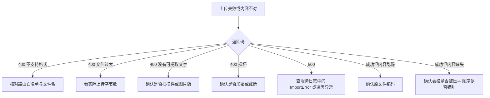
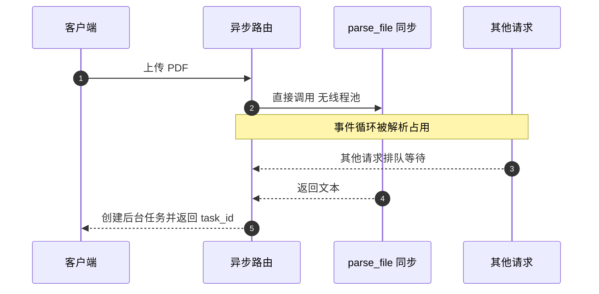

# 文档解析的易错点与排查

上传文档失败时，用户只看到一条文案，排查者需要先分清它来自哪一层：路由的格式检查、解析层的大小与格式判断，还是没被捕获的运行时异常。前两类返回 400 与可读原因，后一类返回 500 与通用文案，两者的排查路径完全不同。

这一篇先列风险，再给一条从返回码到具体原因的排查顺序。

## 1. 风险清单

| 风险 | 位置 | 现象 |
| --- | --- | --- |
| 大小判断在读取之后 | `routes/documents.py` 与 `parser.py` | 超大文件先占内存再被拒 |
| 同步解析在异步路由里直接调用 | `routes/documents.py` | 大文件阻塞事件循环 |
| 依赖动态导入抛 `ImportError` | `parser.py` | 缺依赖返回 500 |
| 单页与遍历异常未捕获 | `parser.py` | 异常文件返回 500 |
| `latin-1` 兜底 | `parser.py` | 乱码静默通过 |
| 未知扩展名先按文本 | `parser.py` | 二进制解成乱码 |
| 两层白名单不一致 | `documents.py` 与 `parser.py` | `.text` 被路由挡下 |
| 扫描件无 OCR | `parser.py` | 「没有可提取的文字」 |
| 加密 PDF 与损坏同文案 | `parser.py` | 提示不准确 |
| 表格结构未抽取 | `parser.py` | 表格被压平 |
| DOCX 顺序丢失 | `parser.py` | 表格移到文末 |
| DOCX 解压体积无上限 | 同 20 MB 判断 | 压缩包展开占内存 |
| 错误文案含底层异常 | `documents.py` | 用户看到库内部信息 |

## 2. 排查顺序



| 返回 | 首个检查点 | 判定依据 |
| --- | --- | --- |
| 400 不支持格式 | 路由白名单 | 扩展名是否在册 |
| 400 过大 | 上传体积 | 是否超过 20 MB |
| 400 无文字 | 文件类型 | 扫描件或图片版 |
| 400 损坏 | 文件可读性 | 是否加密或截断 |
| 500 | 服务日志 | 缺依赖或库内部异常 |
| 500 之外的乱码 | 编码 | `latin-1` 是否兜底成功 |

## 3. 两类错误码的分界

分界靠"错误是否可预期"，示意如下：

```python
# 示意：可预期的输入问题返回 400，不可预期的运行时错误交给通用处理
try:
    text = parse_document(filename, content)
except ParseError as e:                   # 自己抛出的、有明确原因的
    raise HTTPException(400, detail=str(e))
except Exception:                         # 没料到的：记录堆栈，返回通用文案
    logger.exception("parse failed")
    raise HTTPException(500, detail="文档解析失败")
```

"可预期"指由输入直接决定、能给出修复建议的问题：格式不在白名单、超出大小上限、文件损坏。这类错误应当把原因回给用户并附 400。其余异常（依赖缺失、内存不足、未处理的库异常）返回 500 与通用文案，细节只进日志——把堆栈暴露给用户既无用又泄露实现。排查时先看错误码就能判断该查输入还是查服务端。

解析层主动抛的 `ParseError` 都被路由转成 400，错误文案取自异常消息（`documents.py`）。没有被包装的异常统一落到 500，例如：

| 场景 | 异常 | 返回 |
| --- | --- | --- |
| 大小超限 | `ParseError` | 400 |
| `.doc` 文件 | `ParseError` | 400 |
| PDF 打开失败 | `ParseError` | 400 |
| DOCX 打开失败 | `ParseError` | 400 |
| 缺 `pdfplumber` | `ImportError` | 500 |
| 某一页抽取异常 | 库内部异常 | 500 |
| DOCX 遍历异常 | 库内部异常 | 500 |

因此看到 500 时不要先怀疑格式，而应查日志确认是不是环境缺包或文件结构异常。

## 4. 乱码的成因

乱码几乎都来自编码兜底链的最后一档。`utf-8` 与 `gbk` 都失败后，`latin-1` 会把字节逐一直译成字符，函数返回「成功」，乱码文本进入后续流程。

| 原文件编码 | 命中档位 | 结果 |
| --- | --- | --- |
| UTF-8 | 第 1 档 | 正常 |
| GBK | 第 2 档 | 正常 |
| 未知中文编码 | 第 4 档 | 乱码 |
| 任意二进制 | 第 4 档 | 乱码 |

判断方法是对比原文与返回文本中的中文字符：如果中文变成带重音的拉丁字母，就是被 `latin-1` 直译了。

## 5. 内容缺失的三种情况

解析成功但内容不全时，按下面的顺序确认：

| 缺失表现 | 原因 | 位置 |
| --- | --- | --- |
| 整份文档只有图片文字 | 无 OCR | `parser.py` |
| 表格结构消失 | 只抽文本 | `parser.py` |
| DOCX 表格出现在文末 | 段落与表格分两轮 | `parser.py` |
| 表格列错位 | 空单元格被过滤 | `parser.py` |
| 页眉页脚混入正文 | 每页完整抽取 | `parser.py` |

这三种情况都不会报错，只会让下游分析拿到有损文本，因此需要在验收阶段用样本文件人工比对一次。

## 6. 同步解析与事件循环

`parse_file` 是普通同步函数，被异步路由直接调用（`documents.py`），中间没有线程池切换。PDF 与 DOCX 的解析都是 CPU 密集的纯 Python 过程，20 MB 的文件可能占用数百毫秒到数秒，这段时间里整个事件循环被当前请求占住，其他请求的响应会一起变慢。

| 内容类型 | 是否阻塞 | 说明 |
| --- | --- | --- |
| 纯文本 | 轻微 | 仅解码 |
| PDF | 明显 | 逐页解析 |
| DOCX | 明显 | 解压与遍历 |

可选的改法是把解析放进线程池执行，或把任务改成在后台任务里做。当前实现把解析放在请求内、任务却在后台跑，属于中间状态。



## 7. 容易走错的方向

| 现象 | 容易先怀疑 | 实际应先查 |
| --- | --- | --- |
| 上传返回 500 | 文件格式不对 | 依赖是否安装、库是否抛异常 |
| 内容全是乱码 | AI 分析出错 | 编码是否被 `latin-1` 直译 |
| 文档内容缺一半 | 上传被截断 | 表格压平与 DOCX 顺序 |
| 加密 PDF 报损坏 | 文件真的坏了 | 是否需要密码 |
| 上传大文件时全站变慢 | 后台任务占 CPU | 解析在请求内同步执行 |
| `.text` 被拒绝 | 解析器不支持 | 路由白名单不含它 |

## 小结

核心概念：

| 概念 | 内容 |
| --- | --- |
| 400 来源 | 解析层主动抛的 `ParseError` |
| 500 来源 | 依赖缺失与未捕获的库异常 |
| 乱码 | `latin-1` 兜底把未知编码直译 |
| 内容缺失 | 无 OCR、表格压平、顺序错乱 |
| 阻塞 | 同步解析在异步路由内直接执行 |

设计权衡：

| 决策 | 选择 | 收益 | 代价 |
| --- | --- | --- | --- |
| 错误包装 | 只包打开阶段 | 代码短 | 遍历异常落到 500 |
| 编码兜底 | 保留 `latin-1` | 不误拒文件 | 乱码静默 |
| 解析位置 | 请求内同步 | 流程直观 | 阻塞事件循环 |
| 错误文案 | 透出异常消息 | 便于定位 | 暴露库内部信息 |

## 练习

基础题：

1. 哪些情况返回 400，哪些返回 500？
2. 乱码通常由哪一档编码造成？
3. 解析成功但内容缺失的三种原因是什么？
4. 为什么大文件解析会拖慢其他请求？

挑战题：

5. 把解析移出事件循环，比较线程池与后台任务两种方案的取舍。
6. 设计一套错误码映射，让缺依赖、损坏、加密、扫描件可区分。
7. 为解析结果增加质量标记（例如是否发生编码兜底、是否丢失表格），说明判定方式。

---

### 附：本页引用的路径

| 路径 | 用途 |
| --- | --- |
| `backend/documents/parser.py` | 大小与分派、编码链、PDF 与 DOCX 实现 |
| `backend/routes/documents.py` | 白名单、读取、同步解析与错误转换 |
| `requirements.txt` | `pdfplumber` 与 `python-docx` 声明 |
| `backend/routes/session_io.py` | 解压体积限制的对照实现 |
