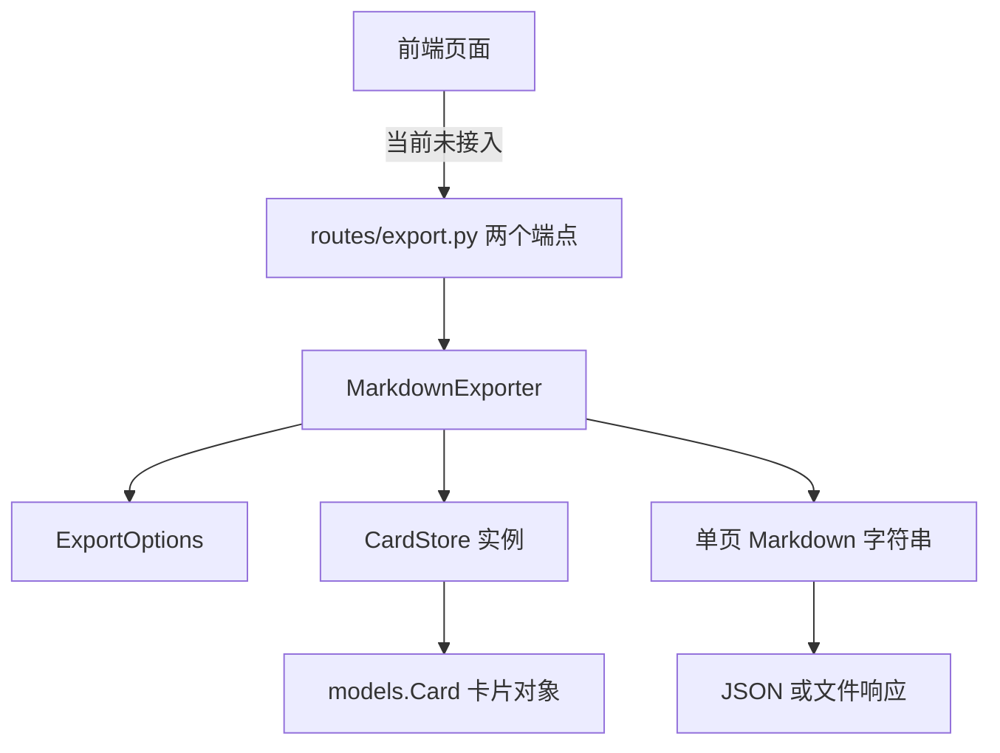
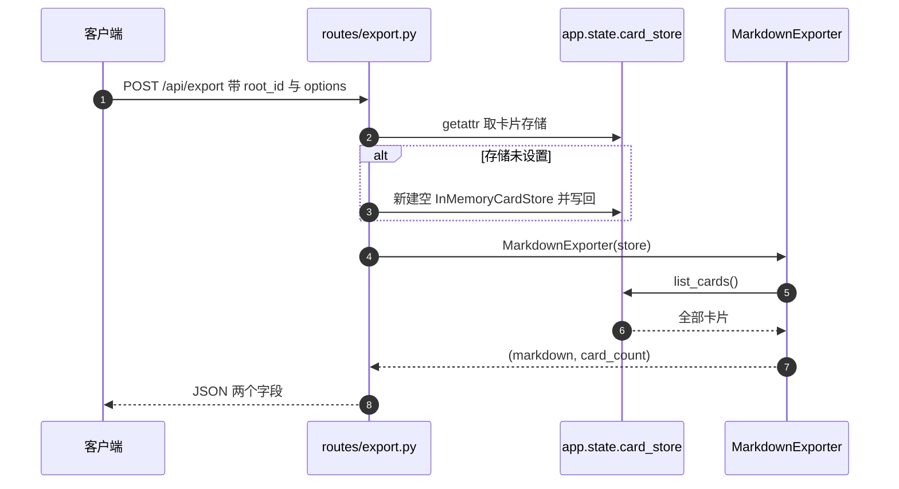

# 导出功能与模块边界

KnowledgeDiver 把知识卡片组织成树形结构，导出功能负责把这些卡片渲染成一份可以直接带走的单页 Markdown。实现集中在 `backend/export/` 目录，HTTP 入口在 `backend/routes/export.py`，两者之间只通过一个 `CardStore` 实例连接。模块边界要看三件事：哪些数据由卡片模型提供、导出器实际依赖存储的哪几个方法、请求体允许调整哪些开关；渲染细节留给后面的小节。

渲染规则、路由行为与已知缺陷分别写在 `02-卡片遍历与排序.md`、`03-单页Markdown生成.md`、`04-导出路由与下载.md` 与 `05-易错点与排查.md`。

## 1. 导出器在仓库里的位置

导出功能由三个文件构成。`backend/export/markdown_exporter.py` 定义 `ExportOptions` 与 `MarkdownExporter`；`backend/export/__init__.py:8` 把两者重新导出，包外只从 `backend.export` 导入；`backend/routes/export.py` 提供两个 HTTP 端点。

依赖方向是单向的：路由依赖导出器，导出器依赖卡片模型与存储接口，反向没有引用。导出器不知道 FastAPI 的存在，也不关心请求从哪来，这种隔离让它可以被脚本或测试直接调用。

## 2. 卡片数据模型提供哪些字段

渲染一页文档需要标题、正文、元数据、来源与链接，这些字段都在 `backend/models/card.py:17-34` 的 `Card` 里定义。导出器只读取，不写回。

| 字段 | 类型 | 导出用途 |
| --- | --- | --- |
| `id` | `str`，UUID | 卡片身份，排序键与映射表的键 |
| `title` | `str` | 标题行文本，也是锚点 slug 的原料 |
| `content` | `str` | 正文，按 Markdown 原样输出 |
| `metadata` | `dict` | 元数据块里的键值对 |
| `links` | `list[str]` | 尾部 Related 行的卡片 ID 列表 |
| `backlinks` | `list[str]` | 入链镜像，导出器未使用 |
| `parent_id` | `str 或 None` | 树形父卡，导出器未使用 |
| `sources` | `list[str]` | 来源 URL 列表 |
| `confidence` | `float`，0 到 1 | 置信度行 |
| `tags` | `list[str]` | 标签，导出器未使用 |
| `created_at` / `updated_at` | `datetime` | 时间戳，导出器未使用 |

模型自身有三处校验：`:36-43` 要求 `id` 是合法 UUID，`:45-56` 限制 `metadata` 的值只能是字符串、数值或字符串列表，`:58-63` 限制 `confidence` 落在 0 到 1 之间。校验在构造卡片时发生，导出路径上不会再次检查，所以导出器可以假定这些字段已经合法。

## 3. CardStore 只被用到 list_cards 一个方法

`MarkdownExporter.__init__` 接收一个 `CardStore` 并保存为 `self.store`（`backend/export/markdown_exporter.py:43-44`）。整个导出流程只调用 `self.store.list_cards()`（`:60`），没有调用 `get_card`、`update_card` 或任何写方法。

`list_cards` 在抽象基类 `BaseCardStore` 里声明（`backend/storage/base.py:58-61`），三种实现的行为一致：返回当前存储中的全部卡片。文件系统实现走 `CardStore`，SQLite 实现执行 `SELECT * FROM cards`（`backend/storage/sqlite_card_store.py:270-273`），内存实现直接取字典的值（`backend/storage/card_store.py:237-238`）。

`backend/storage/__init__.py:13-16` 把三者一并导出。依赖面窄带来两个后果。导出器不关心卡片存在哪里，测试可以用 `InMemoryCardStore` 构造数据；同时它也只能拿到全量列表，任何按父卡筛选的需求都无法在这一层实现。

## 4. ExportOptions 的五个开关

`ExportOptions` 是 Pydantic 模型，五个字段都有默认值（`backend/export/markdown_exporter.py:18-24`）：

| 字段 | 默认 | 作用 |
| --- | --- | --- |
| `include_metadata` | `True` | 是否输出 `metadata` 键值对 |
| `include_sources` | `True` | 是否输出来源 URL 行 |
| `include_confidence` | `True` | 是否输出置信度行 |
| `heading_level_start` | `1` | 卡片标题的起始级别 |
| `include_toc` | `True` | 是否生成目录块 |

这五个开关是导出路径上唯一的可调项。`heading_level_start` 只影响卡片标题，目录标题固定为一级。请求体里的 `options` 字段直接复用这个模型（`backend/routes/export.py:25`），所以 HTTP 侧传入的 JSON 会按同一套默认值补齐。

## 5. 从 HTTP 请求到 Markdown 的调用链

两个端点的共同步骤是：从 `request.app.state` 取出 `card_store`，用它构造 `MarkdownExporter`，再调用 `export_tree_with_count`。`POST /api/export` 把结果放进 JSON（`backend/routes/export.py:39-45`），`GET /api/export/download` 写文件后交给 `FileResponse`（`:48-58`）。

`backend/main.py:35-38` 用 `try`/`except` 导入导出路由，导入失败时把 `export_router` 置为 `None`；`:143-145` 据此决定是否注册。这层保护让导出模块缺失时应用仍能启动，代价是路由是否可用要读启动日志才能发现。

## 6. 单页文档的既定形状

一次成功导出的输出形状固定为三段：可选的目录块、按 `id` 排序的卡片小节、每节之间的空行。卡片小节内部依次是标题、可选的引用式元数据块、正文、可选的 Related 行（`backend/export/markdown_exporter.py:98-138`）。

| 位置 | 内容 | 生成代码 |
| --- | --- | --- |
| 文档开头 | `# Table of Contents` 与链接列表 | `:68-74` |
| 每个卡片 | `#` 加空格加标题 | `:107` |
| 每个卡片 | `> ` 开头的元数据行 | `:115-121` |
| 每个卡片 | 原样正文 | `:125-126` |
| 每个卡片 | `Related: ` 链接行 | `:128-136` |
| 文档结尾 | 统一 strip 后补一个换行 | `:80` |

`export_tree` 与 `export_subtree` 都返回字符串（`:46-51`、`:83-87`），`export_tree_with_count` 额外返回卡片数量（`:53-56`）。`export_to_file` 复用同一份字符串写文件（`:89-96`）。

## 7. 导出模块的两条边界约定

第一条是「导出器不筛选数据」。`export_tree_with_count` 的 `root_id` 参数会被传给同名形参，但函数体没有用它（`backend/export/markdown_exporter.py:53-64` 到 `:81` 之间没有基于 `root_id` 的分支），实际导出的是 `list_cards()` 的全量结果。按参数名理解成子树导出会与实现不符。

第二条是「路由不持有存储」。`backend/routes/export.py:28-36` 从 `app.state` 取 `card_store`，取不到就新建一个空的内存存储并写回 `app.state`。生产环境由应用启动流程注入存储，测试环境靠这条回退路径拿到空库，两个端点在存储缺失时都不会报错，只会导出空文档。

## 8. 易错点

| 易错点 | 现象 | 位置 |
| --- | --- | --- |
| 把 `root_id` 当成子树筛选 | 传入某个卡片 ID 仍得到全量文档 | `backend/export/markdown_exporter.py:53-81` |
| 以为导出器依赖整套 CardStore 接口 | 误判替换存储的成本 | 只用到 `list_cards`（`:60`） |
| 认为路由自带鉴权 | 两个端点没有依赖注入的鉴权函数 | `backend/routes/export.py:39-58` |
| 在应用启动前调用端点 | 得到空文档而不是报错 | `:31-36` 的回退分支 |
| 以为导出路由一定注册 | 导入失败时静默跳过 | `backend/main.py:35-38`、`:143-145` |
| 把 `backlinks` 与 `parent_id` 当成导出输入 | 输出里找不到对应行 | 导出器未读取这两个字段 |

## 小结

核心概念：

| 概念 | 内容 |
| --- | --- |
| 模块构成 | `markdown_exporter.py` 定义模型与导出器，`__init__.py` 重导出，`routes/export.py` 提供两个端点 |
| 依赖面 | 导出器只读取 `list_cards()`，不写存储，不依赖 HTTP |
| 可调开关 | `ExportOptions` 五个字段，默认全部开启目录、元数据、来源与置信度 |
| 调用链 | 取 `app.state.card_store`，构造导出器，调用 `export_tree_with_count`，返回 JSON 或文件 |
| 边界约定 | 导出器不做筛选，路由不持有存储，两者之间的唯一接口是卡片列表 |

设计权衡：

| 决策 | 选择 | 收益 | 代价 |
| --- | --- | --- | --- |
| 存储获取方式 | 从 `app.state` 取，缺失时回退空存储 | 端点在任何启动顺序下都不报错 | 配置缺失表现为空文档，不易察觉 |
| 依赖面 | 只用 `list_cards` | 三种存储实现都可复用 | 无法在存储层做筛选，全量数据要过一遍内存 |
| 路由注册 | `try` / `except` 包住导入 | 模块缺失不影响应用启动 | 路由消失时没有显式告警 |
| 选项模型 | 直接复用 `ExportOptions` 作为请求体 | 默认值只有一份定义 | 内部字段变更会同时改变对外契约 |
| 导出粒度 | 单页全量文档 | 一份文件包含全部内容 | 卡片数量增长后文件体积与解析成本线性上升 |

## 练习

基础题：

1. 列出导出功能涉及的三个文件，并说明各自的职责边界。
2. `MarkdownExporter` 在导出过程中调用了 `CardStore` 的哪些方法？给出源码位置。
3. `ExportOptions` 的五个字段各控制输出的哪一段？
4. 说明 `backend/routes/export.py:31-36` 的回退分支在什么情况下生效。挑战题：

5. 若要按 `parent_id` 只导出某棵子树，改动最小应当落在哪一层？给出函数签名与需要使用的存储方法。
6. 论证把 `app.state.card_store` 的缺失改成显式报错（返回 503）的利弊，并指出需要同步调整的调用方。
7. 导出路由当前没有鉴权依赖。设计一套接入现有鉴权方式的方案，说明受影响的端点与可能的兼容性后果。

---

### 附：本页引用的路径

| 路径 | 用途 |
| --- | --- |
| `backend/export/markdown_exporter.py` | `ExportOptions`（:18-24）、`MarkdownExporter` 与全部导出方法（:36-138） |
| `backend/export/__init__.py` | 包级导出（:8） |
| `backend/routes/export.py` | 请求体（:22-25）、存储获取（:28-36）、两个端点（:39-58） |
| `backend/main.py` | 可选导入（:35-38）、条件注册（:143-145） |
| `backend/models/card.py` | 卡片字段（:17-34）与三处校验（:36-63） |
| `backend/storage/base.py` | `list_cards` 抽象声明（:58-61） |
| `backend/storage/card_store.py` | `InMemoryCardStore`（:204）、`list_cards`（:237-238） |
| `backend/storage/sqlite_card_store.py` | `list_cards` 的 SQL 实现（:270-273） |
| `backend/storage/__init__.py` | 三种卡片存储的导出（:13-16） |
| `frontend/src/api/session.ts` | 现有下载接口只覆盖会话 ZIP（:69-84），未接入 Markdown 导出 |
