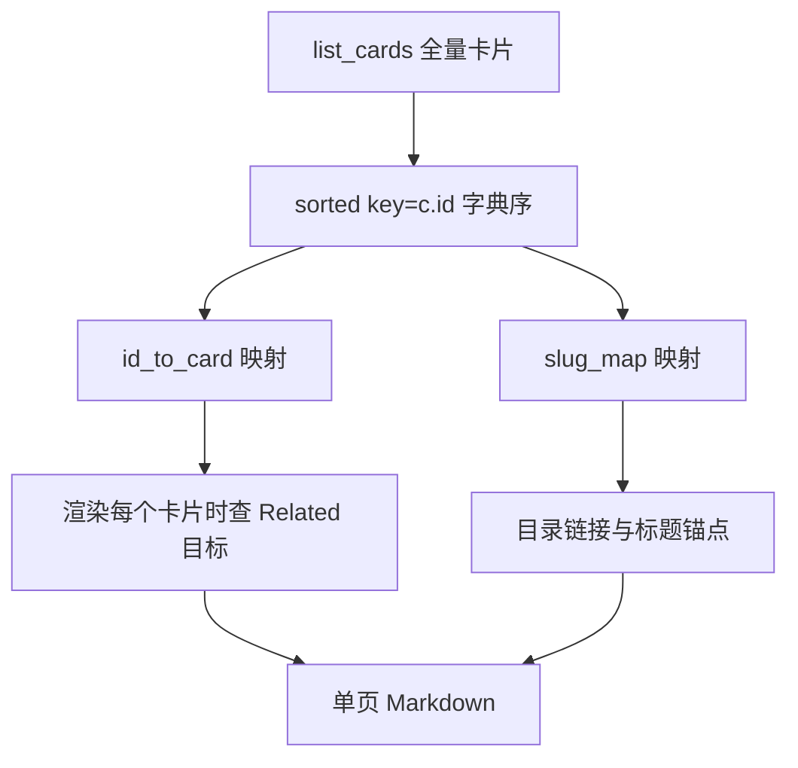
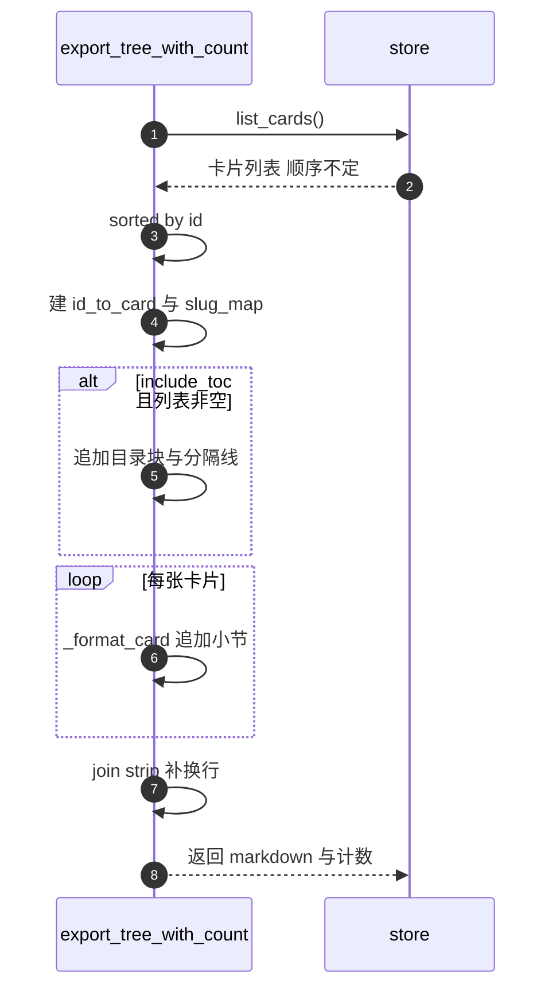

# 卡片遍历与排序

一次导出从 `self.store.list_cards()` 开始，到一份字符串结束。中间有四步：拿到全量卡片、按 `id` 排序、建立两张映射表、按顺序渲染。每一步都在 `MarkdownExporter.export_tree_with_count` 里完成（`backend/export/markdown_exporter.py:53-81`），四步之间有依赖：顺序决定了目录与正文能否对上。

渲染细节见 `03-单页Markdown生成.md`，存储侧三种 `list_cards` 实现的差异也在这里一并说明。

## 1. 入口只接受两个可选参数

`export_tree_with_count` 的签名是 `(root_id=None, options=None)`（`backend/export/markdown_exporter.py:53-55`）。`options` 为 `None` 时用 `ExportOptions()` 补齐默认值（`:57-58`）；`root_id` 会一路传递，但函数体里没有分支读取它。

`export_tree` 是它的薄封装，丢弃计数只返回字符串（`:46-51`）；`export_subtree` 把 `card_id` 传进 `root_id` 后同样走全量路径（`:83-87`）。三个方法的区别只在返回值，不在筛选行为。

## 2. 存储返回的列表没有约定顺序

导出器调用的 `list_cards()` 在三种实现里语义一致，返回顺序却不一致：

| 实现 | 返回顺序 | 位置 |
| --- | --- | --- |
| 文件系统 `CardStore` | `glob("*.md")` 的遍历顺序，取决于文件系统 | `backend/storage/card_store.py:162-168` |
| SQLite `SqliteCardStore` | `SELECT * FROM cards` 无 `ORDER BY`，通常按行号 | `backend/storage/sqlite_card_store.py:270-273` |
| 内存 `InMemoryCardStore` | 字典插入顺序 | `backend/storage/card_store.py:237-238` |

导出器不能依赖这个顺序，所以下一步自己排序。反过来说，任何要求「按创建时间」或「按父子层级」输出文档的需求，都不会被存储层满足。

## 3. 排序键是 id 的字典序

`backend/export/markdown_exporter.py:61` 把列表重排：

```python
all_cards = sorted(all_cards, key=lambda c: c.id)
```

`id` 在卡片模型里被校验为 UUID 字符串（`backend/models/card.py:36-43`），排序比较的是带连字符的十六进制文本。这个顺序等价于把 UUID 的每个十六进制位当字符比较，与创建时间无关，也与 `parent_id` 定义的树形结构无关。视觉上的结果是卡片在文档里的先后基本随机，只有同一批数据反复导出时才稳定。排序键可替换，替换点只有这一处。

按创建时间排序用 `c.created_at`，按树形输出则要先用 `parent_id` 建邻接表再做深度优先遍历，后者的改动范围超出排序表达式本身。



## 4. 两张映射表服务两个不同用途

排好序之后，导出器建两张以卡片 ID 为键的表（`backend/export/markdown_exporter.py:63-64`）：

- `id_to_card` 把 ID 映射到 `Card` 对象，渲染 `links` 时用来取被链接卡片的标题（`:131-133`）。
- `slug_map` 把 ID 映射到标题生成的锚点，目录行与 Related 行都用它拼 `#锚点`（`:71`、`:133`）。两张表都在全量列表上构建，复杂度与卡片数量同阶。文档规模不大时这点内存可以忽略，但它意味着导出必须先把所有卡片读进内存，不能流式处理。

## 5. 目录块在渲染之前生成

目录块的生成条件是 `include_toc` 为真且卡片列表非空（`backend/export/markdown_exporter.py:68`）。生成内容是固定的一级标题 `# Table of Contents`、每张卡片一行链接、一条分隔线（`:69-74`）。目录行使用 `card.title` 作为显示文本，锚点取自 `slug_map[card.id]`。因为 `slug_map` 基于排序后的全量列表，目录顺序与小节顺序一致，两者不会错位。

| 输出行 | 来源 | 备注 |
| --- | --- | --- |
| `# Table of Contents` | 固定文本 | 不受 `heading_level_start` 影响 |
| `- [标题](#锚点)` | 每张卡片一行 | 锚点由 `_slugify` 生成 |
| `---` | 固定文本 | 目录与正文之间的分隔线 |

一个容易忽略的点：目录无条件列出全部卡片，没有深度或数量上限。卡片数量大时，目录本身会占掉相当篇幅。

## 6. 正文小节按同一顺序追加

渲染循环把每张卡片格式化后追加一行空行（`backend/export/markdown_exporter.py:76-78`），最后 `"
".join(md_lines).strip()` 并补一个换行（`:80`）。`strip()` 会同时清掉目录块与末尾小节之间多余的空行，也让文档首尾没有空白。返回值是 `(markdown, len(all_cards))`（`:81`），计数就是列表长度。



## 7. root_id 为什么没有筛选效果

从调用方看，`export_subtree(card_id)` 的命名与 `root_id` 的形参都在暗示子树导出。实际执行路径是：参数进入 `export_tree_with_count`，被继续传给同名形参，然后函数体直接进入全量加载（`backend/export/markdown_exporter.py:57-64`），没有任何按 `root_id` 过滤的分支。

要完整实现子树筛选，缺的不只是几个条件判断，还需要一张从卡片 ID 到其子孙的遍历结构。模型里有 `parent_id`（`backend/models/card.py:29`），但 `list_cards()` 返回的是扁平列表，子卡没有反向索引，所以筛选逻辑要么在导出器里建一次父到子的映射，要么下沉到存储层用 `WHERE` 查询。在缺陷修正之前，把这个参数当作保留字段更准确：传入值不会改变输出，也不会报错。

## 8. 易错点

| 易错点 | 现象 | 位置 |
| --- | --- | --- |
| 认为输出顺序是创建顺序 | 两次导入同样的卡片，顺序不同 | 排序键是 `c.id`（`:61`） |
| 依赖存储返回顺序 | 换一个存储实现后目录顺序变化 | 三种 `list_cards` 顺序各不相同 |
| 传入 `root_id` 期待子树 | 输出仍是全量文档 | `:53-81` 无筛选分支 |
| 认为目录有层级 | 目录是扁平的一级列表 | `:68-74` |
| 忘记目录也占长度 | 大库导出时目录挤压正文 | 每张卡片都进目录 |
| 在导出器里找排序配置 | `ExportOptions` 没有排序字段 | `:18-24` 五个字段都不涉及顺序 |

## 小结

核心概念：

| 概念 | 内容 |
| --- | --- |
| 加载 | 只调用一次 `list_cards()`，拿全量卡片进内存 |
| 排序 | 以 `c.id` 的字典序排序，与创建时间和父子关系都无关 |
| 映射表 | `id_to_card` 供 Related 行取标题，`slug_map` 供目录与锚点 |
| 目录 | `include_toc` 为真时在正文前生成扁平的一级目录 |
| root_id | 形参存在但未参与筛选，三个导出方法行为一致 |

设计权衡：

| 决策 | 选择 | 收益 | 代价 |
| --- | --- | --- | --- |
| 排序键 | 卡片 ID 字典序 | 实现最简单，不依赖时间字段 | 输出顺序对人不友好，且与树形结构无关 |
| 数据加载 | 全量读入内存 | 映射表构建简单，可多次引用同一对象 | 卡片多时内存与导出时长线性增长 |
| 目录生成 | 每张卡片一行 | 定位方便 | 目录可能占文档相当比例 |
| 筛选位置 | 未实现 | 导出器保持纯格式化职责 | 调用方传入 `root_id` 得不到预期结果 |
| 返回计数 | 列表长度 | 一次遍历得到 | 与「导出成功与否」无关，空库也返回 0 而不报错 |

## 练习

基础题：

1. 写出 `export_tree_with_count` 从 `list_cards()` 到返回值的完整步骤。
2. 为什么导出器不能依赖存储返回的顺序？给出三种实现各自的顺序来源。
3. `id_to_card` 与 `slug_map` 分别服务于哪几行输出？
4. 目录块的生成条件是什么？它与 `heading_level_start` 有关系吗？

挑战题：

5. 把排序改成「先按 `parent_id` 分层，再按 `created_at` 排序」，写出需要新增的数据结构与遍历顺序，并说明对 `slug_map` 的影响。
6. 若卡片数量达到一万张，指出当前路径上最可能成为瓶颈的两处，并给出可选的改造方向。
7. 为 `root_id` 实现完整的子树筛选，比较「在导出器里建父到子索引」与「在存储层加查询」两种方案的改动面与一致性风险。

---

### 附：本页引用的路径

| 路径 | 用途 |
| --- | --- |
| `backend/export/markdown_exporter.py` | 加载与排序（:57-64）、目录（:68-74）、渲染循环与返回（:76-81）、三个导出方法（:46-51、:53-56、:83-87、:89-96） |
| `backend/models/card.py` | `id` 与 `parent_id` 字段（:23、:29）、UUID 校验（:36-43） |
| `backend/storage/card_store.py` | 文件系统 `list_cards`（:162-168）、内存 `list_cards`（:237-238） |
| `backend/storage/sqlite_card_store.py` | SQLite `list_cards`（:270-273） |
| `backend/storage/base.py` | `list_cards` 抽象声明（:58-61） |
