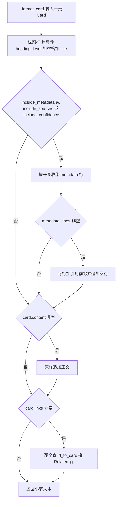
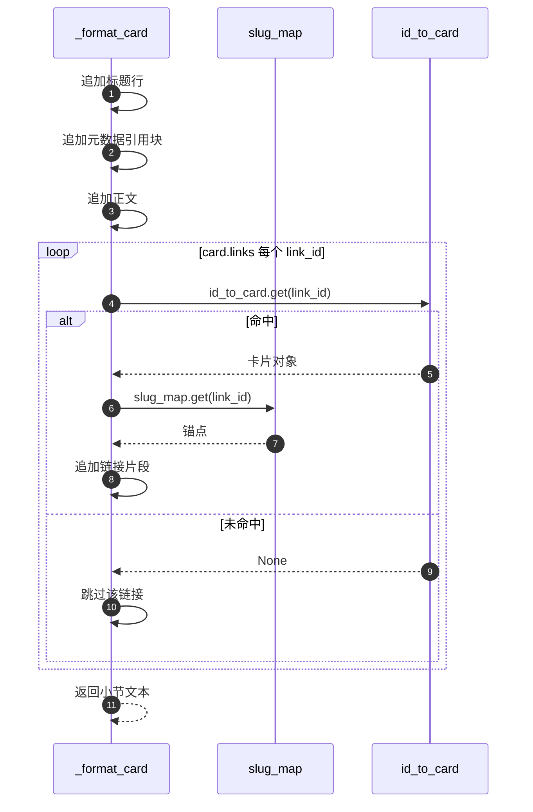

# 单页 Markdown 生成

单页文档由若干个结构相同的小节拼成，每个小节对应一张卡片。`_format_card` 负责把一张 `Card` 变成若干行文本（`backend/export/markdown_exporter.py:98-138`），拼装顺序在 `export_tree_with_count` 的循环里固定下来。`_format_card` 的四段输出决定了单页的最终形态，锚点则完全取决于 `_slugify`（`:27-33`）：目录与标题能否对上就看它。卡片筛选与排序见 `02-卡片遍历与排序.md`。

## 1. 一个小节的四段结构

`_format_card` 依次追加四段内容，每段都有各自的开关或前置条件：

| 顺序 | 内容 | 生成条件 | 代码位置 |
| --- | --- | --- | --- |
| 1 | 标题行 | 总是输出 | `:107-109` |
| 2 | 元数据引用块 | 三个 `include_*` 中任一为真，且对应字段非空 | `:111-123` |
| 3 | 正文 | `card.content` 非空 | `:125-126` |
| 4 | Related 行 | `card.links` 能解出至少一个已知卡片 | `:128-136` |

四段之间由换行连接，小节之间的分隔是渲染循环补的一行空行（`:76-78`），没有额外分隔线。文档整体在最后统一 `strip()`（`:80`）。



## 2. 标题级别只由一个数字决定

标题行的构造是 `"#" * max(heading_level, 1) + " " + card.title`（`backend/export/markdown_exporter.py:107`）。`heading_level` 来自 `ExportOptions.heading_level_start`，默认 1，所以默认输出里每张卡片都是一个一级标题。

`max(..., 1)` 挡住的是非正数取值：传 0 或负数时会退化成一级标题，而不是输出零个井号加标题的非法行。传 2 则所有卡片变成二级标题，但目录标题仍固定为一级（`:69`），此时文档里会出现「一级目录 + 全二级小节」的组合。标题级别不会随卡片层级变化。模型的 `parent_id` 定义了父子关系（`backend/models/card.py:29`），导出器没有读取，所以同一次导出里所有卡片标题级别相同。

## 3. 元数据块的引用格式

元数据最多三行，按 `metadata`、`sources`、`confidence` 的顺序收集（`backend/export/markdown_exporter.py:113-119`）：

```python
metadata_lines.append(": Metadata: " + ", ".join([f"{k}: {v}" for k, v in card.metadata.items()]))
metadata_lines.append("Sources: " + ", ".join(card.sources))
metadata_lines.append("Confidence: " + str(card.confidence))
```

三行统一加 `> ` 前缀变成引用块（`:120-121`），块后补一空行（`:122-123`）。几个细节需要记下来：

- 元数据行以冒号开头，写作 `: Metadata: key: value`，第一个冒号在标准 Markdown 里没有特殊含义，但读起来像笔误。
- 键值对用 `", "` 连接，值里若本身含逗号，边界就分不出来。
- 来源是 URL 列表，直接以逗号拼接，没有做成 Markdown 链接。
- 置信度用 `str()` 输出，浮点数的位数取决于 Python 的默认表示。三个开关各自独立：只关 `include_sources` 时，元数据与置信度照常输出。若三段都为空，整个引用块连同后面的空行都不会出现（`:122`）。

| 开关 | 关闭后的效果 |
| --- | --- |
| `include_metadata` | 不输出 `metadata` 行，其余两行不受影响 |
| `include_sources` | 不输出来源行 |
| `include_confidence` | 不输出置信度行 |

## 4. 正文原样输出

`card.content` 被直接追加，不做转义、不做缩进、不重新编号（`backend/export/markdown_exporter.py:125-126`）。卡片内容本身就是 Markdown（模型注释写明这一点，`backend/models/card.py:25`），直接拼接符合预期。代价是嵌套结构不受控：正文里若含一级标题，会与卡片标题同级，打乱文档层级；正文自带的围栏代码块也可能与文档自身的结构混淆。导出器不做检查，这类问题只能靠写入卡片时的约定避免。

## 5. 锚点 slug 的生成规则

`_slugify` 四步转换（`backend/export/markdown_exporter.py:27-33`）：转小写、删除所有非 `[a-z0-9s-]` 字符、把空白与连字符折叠成单个连字符、去掉首尾连字符。

```python
s = title.lower()
s = re.sub(r"[^a-z0-9s-]", "", s)
s = re.sub(r"[s-]+", "-", s)
return s.strip("-")
```

规则里的字符集只覆盖 ASCII 字母数字。中文、日文、俄文标题在第二步会被整串删除，结果为空字符串。目录行因此变成 `- [标题](#)`，点击跳到文档开头而不是对应小节。标题里的空格与连字符会被规范化，所以 `Hello World` 与 `hello-world` 生成同一个锚点，同名小节之间也会互相覆盖。锚点不参与去重：`slug_map` 以卡片 ID 为键（`:64`），两张同名卡片得到同一个锚点，目录里两条链接指向同一个位置。

| 标题 | 生成锚点 | 目录链接 |
| --- | --- | --- |
| `Knowledge Graph` | `knowledge-graph` | `#knowledge-graph` |
| `卡片树与双向链接` | 空串 | `#` |
| `A B` 与 `a-b` | 同为 `a-b` | 两条链接指向同一处 |

## 6. Related 行只输出能解引用的链接

`card.links` 存的是卡片 ID（`backend/models/card.py:27`）。渲染时逐个查 `id_to_card`，只有找到对象才生成 `[标题](#锚点)`（`backend/export/markdown_exporter.py:129-133`）。指向不存在卡片的 ID 被静默跳过；全部都无法解析时，连 `Related: ` 行本身都不会出现（`:134-136`）。

锚点优先取 `slug_map` 中该 ID 的值，取不到时用 `_slugify(link_id)` 兜底（`:133`）。因为 `slug_map` 覆盖全部卡片，兜底分支实际上走不到，除非 `id_to_card` 与 `slug_map` 的构建出现了分歧。



## 7. 一份最小输出示例

假设两张卡片：`A` 的标题为 `Knowledge Graph`，`B` 的标题为 `卡片树`，`A` 的 `links` 指向 `B`。默认选项下的输出形态如下：

```markdown
# Table of Contents

- [Knowledge Graph](#knowledge-graph)
- [卡片树](#)

---

# Knowledge Graph

> : Metadata: lang: zh

图与节点的定义。

Related: [卡片树](#)

# 卡片树

节点与边的组织方式。
```

示例里第二张卡片的目录链接为 `#`，就是中文标题被 `_slugify` 清空的结果。示例同时说明 `strip()` 之后文档末尾只有一个换行。

## 8. 易错点

| 易错点 | 现象 | 位置 |
| --- | --- | --- |
| 用中文标题期待可用锚点 | 目录链接退化为 `#` | `_slugify` 只保留 ASCII（`:31`） |
| 认为元数据是 YAML frontmatter | 输出是引用块，不是 `---` 包围的头部 | `:120-121` |
| 把 `: Metadata: ` 当成语法 | 它是普通文本，第一个冒号无特殊含义 | `:115` |
| 认为 Related 一定出现 | `links` 全为悬空 ID 时整行消失 | `:134-136` |
| 认为标题级别跟随层级 | 只由 `heading_level_start` 决定 | `:107` |
| 正文含一级标题 | 与卡片标题同级，层级被打乱 | `:125-126` 不做检查 |

## 小结

核心概念：

| 概念 | 内容 |
| --- | --- |
| 小节结构 | 标题、元数据引用块、正文、Related 行，四段按序拼接 |
| 标题级别 | `"#" * max(heading_level, 1)`，默认全部一级 |
| 元数据格式 | 三行引用块，行首 `: Metadata: ` 的冒号属原样输出 |
| 锚点 | `_slugify` 只保留 ASCII 字母数字与连字符，中文标题得到空串 |
| Related | 只能解引用的 `links` 才输出，悬空 ID 静默丢弃 |

设计权衡：

| 决策 | 选择 | 收益 | 代价 |
| --- | --- | --- | --- |
| 正文处理 | 原样输出 | 保留卡片内的 Markdown 结构 | 嵌套标题与原文格式不受控 |
| 锚点规则 | ASCII 字符集 | 实现简单，兼容英文标题 | 中文标题的目录链接失效 |
| 元数据 | 引用块逐行输出 | 不干扰正文渲染，阅读时可折叠 | 不是标准 frontmatter，工具无法解析 |
| 链接解引用 | 查表命中才输出 | 不会输出死链 | 悬空链接无提示 |
| 标题级别 | 全局单值 | 一个参数控制整篇 | 无法表达层级，多级结构要另做处理 |

## 练习

基础题：

1. 列出 `_format_card` 的四段输出及其生成条件。
2. `heading_level_start` 取 0 会发生什么？给出依据行。
3. 写出 `_slugify` 对 `Hello World` 与 `卡片树-2024` 的处理结果。
4. 元数据块的三个开关分别控制哪一行？全部关闭时输出会少哪几行？

挑战题：

5. 设计一个支持中文标题的锚点方案，要求与 GitHub 的渲染行为尽量一致，并说明 `slug_map` 需要怎样改。
6. 若要把元数据改成标准 YAML frontmatter，列出需要修改的函数、对目录位置的影响，以及多卡片单文件场景下的取舍。
7. 正文里出现一级标题会打乱层级。给出一种在不修改卡片内容的前提下保持层级一致的处理策略，并评估其副作用。

---

### 附：本页引用的路径

| 路径 | 用途 |
| --- | --- |
| `backend/export/markdown_exporter.py` | `_slugify`（:27-33）、标题行（:107-109）、元数据块（:111-123）、正文（:125-126）、Related（:128-136）、目录标题（:69） |
| `backend/models/card.py` | 正文为 Markdown 的约定（:25）、`links`（:27）、`parent_id`（:29） |
