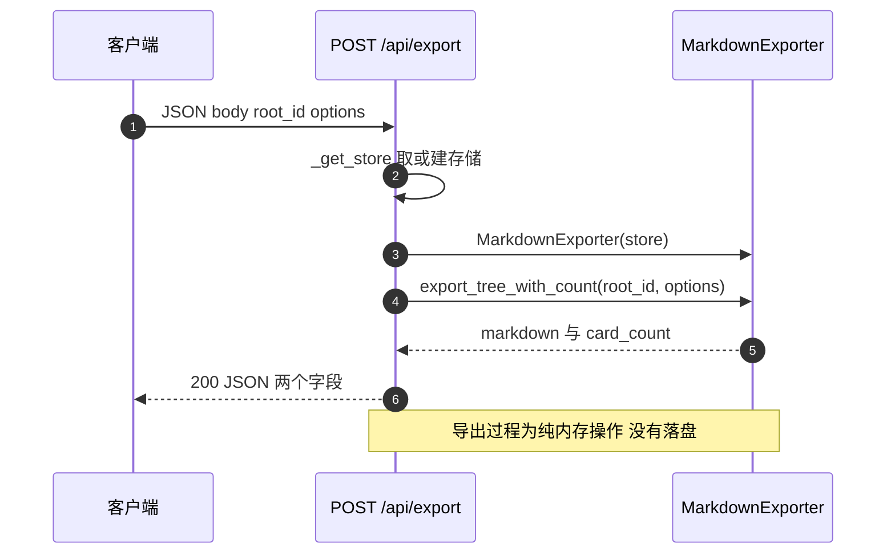
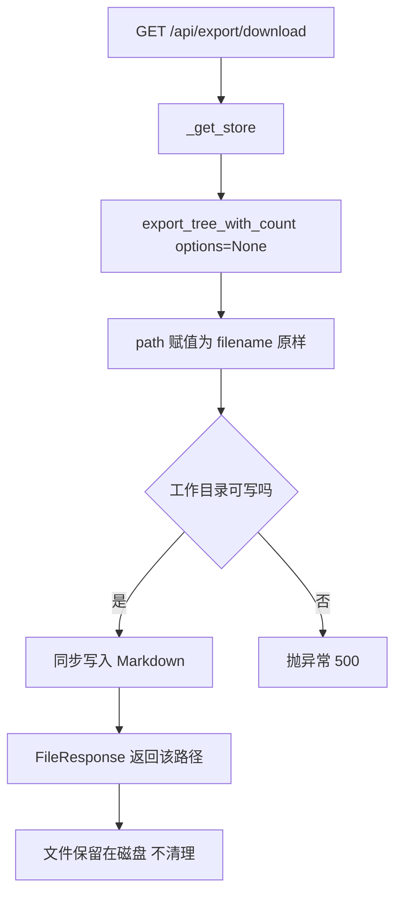

# 导出路由与下载

导出的 HTTP 层只有两个端点，都在 `backend/routes/export.py` 里：一个返回 Markdown 字符串，一个把同样的字符串写成文件后交给浏览器下载。两者共用同一段取存储的辅助函数与同一个导出器实例构造方式，路由自身的实现很短，风险主要来自参数语义。导出器内部的渲染规则见 `03-单页Markdown生成.md`，模块边界的整体说明见 `01-导出功能与模块边界.md`。

## 1. 两个端点与各自的参数

`POST /api/export` 接收 JSON 请求体，返回字符串与卡片计数；`GET /api/export/download` 接收查询参数，返回文件流。

| 端点 | 方法 | 参数 | 响应 |
| --- | --- | --- | --- |
| `/api/export` | POST | 请求体 `root_id`、`options` | `{"markdown": ..., "card_count": ...}` |
| `/api/export/download` | GET | 查询参数 `root_id`、`filename` | `FileResponse`，媒体类型 `text/markdown` |

请求体由 `ExportRequest` 定义，两个字段都可选（`backend/routes/export.py`）。`root_id` 会被传进导出器但不产生筛选效果（见 `02-卡片遍历与排序.md`）；`options` 为 `None` 时由 `ExportOptions` 的默认值补齐。下载端点没有请求体，参数写在查询串里，`filename` 默认 `export.md`。两条路径都不需要鉴权依赖，函数签名里只有 `request` 与业务参数。

## 2. 存储从 app.state 取，取不到就建空库

两个端点的第一步都是调用 `_get_store(request)`（`backend/routes/export.py`）。这段代码依次做三件事：读 `request.app.state.card_store`、判断是否为 `None`、为 `None` 时新建 `InMemoryCardStore(cards=[])` 并写回 `app.state`。

| 分支 | 条件 | 结果 |
| --- | --- | --- |
| 正常 | `app.state.card_store` 已注入 | 直接返回该实例 |
| 回退 | 属性不存在或为 `None` | 新建空内存存储并写回 |

回退分支的注释写明目的是让测试环境中的应用能继续运行。副作用是生产环境若忘记注入存储，端点仍然返回 200，只是文档为空。调用方无法从响应区分「没有卡片」与「没有接上数据库」。

## 3. POST 端点的执行路径

`backend/routes/export.py` 一共四步：取存储、构造 `MarkdownExporter`、调用 `export_tree_with_count`、组装返回值。`options` 原样透传，`root_id` 原样透传，返回值把字符串与计数放在两个键里。



端点函数声明为 `async def`，但内部调用的是同步的 `list_cards()` 与纯字符串拼接。卡片量小时没有可感知影响，卡片量大时这段同步工作会占住事件循环。

## 4. 下载端点的执行路径

`backend/routes/export.py` 的过程是：取存储、构造导出器、以 `options=None` 调用导出、打开 `filename` 写入、用 `FileResponse` 返回。

```python
path = filename
with open(path, "w", encoding="utf-8") as f:
    f.write(markdown)
return FileResponse(path, media_type="text/markdown", filename=filename)
```

三点需要注意。第一，`options` 固定为 `None`，下载路径无法关闭目录或元数据，想要不同选项只能走 POST。第二，写文件用的是同步 `open`，在事件循环里执行。第三，`path` 直接取自查询参数 `filename`，没有做目录白名单或路径规范化，把相对路径或绝对路径当成写入目标。

## 5. filename 同时是写盘路径与下载名

下载端点把同一个字符串既当路径又当下载名，示意如下：

```python
# 示意：写盘 + 设置下载响应头
path = os.path.join(TMP_DIR, filename)          # 若 filename 含 ../ 就写到目录之外
with open(path, "w", encoding="utf-8") as f:
    f.write(markdown)
return Response(open(path, "rb"), media_type="text/markdown",
                headers={"Content-Disposition": f'attachment; filename="{filename}"'})
```

`Content-Disposition`是告诉浏览器"这是附件、请下载而不是直接显示"的响应头。把用户可控的字符串直接当路径使用是典型的路径穿越风险：`../`可以写到工作目录之外，留下无用文件。稳妥做法是只接受一个安全文件名（去掉分隔符）或由服务端生成名字，把下载名与磁盘路径分开。

文件名参数在同一个端点里承担两个角色：写文件的路径与 `FileResponse` 的 `filename`。后者只影响 `Content-Disposition` 中建议的保存名，前者决定服务端真实写入位置（相对进程工作目录解析）。

| 取值 | 写入位置 | 说明 |
| --- | --- | --- |
| `report.md` | 工作目录下的 `report.md` | 默认形态 |
| `../cards/report.md` | 工作目录的上一级目录 | 相对路径未被拦截 |
| `/tmp/report.md` | 绝对路径 | 平台允许时直接写该位置 |

写入的文件不会在响应结束后删除，同一文件名重复请求会覆盖上一次的内容。多用户并发时，相同 `filename` 会互相覆盖，先写后读的顺序决定最终下载内容。



## 6. 路由的可选注册

导出路由不是无条件注册的。`backend/main.py` 把导入包在 `try` / `except` 里，导入失败时把 `export_router` 置为 `None`，只有非 `None` 时才调用 `include_router`。

| 环节 | 代码 | 失败表现 |
| --- | --- | --- |
| 导入 | `backend/main.py` | 捕获异常，不中断应用启动 |
| 注册 | `backend/main.py` | 跳过注册，两个端点不存在 |

这种写法让导出依赖（例如 `pydantic` 版本不符）不会拖垮整个后端。代价是路由缺失只在启动阶段留下一条导入异常，没有任何启动检查或健康端点会报告它。

## 7. 与相邻导出接口的对比

仓库里还有一套会话级导出：`backend/routes/session_io.py` 提供 ZIP 的下载与上传，路由在 `backend/main.py` 注册，前端有对应的调用（`frontend/src/api/session.ts`）。Markdown 导出这一套没有前端调用方，在 `frontend/src` 下搜索端点路径没有结果。

| 维度 | 会话导出 | Markdown 导出 |
| --- | --- | --- |
| 注册方式 | 直接注册 | `try` / `except` 可选注册 |
| 产物 | ZIP 归档 | 单个 `.md` 文件或 JSON 字符串 |
| 前端接入 | 有（`session.ts`） | 无 |
| 临时文件 | 由会话导出流程管理 | 写入工作目录后不清理 |

## 8. 易错点

| 易错点 | 现象 | 位置 |
| --- | --- | --- |
| 认为 `filename` 只是下载名 | 实际决定服务端写盘路径 | `backend/routes/export.py` |
| 传相对或绝对路径 | 文件写到预期之外的位置 | 无规范化 |
| 以为下载端点可配选项 | `options` 固定为 `None` | `backend/routes/export.py` |
| 依赖 `root_id` 得到子树 | 两个端点都传了，但导出器不筛选 | `backend/export/markdown_exporter.py` |
| 认为端点有鉴权 | 函数签名无鉴权依赖 | `backend/routes/export.py` |
| 在卡片量大时同步下载 | 事件循环被同步写文件占住 | `backend/routes/export.py` |
| 认为路由一定存在 | 导入失败时静默跳过注册 | `backend/main.py` |

## 小结

核心概念：

| 概念 | 内容 |
| --- | --- |
| 两个端点 | POST 返回 JSON，GET 写文件后返回 `FileResponse` |
| 存储获取 | 从 `app.state.card_store` 取，缺失时建空内存存储 |
| 选项差异 | POST 支持完整 `ExportOptions`，GET 固定默认值 |
| 文件名双重身份 | 既是写盘路径，又是 `Content-Disposition` 的建议名 |
| 注册方式 | `try` / `except` 可选导入，失败时端点整体缺席 |

设计权衡：

| 决策 | 选择 | 收益 | 代价 |
| --- | --- | --- | --- |
| 存储回退 | 缺失时用空内存存储 | 测试环境无需预置依赖 | 生产配置错误表现为空文档 |
| 注册 | 可选导入 | 导出依赖缺失不影响主应用 | 路由消失无显式告警 |
| 下载实现 | 写工作目录后 `FileResponse` | 代码最短，无需流式拼装 | 文件残留、并发覆盖、路径未校验 |
| 选项传递 | POST 全量、GET 默认 | 下载链接简单可直接分享 | 下载路径无法定制输出 |
| 鉴权 | 未接入 | 端到端调用方便 | 任何能访问后端的人都能触发导出 |

## 练习

基础题：

1. 写出两个端点的路径、方法、参数与响应类型。
2. `_get_store` 在什么条件下创建空存储？这个分支对生产环境意味着什么？
3. 下载端点调用导出器时 `options` 传了什么？由此少掉哪些可调项？
4. `filename` 在端点的哪两处被使用？

挑战题：

5. 给出一个修复 `filename` 路径问题的方案：要求限制写入目录、保留用户可见的下载名，并说明两者如何解耦。
6. 若把下载改成流式返回（不落盘），列出需要替换的 FastAPI 响应类型与需要同步调整的响应头。
7. 为两个端点补上鉴权，说明需要引入的依赖、对现有前端或脚本调用方的影响，以及未登录时的状态码选择。

---

### 附：本页引用的路径

| 路径 | 用途 |
| --- | --- |
| `backend/routes/export.py` | 请求体、存储获取、POST 端点、GET 端点 |
| `backend/main.py` | 可选导入、会话导出注册、条件注册 |
| `backend/export/markdown_exporter.py` | `export_tree_with_count` 与 `export_to_file` |
| `backend/storage/card_store.py` | `InMemoryCardStore` 回退实例 |
| `backend/routes/session_io.py` | 相邻的会话级 ZIP 导出路由 |
| `frontend/src/api/session.ts` | 前端现有下载调用，未接入 Markdown 导出 |
