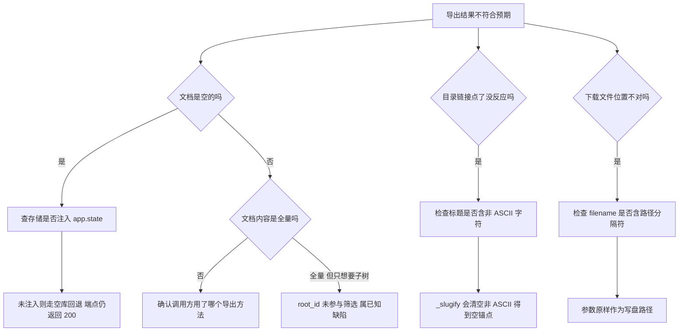
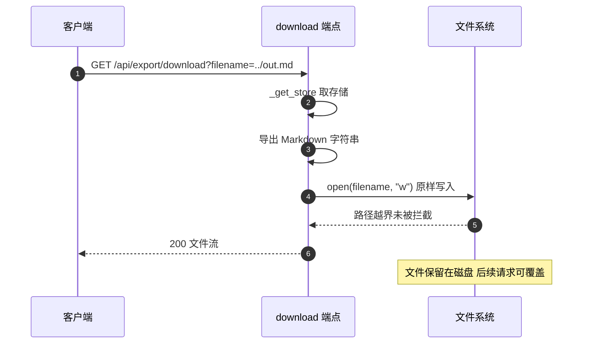

# 导出链路的易错点与排查

导出链路的代码量不大，问题集中在参数语义与实际行为不一致上：`root_id` 看起来筛选、实际不筛选；`filename` 看起来只是下载名、实际决定写盘位置；中文标题看起来能生成锚点、实际生成空串。已核实的缺陷、可观测信号与排查顺序集中在这里。模块构成见 `01-导出功能与模块边界.md`，渲染规则见 `03-单页Markdown生成.md`，端点行为见 `04-导出路由与下载.md`。以下结论除标注外均以源码为准。

## 1. 缺陷清单

| 编号 | 缺陷 | 位置 | 影响 |
| --- | --- | --- | --- |
| D1 | `root_id` 传入但不参与筛选 | `backend/export/markdown_exporter.py` | 请求子树得到全量文档，且不报错 |
| D2 | 中文标题锚点为空串 | `backend/export/markdown_exporter.py` | 目录链接退化为 `#`，点击跳到文首 |
| D3 | 导出结果是扁平列表，与类注释的「卡片树」不符 | 与 | 文档结构不体现 `parent_id` 层级 |
| D4 | 元数据行以 `: ` 开头 | `backend/routes/export.py` | 输出像笔误，不是标准 frontmatter |
| D5 | 下载端点把查询参数当写盘路径 | `backend/routes/export.py` | 可写到工作目录之外，文件残留 |
| D6 | 两个端点都没有鉴权依赖 | `backend/routes/export.py` | 未登录也能导出全部卡片 |
| D7 | 存储缺失时回退空库 | `backend/routes/export.py` | 配置错误表现为空文档 |
| D8 | 导出路由可选注册，失败无告警 | `backend/main.py` | 端点整体缺席，只能从启动日志发现 |
| D9 | 下载端点在事件循环里同步写文件 | `backend/routes/export.py` | 大文档导出期间阻塞其他请求 |
| D10 | 导出模块没有测试覆盖 | `tests/backend/` 下无导出相关用例 | 改动无回归保护（按目录列表观察） |

## 2. 参数语义与实际行为的偏离

D1 与 D5 属于同一类问题：参数名传达的语义比实现承诺的多。排查时先确认「这个参数在函数体里被读过吗」，比读文档更快。

`root_id` 在 `export_tree_with_count` 的形参列表里出现（`backend/export/markdown_exporter.py`），传递链上一直存在，函数体里没有用到。`export_subtree` 是它最容易被误用的调用点。

`filename` 在下载端点里既做路径又做响应头（`backend/routes/export.py`），查询参数没有经过任何规范化。想验证是否真的写到工作目录之外，可以传入一个相对路径再检查文件落点，这一条属可复现的本地验证，不依赖线上环境。



## 3. 中文标题与锚点

中文标题在只按 ASCII 过滤的实现下会得到空锚点，示意如下：

```python
# 示意：空锚点的产生
slug = re.sub(r"[^a-zA-Z0-9-]+", "-", "小结").strip("-")   # -> ""（汉字全被剔除）
link = f"[{title}](#{slug})"                                # -> "[小结](#)"，点击回到页首
```

这类问题的特点是"不报错但结果退化"：锚点字段是空串，链接语法仍然合法，渲染器照常输出一个指向页首的`#`。它的可观测信号是"目录里点击任何中文标题都跳到文首"。修法是把汉字纳入允许字符集，或改用基于序号的锚点——后者更稳，但对外链的稳定性要求更高（插入一节会让后面所有锚点位移）。

`_slugify` 的字符集是 `[a-z0-9s-]`（`backend/export/markdown_exporter.py`），中文标题经过删除后为空串，`slug_map` 里对应条目为空，目录行写成 `- [标题](#)`。验证方式不依赖运行环境：取任意中文标题，按四步规则手算即可得到空串。英文标题则正常，`Hello World` 得到 `hello-world`；大小写不同、连字符与空格混用的标题会生成相同锚点。这一缺陷影响面与卡片库的语言分布直接相关。当前仓库的卡片以中文内容为主，所以目录的可用性实际很低。

## 4. 下载路径与临时文件

`backend/routes/export.py` 的三行代码把 `filename` 直接用作 `open` 的路径。风险分三层：

| 层次 | 表现 | 触发条件 |
| --- | --- | --- |
| 落点偏移 | 文件写到工作目录之外 | `filename` 含 `../` 或为绝对路径 |
| 并发覆盖 | 两个请求写同一路径，后写者覆盖前者 | 相同 `filename` 并发 |
| 文件残留 | 下载结束后文件仍在磁盘 | 每次请求都会留下一个文件 |

`FileResponse` 只负责把文件读出去并设置 `Content-Disposition`，不决定写盘位置。修复方向是把写盘路径与下载名分开：前者由服务端生成（临时目录加随机名），后者保留用户输入但只用于响应头。

## 5. 鉴权与访问面

两个端点没有引入任何鉴权依赖。对比同仓库的其他路由，`backend/routes/auth.py` 提供认证端点，业务路由通常通过 `Depends` 挂鉴权函数；导出路由的导入列表里只有 `APIRouter`、`Request`、`BaseModel` 与 `FileResponse`（`backend/routes/export.py`），没有鉴权相关符号。

后果是任何能访问后端端口的人都可以导出全部卡片。是否要补鉴权取决于部署形态：若后端只在内网由前端代理访问，风险主要来自同网络的其他主机；若直接暴露，导出接口会成为数据外带通道。这一条属部署判断，未在本仓库的配置里找到对应限制。

## 6. 静默失败的三处

导出链路上有三处失败不会给出明显信号：

| 位置 | 失败方式 | 可观察到的现象 |
| --- | --- | --- |
| `backend/export/markdown_exporter.py` | 悬空 `links` 被跳过 | Related 行缺失或整行消失 |
| `backend/routes/export.py` | 存储缺失回退空库 | 200 与空文档 |
| `backend/main.py` | 导入失败跳过注册 | 端点 404，启动日志里有导入异常 |

共同点是调用方无法从正常响应里区分「没有数据」与「配置有问题」。排查这类问题要先确认服务是否真的注册了导出路由，再确认 `app.state.card_store` 指向哪个实现。



## 7. 排查顺序

按「先确认链路存在，再确认数据，最后看格式」推进，每一步都有一个可证伪的观测值：

1. 确认路由是否存在。请求 `/api/export`，返回 404 说明 `export_router` 为 `None`（`backend/main.py`）。
2. 确认存储指向。读 `app.state.card_store` 的类型，是 `InMemoryCardStore` 还是 `SqliteCardStore`，判断数据源是否符合预期。
3. 确认卡片数量。`markdown` 与 `card_count` 同时返回（`backend/routes/export.py`），计数为 0 而库里有数据说明取到了另一个存储。
4. 确认筛选需求。需要子树时先确认 `root_id` 是否真的生效，当前的答案是不生效。
5. 确认锚点。检查目录链接是否指向 `#`，若是则命中 `_slugify` 的字符集限制。
6. 确认落盘。下载后检查工作目录，确认是否产生了预期之外的文件。

## 8. 排查时容易走错的方向

| 现象 | 容易先怀疑 | 实际应先查 |
| --- | --- | --- |
| 文档为空 | 渲染逻辑 | `app.state.card_store` 是否注入 |
| 端点 404 | 前缀写错 | `export_router` 是否为 `None` |
| 目录链接无效 | 前端渲染 | 锚点字符串是否为空 |
| 下载文件名异常 | 浏览器行为 | `filename` 的取值来源 |
| Related 行缺失 | 链接字段为空 | 指向的 ID 是否在本次导出集合里 |

## 9. 未实测与待确认项

以下内容在源码里可得，但没有运行环境验证，写作与排查时按标注处理：

- D5 的越界落点在本地文件系统上可复现，具体在容器或只读挂载下的表现属待实测。
- 中文锚点失效是规则推导结果，未在浏览器里逐条点击验证；不同渲染器对 `#` 的处理可能不同。
- 导出模块无测试用例属按目录列表的观察，未检查是否有被跳过或未提交的用例。
- 前端未接入是搜索 `frontend/src` 内端点路径的结论，若前端通过拼接变量构造路径则可能漏检。

## 小结

核心概念：

| 概念 | 内容 |
| --- | --- |
| 语义偏离 | `root_id` 不筛选、`filename` 兼作写盘路径，是两类主要问题的根源 |
| 锚点限制 | `_slugify` 只保留 ASCII，中文标题的目录链接退化为 `#` |
| 静默失败 | 存储回退、路由可选注册、悬空链接都不产生错误响应 |
| 安全面 | 两个端点无鉴权，下载路径未规范化，文件不清理 |
| 排查顺序 | 路由存在性、存储指向、卡片计数、筛选、锚点、落盘，逐项确认 |

设计权衡：

| 决策 | 选择 | 收益 | 代价 |
| --- | --- | --- | --- |
| 导出粒度 | 全量单页 | 实现简单，一份产物包含全部内容 | `root_id` 成为无效参数 |
| 锚点规则 | ASCII 字符集 | 兼容英文渲染器 | 中文标题不可跳转 |
| 下载实现 | 写盘后 `FileResponse` | 无需流式拼装 | 文件残留与路径风险 |
| 错误处理 | 静默回退 | 端点始终可用 | 配置错误难以发现 |
| 鉴权 | 未接入 | 调用方便 | 数据外带面扩大 |

## 练习

基础题：

1. 列出 D1 到 D6 各自的位置与影响，并指出哪些可以从源码直接判定、哪些需要运行验证。
2. `filename` 为 `../a.md` 时文件写到哪？给出依据行。
3. 说明导出端点在存储缺失时的响应，为什么调用方难以察觉。
4. 中文标题生成的目录链接是什么？写出 `_slugify` 四步后的中间结果。挑战题：

5. 给出修复 D1 的完整方案：包括需要新增的辅助结构、函数签名变化，以及对 `card_count` 语义的影响。
6. 为下载端点设计安全的文件名处理流程，要求同时满足限制落点、避免并发覆盖、清理临时文件三点。
7. 设计一组导出模块的回归测试（不写代码，列出用例清单）：覆盖空库、中文标题、悬空链接、`root_id` 传入与选项关闭四种情形，并说明每条用例的断言点。

---

### 附：本页引用的路径

| 路径 | 用途 |
| --- | --- |
| `backend/export/markdown_exporter.py` | `_slugify`、类与方法、悬空链接处理 |
| `backend/routes/export.py` | 导入表、存储回退、两个端点 |
| `backend/main.py` | 可选导入与条件注册 |
| `backend/models/card.py` | 卡片字段与校验 |
| `backend/routes/auth.py` | 仓库内鉴权端点，作为对照组 |
| `tests/backend/` | 现有测试目录，未包含导出用例 |
| `frontend/src/api/session.ts` | 前端现有下载调用，未接入 Markdown 导出 |
