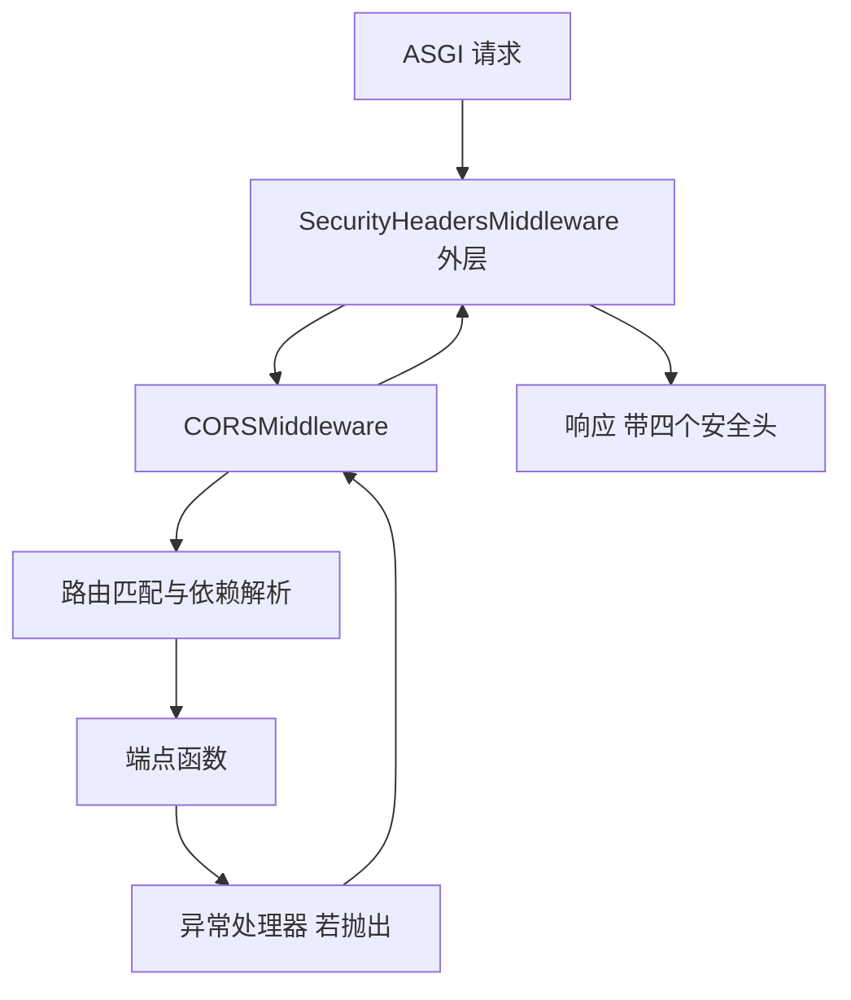
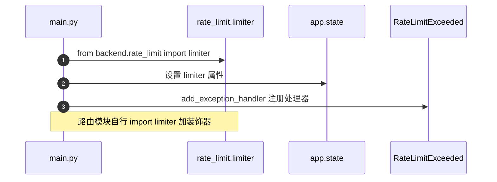

# 应用装配与中间件

KnowledgeDiver 的后端入口是 `backend/main.py`，全文 166 行，承担四件事：创建 `FastAPI` 实例、挂中间件与限流、注册路由、定义异常处理与启动钩子。所有路由业务都在 `backend/routes/` 下，入口文件只做装配。

装配层的代码集中在应用对象的构造与中间件的挂载上。路由模块的组织方式在 `02-路由模块与路径注册.md`，`Depends` 的用法在 `03-Depends 的工作方式.md` 与 `04-鉴权依赖与存储依赖.md`。

## 1. 实例创建与导入顺序

`app = FastAPI()` 只有一行，没有参数（`backend/main.py:47`）。应用的配置通过后续 `add_middleware`、`app.state` 与异常处理器补充，构造函数保持默认。

导入区在文件开头集中列出十三组路由（`:22-34`），其中导出路由用 `try` / `except` 包住（`:35-38`）。日志配置紧随其后（`:41-45`），在创建实例之前执行，因此模块导入阶段的日志也能按统一格式输出。

这个顺序有一个直接后果：任何路由模块在导入期抛出的异常都会让整个应用启动失败，只有导出路由被单独豁免。`backend/config.py:168-172` 中的 `JWT_SECRET` 校验就发生在导入期，见 `05-易错点与排查.md`。

## 2. 安全头中间件

`SecurityHeadersMiddleware` 继承 `BaseHTTPMiddleware`，在 `dispatch` 里调用下游并把四个响应头写回（`backend/main.py:52-67`）：

| 响应头 | 取值 |
| --- | --- |
| `X-Content-Type-Options` | `nosniff` |
| `X-Frame-Options` | `DENY` |
| `Strict-Transport-Security` | `max-age=31536000; includeSubDomains` |
| `Content-Security-Policy` | `default-src 'self'` 起头，脚本与样式允许 `'unsafe-inline'` |

中间件不区分路径，所有响应都会带上这四个头。`@override` 装饰器（`:55`）来自 `typing`，用于标注重写父类方法，运行时不改变行为。



## 3. CORS 的来源与拆分

CORS 中间件的来源列表来自配置项 `CORS_ORIGINS`，在装配时按逗号拆分（`backend/main.py:73`）：

```python
allow_origins=[origin.strip() for origin in CORS_ORIGINS.split(",")],
allow_credentials=True,
allow_methods=["*"],
allow_headers=["*"],
```

`CORS_ORIGINS` 的默认值是 `"*"`（`backend/config.py:165`）。通配来源与 `allow_credentials=True` 同时出现时，浏览器侧的凭证请求会被拒绝，具体表现与浏览器实现有关，属 `05-易错点与排查.md` 中的排查项。

拆分逻辑只做 `strip`，不处理空串。配置成 `"a,b,"` 时会产生一个空来源项；配置成空字符串时列表里只剩一个空串。

## 4. slowapi 限流的挂载

限流器定义在独立模块，避免循环导入（`backend/rate_limit.py:1-6` 的模块注释写明 `auth → main → pipeline → auth` 的依赖链）。`limiter` 用 `get_remote_address` 作为键函数，默认限值取自配置（`:8-12`）。

装配层做两件事：把 `limiter` 挂到 `app.state.limiter`（`backend/main.py:85`），注册 `RateLimitExceeded` 的处理器（`:86`）。`RATE_LIMIT_DEFAULT` 默认 `30/minute`，认证相关默认 `5/minute`（`backend/config.py:161-162`）。

`slowapi` 的装饰器要求被装饰的端点带 `request: Request` 形参。仓库里只有注册与登录两个端点显式加了 `@limiter.limit`（`backend/routes/auth.py:59-60`、`:75-76`），其余端点的限流是否生效取决于库对 `default_limits` 的处理方式，按 slowapi 文档的默认行为理解。



## 5. 三层异常处理器

`backend/main.py:92-126` 注册三个处理器，覆盖面从具体到宽泛：

| 处理器 | 触发条件 | 响应 |
| --- | --- | --- |
| `http_exception_handler` | `HTTPException` | 原状态码，`{"detail", "status_code"}` |
| `validation_exception_handler` | `RequestValidationError` | 422，中文提示加 `errors` 列表 |
| `general_exception_handler` | 其他 `Exception` | 500，固定文案，同时记录日志 |

三条路径都不把堆栈返回给客户端：`HTTPException` 只回 `detail` 与状态码，校验错误回 `exc.errors()`，未预期错误先 `logging.exception` 再回固定中文（`:122-125`）。

`exception_handler(Exception)` 覆盖不到 Starlette 层面的 404 与 405，这两类仍由默认处理器响应。这一条属框架行为，仓库里没有额外处理代码。

## 6. 启动与关闭钩子

`startup` 在事件循环里创建后台任务预热抓取浏览器（`backend/main.py:153-158`），`shutdown` 释放资源（`:160-166`）。两个钩子都用 `@app.on_event` 装饰，该写法在较新的 FastAPI 中已被 `lifespan` 取代，仓库仍在使用。

| 钩子 | 动作 | 代码位置 |
| --- | --- | --- |
| `startup` | `asyncio.create_task(_get_crawler())` | `:153-158` |
| `shutdown` | `await close_crawler()` | `:160-166` |

预热被包成任务而不是直接 `await`，避免启动被浏览器初始化阻塞；注释说明首次抓取可能因此卡住 10 到 30 秒（`:155`）。关闭钩子里取了 logger 并打两条日志，标记释放的开始与结束。

## 7. 根路径与健康检查

`GET /` 返回固定 JSON（`backend/main.py:147-150`），作用是进程存活确认，不检查数据库连通性或浏览器状态。需要判断依赖是否就绪时，这个端点不足以作为依据。

## 8. 易错点

| 易错点 | 现象 | 位置 |
| --- | --- | --- |
| 把 `app.state.limiter` 当成可选 | 未设置时限流装饰器失效 | `backend/main.py:85` |
| 以为安全头只加在 API 路径 | 所有响应都带头，包括静态与错误响应 | `:52-67` |
| 用 `Exception` 处理器兜住 404 | 404 仍走默认响应 | `:117-126` |
| 认为每个端点都限流 | 只有两个端点带显式装饰器 | `backend/routes/auth.py:59、:75` |
| 依赖 `on_event` 长期存在 | 新版 FastAPI 已推荐 `lifespan` | `:153-166` |
| 在导入期读敏感配置 | 缺 `JWT_SECRET` 时应用直接启动失败 | `backend/config.py:169-170` |

## 小结

核心概念：

| 概念 | 内容 |
| --- | --- |
| 装配集中 | 实例创建、中间件、路由注册、异常处理都在 `backend/main.py` |
| 中间件 | 安全头与 CORS 两个，安全头在响应阶段无差别添加 |
| 限流 | `limiter` 挂在 `app.state`，异常处理器单独注册 |
| 异常处理 | 三层处理器，都不向客户端返回堆栈 |
| 生命周期 | `startup` 预热浏览器，`shutdown` 释放资源，用 `on_event` 写法 |

设计权衡：

| 决策 | 选择 | 收益 | 代价 |
| --- | --- | --- | --- |
| 入口文件职责 | 只装配不写业务 | 路由改动互不干扰 | 入口变长后仍要集中改这里 |
| 中间件实现 | 自定义 `BaseHTTPMiddleware` | 安全头一处生效 | 每请求多一层包装开销 |
| 限流器位置 | 独立模块 | 避免 `auth` 与 `main` 循环导入 | 装饰器要各自 `import` |
| 异常兜底 | 捕获 `Exception` | 客户端拿到统一文案 | 未预期错误的表现被抹平，排查要靠日志 |
| 启动预热 | 后台任务 | 启动不被浏览器初始化阻塞 | 预热未完成时的首次抓取仍可能等待 |

## 练习

基础题：

1. 列出 `backend/main.py` 中依次执行的装配步骤。
2. 安全头中间件添加了哪四个响应头？它是否按路径区分？
3. `CORS_ORIGINS` 的默认值是什么？装配时如何拆分？
4. 三个异常处理器各自的触发条件与响应体是什么？

挑战题：

5. 说明把 `@app.on_event` 迁移到 `lifespan` 需要改动的代码范围，以及迁移时容易漏掉的关闭逻辑。
6. 现有 `general_exception_handler` 会把所有未处理异常压成 500 固定文案。设计一个在保留统一响应格式的前提下提高可观测性的方案。
7. `CORS_ORIGINS` 默认 `"*"` 且 `allow_credentials=True`。给出两种整改方向，并说明各自对本地开发与部署的影响。

---

### 附：本页引用的路径

| 路径 | 用途 |
| --- | --- |
| `backend/main.py` | 实例与导入（:22-47）、安全头（:52-67）、CORS（:71-77）、限流（:85-86）、异常处理（:92-126）、路由注册（:129-145）、健康检查与钩子（:147-166） |
| `backend/config.py` | `CORS_ORIGINS`（:165）、限流默认值（:161-162）、`JWT_SECRET` 校验（:168-172） |
| `backend/rate_limit.py` | `limiter` 定义与循环导入说明（:1-12） |
| `backend/routes/auth.py` | 显式限流装饰器（:59-60、:75-76） |
