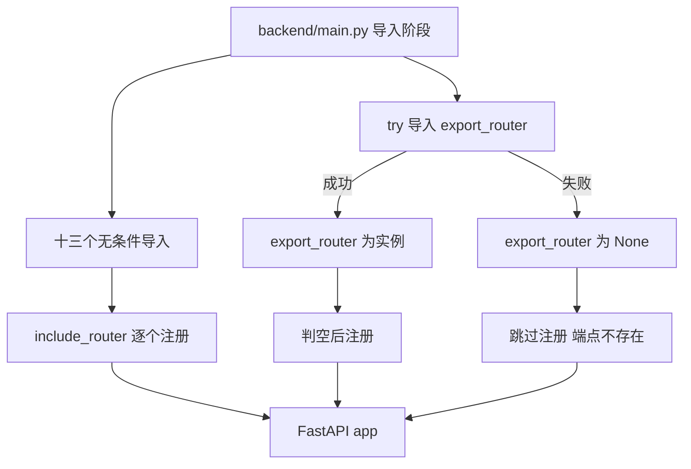
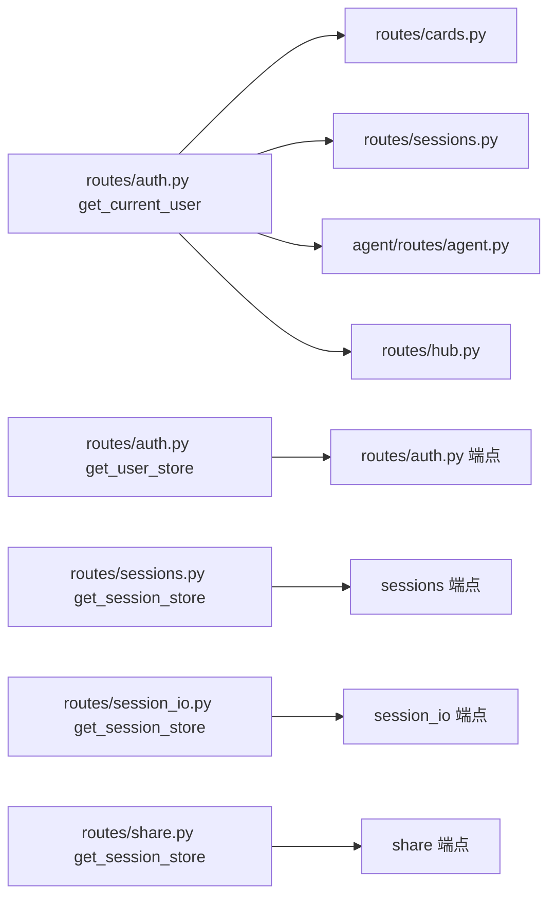

# 路由模块与路径注册

后端的接口按业务拆成十六个模块，每个模块在文件顶部创建一个 `APIRouter` 实例，用装饰器把端点挂上去；`backend/main.py:129-145` 再把这些实例逐个注册进应用。模块之间不互相注册路由，注册动作全部集中在入口。

路由的组织方式与路径前缀在这里有两套写法。应用装配与中间件在 `01-应用装配与中间件.md`，依赖注入在 `03-Depends 的工作方式.md`。

## 1. 十六个路由模块

`backend/routes/` 下有十五个模块，其中十二个无条件注册、导出模块条件注册；加上 `backend/agent/routes/agent.py`，共十四个 `APIRouter` 实例被接入应用，另有 `scraper.py` 与 `search.py` 创建了实例但未注册：

| 模块 | 注册注释里的职责 |
| --- | --- |
| `routes/auth.py` | 认证：注册、登录、个人信息、头像 |
| `routes/pipeline.py` | 流水线：收集与延申搜索的 SSE 流、任务管理 |
| `routes/links.py` | 卡片双向链接 CRUD |
| `routes/classification.py` | AI 自动分类、重分类、分类树 |
| `routes/ai.py` | 流式文本生成 |
| `routes/cards.py` | 卡片 CRUD |
| `routes/sessions.py` | 会话 CRUD 与卡片移动 |
| `routes/session_io.py` | 会话 ZIP 导入导出 |
| `routes/share.py` | 分享链接 token |
| `routes/hub.py` | Hub 论坛浏览、分享、导入、点赞、评论 |
| `routes/documents.py` | 文档上传与分析 |
| `routes/payment.py` | 支付订单创建、回调、查询 |
| `agent/routes/agent.py` | Agent SSE 对话与工具调用 |
| `routes/export.py` | Markdown 导出（可选注册） |

`backend/routes/scraper.py` 与 `backend/routes/search.py` 也各自创建了 `APIRouter`，但没有出现在 `main.py` 的注册列表里，属于未接入的模块。这一条按导入与注册代码对照得出。

## 2. 实例创建的两种写法

绝大多数模块写作 `router = APIRouter()`，不带参数。例外是分类模块，直接声明前缀与标签（`backend/routes/classification.py:17`）：

```python
router = APIRouter(prefix="/api/classification", tags=["classification"])
```

两种写法导致路径定义方式分叉：带前缀的模块在装饰器里写相对路径，不带前缀的模块把 `/api/...` 完整写进装饰器。同一个仓库里因此并存两套风格。

| 写法 | 实例 | 装饰器路径 | 代表 |
| --- | --- | --- | --- |
| 无前缀 | `APIRouter()` | 完整路径 | `routes/cards.py:47` 的 `@router.get("/api/cards")` |
| 带前缀 | `APIRouter(prefix=...)` | 相对路径 | `routes/classification.py:17` |

选择哪一种不影响运行结果，但影响前缀修改的成本：完整路径写法要逐个改装饰器，前缀写法只改一行。

## 3. 集中注册的顺序

`backend/main.py:129-145` 按固定顺序调用 `app.include_router`，顺序与注释一一对应。注册顺序决定 OpenAPI 文档里的分组顺序，不改变路由匹配结果，因为路径本身互不重叠。

| 注册位置 | 模块 | 是否条件注册 |
| --- | --- | --- |
| `:130` | `auth_router` | 否 |
| `:131` | `pipeline_router` | 否 |
| `:132-142` | 其余十个业务路由 | 否 |
| `:143-144` | `export_router` | 是，判空后注册 |

`agent_router` 来自 `backend/agent/routes/agent.py`，与 `routes/` 下的模块并列注册（`:142`）。

## 4. 可选注册带来的静默缺席

导出路由的导入被 `try` / `except Exception` 包住（`backend/main.py:35-38`），失败时把 `export_router` 置为 `None`，注册处再判空（`:143-144`）。设计意图在注释里写明：让缺少导出模块的环境仍能启动应用。

未接入的两个模块（`scraper.py`、`search.py`）与可选的导出模块，三者从外部看都是「端点不存在」，返回 404。要区分它们需要看代码，运行期没有专门的诊断端点。



## 5. 端点装饰器的路径写法

无前缀模块的路径都带 `/api` 段。举三例：卡片列表是 `@router.get("/api/cards")`（`backend/routes/cards.py:47`），会话列表是 `@router.get("/api/sessions")`（`backend/routes/sessions.py:24`），注册是 `@router.post("/api/auth/register")`（`backend/routes/auth.py:58`）。

路径里出现中文与复数混用的情况较少，命名整体一致。同一个模块内部的路径以业务名词开头，例如 `cards.py` 全是 `/api/cards` 系列，`sessions.py` 全是 `/api/sessions` 系列。

| 模块 | 端点路径示例 | 行号 |
| --- | --- | --- |
| `cards.py` | `/api/cards` | `:47` |
| `sessions.py` | `/api/sessions` | `:24` |
| `auth.py` | `/api/auth/register` | `:58` |
| `sessions.py` | `/api/sessions/{session_id}/download` | `backend/routes/session_io.py:35` 起的会话导出系列 |

## 6. 同一模块内依赖的复用

路由模块之间通过函数导入复用依赖。`routes/cards.py`、`routes/sessions.py` 等多处从 `routes/auth.py` 导入 `get_current_user`（`backend/routes/cards.py:21`、`backend/routes/sessions.py:13`）。会话存储的依赖提供者 `get_session_store` 在三个模块里各写了一份相同实现（`sessions.py:19-21`、`session_io.py:35`、`share.py:19`）。

这种复用以函数为粒度，不需要共享基类。代价是同一个 `get_session_store` 出现三份，改一处不会自动同步到另外两处。



## 7. 端点签名的两种参数风格

业务参数与依赖参数混在同一个签名里，靠 `= Depends(...)` 区分。`cards.py` 的列表端点把查询参数默认值与依赖写在一起（`backend/routes/cards.py:47-50`）：

```python
@router.get("/api/cards")
async def list_cards(
    session_id: str = DEFAULT_SESSION_ID,
    current_user: User = Depends(get_current_user)
) -> List[dict]:
```

`session_id` 是带默认值的查询参数，`current_user` 是依赖注入结果。两者位置相邻、形式相似，读签名时要靠 `Depends` 判断来源。返回类型标注 `List[dict]`，在 OpenAPI 里会生成对应的响应结构。

## 8. 易错点

| 易错点 | 现象 | 位置 |
| --- | --- | --- |
| 在有前缀的模块里写完整路径 | 实际路径变成前缀重复 | `routes/classification.py:17` 与装饰器写法的组合 |
| 以为 `scraper.py` / `search.py` 的端点可用 | 请求 404 | 未注册（对照 `main.py:129-145`） |
| 认为注册顺序影响匹配 | 修改顺序后路由行为不变 | 路径互不重叠 |
| 找不到 `get_session_store` 的唯一来源 | 三份同名实现 | `sessions.py:19`、`session_io.py:35`、`share.py:19` |
| 把 `DEFAULT_SESSION_ID` 当成依赖 | 它是普通默认值，不参与注入 | `routes/cards.py:49` |
| 认为导出路由一定存在 | 导入失败时静默跳过 | `backend/main.py:35-38` |

## 小结

核心概念：

| 概念 | 内容 |
| --- | --- |
| 模块化方式 | 每个业务一个模块，模块内创建 `APIRouter` 并挂端点 |
| 注册位置 | 全部集中在 `backend/main.py:129-145` |
| 前缀写法 | 多数模块把 `/api/...` 写进装饰器，分类模块用 `prefix` 参数 |
| 条件注册 | 导出路由判空后注册，其余无条件 |
| 依赖复用 | 通过导入 `get_current_user` 等函数跨模块复用，会话存储依赖有三份副本 |

设计权衡：

| 决策 | 选择 | 收益 | 代价 |
| --- | --- | --- | --- |
| 注册集中 | 入口统一 `include_router` | 一眼看清全部接口 | 入口文件随模块增加而变长 |
| 前缀风格 | 混用两套 | 各自写法直观 | 前缀调整成本不一致 |
| 导出路由 | 可选注册 | 缺依赖也能启动 | 端点缺席无运行期提示 |
| 依赖提供者 | 模块内定义、跨模块导入 | 无额外抽象层 | 重复实现难以统一修改 |
| 参数风格 | 默认值与 `Depends` 并列 | 签名紧凑 | 需要靠 `Depends` 分辨参数来源 |

## 练习

基础题：

1. 列出 `backend/main.py` 中注册的路由模块，并指出哪一个有条件注册。
2. 说出 `APIRouter()` 与 `APIRouter(prefix=...)` 两种写法在路径定义上的差别。
3. `routes/scraper.py` 与 `routes/search.py` 为什么无法访问？给出判断依据。
4. `get_session_store` 在几个文件里出现？各自的返回类型是什么？

挑战题：

5. 若要给所有业务路由统一加上 `/api` 前缀，比较「改 `include_router` 参数」与「逐个改装饰器」两种方案的改动面与风险。
6. 设计一个启动期自检：在应用启动时列出未注册的 `APIRouter` 模块并打日志，说明实现位置与误报处理。
7. 把三份 `get_session_store` 合并成一处，给出放置位置与需要同步修改的导入语句，并评估循环导入风险。

---

### 附：本页引用的路径

| 路径 | 用途 |
| --- | --- |
| `backend/main.py` | 导入列表（:22-38）、注册区（:129-145） |
| `backend/routes/classification.py` | 带 `prefix` 与 `tags` 的实例化（:17） |
| `backend/routes/cards.py` | 无参数实例（:27）、列表端点（:47-50）、依赖导入（:21） |
| `backend/routes/sessions.py` | 实例与依赖提供者（:16-21）、列表端点（:24-26） |
| `backend/routes/session_io.py` | 同名依赖提供者（:35） |
| `backend/routes/share.py` | 同名依赖提供者（:19） |
| `backend/routes/auth.py` | 注册端点路径（:58）、依赖提供者（:23-28） |
| `backend/agent/routes/agent.py` | Agent 路由实例（:12）与依赖使用（:18） |
