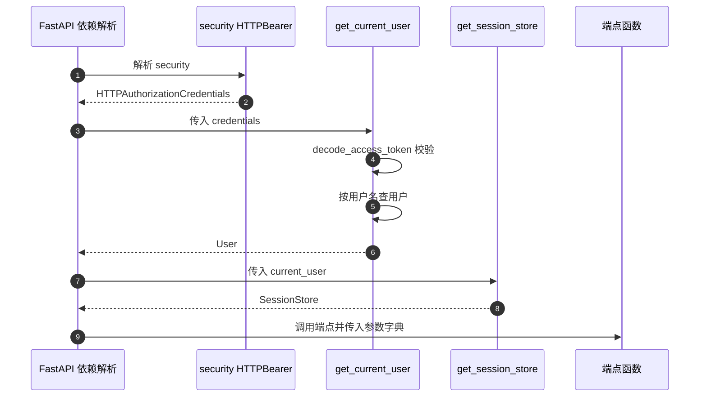
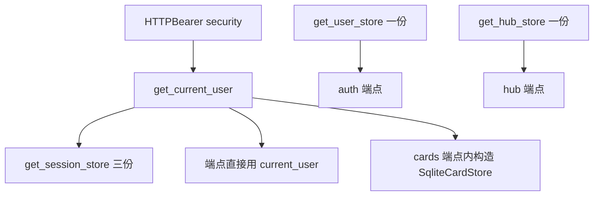

# Depends 的工作方式

后端的鉴权、存储与请求上下文都通过 `Depends` 注入，全仓库出现 84 次依赖声明。注入的写法集中在三类：把 `Request` 交给限流装饰器、把 `User` 注入端点、把存储实例注入端点。依赖提供者本身也是普通函数，可以继续声明自己的依赖，形成链式解析。

`Depends` 在仓库里的具体形态由几处调用点决定。鉴权链与存储依赖的细节在 `04-鉴权依赖与存储依赖.md`，模块与路由的组织在 `02-路由模块与路径注册.md`。

## 1. 三种参数在签名里的区分

一个端点签名里可能同时出现业务参数、带默认值的查询参数与依赖参数。区分规则是：有 `Depends` 默认值的参数由框架调用工厂函数后注入，普通带默认值的参数从查询串解析，没有默认值的参数是必填项。示意如下：

```python
@router.get("/api/cards")
async def list_cards(
    session_id: str = "default",              # 查询参数，缺省时用默认值
    current_user: User = Depends(get_current_user),  # 框架调用依赖函数后注入
    store: CardStore = Depends(get_card_store),      # 同一个依赖在一次请求内只求值一次
):
    ...
```

`backend/routes/cards.py` 是最小示例：`session_id` 有默认值，`current_user` 用 `Depends`。

| 写法 | 解析方式 | 例子 |
| --- | --- | --- |
| `name: str` 无默认值 | 必填查询参数 | `routes/cards.py` 的查询串字段 |
| `name: str = "默认"` | 可选查询参数 | `routes/cards.py` 的 `session_id` |
| `obj: T = Depends(f)` | 调用 `f` 取返回值 | `routes/sessions.py` 的 `store` |
| `request: Request` | 由框架注入请求对象 | `routes/auth.py` |

`Depends` 的实参是「可调用对象」，可以是同步函数、异步函数或类。仓库里全部使用函数，没有依赖类。

## 2. 依赖提供者的两种形态

仓库里的提供者分同步与异步两类，返回类型都标注在签名上：

```python
# 同步：每次调用构造一个存储实例
def get_user_store() -> SqliteUserStore:
    return SqliteUserStore()

# 异步：先解析登录用户，再按用户名构造存储
async def get_current_user(
    credentials: HTTPAuthorizationCredentials = Depends(security)
) -> User:
    ...
```

`get_user_store` 不接收任何参数（`backend/routes/auth.py`），`get_current_user` 自身带一个 `Depends` 参数，构成两层依赖链。同步提供者会被 FastAPI 放进线程池执行，异步提供者直接在事件循环里执行，这一点对构造存储这类轻量操作没有可感知差别。

## 3. 子依赖链的解析顺序

`get_session_store` 依赖 `get_current_user`，后者依赖 `security`，解析顺序是从外到内再逐层返回：



链上任意一层抛出 `HTTPException`，后续层不会执行，端点函数也不会被调用。`get_current_user` 在 token 无效时抛 401（`backend/routes/auth.py`）。

## 4. 同一请求内的结果缓存

FastAPI 对同一个依赖函数在同一请求内只解析一次，结果复用。仓库里最直接的例子是 `backend/routes/auth.py` 的 `get_me`：它同时依赖 `get_current_user` 与 `get_user_store`，两个依赖互不嵌套，各解析一次。

缓存按依赖函数对象计，不按参数计。若同一个依赖带不同参数，缓存语义就要靠 `use_cache=False` 或直接调用函数来规避。仓库当前没有出现参数化依赖，所以缓存行为按默认值理解，属框架通用行为。

| 场景 | 解析次数 | 说明 |
| --- | --- | --- |
| 端点直接依赖 `get_current_user` | 1 | 常见形态 |
| 端点依赖 `get_session_store`，它又依赖 `get_current_user` | 1 | 链上只解析一次 |
| 端点同时依赖 `get_current_user` 与 `get_session_store` | 1 | 缓存命中，用户对象复用 |
| 同一请求里两次 `Depends(f)` 同名 | 1 | 默认 `use_cache=True` |

## 5. 直接构造与依赖注入的混用

并非所有存储都通过依赖获取。`backend/routes/cards.py` 在端点体内直接构造 `SqliteCardStore`：

```python
store = SqliteCardStore(username=current_user.username, session_id=session_id)
cards = store.list_cards()
```

同一个模块的另一个端点则把用户对象作为依赖注入。两种方式并存：用户身份必须走依赖（要解析 token），存储实例可以依赖注入也可以就地构造。

| 方式 | 位置 | 特点 |
| --- | --- | --- |
| 依赖注入存储 | `routes/sessions.py` | 端点签名声明，便于替换与测试 |
| 端点内构造存储 | `routes/cards.py` | 需要组合用户名与会话 ID，就地构造更直接 |

## 6. 依赖提供者的重复定义

会话存储的提供者在三个模块里各有一份（`backend/routes/sessions.py`、`backend/routes/session_io.py`、`backend/routes/share.py`），实现相同：拿当前用户再构造 `SessionStore`。Hub 模块另有一个 `get_hub_store`（`backend/routes/hub.py`），用户存储提供者只在 `auth.py` 出现一次。



依赖提供者作为函数存在，所以跨模块复用的方式是导入；重复定义不会引发冲突，但修改时会漏改。

## 7. 依赖的返回值与类型标注

提供者的返回类型同时是端点的参数类型，`store: SqliteUserStore = Depends(get_user_store)`（`backend/routes/auth.py`）与 `store: SessionStore = Depends(get_session_store)`（`backend/routes/sessions.py`）都是这种形态。类型标注让编辑器与 OpenAPI 生成器能推断端点参数结构。

需要注意返回类型与端点内使用是否一致。`routes/export.py` 的注释把 `CardStore` 当类型，实际运行时传入的是 `InMemoryCardStore`（`backend/routes/export.py`），两者同属 `BaseCardStore` 的子类，类型层面靠鸭子类型成立。

## 8. 易错点

| 易错点 | 现象 | 位置 |
| --- | --- | --- |
| 把 `Depends` 实参写成调用 | 传入函数返回值而非函数对象 | 依赖要写 `Depends(f)` 而非 `f()` |
| 认为依赖每次调用都重新执行 | 同一请求内结果被缓存 | `routes/auth.py` 两依赖共存 |
| 在提供者里做重活 | 每个请求都会触发 | `get_user_store` 只构造对象（`auth.py`） |
| 以为 `session_id` 也是注入 | 它是查询参数默认值 | `routes/cards.py` |
| 找不到 `get_session_store` 的定义 | 三份同名实现分布在不同模块 | `sessions.py`、`session_io.py`、`share.py` |
| 依赖抛错后期望端点兜底 | 端点不会被执行 | `auth.py` 的 401 |

## 小结

核心概念：

| 概念 | 内容 |
| --- | --- |
| 注入形态 | `obj: T = Depends(callable)`，实参是可调用对象而非调用结果 |
| 依赖链 | 提供者自身可继续声明依赖，如 `get_session_store → get_current_user → security` |
| 缓存 | 同一请求内同一依赖只解析一次，结果复用 |
| 参数区分 | 无 `Depends` 的参数按查询参数解析，带默认值即为可选 |
| 混用 | 用户身份走依赖，存储实例可注入也可在端点内构造 |

设计权衡：

| 决策 | 选择 | 收益 | 代价 |
| --- | --- | --- | --- |
| 提供者形态 | 普通函数 | 可测试、可导入复用 | 重复定义不会报错，容易漏改 |
| 鉴权方式 | `HTTPBearer` 加函数依赖 | 端点只需声明 `Depends` | 每个受保护端点都要写一遍 |
| 存储获取 | 注入与就地构造混用 | 复杂组合参数可就地处理 | 签名风格不统一 |
| 缓存依赖 | 默认开启 | 避免重复查库 | 依赖有副作用时结果不易预期 |
| 依赖粒度 | 每个存储一个提供者 | 端点签名自解释 | 提供者数量随存储类型增长 |

## 练习

基础题：

1. 说出端点签名里三种参数的区分方式，各举一个源码位置。
2. `get_session_store` 的依赖链有哪几层？每层返回什么？
3. 同一请求内 `get_current_user` 被两个依赖间接用到时会解析几次？
4. 仓库里有哪几处是端点内直接构造存储而不是依赖注入？给出位置。

挑战题：

5. 把三份 `get_session_store` 合并为一份并保持端点签名不变，说明放置位置与循环导入风险的规避方式。
6. 设计一个带参数的存储依赖（例如按 `session_id` 返回不同存储），说明 `use_cache` 设置与参数来源。
7. `Depends` 可以作用于类。给出把 `get_current_user` 改写成依赖类的方案，并比较两种实现的测试成本。

---

### 附：本页引用的路径

| 路径 | 用途 |
| --- | --- |
| `backend/routes/auth.py` | 提供者定义、401 分支、双依赖端点 |
| `backend/routes/sessions.py` | `get_session_store`与端点用法 |
| `backend/routes/session_io.py` | 同名提供者 |
| `backend/routes/share.py` | 同名提供者 |
| `backend/routes/hub.py` | `get_hub_store` |
| `backend/routes/cards.py` | 端点内构造存储、查询参数默认值 |
| `backend/routes/export.py` | 存储类型与运行时实例的差异 |
